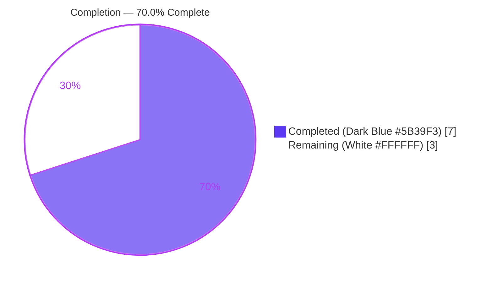
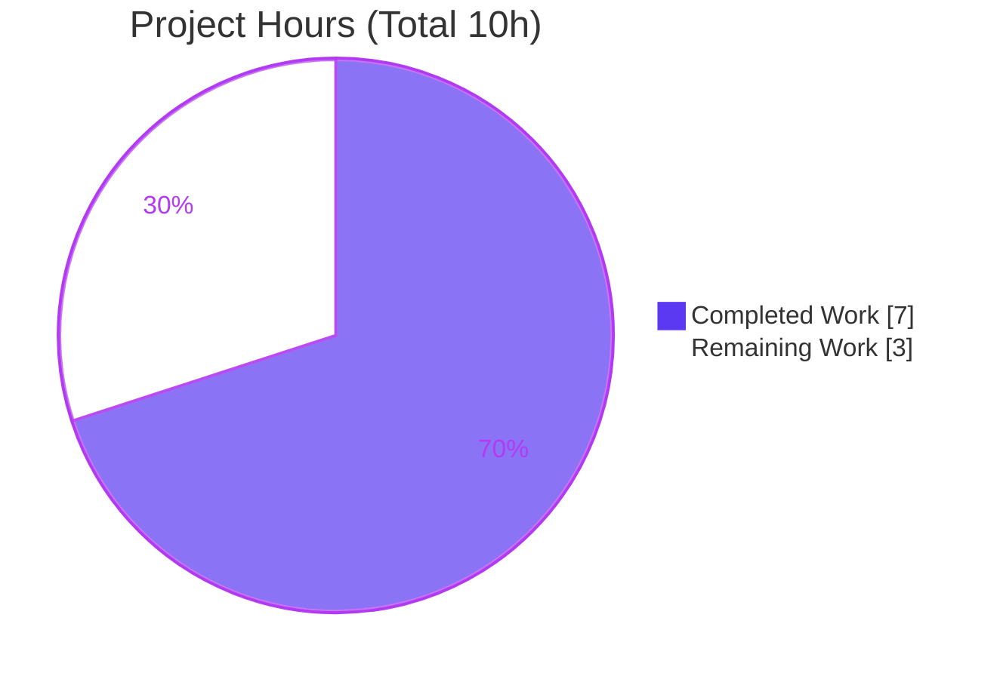
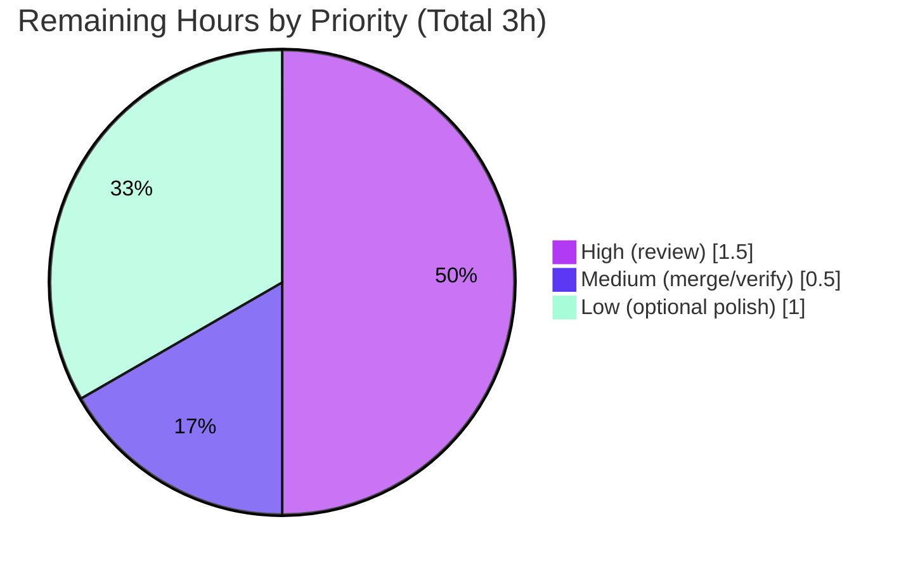

# Blitzy Project Guide — Express.js Migration & `/good-evening` Endpoint

> **Project:** Minimal Node.js Tutorial Server · **Branch:** `blitzy-aed17f6f-f4b2-40ec-89f1-a9e4d0aa0a8e` · **HEAD:** `7239474`
> **Color legend:** <span style="color:#5B39F3">■</span> Completed / AI Work = Dark Blue `#5B39F3` · <span style="color:#FFFFFF">□</span> Remaining = White `#FFFFFF` · Headings accent = Violet-Black `#B23AF2` · Highlight = Mint `#A8FDD9`

---

## 1. Executive Summary

### 1.1 Project Overview

This project introduces the **Express.js** web framework into an existing minimal Node.js HTTP tutorial server and adds a second plain-text endpoint, `GET /good-evening` (returning `"Good evening"`), while preserving the original `GET /` endpoint's byte-exact contract (`200` / `text/plain` / `"Hello, World!\n"`). The server migrates from the Node core `http` module to an Express application, keeping the original bind (`127.0.0.1:3000`) and startup log intact. The target audience is developers learning Node/Express routing. The technical scope is intentionally tiny: four tracked files (`server.js`, `package.json`, `package-lock.json`, `README.md`), one direct dependency (`express@^5.2.1`), and two `GET` routes.

### 1.2 Completion Status



| Metric | Hours |
|--------|-------|
| **Total Hours** | **10** |
| Completed Hours (AI) | 7 |
| Completed Hours (Manual) | 0 |
| **Completed Hours (AI + Manual)** | **7** |
| **Remaining Hours** | **3** |
| **Percent Complete** | **70.0%** |

> **Completion formula:** `7 completed ÷ 10 total × 100 = 70.0%`. All AAP-scoped autonomous development (FR-1 → FR-4) is **100% implemented and independently validated**; the remaining 30% is exclusively **human-gated path-to-production** work (code review, merge, and optional polish) — no autonomous code work is outstanding.

### 1.3 Key Accomplishments

- ✅ **FR-1 — Express.js introduced** as a verified, locked dependency (`express@^5.2.1`; resolves to `5.2.1`); `package-lock.json` regenerated (`lockfileVersion 3`, 68 entries = 1 root + 67 transitive); `npm ci` reproducible with **0 vulnerabilities**.
- ✅ **FR-2 — Server migrated** from the core `http` module to an Express application (`const app = express()` / `app.listen(...)`); host `127.0.0.1`, port `3000`, and the startup log line preserved verbatim.
- ✅ **FR-3 — Legacy endpoint preserved byte-exact:** `GET /` → `200`, `Content-Type: text/plain`, body `"Hello, World!\n"` (14 bytes), with explicit `type('text/plain')` to avoid Express's `text/html` default.
- ✅ **FR-4 — New endpoint added:** `GET /good-evening` → `"Good evening"` (12 bytes, no trailing newline).
- ✅ **Routing hardened (ambiguity A3):** strict + case-sensitive routing enabled so the legacy `/` does not shadow the new route; non-canonical variants (`/GOOD-EVENING`, `/good-evening/`, `/nope`) correctly return `404`.
- ✅ **Independently re-validated** by this assessment: clean syntax (`node --check` exit 0), reproducible install, live runtime smoke tests of both endpoints, and clean process lifecycle (port `3000` released).

### 1.4 Critical Unresolved Issues

| Issue | Impact | Owner | ETA |
|-------|--------|-------|-----|
| _None._ All AAP requirements implemented and validated; zero compilation, install, or runtime errors. | None | — | — |

> There are **no critical blocking issues**. The only outstanding work is the standard human review/merge gate (see §1.6 and §2.2).

### 1.5 Access Issues

| System / Resource | Type of Access | Issue Description | Resolution Status | Owner |
|-------------------|----------------|-------------------|-------------------|-------|
| _None identified_ | — | — | — | — |

> **No access issues identified.** The repository is local and writable, the npm dependency closure installs reproducibly (verified via `npm ci`), and no external services, credentials, or third-party APIs are required by this feature.

### 1.6 Recommended Next Steps

1. **[High]** Perform human code review of the 3-commit diff (`server.js`, `package.json`, `package-lock.json`) and approve the PR — confirm AAP fidelity, exact response literals, and routing strictness.
2. **[Medium]** Merge the branch to mainline and run a post-merge runtime verification (`npm ci` → boot → `curl` both endpoints) in the target environment.
3. **[Low]** _Optional:_ Update `README.md` to document the Express dependency and the two endpoints.
4. **[Low]** _Optional:_ Add a `.gitignore` entry for `node_modules/` to prevent accidental commits of the generated artifact.

---

## 2. Project Hours Breakdown

### 2.1 Completed Work Detail

| Component | Hours | Description |
|-----------|-------|-------------|
| FR-1: Express.js dependency integration | 1.0 | Added `"express": "^5.2.1"` to `package.json`; regenerated `package-lock.json` (lockfileVersion 3, 67 transitive packages); verified reproducible `npm ci` with 0 vulnerabilities (commit `9476a38`). |
| FR-2: HTTP → Express server migration | 2.0 | Refactored `server.js` from core `http` to an Express app (`require('express')`, `const app = express()`, `app.listen(port, hostname, cb)`); preserved bind `127.0.0.1:3000` and the startup log line (commit `ec848cf`). |
| FR-3: Legacy endpoint preservation | 0.5 | `app.get('/', …)` returns `200` / `text/plain` / `"Hello, World!\n"` byte-exact; explicit `type('text/plain')` prevents Express's `text/html` default. |
| FR-4: New `/good-evening` endpoint | 0.5 | `app.get('/good-evening', …)` returns exactly `"Good evening"` (12 bytes, no trailing newline). |
| Routing hardening (ambiguity A3) | 1.0 | Enabled `strict routing` + `case sensitive routing` to confine the route surface to the two canonical endpoints; documented; verified `404` on non-canonical variants (commit `7239474`). |
| Autonomous validation & testing (5 gates) | 2.0 | Dependencies, compilation, functional smoke (both endpoints), runtime boot (`node` + `npm start`), and zero-error gates — including byte-exact literal checks, negative-route checks, and process-lifecycle/port-free verification. |
| **Total Completed** | **7.0** | |

### 2.2 Remaining Work Detail

| Category | Hours | Priority |
|----------|-------|----------|
| Human code review & PR approval (3-commit diff incl. lockfile; confirm AAP fidelity + literals + routing) | 1.5 | High |
| Merge to mainline + post-merge runtime verification (`npm ci` → boot → `curl` both endpoints in target env) | 0.5 | Medium |
| _Optional:_ README documentation of the Express dependency and two endpoints | 0.5 | Low |
| _Optional:_ `.gitignore` for `node_modules/` (prevents accidental commit of generated artifact) | 0.5 | Low |
| **Total Remaining** | **3.0** | |

### 2.3 Hours Summary

| Metric | Hours | Formula / Note |
|--------|-------|----------------|
| Completed (§2.1) | 7.0 | Sum of completed components |
| Remaining (§2.2) | 3.0 | Sum of remaining categories |
| **Total** | **10.0** | `7.0 + 3.0` (matches §1.2) |
| **Percent Complete** | **70.0%** | `7.0 ÷ 10.0 × 100` |

---

## 3. Test Results

> **Integrity note:** All entries below originate from Blitzy's autonomous validation logs for this project (Final Validator 5-gate run) and were independently re-confirmed during this assessment. No instrumented unit-test suite exists — **by AAP design** (the placeholder `test` script is intentionally left unchanged per requirement F-008 / §0.5.2), so code-coverage is **N/A**.

| Test Category | Framework / Method | Total | Passed | Failed | Coverage % | Notes |
|---------------|--------------------|-------|--------|--------|------------|-------|
| Dependency / Install | `npm ci` + `npm install` | 2 | 2 | 0 | N/A | `npm ci` → "added 67 packages", **0 vulnerabilities**, reproducible from lockfile; `npm install` idempotent ("up to date"). |
| Build / Syntax | `node --check server.js` | 1 | 1 | 0 | N/A | Exit 0; module loads via `require` with no exceptions; `require('express')` present, `http` core absent. |
| Functional / Endpoint Smoke | HTTP (curl / Invoke-WebRequest) | 5 | 5 | 0 | N/A | `GET /` (200/text-plain/`"Hello, World!\n"`/14B); `GET /good-evening` (200/text-plain/`"Good evening"`/12B); 3 negative routes (`/GOOD-EVENING`, `/good-evening/`, `/nope`) → `404`. |
| Runtime / Boot | `node server.js` + `npm start` | 2 | 2 | 0 | N/A | Both paths boot, emit `Server running at http://127.0.0.1:3000/`, bind correctly, and serve both endpoints. |
| Unit | _none (by AAP design)_ | 0 | 0 | 0 | N/A | Placeholder `test` script (`echo … && exit 1`) deliberately untouched per F-008; adding a suite is out of scope. |
| **Total** | | **10** | **10** | **0** | **N/A** | **100% pass across all autonomous validation checks; 0 real test failures.** |

---

## 4. Runtime Validation & UI Verification

**Runtime health** — independently re-verified live during this assessment:

- ✅ **Operational** — Server boots via `node server.js`
- ✅ **Operational** — Server boots via `npm start`
- ✅ **Operational** — Startup log emitted: `Server running at http://127.0.0.1:3000/`
- ✅ **Operational** — Network bind on `127.0.0.1:3000`
- ✅ **Operational** — Clean process lifecycle; port `3000` released after shutdown (no orphaned processes)

**API / endpoint verification:**

- ✅ **Operational** — `GET /` → `200`, `Content-Type: text/plain; charset=utf-8`, body `"Hello, World!\n"` (14 bytes, byte-identical legacy contract)
- ✅ **Operational** — `GET /good-evening` → `200`, `Content-Type: text/plain; charset=utf-8`, body `"Good evening"` (12 bytes)
- ✅ **Operational** — `GET /GOOD-EVENING` → `404` (case-sensitive routing)
- ✅ **Operational** — `GET /good-evening/` → `404` (strict routing)
- ✅ **Operational** — `GET /nope` → `404` (no catch-all; legacy bound to `/`)

**UI verification:** **N/A** — this is a backend HTTP server returning plain-text bodies. There is no graphical user interface, component library, or design system (per AAP §0.4.3). The only "interface" is the HTTP contract, which is fully verified above.

---

## 5. Compliance & Quality Review

Cross-mapping of AAP deliverables and special instructions to quality benchmarks:

| Requirement / Benchmark | AAP Ref | Status | Progress | Notes |
|-------------------------|---------|--------|----------|-------|
| FR-1 — Express.js as runtime dependency | §0.1.1 | ✅ Pass | 100% | `^5.2.1` declared + locked; `npm ci` reproducible. |
| FR-2 — Migrate `http` → Express | §0.1.1 | ✅ Pass | 100% | `http` core removed; `app.listen` preserves bind + log. |
| FR-3 — Preserve legacy endpoint (byte-exact) | §0.1.1 | ✅ Pass | 100% | `200`/`text/plain`/`"Hello, World!\n"` confirmed (14 bytes). |
| FR-4 — Add `/good-evening` | §0.1.1 | ✅ Pass | 100% | Returns exactly `"Good evening"` (12 bytes). |
| Preserve exact response literals | §0.1.2 / §0.6 | ✅ Pass | 100% | Byte-for-byte match for both bodies. |
| Preserve network binding + startup log | §0.1.2 / §0.6 | ✅ Pass | 100% | `127.0.0.1:3000` + log line unchanged. |
| Explicit `text/plain` (avoid `text/html`) | §0.1.1 | ✅ Pass | 100% | `res.type('text/plain')` set on both routes. |
| CommonJS + single-file convention | §0.6 | ✅ Pass | 100% | `require(...)`, single `server.js`. |
| Verified dependency version (no placeholders) | §0.6 | ✅ Pass | 100% | `express@^5.2.1` (real npm version). |
| Zero-placeholder policy | Platform | ✅ Pass | 100% | No TODO/stub/`NotImplemented`; production-ready code. |
| Security — `npm audit` | Platform | ✅ Pass | 100% | **0 vulnerabilities** reported. |
| Out-of-scope items left untouched | §0.5.2 | ✅ Pass | 100% | `test` placeholder, `main: index.js`, README all intentionally unchanged. |
| Ambiguity defaults A1/A2/A3 honored | §0.1.3 | ✅ Pass | 100% | `/good-evening`; no trailing newline; legacy bound to `/`. |
| Human code review / PR approval | Path-to-prod | ⬜ Pending | 0% | Standard human gate before merge (see §2.2). |

**Fixes applied during autonomous validation:** **None** — the Final Validator found no defects across all five gates; the implementation was already faithful to AAP §0.4.2.

**Outstanding compliance items:** Human code review/approval (the only quality gate not yet satisfied) and optional documentation/hygiene polish.

---

## 6. Risk Assessment

All risks are **Low severity** given the trivial, loopback-only, fully-validated 2-endpoint scope. No High or Medium severity risks exist; `npm audit` reports zero vulnerabilities.

| # | Risk | Category | Severity | Probability | Mitigation | Status |
|---|------|----------|----------|-------------|------------|--------|
| R1 | Caret range `^5.2.1` could pull a future Express 5.x minor with behavior changes | Technical | Low | Low | `package-lock.json` pins `5.2.1`; `npm ci` installs deterministically | Mitigated |
| R2 | No automated unit-test suite (placeholder by AAP design) — future regressions uncaught | Technical | Low | Medium | Documented smoke-test commands; add a suite if the server is extended | Accepted (by design) |
| R3 | `npm test` placeholder exits `1` — would fail any CI that runs it | Technical | Low | Low | By AAP design (F-008); no CI exists; documented | Accepted (by design) |
| R4 | No auth / input validation | Security | Low | Low | Static `GET` responses, no user input, `127.0.0.1` loopback bind, `npm audit` 0 vulns | Mitigated |
| R5 | `node_modules/` untracked with no `.gitignore` — accidental-commit risk | Security | Low | Low | Add `.gitignore` (Low-priority remaining task) | Open (Low) |
| R6 | Hardcoded host/port, no env config — limited deployability to other environments | Operational | Low | Low | AAP intentionally preserves binding; documented | Accepted (by design) |
| R7 | No health check / monitoring / graceful shutdown | Operational | Low | Low | Out of scope per AAP tutorial scope | Accepted (by design) |
| R8 | `npm ci` requires the npm registry or a warmed cache (offline/air-gapped envs) | Integration | Low | Low | `package-lock.json` enables reproducible installs | Mitigated |

---

## 7. Visual Project Status

**Project hours breakdown** (Completed = Dark Blue `#5B39F3`, Remaining = White `#FFFFFF`):



**Remaining hours by priority** (sums to the 3.0h Remaining total in §1.2 / §2.2):



> **Integrity check:** Pie "Remaining Work" = **3** = §1.2 Remaining Hours = §2.2 "Hours" column total. Pie "Completed Work" = **7** = §1.2 Completed Hours = §2.1 total. `7 + 3 = 10` = Total.

---

## 8. Summary & Recommendations

**Achievements.** The Express.js migration is **functionally complete and production-ready at the code level.** All four feature requirements (FR-1 → FR-4) are implemented across three clean, attributable commits and independently validated: the dependency is locked and installs reproducibly with zero vulnerabilities, the server compiles and boots cleanly, and both endpoints return their exact byte-level contracts. Route hardening additionally confines the surface to the two canonical endpoints.

**Remaining gaps.** Nothing in the AAP development scope is outstanding. The remaining **3.0 hours (30%)** are entirely human-gated path-to-production activities: a code-review/PR-approval gate (High), a merge + post-merge runtime verification (Medium), and two optional polish items — README documentation and a `node_modules/` `.gitignore` (Low).

**Critical path to production.** Human code review → merge to mainline → post-merge smoke test. This path has no technical blockers.

**Production-readiness assessment.** The project is **70.0% complete** on an AAP-scoped + path-to-production basis (`7 ÷ 10`). The autonomous development portion is **100% complete and validated**; the residual percentage reflects the human review/merge/polish gate that cannot be auto-completed. **Recommendation: APPROVE pending code review** — confidence is **High**, given the small, unambiguous scope and the clean 5-gate validation.

| Success Metric | Target | Actual | Met? |
|----------------|--------|--------|------|
| Both endpoints return exact contracts | 100% | 100% (14B / 12B) | ✅ |
| Reproducible install, 0 vulnerabilities | 0 vulns | 0 vulns | ✅ |
| Clean compile + runtime boot | Pass | Pass | ✅ |
| AAP feature requirements satisfied | 4 / 4 | 4 / 4 | ✅ |
| Autonomous validation gates passed | 5 / 5 | 5 / 5 | ✅ |

---

## 9. Development Guide

> Every command below was executed and verified during this assessment (Windows PowerShell host; commands are OS-agnostic).

### 9.1 System Prerequisites

- **Node.js ≥ 18** (Express 5 requirement). Verified on **v20.20.2**.
- **npm** (ships with Node). Verified on **10.8.2**.
- **Git** (optional, to clone/checkout the branch).
- No database, cache, message queue, or other external service is required.

```bash
node --version    # expect v18+ (verified v20.20.2)
npm --version     # verified 10.8.2
```

### 9.2 Environment Setup

- Check out the branch and change into the repository root. **No environment variables are required** — host (`127.0.0.1`) and port (`3000`) are hardcoded by design (AAP §0.5.2).

```bash
git checkout blitzy-aed17f6f-f4b2-40ec-89f1-a9e4d0aa0a8e
cd <repository-root>     # directory containing server.js and package.json
```

### 9.3 Dependency Installation

Use `npm ci` for a clean, reproducible install from the lockfile (recommended), or `npm install`.

```bash
npm ci                   # → "added 67 packages", "found 0 vulnerabilities"
# Alternatively:
npm install              # idempotent → "up to date"
```

Verify the dependency tree:

```bash
npm ls express           # → hello_world@1.0.0 └── express@5.2.1
```

### 9.4 Application Startup

```bash
npm start                # runs "node server.js"
# Alternatively:
node server.js
```

Expected console output:

```text
Server running at http://127.0.0.1:3000/
```

### 9.5 Verification Steps

```bash
# 1) Syntax / compile gate
node --check server.js                       # exit code 0, no output

# 2) Legacy endpoint (preserved)
curl -i http://127.0.0.1:3000/
#   HTTP/1.1 200 OK
#   Content-Type: text/plain; charset=utf-8
#   Hello, World!

# 3) New endpoint
curl -i http://127.0.0.1:3000/good-evening
#   HTTP/1.1 200 OK
#   Content-Type: text/plain; charset=utf-8
#   Good evening

# 4) Negative routes (expected 404 — strict + case-sensitive routing)
curl -i http://127.0.0.1:3000/GOOD-EVENING    # 404
curl -i http://127.0.0.1:3000/good-evening/   # 404
curl -i http://127.0.0.1:3000/nope            # 404
```

> **PowerShell equivalent** for the GET checks: `Invoke-WebRequest -Uri http://127.0.0.1:3000/ -UseBasicParsing`.

### 9.6 Example Usage

```bash
$ curl http://127.0.0.1:3000/
Hello, World!

$ curl http://127.0.0.1:3000/good-evening
Good evening
```

### 9.7 Troubleshooting

| Symptom | Cause | Resolution |
|---------|-------|------------|
| `Error: listen EADDRINUSE :::3000` | Port `3000` already in use | Stop the process holding the port (e.g., `lsof -i :3000` then kill the PID; on Windows use `Get-NetTCPConnection -LocalPort 3000`), or change the port in `server.js`. |
| `npm test` prints an error and exits `1` | Placeholder test script (intentional, AAP F-008) | Not a defect — there is no test suite by design. Ignore, or replace the script if you add tests. |
| `npm ci` fails to download packages | Offline / no registry access or cold cache | Run on a network with npm registry access, or pre-warm the npm cache; `package-lock.json` guarantees reproducibility once packages are reachable. |
| Server fails to start on older Node | Express 5 requires Node ≥ 18 | Upgrade Node.js to v18 or later (v20 LTS recommended). |
| `Cannot find module 'express'` | Dependencies not installed | Run `npm ci` (or `npm install`) in the repository root before starting the server. |

---

## 10. Appendices

### Appendix A — Command Reference

| Command | Purpose |
|---------|---------|
| `npm ci` | Clean, reproducible install from `package-lock.json` (67 packages, 0 vulns) |
| `npm install` | Install/refresh dependencies (idempotent) |
| `npm ls express` | Show resolved Express version (`express@5.2.1`) |
| `node --check server.js` | Syntax/compile gate (exit 0) |
| `npm start` / `node server.js` | Start the server on `127.0.0.1:3000` |
| `npm audit` | Security audit (0 vulnerabilities) |
| `curl http://127.0.0.1:3000/` | Exercise the legacy endpoint |
| `curl http://127.0.0.1:3000/good-evening` | Exercise the new endpoint |

### Appendix B — Port Reference

| Port | Service | Bind Address | Notes |
|------|---------|--------------|-------|
| 3000 | Express HTTP server | `127.0.0.1` (loopback) | Hardcoded in `server.js`; not externally exposed |

### Appendix C — Key File Locations

| File | Role | Disposition |
|------|------|-------------|
| `server.js` | Express app + two `GET` routes + listener | UPDATED (commits `ec848cf`, `7239474`) |
| `package.json` | Manifest; declares `express@^5.2.1`; `start` script | UPDATED (commit `9476a38`) |
| `package-lock.json` | Locked dependency closure (lockfileVersion 3, 68 entries) | UPDATED (tooling-generated) |
| `README.md` | Project readme | UNCHANGED (optional update pending) |
| `node_modules/` | Installed dependencies | GENERATED (untracked) |

### Appendix D — Technology Versions

| Component | Version | Notes |
|-----------|---------|-------|
| Node.js | v20.20.2 (≥ 18 required) | Satisfies Express 5 engine requirement |
| npm | 10.8.2 | — |
| Express | 5.2.1 (declared `^5.2.1`) | Verified against npm registry |
| Lockfile | `lockfileVersion 3` | 1 root + 67 transitive packages |
| Module system | CommonJS | `require(...)` |

### Appendix E — Environment Variable Reference

| Variable | Required | Default | Notes |
|----------|----------|---------|-------|
| _None_ | — | — | Host (`127.0.0.1`) and port (`3000`) are hardcoded by design; no env config introduced (AAP §0.5.2). |

### Appendix F — Developer Tools Guide

| Tool | Use |
|------|-----|
| `node --check <file>` | Static syntax validation without execution |
| `npm ls <pkg>` | Inspect the resolved dependency tree |
| `npm audit` | Vulnerability scan of the dependency closure |
| `curl -i` / `Invoke-WebRequest` | Inspect HTTP status, headers, and body of each route |
| `git log --oneline` / `git diff --stat` | Review the 3-commit feature history and change volume |

### Appendix G — Glossary

| Term | Definition |
|------|------------|
| **AAP** | Agent Action Plan — the file-level implementation blueprint that scopes this feature. |
| **FR-1 … FR-4** | The four feature requirements: add Express, migrate to Express, preserve the legacy endpoint, add `/good-evening`. |
| **Strict routing** | Express setting where `/good-evening` and `/good-evening/` are treated as distinct paths. |
| **Case-sensitive routing** | Express setting where `/good-evening` and `/GOOD-EVENING` are treated as distinct paths. |
| **Lockfile** | `package-lock.json` — pins the exact dependency closure for reproducible installs. |
| **Loopback bind** | Listening on `127.0.0.1`, reachable only from the local host. |
| **Path-to-production** | Standard activities (review, merge, deploy) required to ship validated code. |