# Technical Specification

# 1. Introduction

## 1.1 Executive Summary

### 1.1.1 Project Overview

The `hao-backprop-test` project — also identified by the npm package name `hello_world` (version `1.0.0`) — is a deliberately minimal Node.js HTTP server that functions as a stable test fixture for integration with an external system referred to as "backprop." The repository contains exactly four files at its root with no subdirectories beyond `.git`. Its sole runtime artifact is a 15-line `server.js` file that instantiates an HTTP listener using Node.js's built-in `http` module and responds to every incoming request with a static `Hello, World!\n` payload.

The repository's `README.md` characterizes the project in a single sentence as a "test project for backprop integration" and includes the explicit directive "Do not touch!" — a directive that conveys the project's defining quality: its value derives from immutability and predictability rather than from feature breadth. The codebase is not a production application; it is an integration target maintained as a known, immutable baseline.

### 1.1.2 Core Business Problem

The project addresses a narrowly defined integration-testing need: backprop integration efforts require a deterministic, predictable HTTP service against which to validate behavior. By providing a minimal HTTP server with no routing logic, no external dependencies, no authentication, no persistent state, and no environmental variability, this project supplies a reference fixture whose behavior is fully and exhaustively specified by 15 lines of code, and is therefore reproducible across any Node.js-capable host.

| Problem Domain | Resolution Approach |
|---|---|
| Need for a reproducible integration target | Single-handler HTTP server with hardcoded response |
| Risk of dependency drift breaking tests | Zero third-party dependencies in lockfile |
| Variability across runtime environments | Hardcoded host, port, and response payload |
| Ambiguity about expected behavior | Stateless server returns identical output for all requests |

### 1.1.3 Key Stakeholders and Users

| Stakeholder | Role | Interaction Pattern |
|---|---|---|
| `hxu` (declared `author` in `package.json`) | Project maintainer | Authors and preserves the fixture |
| The "backprop" integration target | Primary consumer | Exercises the HTTP endpoint |
| Future backprop integration contributors | Indirect users | Reference the fixture without modifying it |

### 1.1.4 Expected Business Impact and Value Proposition

The value proposition is derived directly from the project's intentional minimalism. By committing to a fixed, dependency-free implementation distributed under the MIT license, the project provides the backprop integration effort with a stable target for repeated validation. The "Do not touch!" directive in the README reinforces that any change to the codebase would invalidate the integration baseline; preservation, not extension, is the operating principle.

## 1.2 System Overview

### 1.2.1 Project Context

#### Business Context and Market Positioning

This project occupies a narrow niche as an internal engineering fixture rather than a market-facing product. It is not distributed for downstream consumption as a library, and the npm package metadata exists only to confirm the project's identity and to support local Node.js tooling conventions (e.g., `npm install` workflows). The project is internally self-described as a "test project," not a commercial software product.

#### Current System Limitations and Predecessor Context

The repository is not a replacement for or upgrade of an existing system. There is no migration history, no deprecation notice, and no reference to predecessor systems anywhere within the four files of the repository. The project stands alone as a purpose-built fixture rather than a step in a system evolution.

#### Integration with the Existing Enterprise Landscape

The system integrates with the broader landscape exclusively through a single HTTP endpoint exposed on the loopback interface. The integration model is therefore narrow and well-defined:

| Integration Dimension | Specification |
|---|---|
| Transport | HTTP (plaintext; no TLS) |
| Address | `127.0.0.1:3000` (loopback only — not externally reachable) |
| Protocol surface | Any HTTP method and any path returns the same response |
| Coupling style | Minimal — the consumer need only issue an HTTP request to the local port |

### 1.2.2 High-Level Description

#### Primary System Capabilities

| Capability | Description |
|---|---|
| HTTP Listening | Binds to `127.0.0.1` on port `3000` and accepts incoming HTTP connections |
| Static Response | Returns the literal payload `Hello, World!\n` with HTTP `200` status |
| Content Typing | Sets the `Content-Type` response header to `text/plain` |
| Startup Logging | Emits `Server running at http://127.0.0.1:3000/` to stdout when the listener becomes ready |

#### Major System Components

The system has only one logical runtime component: the HTTP server defined in `server.js`. Supporting files (`package.json`, `package-lock.json`, `README.md`) provide manifest data and human-readable documentation but contain no runtime logic.

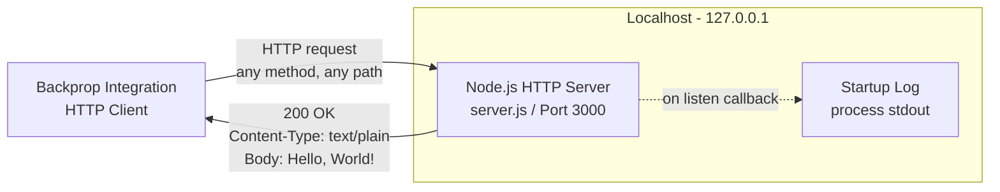

#### Core Technical Approach

The technical approach uses Node.js's built-in `http` module exclusively, written in CommonJS-style JavaScript (via `require`), with no external libraries, no build step, and no test harness. Configuration values (`hostname` and `port`) are declared as in-file constants. The request handler is a single arrow-function callback that ignores all properties of the incoming request object and unconditionally writes the static response. The server is started by invoking `server.listen(port, hostname, callback)`, where the callback emits a single startup log line.

| Stack Layer | Selection | Rationale (Inferred from Code) |
|---|---|---|
| Runtime | Node.js | The `http` module is a Node-only API |
| Language | JavaScript (CommonJS) | `require('http')` syntax in `server.js` |
| HTTP Library | Built-in `http` module | No framework dependencies needed |
| Package Manager | npm | Presence of `package.json` + `package-lock.json` v3 |
| External Dependencies | None | Lockfile resolves zero packages |

### 1.2.3 Success Criteria

The repository does not declare formal SLAs, KPIs, or quantitative measurable objectives. The criteria below are derived strictly from observable behaviors in the code and are not extrapolated beyond the available evidence.

#### Measurable Objectives (Observable Indicators)

| Criterion Category | Observable Indicator |
|---|---|
| Startup correctness | `node server.js` produces the startup log message |
| Response correctness | An HTTP request to `127.0.0.1:3000` returns status `200`, header `Content-Type: text/plain`, body `Hello, World!\n` |
| Determinism | Repeated requests yield byte-identical responses |
| Stability | The codebase remains unchanged, honoring the README's "Do not touch!" directive |

#### Critical Success Factors

- **Code immutability**: The README's "Do not touch!" directive is itself a success factor — divergence from the current implementation would compromise the fixture's role as a stable baseline.
- **Dependency-free operation**: The empty dependency graph in `package-lock.json` (lockfileVersion `3`) ensures that the project cannot be broken by upstream package changes.
- **Local reachability**: The integration consumer must be able to reach the loopback interface on TCP port `3000` from the same host.

#### Key Performance Indicators (KPIs)

No quantitative KPIs (such as latency targets, throughput targets, or availability targets) are specified within the repository. The functional KPI inferable from the code is binary: the server either responds with the expected payload, or it does not. Any throughput observed is a property of Node.js's built-in `http` module under default settings rather than of the application logic itself.

## 1.3 Scope

### 1.3.1 In-Scope Elements

#### Core Features and Functionalities

| Feature | Implementation Evidence |
|---|---|
| Single HTTP listener | `http.createServer` invocation in `server.js` |
| Static "Hello, World!" response | `res.end('Hello, World!\n')` in the request handler |
| Status code `200` | `res.statusCode = 200` in the handler |
| `text/plain` content type | `res.setHeader('Content-Type', 'text/plain')` |
| Startup console log | `console.log` invocation passed to `server.listen` |

#### Primary User Workflows

The only supported workflow is unidirectional and synchronous: a client (the "backprop" integration target) issues any HTTP request to `http://127.0.0.1:3000/` and receives the static response. There is no authentication flow, no user registration, no multi-step interaction, and no session lifecycle.

#### Essential Integrations

The single integration is the inbound HTTP request from the local backprop process. No outbound integrations are present — the server makes no network calls, opens no files, and connects to no databases.

#### Key Technical Requirements

| Requirement | Source of Truth |
|---|---|
| Node.js runtime | `require('http')` in `server.js` |
| CommonJS module system | `require` syntax in `server.js` |
| npm-managed package metadata | `package.json` and `package-lock.json` (v3) |
| MIT license | `license` field in both `package.json` and `package-lock.json` |

#### Implementation Boundaries

| Boundary Dimension | In-Scope Coverage |
|---|---|
| System boundary | A single Node.js process running `server.js` |
| User groups | The local backprop integration consumer only |
| Geographic / market coverage | Single host; loopback interface only |
| Data domains | None — no persistent or in-memory user data is processed |

### 1.3.2 Out-of-Scope Elements

The following capabilities are explicitly absent from the codebase. Their absence has been verified by exhaustive examination of all four files in the repository.

#### Excluded Features and Capabilities

| Excluded Capability | Verification |
|---|---|
| HTTPS / TLS | No `https` module imported; no certificates referenced |
| URL routing | The request handler does not inspect `req.url` |
| HTTP method differentiation | The request handler does not inspect `req.method` |
| Request body parsing | The request handler does not read from `req` |
| Authentication / authorization | No headers or credentials are inspected |
| Persistence (database, file I/O) | No I/O modules imported |
| Environment variable configuration | `hostname` and `port` are hardcoded literals |
| Graceful shutdown | No signal handlers (`SIGINT`, `SIGTERM`) registered |
| Error handling beyond Node defaults | No `try/catch` blocks or `error` event listeners |
| Logging framework | Only the startup `console.log` line is emitted |
| Test suite | The `test` script in `package.json` is the failing placeholder `echo "Error: no test specified" && exit 1` |
| Build pipeline | No build scripts, bundlers, or transpilers configured |
| External dependencies | `package-lock.json` resolves zero third-party packages |

#### Future Phase Considerations

The repository contains no roadmap, no `TODO` markers, no commented-out code suggesting planned extensions, and no `CHANGELOG`. The README's "Do not touch!" directive indicates that future expansion within this repository is not planned. Any evolution of the backprop integration story is expected to occur outside this fixture.

#### Integration Points Not Covered

| Non-Integration Point | Status |
|---|---|
| Outbound HTTP / API calls | Not implemented |
| Message queue producers / consumers | Not implemented |
| Database connectivity | Not implemented |
| External secret / configuration stores | Not implemented |
| Reverse proxy / load balancer hooks | Not implemented |
| Observability (metrics, tracing, structured logs) | Not implemented |

#### Unsupported Use Cases

- **Public or internet-facing deployment**: The server binds to `127.0.0.1`, not `0.0.0.0`, and is therefore unreachable from outside the host without additional networking configuration that lies outside this repository.
- **Multi-tenant or per-user responses**: All requests, regardless of origin, method, path, or headers, receive identical output.
- **Production-scale workloads**: No concurrency tuning, connection limits, rate limiting, or scaling primitives are present.
- **Programmatic startup via `npm start`**: No `start` script is defined in `package.json`; the server is launched only by direct invocation as `node server.js`.
- **Module-style consumption**: `package.json` declares `"main": "index.js"`, but no `index.js` file exists in the repository, so the project cannot be `require`d as a library by another Node.js module.

#### References

- `server.js` — Sole runtime file. Source of evidence for the HTTP server implementation, hostname (`127.0.0.1`), port (`3000`), request handler logic, response payload (`Hello, World!\n`), status code (`200`), `Content-Type` header (`text/plain`), and startup log message.
- `package.json` — npm manifest. Source of evidence for project name (`hello_world`), version (`1.0.0`), declared description (`Hello world in Node.js`), declared entry point (`index.js` — note: file does not exist in the repository), placeholder `test` script, author (`hxu`), and `MIT` license declaration. Confirms absence of `dependencies` and `devDependencies` keys.
- `package-lock.json` — npm lockfile (`lockfileVersion: 3`). Source of evidence for the empty external dependency graph and confirms the `hello_world` package identity at version `1.0.0` under MIT license.
- `README.md` — Two-line documentation file. Source of evidence for the repository name (`hao-backprop-test`), the project's stated purpose (`test project for backprop integration`), and the immutability directive (`Do not touch!`).
- Repository root directory — Confirmed via folder enumeration to contain only the four files above and no subdirectories beyond `.git`. No hidden configuration directories (`.github/`, `config/`, `src/`, `test/`, etc.) exist.

# 2. Product Requirements

This section decomposes the `hao-backprop-test` system into discrete, testable features. Each feature is grounded exclusively in direct evidence from the four-file repository (`server.js`, `package.json`, `package-lock.json`, `README.md`). Consistent with the README's `Do not touch!` directive (see Section 1.1.1), no aspirational, planned, or extrapolated features are documented — only behaviors observable in the existing source code are catalogued.

Given the deliberate minimalism of the project (a 15-line runtime file plus three supporting manifest/documentation files, as established in Sections 1.1.1, 1.2.2, and 1.3.1), the feature inventory is correspondingly compact. All features are reported as **Completed** status because the codebase is intentionally frozen, and all features carry **Low** technical complexity because the entire runtime is captured in a single short script with no external dependencies.

## 2.1 Feature Catalog

The catalog below enumerates nine distinct, individually testable features F-001 through F-009. The grouping reflects the natural separation between runtime behaviors (F-001 through F-005, sourced from `server.js`) and project-artifact features (F-006 through F-009, sourced from `package.json`, `package-lock.json`, and `README.md`).

### 2.1.1 F-001: HTTP Server Instantiation & Network Binding

#### Feature Metadata

| Attribute | Value |
|---|---|
| Unique ID | F-001 |
| Feature Name | HTTP Server Instantiation & Network Binding |
| Feature Category | Runtime / Networking |
| Priority Level | Critical |
| Status | Completed |

#### Description

- **Overview**: Instantiates a Node.js HTTP server via the built-in `http` module and binds it to the loopback interface at hostname `127.0.0.1` on TCP port `3000`. This feature establishes the sole inbound integration surface of the system.
- **Business Value**: Supplies the deterministic, fixed network endpoint that the backprop integration target relies upon for repeated validation runs. As described in Section 1.1.4, the value derives from the predictability of this endpoint.
- **User Benefits**: The backprop integration consumer (Section 1.1.3) can address a known, hardcoded `host:port` pair across all environments without configuration handshakes.
- **Technical Context**: Implementation uses `http.createServer(...)` followed by `server.listen(port, hostname, callback)` in `server.js`. The hostname and port are declared as in-file CommonJS constants, not externalized through environment variables, command-line flags, or configuration files.

#### Dependencies

- **Prerequisite Features**: None — F-001 is the foundational feature upon which F-002, F-003, F-004, and F-005 depend at runtime.
- **System Dependencies**: Node.js runtime providing the built-in `http` module.
- **External Dependencies**: None — `package-lock.json` resolves zero third-party packages (Section 1.3.2).
- **Integration Requirements**: TCP port `3000` must be available on the loopback interface of the host machine; no fallback or retry logic exists in code.

### 2.1.2 F-002: Static Response Body Generation

#### Feature Metadata

| Attribute | Value |
|---|---|
| Unique ID | F-002 |
| Feature Name | Static Response Body Generation |
| Feature Category | Runtime / Request Handling |
| Priority Level | Critical |
| Status | Completed |

#### Description

- **Overview**: Returns the literal byte sequence `Hello, World!\n` (with trailing newline) as the HTTP response body for every incoming request, regardless of method, path, headers, query parameters, or body content.
- **Business Value**: Determinism of the response payload is the project's defining contractual property — repeated requests yield byte-identical responses (Section 1.2.3), allowing the backprop integration to assert exact output equality.
- **User Benefits**: Integration test authors can hardcode expected response bytes without parsing, branching, or normalization logic.
- **Technical Context**: Implemented as `res.end('Hello, World!\n')` within the `http.createServer` request handler. The `req` parameter is never inspected — there is no routing, no method differentiation, no header parsing, and no body reading (Section 1.3.2).

#### Dependencies

- **Prerequisite Features**: F-001 (the response can only be returned over an established HTTP listener)
- **System Dependencies**: Node.js `http` module's response stream API
- **External Dependencies**: None
- **Integration Requirements**: None beyond F-001's network binding

### 2.1.3 F-003: HTTP Status Code Assignment

#### Feature Metadata

| Attribute | Value |
|---|---|
| Unique ID | F-003 |
| Feature Name | HTTP Status Code Assignment |
| Feature Category | Runtime / Request Handling |
| Priority Level | Critical |
| Status | Completed |

#### Description

- **Overview**: Sets the HTTP response status code to `200` (OK) on every response, unconditionally and without branching logic.
- **Business Value**: Confirms to the backprop integration consumer that every interaction is treated as successful, supporting the project's role as a known-good baseline.
- **User Benefits**: Test assertions for HTTP success can be expressed as a single equality check against the integer `200`.
- **Technical Context**: Implemented as the assignment `res.statusCode = 200` within the request handler in `server.js`. There are no error pathways, conditional status assignments, or status-mapping logic.

#### Dependencies

- **Prerequisite Features**: F-001 (HTTP listener), F-002 (handler invocation context)
- **System Dependencies**: Node.js `http` response object's `statusCode` property
- **External Dependencies**: None
- **Integration Requirements**: None

### 2.1.4 F-004: Content-Type Header Assignment

#### Feature Metadata

| Attribute | Value |
|---|---|
| Unique ID | F-004 |
| Feature Name | Content-Type Header Assignment |
| Feature Category | Runtime / Request Handling |
| Priority Level | Critical |
| Status | Completed |

#### Description

- **Overview**: Sets the `Content-Type` HTTP response header to the literal value `text/plain` on every response, without specifying a charset.
- **Business Value**: Declares the MIME type of the response payload so that the backprop integration consumer can correctly interpret the response bytes as plain text.
- **User Benefits**: Predictable Content-Type negotiation; no content sniffing required.
- **Technical Context**: Implemented as `res.setHeader('Content-Type', 'text/plain')` within the request handler. No charset suffix (e.g., `; charset=utf-8`) is appended — Node.js default behavior applies.

#### Dependencies

- **Prerequisite Features**: F-001 (HTTP listener), F-002 (handler invocation context)
- **System Dependencies**: Node.js `http` response object's `setHeader` method
- **External Dependencies**: None
- **Integration Requirements**: None

### 2.1.5 F-005: Startup Console Logging

#### Feature Metadata

| Attribute | Value |
|---|---|
| Unique ID | F-005 |
| Feature Name | Startup Console Logging |
| Feature Category | Operational / Observability |
| Priority Level | High |
| Status | Completed |

#### Description

- **Overview**: Emits a single log line to standard output when the HTTP listener is ready to accept connections. The message follows the format `Server running at http://127.0.0.1:3000/` and uses template-literal interpolation of the same `hostname` and `port` constants used in the `server.listen` invocation.
- **Business Value**: Provides binary operational visibility — the operator can confirm successful startup without external monitoring infrastructure.
- **User Benefits**: Immediate confirmation that the integration target is ready, supporting fail-fast behavior in shell scripts and CI pipelines that launch the fixture.
- **Technical Context**: Implemented as a `console.log(...)` invocation inside the callback passed to `server.listen(port, hostname, callback)`. No structured logging framework is used (Section 1.3.2); the log line is the only emission produced by the runtime under normal operation.

#### Dependencies

- **Prerequisite Features**: F-001 (the log fires only after a successful network bind)
- **System Dependencies**: Node.js `console` global; standard output stream
- **External Dependencies**: None
- **Integration Requirements**: An attached or redirected stdout stream is required for the message to be observable

### 2.1.6 F-006: NPM Package Identity & Metadata

#### Feature Metadata

| Attribute | Value |
|---|---|
| Unique ID | F-006 |
| Feature Name | NPM Package Identity & Metadata |
| Feature Category | Project Artifact / Tooling |
| Priority Level | High |
| Status | Completed |

#### Description

- **Overview**: Declares the project's npm-level identity through `package.json`, including package name (`hello_world`), version (`1.0.0`), description (`Hello world in Node.js`), declared entry point (`index.js`), author (`hxu`), and license (`MIT`).
- **Business Value**: Enables the project to be recognized by npm tooling and to participate in conventional Node.js project workflows. The MIT license declaration confirms the legal basis for use.
- **User Benefits**: Maintainers and contributors can run `npm` commands against the project directory; tooling that inspects manifests will find well-formed metadata.
- **Technical Context**: A notable inconsistency exists between the declared entry point `"main": "index.js"` and the actual runtime artifact `server.js` — no `index.js` file exists in the repository (confirmed in Section 1.3.2). Additionally, the npm package name `hello_world` differs from the repository name `hao-backprop-test` declared in the README. No `start` script is defined, so the server is launched only via direct `node server.js` invocation.

#### Dependencies

- **Prerequisite Features**: None
- **System Dependencies**: npm CLI (for inspection); JSON parser
- **External Dependencies**: None
- **Integration Requirements**: None

### 2.1.7 F-007: Zero External Dependencies (Lockfile Determinism)

#### Feature Metadata

| Attribute | Value |
|---|---|
| Unique ID | F-007 |
| Feature Name | Zero External Dependencies (Lockfile Determinism) |
| Feature Category | Project Artifact / Supply Chain |
| Priority Level | High |
| Status | Completed |

#### Description

- **Overview**: Guarantees an empty external dependency closure by maintaining a `package-lock.json` (lockfile version `3`) whose `packages` object contains only the root entry. Neither `dependencies` nor `devDependencies` keys are present in `package.json` or the lockfile.
- **Business Value**: Eliminates the risk of upstream package drift breaking the integration target (Section 1.2.3, Critical Success Factors). The fixture is immune to transitive vulnerability disclosures, deprecation notices, or version-resolution changes in the npm registry.
- **User Benefits**: `npm install` and `npm ci` complete without resolving any third-party packages; reproducibility is absolute across machines and time.
- **Technical Context**: The lockfile's modern v3 format is used. Determinism is enforced by the absence of `dependencies` declarations rather than by pinning specific versions.

#### Dependencies

- **Prerequisite Features**: F-006 (package identity)
- **System Dependencies**: npm CLI honoring `package-lock.json` v3
- **External Dependencies**: None — by design
- **Integration Requirements**: None

### 2.1.8 F-008: Placeholder Test Script

#### Feature Metadata

| Attribute | Value |
|---|---|
| Unique ID | F-008 |
| Feature Name | Placeholder Test Script |
| Feature Category | Project Artifact / Tooling |
| Priority Level | Low |
| Status | Completed |

#### Description

- **Overview**: Defines a single npm `test` script in `package.json` that intentionally fails. The script body is `echo "Error: no test specified" && exit 1`, ensuring that any invocation of `npm test` exits with a non-zero status code.
- **Business Value**: Documents the intentional absence of a test suite (Section 1.3.2) without removing the npm convention slot for tests; this is the npm-init default placeholder preserved as-is.
- **User Benefits**: CI tooling that scans for the conventional `test` script will receive a clear, fail-fast signal that no tests are defined, rather than a silent success.
- **Technical Context**: This is the only npm script defined in `package.json`. There is no real test harness, no test runner dependency, and no test files in the repository.

#### Dependencies

- **Prerequisite Features**: F-006 (package manifest hosting the script)
- **System Dependencies**: npm CLI's script-execution mechanism; a POSIX-compatible `echo` and `exit` shell
- **External Dependencies**: None
- **Integration Requirements**: None

### 2.1.9 F-009: Repository Documentation & Immutability Directive

#### Feature Metadata

| Attribute | Value |
|---|---|
| Unique ID | F-009 |
| Feature Name | Repository Documentation & Immutability Directive |
| Feature Category | Governance / Documentation |
| Priority Level | Critical |
| Status | Completed |

#### Description

- **Overview**: Provides minimal human-readable documentation in `README.md` consisting of three lines: a heading bearing the repository name `hao-backprop-test`, a single-sentence purpose statement (`test project for backprop integration`), and an explicit operational directive (`Do not touch!`).
- **Business Value**: The `Do not touch!` directive is the project's governing constraint — it elevates immutability to a first-class, system-wide property and is itself a Critical Success Factor (Section 1.2.3). Modification of the codebase would invalidate the integration baseline.
- **User Benefits**: Future contributors are unambiguously informed that code-level changes are not welcome; the fixture's reliability depends on its preservation.
- **Technical Context**: `README.md` is purely documentary and contains no executable content. The repository name (`hao-backprop-test`) declared here differs from the npm package name (`hello_world`) declared in `package.json` — both identifiers must be honored together.

#### Dependencies

- **Prerequisite Features**: None
- **System Dependencies**: A Markdown-aware viewer (e.g., GitHub's web UI, IDE preview) for human consumption
- **External Dependencies**: None
- **Integration Requirements**: None — but governs the operational policy applied to all other features

## 2.2 Functional Requirements Tables

For each feature catalogued in Section 2.1, this subsection enumerates the atomic, individually testable requirements. Requirement IDs follow the format `F-XXX-RQ-YYY`, where `XXX` is the feature number and `YYY` is the per-feature requirement ordinal. All requirements are considered **Must-Have** because each corresponds to behavior already realized in the frozen codebase; "Should-Have" and "Could-Have" classifications are reserved for hypothetical future work that, per F-009's immutability directive, is not planned.

### 2.2.1 F-001 Requirements: HTTP Server Network Binding

#### Requirement Details

| Requirement ID | Description | Priority | Complexity |
|---|---|---|---|
| F-001-RQ-001 | The system shall bind an HTTP listener to hostname `127.0.0.1` | Must-Have | Low |
| F-001-RQ-002 | The system shall bind an HTTP listener to TCP port `3000` | Must-Have | Low |
| F-001-RQ-003 | The system shall use the Node.js built-in `http` module exclusively | Must-Have | Low |
| F-001-RQ-004 | The system shall use CommonJS module syntax (`require`) | Must-Have | Low |

#### Technical Specifications

| Requirement ID | Input Parameters | Output / Response |
|---|---|---|
| F-001-RQ-001 | None (in-file constant) | An HTTP server bound to `127.0.0.1` |
| F-001-RQ-002 | None (in-file constant) | An HTTP server bound to TCP port `3000` |
| F-001-RQ-003 | N/A | `http` module loaded successfully |
| F-001-RQ-004 | N/A | Module loads via `require('http')` |

#### Acceptance Criteria & Validation

| Requirement ID | Acceptance Criterion | Validation Rule |
|---|---|---|
| F-001-RQ-001 | A TCP probe to `127.0.0.1:3000` succeeds after `node server.js` | Hostname constant equals literal `'127.0.0.1'` |
| F-001-RQ-002 | Port `3000` listener is observable via OS socket inspection | Port constant equals literal `3000` |
| F-001-RQ-003 | No third-party HTTP framework is imported | `package-lock.json` resolves zero packages |
| F-001-RQ-004 | `server.js` parses under Node.js CommonJS loader | `require` keyword present, no `import` syntax |

### 2.2.2 F-002 Requirements: Static Response Body

#### Requirement Details

| Requirement ID | Description | Priority | Complexity |
|---|---|---|---|
| F-002-RQ-001 | The system shall return the body `Hello, World!\n` for every request | Must-Have | Low |
| F-002-RQ-002 | The system shall return the same body regardless of HTTP method | Must-Have | Low |
| F-002-RQ-003 | The system shall return the same body regardless of request path | Must-Have | Low |
| F-002-RQ-004 | The system shall not inspect or read request body content | Must-Have | Low |

#### Technical Specifications

| Requirement ID | Input Parameters | Output / Response |
|---|---|---|
| F-002-RQ-001 | Any HTTP request | Body bytes: `Hello, World!\n` (14 bytes) |
| F-002-RQ-002 | Any of GET, POST, PUT, DELETE, etc. | Identical response body |
| F-002-RQ-003 | Any URL path including `/`, `/foo`, `/anything` | Identical response body |
| F-002-RQ-004 | Request body of any size or content | Body is not consumed by handler |

#### Acceptance Criteria & Validation

| Requirement ID | Acceptance Criterion | Validation Rule |
|---|---|---|
| F-002-RQ-001 | Response body byte-equal to `Hello, World!\n` | Determinism requirement (Section 1.2.3) |
| F-002-RQ-002 | Method invariance verified across at least GET and POST | No `req.method` branching in handler |
| F-002-RQ-003 | Path invariance verified across at least 2 distinct paths | No `req.url` branching in handler |
| F-002-RQ-004 | Server does not hang waiting for body data | Handler does not bind to `data` event |

### 2.2.3 F-003 Requirements: HTTP Status Code

#### Requirement Details

| Requirement ID | Description | Priority | Complexity |
|---|---|---|---|
| F-003-RQ-001 | The system shall set HTTP status code `200` on every response | Must-Have | Low |
| F-003-RQ-002 | The system shall not produce any non-200 status codes | Must-Have | Low |

#### Technical Specifications

| Requirement ID | Input Parameters | Output / Response |
|---|---|---|
| F-003-RQ-001 | Any HTTP request | Status line: `HTTP/1.1 200 OK` |
| F-003-RQ-002 | Any HTTP request, including malformed/edge-case inputs | Status code remains `200` |

#### Acceptance Criteria & Validation

| Requirement ID | Acceptance Criterion | Validation Rule |
|---|---|---|
| F-003-RQ-001 | `curl -I http://127.0.0.1:3000` reports `200 OK` | `res.statusCode = 200` assignment present |
| F-003-RQ-002 | No conditional status logic exists in handler | Static analysis confirms no other status assignments |

### 2.2.4 F-004 Requirements: Content-Type Header

#### Requirement Details

| Requirement ID | Description | Priority | Complexity |
|---|---|---|---|
| F-004-RQ-001 | The system shall set the `Content-Type` header to `text/plain` | Must-Have | Low |
| F-004-RQ-002 | The system shall set the same header value on every response | Must-Have | Low |

#### Technical Specifications

| Requirement ID | Input Parameters | Output / Response |
|---|---|---|
| F-004-RQ-001 | Any HTTP request | Response header: `Content-Type: text/plain` |
| F-004-RQ-002 | Any HTTP request | Header value is invariant |

#### Acceptance Criteria & Validation

| Requirement ID | Acceptance Criterion | Validation Rule |
|---|---|---|
| F-004-RQ-001 | Response includes `Content-Type: text/plain` header | `setHeader` invocation matches exactly |
| F-004-RQ-002 | No `Accept` header negotiation occurs | Handler does not inspect `req.headers` |

### 2.2.5 F-005 Requirements: Startup Console Log

#### Requirement Details

| Requirement ID | Description | Priority | Complexity |
|---|---|---|---|
| F-005-RQ-001 | The system shall emit a startup log line to stdout | Must-Have | Low |
| F-005-RQ-002 | The log message shall match `Server running at http://127.0.0.1:3000/` | Must-Have | Low |
| F-005-RQ-003 | The log shall fire only after successful listener binding | Must-Have | Low |

#### Technical Specifications

| Requirement ID | Input Parameters | Output / Response |
|---|---|---|
| F-005-RQ-001 | None (triggered by `listen` callback) | Single line written to `process.stdout` |
| F-005-RQ-002 | Hostname and port constants | Message with interpolated values |
| F-005-RQ-003 | Successful TCP bind event | Callback invocation |

#### Acceptance Criteria & Validation

| Requirement ID | Acceptance Criterion | Validation Rule |
|---|---|---|
| F-005-RQ-001 | stdout contains exactly one log line on startup | Single `console.log` invocation in source |
| F-005-RQ-002 | Log text matches the hostname/port template literal | Template uses same constants as `listen` call |
| F-005-RQ-003 | No log appears if bind fails | Callback is never invoked on bind error |

### 2.2.6 F-006 Requirements: Package Manifest

#### Requirement Details

| Requirement ID | Description | Priority | Complexity |
|---|---|---|---|
| F-006-RQ-001 | The package shall declare name `hello_world` | Must-Have | Low |
| F-006-RQ-002 | The package shall declare version `1.0.0` | Must-Have | Low |
| F-006-RQ-003 | The package shall declare author `hxu` | Must-Have | Low |
| F-006-RQ-004 | The package shall declare license `MIT` | Must-Have | Low |

#### Technical Specifications

| Requirement ID | Input Parameters | Output / Response |
|---|---|---|
| F-006-RQ-001 | `package.json` parsed | `name` field: `hello_world` |
| F-006-RQ-002 | `package.json` parsed | `version` field: `1.0.0` |
| F-006-RQ-003 | `package.json` parsed | `author` field: `hxu` |
| F-006-RQ-004 | `package.json` parsed | `license` field: `MIT` |

#### Acceptance Criteria & Validation

| Requirement ID | Acceptance Criterion | Validation Rule |
|---|---|---|
| F-006-RQ-001 | `npm pkg get name` returns `hello_world` | Manifest is valid JSON |
| F-006-RQ-002 | `npm pkg get version` returns `1.0.0` | Semver-compliant version |
| F-006-RQ-003 | Author field is non-empty string | String literal preserved |
| F-006-RQ-004 | License is SPDX-recognized identifier `MIT` | License field consistent across `package.json` and `package-lock.json` |

### 2.2.7 F-007 Requirements: Lockfile Dependency Closure

#### Requirement Details

| Requirement ID | Description | Priority | Complexity |
|---|---|---|---|
| F-007-RQ-001 | The lockfile shall use `lockfileVersion: 3` | Must-Have | Low |
| F-007-RQ-002 | The lockfile shall declare zero external packages | Must-Have | Low |
| F-007-RQ-003 | `package.json` shall declare neither `dependencies` nor `devDependencies` | Must-Have | Low |

#### Technical Specifications

| Requirement ID | Input Parameters | Output / Response |
|---|---|---|
| F-007-RQ-001 | `package-lock.json` parsed | `lockfileVersion` field: `3` |
| F-007-RQ-002 | `package-lock.json` parsed | `packages` object contains only the root key `""` |
| F-007-RQ-003 | `package.json` parsed | `dependencies` and `devDependencies` keys absent |

#### Acceptance Criteria & Validation

| Requirement ID | Acceptance Criterion | Validation Rule |
|---|---|---|
| F-007-RQ-001 | Modern lockfile format used | Version 3 enforced |
| F-007-RQ-002 | `npm ci` populates an empty `node_modules` | No nested `node_modules` references in lockfile |
| F-007-RQ-003 | Manifest signals zero-dependency contract | Critical Success Factor (Section 1.2.3) |

### 2.2.8 F-008 Requirements: Placeholder Test Script

#### Requirement Details

| Requirement ID | Description | Priority | Complexity |
|---|---|---|---|
| F-008-RQ-001 | A `test` script shall be defined in `package.json` | Must-Have | Low |
| F-008-RQ-002 | The `test` script shall exit with a non-zero status code | Must-Have | Low |
| F-008-RQ-003 | The script shall print `Error: no test specified` to stdout | Must-Have | Low |

#### Technical Specifications

| Requirement ID | Input Parameters | Output / Response |
|---|---|---|
| F-008-RQ-001 | `npm test` invocation | Script command resolved by npm |
| F-008-RQ-002 | `npm test` invocation | Process exit code `1` |
| F-008-RQ-003 | `npm test` invocation | stdout includes the placeholder message |

#### Acceptance Criteria & Validation

| Requirement ID | Acceptance Criterion | Validation Rule |
|---|---|---|
| F-008-RQ-001 | `package.json` `scripts.test` field is present | JSON path `scripts.test` resolves |
| F-008-RQ-002 | Process exits non-zero (intentional fail-fast) | `&& exit 1` in script body |
| F-008-RQ-003 | Output message documents test absence | String literal preserved |

### 2.2.9 F-009 Requirements: Documentation & Immutability

#### Requirement Details

| Requirement ID | Description | Priority | Complexity |
|---|---|---|---|
| F-009-RQ-001 | `README.md` shall declare the repository name `hao-backprop-test` | Must-Have | Low |
| F-009-RQ-002 | `README.md` shall state the project purpose for backprop integration | Must-Have | Low |
| F-009-RQ-003 | `README.md` shall include the immutability directive `Do not touch!` | Must-Have | Low |

#### Technical Specifications

| Requirement ID | Input Parameters | Output / Response |
|---|---|---|
| F-009-RQ-001 | `README.md` rendered or read | Heading containing `hao-backprop-test` |
| F-009-RQ-002 | `README.md` rendered or read | Sentence stating test-fixture purpose |
| F-009-RQ-003 | `README.md` rendered or read | Literal string `Do not touch!` |

#### Acceptance Criteria & Validation

| Requirement ID | Acceptance Criterion | Validation Rule |
|---|---|---|
| F-009-RQ-001 | Repository name is discoverable from documentation | String match against README contents |
| F-009-RQ-002 | Purpose statement is unambiguous | Mentions backprop integration |
| F-009-RQ-003 | Governing immutability constraint is preserved | Any change to this string is itself a violation |

## 2.3 Feature Relationships

This subsection documents only feature relationships that are directly evidenced in the source code. No relationships are inferred or imagined beyond what the four files demonstrate.

### 2.3.1 Feature Dependency Map

The following diagram visualizes the runtime and project-artifact dependency graph among the nine features. Solid arrows denote runtime activation dependencies (the target feature cannot execute without the source). Dashed arrows denote artifact relationships (project-file co-location). The dotted enclosure represents the system-wide governance scope of F-009's immutability directive.

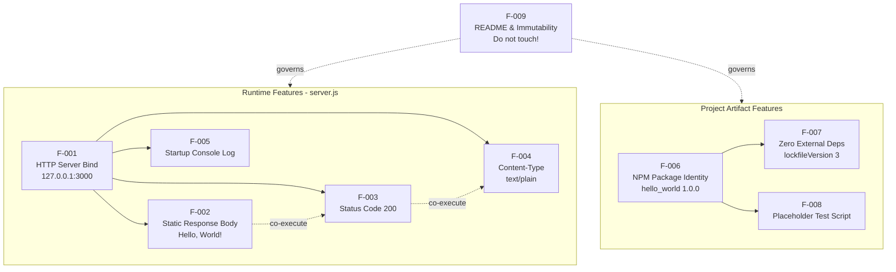

### 2.3.2 Integration Points

The system has exactly one inbound integration point and zero outbound integration points, consistent with the integration profile in Sections 1.2.1 and 1.3.1.

| Integration Point | Direction | Features Involved | Mechanism |
|---|---|---|---|
| HTTP endpoint at `127.0.0.1:3000` | Inbound | F-001, F-002, F-003, F-004 | TCP/HTTP via Node.js `http` module |
| Standard output stream | Outbound (logging) | F-005 | `console.log` → `process.stdout` |
| npm CLI manifest interaction | Tooling | F-006, F-007, F-008 | JSON parsing of `package.json` and `package-lock.json` |
| README rendering | Documentation | F-009 | Markdown viewers / repository hosts |

### 2.3.3 Shared Components and Common Services

The system contains a small set of shared building blocks. All sharing is intra-process and intra-file; there are no cross-module shared services because the entire runtime is a single file.

| Shared Component | Used By | Description |
|---|---|---|
| `hostname` constant (`127.0.0.1`) | F-001, F-005 | Bind target and log message interpolation |
| `port` constant (`3000`) | F-001, F-005 | Bind target and log message interpolation |
| Node.js `http` module | F-001, F-002, F-003, F-004 | Server creation and response API surface |
| `http.createServer` request handler | F-002, F-003, F-004 | Single arrow-function callback co-locating body, status, and header logic |
| `package.json` manifest | F-006, F-007, F-008 | Hosts identity metadata, dependency declarations, and script definitions |
| MIT license declaration | F-006, F-007 | Asserted in both `package.json` and `package-lock.json` |

### 2.3.4 Governance Relationship

F-009 (Repository Documentation & Immutability Directive) is unique in that it imposes a governance constraint on every other feature. The `Do not touch!` directive is a meta-requirement: any change to F-001 through F-008 would itself constitute a violation of F-009. This is consistent with the immutability emphasis established in Sections 1.1.4 and 1.2.3.

## 2.4 Implementation Considerations

This subsection captures cross-cutting implementation factors that apply to one or more features. All considerations are grounded in observable code; no extrapolated SLAs, throughput targets, or availability commitments are introduced — consistent with Section 1.2.3, which states that no quantitative KPIs are declared in the repository.

### 2.4.1 Technical Constraints

| Constraint | Affected Features | Source of Constraint |
|---|---|---|
| Node.js runtime required | F-001, F-002, F-003, F-004, F-005 | `require('http')` is a Node-only API |
| CommonJS module system required | All runtime features | `require` syntax in `server.js` |
| TCP port `3000` must be free on loopback | F-001 | No fallback or retry logic in code |
| `package.json` declared entry point inconsistency | F-006 | Declared `index.js` does not exist; runtime is `server.js` |
| No `start` script | F-006 | Server launched only via `node server.js`, not `npm start` |
| MIT license terms | All features | Declared in `package.json` and `package-lock.json` |
| Repository immutability | All features | F-009's `Do not touch!` directive |

### 2.4.2 Performance Requirements

The repository declares no quantitative performance targets (Section 1.2.3, Key Performance Indicators). Performance characteristics are exclusively determined by Node.js's built-in `http` module operating under default settings.

| Performance Dimension | Specified Value | Notes |
|---|---|---|
| Latency target | None declared | Behavior is whatever Node.js default produces |
| Throughput target | None declared | No connection limits or rate limiting code |
| Concurrency tuning | None | Single-process Node.js event loop default |
| Keep-alive configuration | None | Node.js default keep-alive applies |
| Connection limit | None | No `maxConnections` setting in code |

### 2.4.3 Scalability Considerations

Scalability is explicitly out of scope (Section 1.3.2, Unsupported Use Cases). The system is single-process, single-host, and bound to the loopback interface only.

| Scalability Dimension | Status | Implication |
|---|---|---|
| Horizontal scaling | Not supported | No clustering, worker threads, or process management |
| Loopback binding (`127.0.0.1`) | By design | Server is unreachable from outside the host |
| Stateless handler | By design | All requests yield identical output (idempotent) |
| Multi-tenant responses | Not supported | No per-user or per-origin differentiation |

### 2.4.4 Security Implications

The minimal surface area of the system results in a correspondingly minimal security exposure profile.

| Security Dimension | Status | Mitigating Factor |
|---|---|---|
| Authentication / authorization | Not implemented | Not in scope; loopback binding limits exposure |
| TLS / HTTPS | Not implemented | Plaintext HTTP only; no certificate management |
| External network exposure | Restricted | Loopback-only binding (`127.0.0.1`, not `0.0.0.0`) |
| Input validation | Not applicable | No input is read from `req` |
| Secrets / credentials | Not present | No environment variables, config files, or secret stores |
| Supply chain attack surface | Eliminated | Zero external dependencies (F-007) |
| Logging of sensitive data | None | Only the static startup line is logged (F-005) |

### 2.4.5 Maintenance Requirements

| Maintenance Dimension | Approach | Source |
|---|---|---|
| Code change policy | Effectively frozen — `Do not touch!` directive | F-009 / `README.md` |
| Versioning | Static `1.0.0`; no SemVer evolution planned | F-006 / `package.json` |
| Dependency updates | None required (zero dependencies) | F-007 |
| CI/CD configuration | None present | No `.github/`, `.gitlab-ci`, or equivalent files (Section 1.3.2) |
| Test maintenance | Not applicable — placeholder fails by design | F-008 |
| Documentation maintenance | Single 3-line README | F-009 |
| Issue templates / contribution guides | Not present | Repository contains only the four files (Section 1.3.2) |
| Changelog / roadmap | Not present | Future expansion not planned (Section 1.3.2) |

## 2.5 Traceability Matrix

The traceability matrix maps each functional requirement to its source-file evidence and to the higher-level scope items declared in Section 1.3.

### 2.5.1 Requirements-to-Evidence Mapping

| Requirement ID | Evidence File | Evidence Locator |
|---|---|---|
| F-001-RQ-001 | `server.js` | `const hostname = '127.0.0.1'` |
| F-001-RQ-002 | `server.js` | `const port = 3000` |
| F-001-RQ-003 | `server.js` | `const http = require('http')` |
| F-001-RQ-004 | `server.js` | CommonJS `require` syntax used throughout |
| F-002-RQ-001 | `server.js` | `res.end('Hello, World!\n')` |
| F-002-RQ-002 | `server.js` | Handler does not inspect `req.method` |
| F-002-RQ-003 | `server.js` | Handler does not inspect `req.url` |
| F-002-RQ-004 | `server.js` | Handler does not bind `data`/`end` events on `req` |
| F-003-RQ-001 | `server.js` | `res.statusCode = 200` |
| F-003-RQ-002 | `server.js` | No alternative status assignments in handler |
| F-004-RQ-001 | `server.js` | `res.setHeader('Content-Type', 'text/plain')` |
| F-004-RQ-002 | `server.js` | Header set unconditionally on every response |
| F-005-RQ-001 | `server.js` | `console.log(...)` inside `listen` callback |
| F-005-RQ-002 | `server.js` | Template literal `Server running at http://${hostname}:${port}/` |
| F-005-RQ-003 | `server.js` | `console.log` is the sole body of the `listen` callback |
| F-006-RQ-001 | `package.json` | `"name": "hello_world"` |
| F-006-RQ-002 | `package.json` | `"version": "1.0.0"` |
| F-006-RQ-003 | `package.json` | `"author": "hxu"` |
| F-006-RQ-004 | `package.json` | `"license": "MIT"` |
| F-007-RQ-001 | `package-lock.json` | `"lockfileVersion": 3` |
| F-007-RQ-002 | `package-lock.json` | `packages` object contains only root entry |
| F-007-RQ-003 | `package.json` | `dependencies`/`devDependencies` keys absent |
| F-008-RQ-001 | `package.json` | `scripts.test` field defined |
| F-008-RQ-002 | `package.json` | `&& exit 1` in script body |
| F-008-RQ-003 | `package.json` | `echo "Error: no test specified"` in script body |
| F-009-RQ-001 | `README.md` | `# hao-backprop-test` heading |
| F-009-RQ-002 | `README.md` | `test project for backprop integration` |
| F-009-RQ-003 | `README.md` | `Do not touch!` |

### 2.5.2 Cross-Section References

| Feature | Related Tech Spec Section | Topic |
|---|---|---|
| F-001, F-002, F-003, F-004, F-005 | Section 1.2.2 (Primary System Capabilities) | Capability-to-feature mapping |
| F-001 | Section 1.2.1 (Integration with Enterprise Landscape) | Loopback-only HTTP integration model |
| F-002, F-003, F-004 | Section 1.3.1 (Core Features and Functionalities) | Source-of-truth implementation evidence |
| F-005 | Section 1.2.3 (Measurable Objectives) | Startup correctness observable indicator |
| F-006 | Section 1.2.1 (Business Context) | npm package identity rationale |
| F-007 | Section 1.2.3 (Critical Success Factors) | Dependency-free operation factor |
| F-008 | Section 1.3.2 (Excluded Features) | Test suite absence verification |
| F-009 | Section 1.1.4 (Value Proposition); Section 1.2.3 (Critical Success Factors) | Code immutability as a system-wide property |

### 2.5.3 Process Flowchart Reference

The end-to-end request/response flow that exercises features F-001 through F-005 is depicted in the Mermaid flowchart of **Section 1.2.2 (Major System Components)**, which shows the path: Backprop HTTP Client → Node.js HTTP Server → 200 OK response → Startup log to stdout. That diagram is the canonical process flowchart for this section's runtime features and is not duplicated here.

## 2.6 Assumptions and Constraints

This subsection consolidates the assumptions underpinning the requirements and the explicit constraints that bound the system's evolution.

### 2.6.1 Operating Assumptions

| Assumption | Justification |
|---|---|
| A Node.js runtime is available on the host | Required for `require('http')` (F-001) |
| TCP port `3000` is free on `127.0.0.1` | No fallback or port-discovery logic exists |
| The integration consumer runs on the same host | Loopback-only binding precludes cross-host access |
| The host filesystem honors the four committed files | No verification logic in source code |
| The MIT license terms are accepted by consumers | Declared in both manifest and lockfile |

### 2.6.2 Explicit Constraints

| Constraint | Origin | Effect |
|---|---|---|
| `Do not touch!` immutability directive | F-009 / `README.md` | Forbids modification of any feature |
| Hardcoded hostname and port | F-001 / `server.js` | No runtime reconfiguration possible |
| Zero external dependencies | F-007 / `package-lock.json` | Forbids introduction of npm packages |
| No `start` script | F-006 / `package.json` | Server must be launched as `node server.js` |
| Declared entry point `index.js` does not exist | F-006 inconsistency | Project cannot be `require`d as a library |
| No environment variable configuration | Section 1.3.2 | Configuration cannot be externalized without code changes |
| No graceful shutdown handlers | Section 1.3.2 | Process termination is abrupt; no SIGINT/SIGTERM hooks |

### 2.6.3 Requirement Versioning

All requirements derive from the package version `1.0.0` declared in `package.json` (F-006-RQ-002). Because the codebase is governed by F-009's immutability directive, requirement versions are locked to `1.0.0` and are not expected to evolve within this repository. Any future versioning would necessitate a separate repository or a successor fixture.

## 2.7 References

### 2.7.1 Repository Files Examined

- `server.js` — 15-line runtime artifact. Source of evidence for F-001 (HTTP bind on `127.0.0.1:3000`), F-002 (static `Hello, World!\n` response), F-003 (status `200`), F-004 (`Content-Type: text/plain` header), and F-005 (startup log message). Implements the entire runtime using the Node.js built-in `http` module via CommonJS `require`.
- `package.json` — 11-line npm manifest. Source of evidence for F-006 (package identity: `hello_world` / `1.0.0` / `hxu` / MIT) and F-008 (placeholder failing test script). Declares `"main": "index.js"` for a file that does not exist in the repository.
- `package-lock.json` — 14-line npm lockfile (`lockfileVersion: 3`). Source of evidence for F-007 (zero external dependencies; root-only `packages` entry) and reaffirms F-006 identity (name `hello_world`, version `1.0.0`, MIT license).
- `README.md` — 3-line documentation file. Source of evidence for F-009 (repository name `hao-backprop-test`, project purpose statement, and immutability directive `Do not touch!`).

### 2.7.2 Repository Folders Explored

- Repository root (`/`) — Confirmed via folder enumeration to contain only the four files above plus the `.git` directory. No subdirectories such as `src/`, `test/`, `lib/`, `config/`, `.github/`, or `docs/` exist. No hidden configuration files (`.env`, `.gitignore`, `.eslintrc`, `Dockerfile`, `Makefile`) are present.

### 2.7.3 Technical Specification Sections Cross-Referenced

- **Section 1.1 Executive Summary** — Provided project overview, business problem framing, stakeholder list (`hxu`, backprop integration target, future contributors), and value proposition statement emphasizing immutability and predictability.
- **Section 1.2 System Overview** — Provided integration model (loopback-only HTTP), capability table (HTTP listening, static response, content typing, startup logging), technology stack rationale, success criteria (binary observable indicators), and confirmed absence of formal SLAs/KPIs.
- **Section 1.3 Scope** — Provided exhaustive in-scope feature list with implementation evidence pointers, and out-of-scope capabilities list (HTTPS, routing, method differentiation, request body parsing, authentication, persistence, environment variables, graceful shutdown, error handling, logging framework, tests, build pipeline, external dependencies).

# 3. Technology Stack

This section provides the definitive catalog of all technologies, languages, frameworks, libraries, services, and tooling that constitute the `hao-backprop-test` repository. Every entry is grounded in observable evidence from the four-file repository (`server.js`, `package.json`, `package-lock.json`, `README.md`).

> **Critical Notice — Default Stack Inapplicability**
>
> The default technology stack typically applied to backend systems (AWS, Docker, Terraform, GitHub Actions, Python/Flask, Auth0, MongoDB, Langchain, React, TypeScript, TailwindCSS, Swift, Kotlin, Objective-C, ElectronJS) is **explicitly inapplicable** to this project. The repository contains zero evidence of any of those technologies. Adopting them would directly violate the immutability directive established in F-009 (`README.md`'s `Do not touch!` instruction) and the zero-dependency mandate of F-007. The technology stack documented below reflects the minimal, intentionally constrained reality of the codebase.

The overarching design philosophy that justifies every technology decision in this section is captured in Section 1.2.3: **code immutability** and **dependency-free operation**. The empty dependency graph in `package-lock.json` (lockfileVersion `3`) ensures the project cannot be broken by upstream package changes — a property that is itself a critical success factor for the project's role as a stable integration fixture for the backprop tooling.

## 3.1 PROGRAMMING LANGUAGES

### 3.1.1 Language Inventory by Component

| Component | Language | Module System | Source File | Rationale |
|---|---|---|---|---|
| HTTP Server (sole runtime) | JavaScript (ECMAScript) | CommonJS | `server.js` | Required by Node.js built-in `http` module API |
| npm Manifest | JSON | n/a | `package.json` | npm tooling format |
| npm Lockfile | JSON | n/a | `package-lock.json` | npm v7+ lockfile schema (lockfileVersion `3`) |
| Documentation | Markdown | n/a | `README.md` | Human-readable repository description |

### 3.1.2 Server-Side Language: JavaScript

The system uses JavaScript exclusively for all executable logic. There is precisely one source file containing runtime behavior — `server.js` — written in standard ECMAScript syntax compatible with the Node.js runtime.

#### Selection Criteria

- **Direct API binding requirement**: Per Section 1.2.2, the runtime layer is selected as Node.js because "the `http` module is a Node-only API." JavaScript is therefore the only practical language choice for invoking that API directly without a foreign-function interface.
- **Stable integration target**: Per Section 1.1.4 (Executive Summary), the value proposition is derived from the project's intentional minimalism — JavaScript on Node.js requires no compilation, transpilation, or interpreter pre-warming, presenting the simplest possible runtime contract to the consuming integration.
- **Manifest-language alignment**: The npm ecosystem is the canonical distribution channel for JavaScript code. Adopting JavaScript aligns the runtime language with the package manager toolchain (`npm`), eliminating cross-language tooling friction.

#### Constraints

- **No transpilation step is permitted.** No `babel.config.js`, `tsconfig.json`, or any transpiler configuration exists in the repository, and Section 1.3.2 explicitly excludes "Build pipeline: No build scripts, bundlers, or transpilers configured."
- **No type-checking layer is permitted.** No TypeScript files (`.ts`, `.tsx`), no `tsconfig.json`, and no type-declaration packages exist in the dependency graph.

### 3.1.3 Module System: CommonJS

The codebase uses the **CommonJS** module specification, identifiable by the `require('http')` invocation in `server.js`. ES Modules (`import`/`export`) are not used.

#### Constraint Source

This is a hard, non-negotiable constraint formalized in Section 2.4.1 (Technical Constraints), which lists "CommonJS module system required" as a constraint affecting all runtime features, sourced from the `require` syntax in `server.js`. It is further formalized as functional requirement F-001-RQ-004 in Section 2.2.1.

#### Selection Rationale

- **Zero configuration**: CommonJS is the default module system for Node.js when no `"type": "module"` field is present in `package.json` and no `.mjs` extension is used. The absence of any module-type declaration in `package.json` confirms the implicit CommonJS resolution.
- **Maximum runtime compatibility**: CommonJS is supported by every Node.js version that ships with the `http` module — broadening the range of host runtimes that can serve as integration platforms without modification.

### 3.1.4 Excluded Languages

For completeness and to prevent ambiguity for downstream integrators, the following languages are explicitly **not** present in any form in the repository: Python, TypeScript, Swift, Kotlin, Objective-C, Java, C#, Go, Rust, Ruby, PHP, C++, C. There are no `.py`, `.swift`, `.kt`, `.m`, `.tsx`, `.jsx`, `.css`, or HTML files anywhere in the repository tree.

## 3.2 FRAMEWORKS & LIBRARIES

### 3.2.1 Runtime Platform: Node.js

The runtime platform is Node.js, identified by the presence of the CommonJS `require` mechanism and the use of the Node-only `http` module.

#### Version Pinning

| Pinning Mechanism | Status | Implication |
|---|---|---|
| `engines` field in `package.json` | **Absent** | No declared minimum or maximum Node.js version |
| `.nvmrc` file | **Absent** | No nvm-based version pin |
| `.node-version` file | **Absent** | No equivalent version pin |
| `volta` field in `package.json` | **Absent** | No Volta-based version pin |

The deliberate absence of any version pinning, combined with the use of only the most stable Node.js core API (`http`), maximizes the range of compatible Node.js runtimes. This aligns with the integration-fixture purpose: the consuming backprop tooling can validate against any Node.js installation that supports the long-stable `http` module.

### 3.2.2 HTTP Library: Node.js Built-in `http` Module

The sole library used at runtime is the Node.js built-in `http` module, which is part of the Node.js standard library and does **not** appear in the dependency graph because it ships with the runtime itself.

| Attribute | Value |
|---|---|
| Module name | `http` |
| Source | Node.js core standard library |
| Import line | `const http = require('http');` (line 1 of `server.js`) |
| APIs used | `http.createServer(handler)`, `server.listen(port, hostname, callback)` |
| Version | Bound to the host Node.js runtime version (no independent version) |

#### Justification (Section 1.2.2)

The selection rationale, as documented in the Stack Layer table of Section 1.2.2, is unequivocal: "HTTP Library: Built-in `http` module — No framework dependencies needed." This rationale is reinforced by F-001-RQ-003 (Section 2.2.1), which formalizes the requirement: **"The system shall use the Node.js built-in `http` module exclusively."**

### 3.2.3 Excluded Frameworks

The following frameworks are explicitly **not** used. This list is provided to eliminate ambiguity given that several are commonly assumed in backend Node.js projects:

| Excluded Category | Examples Verified Absent |
|---|---|
| HTTP application frameworks | Express, Koa, Fastify, Hapi, NestJS, Restify, Polka |
| Web frameworks (other ecosystems) | Flask, Django, FastAPI, Spring, Rails, Laravel, ASP.NET |
| Frontend frameworks | React, Angular, Vue, Svelte, Solid, Preact |
| Mobile/Native frameworks | React Native, Flutter, SwiftUI, Jetpack Compose |
| AI/ML frameworks | Langchain, LlamaIndex, Hugging Face Transformers, TensorFlow.js |
| ORM / Database frameworks | Mongoose, Sequelize, TypeORM, Prisma, Knex |
| Testing frameworks | Jest, Mocha, Vitest, Tap, AVA, Jasmine |

The absence of frameworks is a positive design decision, not an oversight. Per Section 2.1.7 (Feature F-007: Zero External Dependencies), this absence "eliminates the risk of upstream package drift breaking the integration target."

## 3.3 OPEN SOURCE DEPENDENCIES

### 3.3.1 Direct Dependencies

**The repository declares zero open-source dependencies.** The complete content of `package.json` confirms this:

| Manifest Field | Value or Status |
|---|---|
| `dependencies` | **Field absent** |
| `devDependencies` | **Field absent** |
| `peerDependencies` | **Field absent** |
| `optionalDependencies` | **Field absent** |
| `bundledDependencies` | **Field absent** |

This is not an empty-but-present `dependencies: {}` object — the keys themselves do not appear in the manifest. The manifest contains only identity fields (`name`, `version`, `description`, `main`, `author`, `license`) and a single placeholder script.

### 3.3.2 Lockfile Determinism

`package-lock.json` provides cryptographic-grade verification that no transitive dependencies exist either:

| Lockfile Attribute | Value |
|---|---|
| `lockfileVersion` | `3` (npm v7+ schema) |
| `packages` object entries | One — the root entry keyed by `""` |
| External package entries | **Zero** |
| Resolved registry URLs | **None present** |
| Integrity hashes | **None present** |

The empty `packages` object confirms that no transitive resolution occurred. This satisfies F-007-RQ-002 (Section 2.2.7): **"The lockfile shall declare zero external packages."**

#### Security Implication

Per Section 2.4.4 (Security Implications), this design **eliminates the supply-chain attack surface** entirely. The system is structurally immune to:

- Malicious package injection (no resolution path exists)
- Transitive vulnerability disclosures (no transitive packages exist)
- Deprecation cascade failures (no upstream packages to deprecate)
- Version-resolution drift (no packages to resolve)
- Typosquatting attacks (no package names to typosquat)

### 3.3.3 Package Registry Configuration

| Registry Attribute | Value |
|---|---|
| Default registry | `npmjs.com` (implied by use of standard `package-lock.json`) |
| `.npmrc` file | **Absent** — no custom registry configured |
| Scoped registry overrides | **None** |
| Private registry references | **None** |
| `publishConfig` block in manifest | **Absent** — package is not configured for publication |

The package is **not published to any registry**. Per Section 1.2.1, the npm package metadata "exists only to confirm the project's identity and to support local Node.js tooling conventions" — the package is consumed only by direct repository checkout and `node server.js` invocation, never by `npm install hello_world`.

### 3.3.4 Dependency Graph Diagram

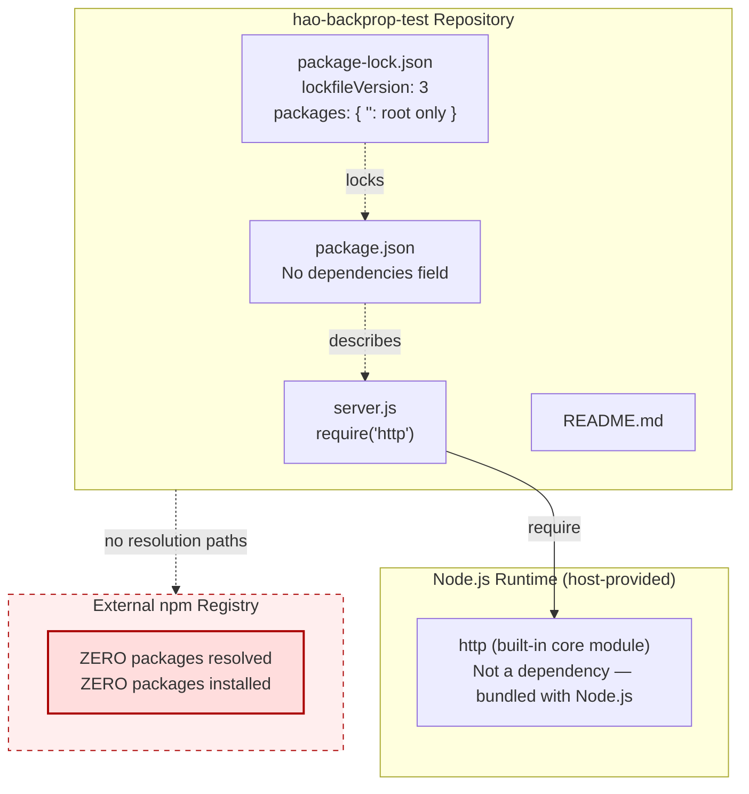

## 3.4 THIRD-PARTY SERVICES

### 3.4.1 External Service Integration Status

**The system integrates with zero third-party services.** This is an explicit, non-negotiable property documented in Section 1.3.2 (Out-of-Scope Elements).

| Service Category | Default-Stack Equivalent | Repository Status |
|---|---|---|
| Cloud platforms | AWS, Azure, GCP | **Not used** — no SDK imports, no IAM credentials, no service endpoints |
| Authentication providers | Auth0, Okta, AWS Cognito | **Not used** — no auth library, no JWT issuance, no OAuth flows |
| Application monitoring | Datadog, New Relic, Sentry | **Not used** — no instrumentation, no agent installation |
| Logging aggregation | Splunk, Loggly, ELK Stack | **Not used** — only stdout via single `console.log` (F-005) |
| Error tracking | Sentry, Rollbar, Bugsnag | **Not used** — no error handlers, no exception reporting |
| Email / Notifications | SendGrid, Mailgun, Twilio | **Not used** — no outbound communication |
| AI / LLM services | OpenAI, Anthropic, Cohere | **Not used** — no API client, no AI framework |
| Payment processors | Stripe, PayPal | **Not used** — no commerce surface |
| CDN services | CloudFront, Cloudflare, Fastly | **Not used** — server is loopback-only |

### 3.4.2 Outbound Network Activity

Per the source-level evidence in `server.js`, the application performs **no outbound network requests** of any kind:

- No `http.request()` invocations
- No `https.request()` invocations
- No `fetch()` calls (and no fetch polyfill imported)
- No `net.connect()` or socket-level outbound traffic
- No DNS lookups initiated by application code

The only network activity is **inbound HTTP** on the loopback interface `127.0.0.1:3000`. The combination of loopback binding plus zero outbound traffic means the system has no network egress requirements whatsoever.

### 3.4.3 Service Absence Justifications

The deliberate absence of every third-party service category is justified by the project's role and constraints:

| Service Category | Justification for Absence |
|---|---|
| Authentication | Section 2.4.4: loopback binding renders external auth controls redundant for the threat model |
| Monitoring / APM | Section 1.2.3: no quantitative KPIs or SLAs are declared, so no observability targets exist |
| Cloud services | Section 1.3.2: deployment is local execution (`node server.js`) only |
| External APIs | Section 1.2.1: integration is a single inbound HTTP endpoint, not a federated mesh |

## 3.5 DATABASES & STORAGE

### 3.5.1 Persistence Layer Status

**The system implements no persistence layer.** Section 1.3.1 (Implementation Boundaries) explicitly states under Data domains: **"None — no persistent or in-memory user data is processed."** Section 1.3.2 (Excluded Features) additionally confirms: **"Persistence (database, file I/O) — No I/O modules imported."**

### 3.5.2 Database Inventory

| Database Category | Default-Stack Equivalent | Repository Status |
|---|---|---|
| Document database | MongoDB | **Not used** — no `mongoose`, no `mongodb` driver |
| Relational database | PostgreSQL, MySQL | **Not used** — no `pg`, no `mysql2` driver |
| Key-value store | Redis, DynamoDB | **Not used** — no `redis`, no `ioredis` driver |
| Search engine | Elasticsearch, OpenSearch | **Not used** — no client libraries |
| Graph database | Neo4j | **Not used** — no graph drivers |
| Vector database | Pinecone, Weaviate | **Not used** — no vector store clients |

### 3.5.3 In-Memory State

Per Section 2.4.3 (Scalability Considerations), the request handler is documented as **stateless** by design: "All requests yield identical output (idempotent)." Verification at the source level confirms:

- No closure-captured variables hold per-request state
- No top-level mutable variables track request counts, sessions, or caches
- No `Map`, `Set`, or `WeakMap` in-memory stores are instantiated

### 3.5.4 Caching Solutions

**No caching layer is present at any tier.**

| Cache Tier | Status |
|---|---|
| In-process cache (e.g., LRU) | **None** |
| Distributed cache (Redis, Memcached) | **None** |
| HTTP cache headers | **None** — no `Cache-Control`, `ETag`, or `Last-Modified` headers set in the response |
| CDN edge caching | **None** — server is loopback-only |

### 3.5.5 File System and Object Storage

**No file system I/O occurs at runtime.** The Node.js `fs` module is not imported in `server.js`. No object storage services (S3, Azure Blob Storage, GCS) are referenced. The only files involved at any phase are the four committed source files, which are read by Node.js itself during module loading — not by application code.

## 3.6 DEVELOPMENT & DEPLOYMENT

### 3.6.1 Development Tools

The development tooling surface is minimal by design.

| Tool Category | Selection | Justification |
|---|---|---|
| Package Manager | **npm** | Implied by presence of `package.json` and `package-lock.json` (lockfileVersion `3`); no `yarn.lock` or `pnpm-lock.yaml` exists |
| Linter | **None** | No `.eslintrc*`, no `.prettierrc*`, no `eslint.config.js` |
| Code formatter | **None** | No formatter configuration files |
| Type checker | **None** | No `tsconfig.json`, no `jsconfig.json` |
| Editor configuration | **None** | No `.editorconfig`, no `.vscode/`, no `.idea/` directories |
| Pre-commit hooks | **None** | No `.husky/`, no `lint-staged` configuration |
| Git ignore configuration | **None** | No `.gitignore` file is committed (per Section 2.7) |

#### Package Manager: npm

The choice of npm (rather than yarn, pnpm, or bun) is verified by the `lockfileVersion: 3` field in `package-lock.json`, which is npm-specific (introduced in npm v7+). Section 2.3.2 confirms "npm CLI manifest interaction" as the tooling integration mechanism.

### 3.6.2 Build System

**No build system is configured.** Per Section 1.3.2 (Out-of-Scope Elements): "Build pipeline: No build scripts, bundlers, or transpilers configured."

| Build Concern | Status |
|---|---|
| Bundler (Webpack, Rollup, esbuild, Vite) | **None** |
| Transpiler (Babel, SWC, TypeScript compiler) | **None** |
| Task runner (Gulp, Grunt) | **None** |
| `Makefile` | **None** |
| `npm scripts` | **Only** a placeholder `test` script: `echo "Error: no test specified" && exit 1` |
| Production minification | **None** |
| Source map generation | **None** |
| Asset pipeline | **None** |

The absence of `start`, `build`, `lint`, `dev`, or `prepare` scripts is documented as a constraint in Section 2.6.2: **"No `start` script — Server must be launched as `node server.js`."**

### 3.6.3 Containerization

**No containerization is configured.**

| Container Asset | Status |
|---|---|
| `Dockerfile` | **Absent** (Section 2.7.2 folder enumeration) |
| `docker-compose.yml` | **Absent** |
| `.dockerignore` | **Absent** |
| Kubernetes manifests (`*.yaml`, Helm charts) | **Absent** |
| OCI image references | **None** |

Adding a `Dockerfile` would not change the application's runtime behavior, but doing so would constitute a change to the repository — directly forbidden by F-009's `Do not touch!` immutability directive. Containerization, if required by a downstream integration host, must be applied externally to this repository, not within it.

### 3.6.4 CI/CD Configuration

**No CI/CD pipeline is configured.** Section 2.4.5 (Maintenance Requirements) confirms: "CI/CD configuration: None present — No `.github/`, `.gitlab-ci`, or equivalent files."

| CI/CD Asset | Status |
|---|---|
| GitHub Actions (`.github/workflows/`) | **Absent** |
| GitLab CI (`.gitlab-ci.yml`) | **Absent** |
| CircleCI (`.circleci/config.yml`) | **Absent** |
| Travis CI (`.travis.yml`) | **Absent** |
| Jenkins (`Jenkinsfile`) | **Absent** |
| Azure Pipelines (`azure-pipelines.yml`) | **Absent** |

### 3.6.5 Infrastructure as Code

**No Infrastructure as Code (IaC) configuration is present.**

| IaC Tool | Status |
|---|---|
| Terraform (`.tf` files) | **Absent** |
| Pulumi | **Absent** |
| AWS CloudFormation | **Absent** |
| AWS CDK | **Absent** |
| Ansible playbooks | **Absent** |
| Chef / Puppet manifests | **Absent** |

### 3.6.6 Test Infrastructure

**No automated test framework is installed.**

| Test Concern | Status |
|---|---|
| Test framework (Jest, Mocha, Vitest, Tap) | **None installed** — zero dependencies |
| Test files (`*.test.js`, `__tests__/`) | **None present** |
| `npm test` outcome | Intentional failure — `echo "Error: no test specified" && exit 1` |
| Coverage tooling (nyc, c8) | **None** |
| End-to-end tooling (Playwright, Cypress) | **None** |

The placeholder failing `test` script is itself a documented feature, F-008 (Section 2.1.8): the intentional failure signals to operators and CI systems that no test suite exists, distinguishing the project from one where tests merely failed to be discovered.

### 3.6.7 Deployment Model

The deployment model is **direct command-line invocation on a host with Node.js installed**. There is no orchestrator, no process supervisor, and no service manager configured within the repository.

#### Launch Command

```
node server.js
```

#### Reachability Constraints

| Constraint | Source | Implication |
|---|---|---|
| Loopback binding (`127.0.0.1`) | `server.js:3` (hardcoded `hostname` constant) | Server is unreachable from any external host or network |
| TCP port `3000` | `server.js:4` (hardcoded `port` constant) | Port collisions cause immediate startup failure (no fallback) |
| No environment variable overrides | Section 2.6.2 | Configuration cannot be externalized without code changes — and code changes are forbidden by F-009 |

#### Process Lifecycle

| Lifecycle Concern | Behavior |
|---|---|
| Startup | Synchronous; emits `Server running at http://127.0.0.1:3000/` to stdout when listener is ready |
| Steady state | Stateless request handling on the Node.js event loop |
| Shutdown | Abrupt — no SIGINT/SIGTERM hooks; no graceful drain (Section 2.6.2) |
| Restart policy | None within repository — must be externally provided (e.g., systemd, pm2) if desired |

### 3.6.8 Deployment Topology Diagram

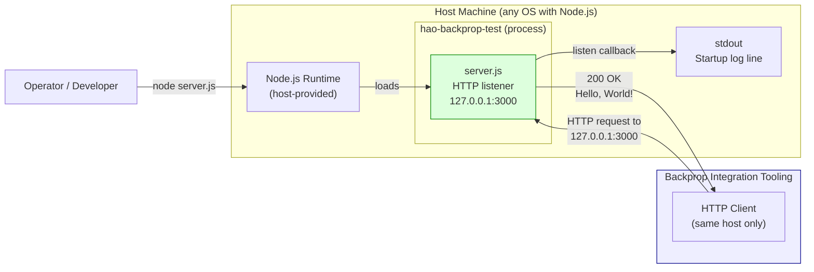

## 3.7 TECHNOLOGY STACK SUMMARY

### 3.7.1 Consolidated Stack Matrix

| Layer | Technology | Version | Source of Truth |
|---|---|---|---|
| Runtime | Node.js | Unpinned (no `engines` field) | Implied by `require('http')` in `server.js` |
| Language | JavaScript (ECMAScript) | n/a (runtime-bound) | `server.js` |
| Module system | CommonJS | n/a | `require('http')` in `server.js` |
| HTTP library | Node.js core `http` | Bound to runtime version | `server.js:1` |
| Package manager | npm | v7+ (lockfileVersion `3` semantics) | `package-lock.json:4` |
| Manifest format | npm `package.json` | n/a | `package.json` |
| License | MIT | n/a | `package.json:10`, `package-lock.json` |
| External dependencies | None | n/a | F-007 / `package-lock.json` |
| Frameworks | None | n/a | Section 1.2.2 |
| Databases | None | n/a | Section 1.3.1 |
| Caches | None | n/a | Section 3.5.4 |
| Cloud services | None | n/a | Section 3.4.1 |
| Containerization | None | n/a | Section 3.6.3 |
| CI/CD | None | n/a | Section 2.4.5 |
| IaC | None | n/a | Section 3.6.5 |
| Test framework | None | n/a | F-008 / Section 3.6.6 |
| Build tools | None | n/a | Section 1.3.2 |

### 3.7.2 Project Identity

| Identity Attribute | Value | Source |
|---|---|---|
| npm package name | `hello_world` | `package.json` |
| Package version | `1.0.0` | `package.json` (locked per F-006-RQ-002) |
| Description | `Hello world in Node.js` | `package.json` |
| Declared entry point | `index.js` (⚠️ file does not exist — see F-006 inconsistency) | `package.json` |
| Actual runtime artifact | `server.js` | Repository root |
| Author | `hxu` | `package.json` |
| License (manifest) | `MIT` | `package.json` |
| License (lockfile) | `MIT` | `package-lock.json` |
| Repository name | `hao-backprop-test` | `README.md` |
| Lockfile version | `3` | `package-lock.json` |

### 3.7.3 Default Technology Stack Deviation Analysis

The following table maps each item in the default technology stack provided in the section prompt to its disposition in this project, with the justification rooted in repository evidence:

| Default Stack Item | Disposition | Justification |
|---|---|---|
| AWS (Cloud Platform) | **Not used** | No SDK, no service references; deployment is local-only (Section 3.4.1) |
| Docker (Containerization) | **Not used** | No `Dockerfile`; F-009 immutability forbids addition (Section 3.6.3) |
| Terraform (IaC) | **Not used** | No `.tf` files; no infrastructure to provision (Section 3.6.5) |
| GitHub Actions (CI/CD) | **Not used** | No `.github/` directory (Section 2.4.5) |
| Python (Primary Language) | **Not used** | Project is JavaScript on Node.js (Section 3.1.2) |
| Flask (Framework) | **Not used** | Project is Node.js with built-in `http` only (Section 3.2.2) |
| Auth0 (Authentication) | **Not used** | No authentication implemented (Section 2.4.4) |
| MongoDB (Database) | **Not used** | No persistence layer (Section 3.5.1) |
| Langchain (AI Framework) | **Not used** | No AI surface; static response only (Section 3.4.1) |
| React (Web Frontend) | **Not used** | Server emits `text/plain`, not HTML; no frontend (Section 3.2.3) |
| TypeScript | **Not used** | JavaScript with CommonJS only (Section 3.1.2) |
| TailwindCSS | **Not used** | No frontend, no CSS surface |
| React-Native | **Not used** | No mobile target |
| Swift / Kotlin / Objective-C | **Not used** | No native applications |
| ElectronJS | **Not used** | No desktop application |

**Conclusion**: The technology stack of this repository is intentionally orthogonal to the default stack. Adopting any default item would breach the foundational constraints F-007 (zero external dependencies) and F-009 (immutability directive). The minimal stack documented in this section is therefore the **correct and complete** technology stack for the project's stated purpose as a stable backprop integration fixture.

#### References

#### Files Examined

- `server.js` — Sole runtime artifact; provides all evidence for runtime language (JavaScript/CommonJS), HTTP library selection (Node.js built-in `http`), hardcoded configuration (`hostname='127.0.0.1'`, `port=3000`), and the absence of outbound network calls or persistence I/O.
- `package.json` — npm manifest; provides evidence for package identity (`hello_world@1.0.0`), MIT license, declared entry point (`index.js`), placeholder test script, and the absence of `dependencies`, `devDependencies`, `engines`, and `start` script fields.
- `package-lock.json` — npm lockfile; provides evidence for `lockfileVersion: 3`, the empty `packages` object (root-only entry), and the consequent zero-dependency property that grounds Section 3.3.
- `README.md` — Repository documentation; provides evidence for the repository name `hao-backprop-test` and the immutability directive that justifies the prohibition against adopting default-stack technologies.

#### Folders Explored

- Repository root (`/`) — Confirmed via folder enumeration to contain only the four files above; no subdirectories beyond `.git`. No `src/`, `test/`, `lib/`, `config/`, `.github/`, `docs/`, `node_modules/`, or `.vscode/` directories exist.

#### Technical Specification Sections Cross-Referenced

- **Section 1.1 Executive Summary** — Justification for immutability and dependency-free operation as core value proposition.
- **Section 1.2 System Overview** — Stack-layer-by-rationale table (Runtime, Language, HTTP Library, Package Manager, External Dependencies); critical success factors emphasizing code immutability.
- **Section 1.3 Scope** — Out-of-scope confirmation for build pipeline, persistence, external integrations, and observability.
- **Section 2.1 Feature Catalog** — Feature F-007 (Zero External Dependencies), Feature F-008 (Placeholder Test Script), Feature F-009 (Immutability directive).
- **Section 2.2 Functional Requirements Tables** — Atomic requirements F-001-RQ-003 (Node.js `http` exclusively), F-001-RQ-004 (CommonJS), F-007-RQ-001 (lockfileVersion 3), F-007-RQ-002 (zero packages).
- **Section 2.3 Feature Relationships** — Confirms `Node.js http module` as shared component and `npm CLI manifest interaction` as tooling integration.
- **Section 2.4 Implementation Considerations** — Technical constraints, security implications (zero supply-chain attack surface), and maintenance requirements (no CI/CD).
- **Section 2.5 Traceability Matrix** — Maps each requirement to source-file evidence locator.
- **Section 2.6 Assumptions and Constraints** — Confirms no env-var configuration, version locked at `1.0.0`, and zero-dependency constraint sourced from F-007.
- **Section 2.7 References** — Confirms exhaustive folder enumeration; no `.github/`, `Dockerfile`, `Makefile`, `.env`, `.gitignore`, or `.eslintrc` files exist.

# 4. Process Flowchart

## 4.1 OVERVIEW AND WORKFLOW INVENTORY

### 4.1.1 Scope of Process Flows in This System

The `hao-backprop-test` repository is, by design, a fixed-output HTTP fixture comprising a single 15-line runtime artifact (`server.js`), three supporting manifest/documentation files (`package.json`, `package-lock.json`, `README.md`), and zero external dependencies. As established in Section 1.2.2 (High-Level Description), Section 1.3 (Scope), and Section 2.4 (Implementation Considerations), the application contains **no business logic decision points, no application-level error handling, no persisted state, and no outbound integrations**. Consequently, every flowchart in this section is intentionally narrow: the diagrams document what the code *does* — not an aspirational expansion of what it could do.

This minimalism is itself a documented requirement (F-009 — Repository Documentation & Immutability Directive, per Section 2.3.4), which governs all other features and forbids any divergence from the present implementation. The diagrams below therefore depict actual system behavior with high fidelity rather than generalized templates.

### 4.1.2 Workflow Inventory

The system contains exactly two end-to-end workflows. Both are wholly defined within `server.js`:

| Workflow ID | Workflow Name | Trigger | Termination | Frequency |
|---|---|---|---|---|
| WF-A | Server Startup Lifecycle | Operator invokes `node server.js` | Process listening on `127.0.0.1:3000` (steady state) | Once per process lifetime |
| WF-B | HTTP Request/Response Cycle | Inbound TCP connection on `127.0.0.1:3000` | Static `200 OK` response with `Hello, World!\n` body transmitted | Per request, unbounded |

There are **no scheduled jobs, no batch processing sequences, no event-driven flows, and no asynchronous message-driven workflows** in the repository. The "batch processing" and "event processing" axes called out in this section's prompt are explicitly inapplicable, consistent with Section 3.5 (Databases & Storage — none) and Section 3.4 (Third-Party Services — none).

### 4.1.3 Relationship to Other Diagrams in This Specification

This section consolidates and extends process-flow visualizations that appear throughout the specification. To preserve a single source of truth, cross-references are provided rather than duplicating identical content.

| Diagram in This Document | Source Section | Role in Section 4 |
|---|---|---|
| Major System Components flowchart | Section 1.2.2 | Designated by Section 2.5.3 as the canonical end-to-end runtime flowchart; extended below with swim lanes |
| Feature Dependency Map | Section 2.3.1 | Provides feature-to-feature dependency context referenced by the per-request flowchart |
| Dependency Graph Diagram | Section 3.3.4 | Confirms structural absence of integration calls into third-party packages |
| Deployment Topology Diagram | Section 3.6.8 | Provides operator/runtime/process boundary context; referenced by the high-level swim-lane diagram |

---

## 4.2 HIGH-LEVEL SYSTEM WORKFLOW

### 4.2.1 End-to-End Swim-Lane Diagram

The following diagram extends the canonical flowchart in Section 1.2.2 by adding swim lanes for each actor and system surface enumerated in Section 3.6.8 (Deployment Topology Diagram). The diagram unifies Workflow A (startup, top half) and Workflow B (per-request, bottom half) on a single canvas to make the relationship between them explicit.

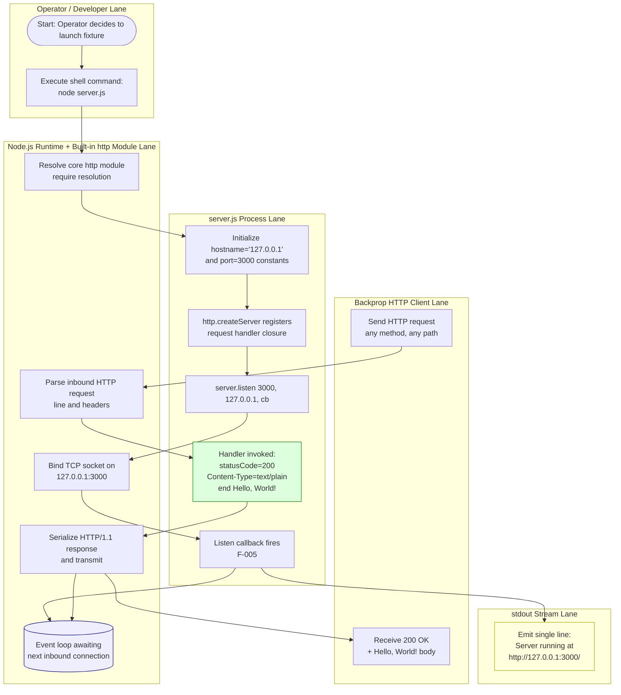

### 4.2.2 Actor and System Boundary Inventory

The complete set of actors and systems participating in the workflows is intentionally narrow. No additional actor (no authentication service, no database, no message broker, no reverse proxy, no load balancer, no external API provider) is referenced by any file in the repository.

| Actor / System | Lane | Role | Source of Evidence |
|---|---|---|---|
| Operator / Developer | Operator Lane | Initiates the process by typing `node server.js` | Section 3.6.7 (Launch Command) |
| Node.js Runtime | Runtime Lane | Provides event loop, module resolution, process lifecycle | Section 3.2.1 |
| Built-in `http` module | Runtime Lane | Parses HTTP requests, serializes responses, manages TCP socket | `server.js:1` (`require('http')`) |
| `server.js` process | Process Lane | Holds hostname/port constants, handler closure, listen callback | `server.js:1–15` |
| `stdout` stream | stdout Lane | Receives the single startup log line emitted by `console.log` | `server.js:13` |
| Backprop HTTP Client | Client Lane | Issues HTTP requests from the same host (loopback only) | Section 1.1.3, Section 1.2.1 |
| Loopback TCP/IP Stack | Implicit (under Runtime Lane) | Routes loopback packets between client and server | Section 1.2.1 |

### 4.2.3 User Touchpoints

There are exactly two user touchpoints, both attributable to the Operator/Developer:

1. **Process launch touchpoint** — execution of `node server.js` at the shell. Per Section 2.6.2, no `npm start` script is defined, so the canonical launch command is the literal `node server.js` and no other invocation is supported.
2. **Startup confirmation touchpoint** — observation of the `Server running at http://127.0.0.1:3000/` line on stdout. Per Section 1.2.3 (Measurable Objectives), this log line is the binary observable indicator of startup correctness.

The Backprop HTTP Client is a programmatic actor rather than a human user; consequently its interaction surface is the loopback HTTP endpoint, not a UI or CLI touchpoint.

---

## 4.3 CORE BUSINESS PROCESS — SERVER STARTUP LIFECYCLE (WORKFLOW A)

### 4.3.1 Step-by-Step Description

Workflow A executes exactly once per process lifetime. All steps are derived directly from `server.js` lines 1–14 and the requirement evidence in Section 2.5.1.

| Step | Code Locator | Description | Side Effect | Synchronicity |
|---|---|---|---|---|
| A-1 | (Operator) | Operator runs `node server.js` from the shell | Node.js process spawned | Synchronous |
| A-2 | `server.js:1` | `const http = require('http')` | CommonJS loader resolves Node.js core module (always succeeds — built-in) | Synchronous |
| A-3 | `server.js:3` | `const hostname = '127.0.0.1'` | Hostname constant initialized to loopback | Synchronous |
| A-4 | `server.js:4` | `const port = 3000` | Port constant initialized | Synchronous |
| A-5 | `server.js:6–10` | `http.createServer(handler)` | Server object instantiated; handler closure registered (NOT yet listening) | Synchronous |
| A-6 | `server.js:12` | `server.listen(port, hostname, cb)` | TCP bind requested at `127.0.0.1:3000` | **Asynchronous** |
| A-7 | `server.js:13` | Listen callback fires; `console.log(...)` emits startup line | Single text line written to `process.stdout` (F-005) | Synchronous (within callback) |
| A-8 | (implicit) | Node.js event loop becomes active | Process remains alive awaiting inbound connections | Steady-state asynchronous |

### 4.3.2 Startup Sequence Diagram

```mermaid
sequenceDiagram
    actor Operator
    participant Shell as OS Shell
    participant Node as Node.js Runtime
    participant Http as http module<br/>(built-in)
    participant Srv as server.js<br/>module
    participant Out as stdout

    Operator->>Shell: node server.js
    Shell->>Node: spawn process
    Node->>Srv: load and execute module
    Srv->>Http: require('http')
    Http-->>Srv: http API surface
    Note over Srv: Initialize constants:<br/>hostname='127.0.0.1'<br/>port=3000
    Srv->>Http: http.createServer(handler)
    Http-->>Srv: server object<br/>(handler registered;<br/>not yet listening)
    Srv->>Http: server.listen(3000, '127.0.0.1', cb)
    Http->>Node: request TCP bind on loopback:3000
    Node-->>Http: bind success (asynchronous)
    Http->>Srv: invoke listen callback
    Srv->>Out: console.log("Server running at http://127.0.0.1:3000/")
    Note over Node: Event loop active;<br/>process awaits inbound HTTP connections
```

### 4.3.3 Decision Points and Branches in Startup

The application code in `server.js` contains **zero decision points** — there are no `if`, `else`, `switch`, ternary, or short-circuit operators in the file. The only branching during startup occurs at the Node.js runtime boundary (not in application code):

| Branch | Decided By | Outcome on Success | Outcome on Failure | Application Mitigation |
|---|---|---|---|---|
| `http` module resolvable? | Node.js module loader | Module loaded | (impossible — built-in) | None |
| TCP port 3000 free on loopback? | OS network stack | Bind succeeds → listen callback fires | `EADDRINUSE` → uncaught exception → process exits non-zero | **None** (Section 2.4.1) |
| Loopback interface available? | OS network stack | Bind succeeds | Bind error → uncaught exception → process exits | **None** |

The absence of fallback or retry logic for any of these branches is a documented constraint per Section 2.4.1 ("TCP port `3000` must be free on loopback — No fallback or retry logic in code").

### 4.3.4 Timing Characteristics

Per Section 1.2.3 and Section 2.4.2, the repository declares no quantitative SLAs, latency targets, or throughput targets. Timing characteristics are exclusively those produced by Node.js's default behavior:

- **Steps A-1 through A-5 are synchronous** and complete in module-load time (microseconds on typical hardware).
- **Step A-6 is asynchronous**: `server.listen` returns immediately; the listen callback (Step A-7) fires only after the OS confirms the TCP bind.
- **Step A-7 is synchronous within the callback**: `console.log` is called once; no I/O latency is built into the application path.
- **No timeouts are configured**: the bind operation will wait as long as Node.js's default behavior dictates.

---

## 4.4 CORE BUSINESS PROCESS — HTTP REQUEST/RESPONSE CYCLE (WORKFLOW B)

### 4.4.1 Step-by-Step Description

Workflow B executes once per inbound HTTP request. The handler is defined at `server.js:6–10` as a single arrow function with three statements and no control flow.

| Step | Code Locator | Description | Decision Logic |
|---|---|---|---|
| B-1 | (external) | HTTP client opens TCP connection to `127.0.0.1:3000` | None |
| B-2 | (Node.js core) | `http` module parses request line, headers (and any body) | Handled by core, not application |
| B-3 | `server.js:6` | Handler `(req, res) => { ... }` invoked | **Unconditional** — invoked for every request regardless of method, path, headers, or body |
| B-4 | `server.js:7` | `res.statusCode = 200` | **Unconditional** — always 200 (F-003) |
| B-5 | `server.js:8` | `res.setHeader('Content-Type', 'text/plain')` | **Unconditional** — always `text/plain` (F-004) |
| B-6 | `server.js:9` | `res.end('Hello, World!\n')` | **Unconditional** — always identical 14-byte payload (F-002) |
| B-7 | (Node.js core) | Response serialized and transmitted to client | None |

Per requirement evidence in Section 2.5.1 (rows F-002-RQ-002, F-002-RQ-003, F-002-RQ-004): the handler does not inspect `req.method`, does not inspect `req.url`, and does not bind `data` or `end` events on `req`. As a result, the handler is fully **idempotent and stateless** (Section 2.4.3).

### 4.4.2 Per-Request Flowchart

The flowchart below intentionally contains **no decision diamonds** because the application's request path has no branching. This is a faithful representation of `server.js` lines 6–10, not a simplification.

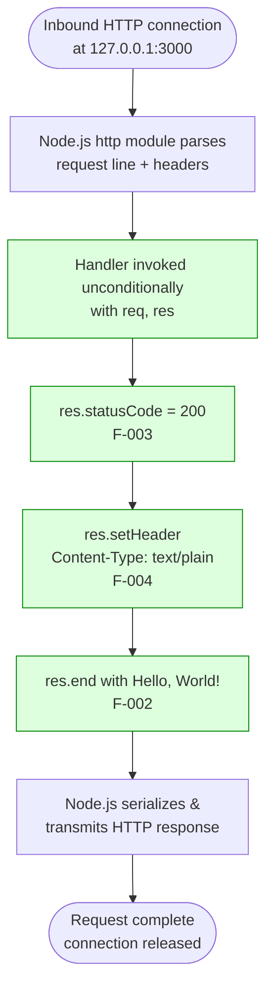

### 4.4.3 Decision Points (Application vs. Runtime)

| Layer | Number of Decision Points | Notes |
|---|---|---|
| Application code (`server.js`) | **0** | No `if`, `else`, `switch`, `case`, `?:`, `&&`, or `||` short-circuits. Verified by Section 2.5.1 evidence rows. |
| Node.js `http` module | (Internal) | Core handles malformed-request rejection (HTTP 400), keep-alive negotiation, etc., without invoking the application handler |
| OS TCP/IP stack | (Internal) | Connection acceptance and routing on the loopback interface |

This is a deliberate design property documented in Section 2.4.3 (Scalability — Stateless handler) and Section 2.5.1 (Requirements-to-Evidence Mapping).

### 4.4.4 Timing Characteristics

- **All handler statements are synchronous**: `res.statusCode`, `res.setHeader`, and `res.end` are non-blocking property/method calls that complete in nanoseconds. No I/O or computation occurs inside the handler.
- **Concurrency is governed entirely by Node.js's default event loop** (Section 2.4.2). No connection limits, rate limits, or back-pressure thresholds are configured.
- **Keep-alive defaults apply**: the application sets no `Connection` header behavior beyond Node.js defaults.
- **No SLA is declared**: the binary KPI from Section 1.2.3 is "the server either responds with the expected payload, or it does not."

---

## 4.5 INTEGRATION WORKFLOWS

### 4.5.1 Integration Point Inventory

Reproducing Section 2.3.2's inventory for completeness, the integration surface comprises one inbound point and zero outbound points (no third-party API, database, queue, or cache integration exists, per Section 3.4 and Section 3.5):

| Integration Point | Direction | Mechanism | Features Involved | Workflow |
|---|---|---|---|---|
| HTTP endpoint at `127.0.0.1:3000` | Inbound | TCP/HTTP via Node.js `http` module | F-001, F-002, F-003, F-004 | Workflow B |
| `process.stdout` | Outbound (logging) | `console.log` → stdout file descriptor | F-005 | Workflow A (one-time) |
| npm CLI manifest interaction | Tooling (offline) | JSON parsing of `package.json` and `package-lock.json` | F-006, F-007, F-008 | Operator-driven, not runtime |
| README rendering | Documentation | Markdown viewer / repository host | F-009 | Operator-driven, not runtime |

### 4.5.2 Inbound HTTP Integration Sequence Diagram

```mermaid
sequenceDiagram
    participant Client as Backprop<br/>HTTP Client
    participant TCP as Loopback<br/>TCP/IP Stack
    participant Http as Node.js<br/>http module
    participant Handler as server.js<br/>handler closure

    Client->>TCP: TCP SYN to 127.0.0.1:3000
    TCP->>Http: Accept connection
    Client->>Http: HTTP request line + headers + (optional) body
    Note over Http: Core parses request<br/>(handler not yet involved;<br/>malformed requests rejected here)
    Http->>Handler: invoke handler(req, res)
    Note over Handler: Handler does NOT inspect<br/>method, url, headers, or body<br/>(F-002-RQ-002 to F-002-RQ-004)
    Handler->>Http: res.statusCode = 200
    Handler->>Http: res.setHeader('Content-Type','text/plain')
    Handler->>Http: res.end('Hello, World!\n')
    Http->>TCP: Serialize HTTP/1.1 response
    TCP->>Client: 200 OK + Hello, World!\n
    Note over Client,Handler: No authentication, no validation,<br/>no DB call, no external API call,<br/>no event published
```

### 4.5.3 Outbound and Tooling Integration Flows

The system has exactly one outbound flow at runtime — the single `console.log` line emitted once during startup. There are no other outbound side effects.

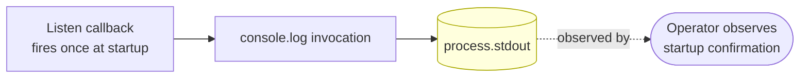

The npm tooling and README integrations are **not runtime workflows**. They are operator-driven activities (e.g., `npm install`, viewing the README on a repository host) that interact with manifest and documentation files outside the running process.

### 4.5.4 Verified-Absent Integrations

Per Section 3.4 (Third-Party Services) and Section 3.5 (Databases & Storage), the following integration patterns are verified-absent through exhaustive enumeration of the four files in the repository:

| Integration Pattern | Status | Verification |
|---|---|---|
| Outbound HTTP/HTTPS calls (`http.request`, `https.request`, `fetch`) | Absent | Not present in `server.js` |
| TCP/UDP outbound (`net.connect`, `dgram.createSocket`) | Absent | Not present in `server.js` |
| DNS lookups initiated by application | Absent | Loopback literal `'127.0.0.1'` requires no resolution |
| Database drivers (PostgreSQL, MySQL, MongoDB, Redis, etc.) | Absent | Zero packages in `package-lock.json` |
| Message brokers (Kafka, RabbitMQ, NATS, SQS) | Absent | Zero packages in `package-lock.json` |
| File system I/O (`fs` module) | Absent | `fs` not required in `server.js` |
| Cloud SDKs (AWS, GCP, Azure) | Absent | Zero packages in `package-lock.json` |
| Cron / scheduled job framework | Absent | No timer code in `server.js` |
| Event bus / pub-sub | Absent | No emitter usage beyond Node.js core |

This verified absence is what makes batch processing diagrams, event-processing flows, and DLQ/poison-message diagrams **non-applicable** to this section.

---

## 4.6 VALIDATION, AUTHORIZATION, AND COMPLIANCE CHECKPOINTS

### 4.6.1 Business Rules per Workflow Step

Workflow A (Startup) and Workflow B (Request) together enforce exactly **four** business rules — all of which are unconditional invariants rather than conditional branches:

| Business Rule | Workflow Step | Source |
|---|---|---|
| BR-1: Server must bind to loopback only (`127.0.0.1`, never `0.0.0.0`) | A-3 / A-6 | F-001-RQ-001; Section 2.4.4 (loopback-only mitigation) |
| BR-2: Server must bind on TCP port `3000` | A-4 / A-6 | F-001-RQ-002 |
| BR-3: Every response must be HTTP `200`, `Content-Type: text/plain`, body `Hello, World!\n` | B-4, B-5, B-6 | F-002, F-003, F-004 |
| BR-4: Startup must emit exactly one log line of the documented form to stdout | A-7 | F-005-RQ-001 to F-005-RQ-003 |

### 4.6.2 Data Validation Requirements

Per Section 2.4.4 (Security Implications), input validation is **not applicable** because the handler reads no input from the `req` object. The handler does not inspect:

- `req.method`
- `req.url`
- `req.headers`
- `req.body` / request body stream
- Query string parameters

There is therefore **no schema, no length check, no type coercion, no sanitization, and no allow-list/deny-list validation** within the application. The only implicit validation is performed by the Node.js `http` module itself, which rejects malformed HTTP framing with a `400 Bad Request` *without invoking the handler*.

### 4.6.3 Authorization Checkpoints

There are **zero authorization checkpoints** in the application. Per Section 2.4.4:

- No authentication step (no token verification, no session lookup, no cookie inspection)
- No authorization step (no RBAC, no ABAC, no policy evaluation)
- No CORS, CSRF, or origin checks
- No rate limiting

The **only** access-control measure is the network-layer constraint imposed by binding to `127.0.0.1` (loopback). This restricts the threat model to same-host actors and is documented in Section 2.4.4 as the sole mitigating factor for external network exposure.

### 4.6.4 Regulatory Compliance Checks

No regulatory compliance checks (GDPR, HIPAA, PCI-DSS, SOX, etc.) are implemented or applicable, because:

- No personally identifiable information (PII) is collected, processed, or stored.
- No payment data, health data, or financial data flows through the system.
- The static response body `Hello, World!\n` is non-sensitive.
- No logging of request data occurs (Section 2.4.4 — "Logging of sensitive data: None — Only the static startup line is logged").

The MIT license (declared in both `package.json` and `package-lock.json` per Section 2.5.1) governs distribution but does not impose runtime compliance checks.

---

## 4.7 STATE MANAGEMENT

### 4.7.1 Process Lifecycle States

The system holds **no application-level state**. Per Section 2.4.3 (Scalability — Stateless handler) and Section 3.5 (Databases & Storage — none), there are no closure-captured per-request variables, no top-level mutable counters, no session caches, no `Map`/`Set`/`WeakMap` instances, and no database, cache, file, or object-store persistence.

The only states that exist are **Node.js process lifecycle states**:

| State | Description | Entry Trigger | Exit Trigger |
|---|---|---|---|
| `NotRunning` | No Node.js process exists | (initial) | Operator runs `node server.js` |
| `Loading` | Modules being resolved; constants being initialized | Process spawned | `http.createServer` returns |
| `Binding` | `server.listen()` called; awaiting OS TCP bind | `createServer` complete | OS reports bind result |
| `Listening` | Bind callback fired; ready to accept inbound connections | Bind success | Inbound request OR termination signal |
| `HandlingRequest` | Transient — handler executing for a single request | Request arrives | `res.end` returns |
| `Terminated` | Process killed (abrupt; no graceful drain) | Bind failure, SIGINT, SIGTERM, or uncaught exception | (terminal) |

### 4.7.2 State Transition Diagram

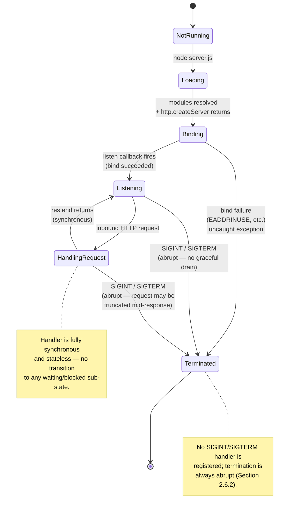

### 4.7.3 Data Persistence, Caching, and Transaction Boundaries

| Concern | Status | Source |
|---|---|---|
| Database persistence | Not implemented — zero drivers in `package-lock.json` | Section 3.5 |
| File-system persistence | Not implemented — `fs` not imported | Section 3.5 |
| Object storage (S3, GCS, Azure Blob) | Not implemented | Section 3.5 |
| In-memory caching | Not implemented | Section 3.5 |
| HTTP cache headers (`Cache-Control`, `ETag`, `Last-Modified`) | Not set | Section 2.5.1 (only `Content-Type` is set) |
| Transaction boundaries | **Not applicable** — no persistence to transact over | Section 3.5 |
| Idempotency keys | Not applicable — handler is intrinsically idempotent (Section 2.4.3) |
| Optimistic / pessimistic locking | Not applicable — no shared mutable state |

Because there are no persistence points, there are also no transaction commit/rollback boundaries to depict in any flowchart. The "Transaction Boundaries" axis from this section's prompt is intentionally empty.

---

## 4.8 ERROR HANDLING

### 4.8.1 Application-Level Error Handling Inventory

Per Section 1.3.2 (Out-of-Scope Elements) and Section 2.4.4, the application contains **zero error-handling constructs**. The following table enumerates the absence of each category that would normally appear in an error-handling flowchart:

| Error-Handling Construct | Present in `server.js`? | Implication |
|---|---|---|
| `try` / `catch` block | **No** | Synchronous exceptions propagate to Node.js default handler |
| `.on('error', ...)` listener on the server object | **No** | Server-level errors are unhandled at application layer |
| `.on('error', ...)` listener on `req` or `res` | **No** | Stream errors are unhandled at application layer |
| `process.on('uncaughtException', ...)` | **No** | Uncaught exceptions terminate the process |
| `process.on('unhandledRejection', ...)` | **No** | (Not applicable — no Promise usage) |
| Retry / backoff logic | **No** | No retry on bind failure, no retry within handler |
| Fallback / graceful-degradation logic | **No** | No alternate response path |
| Error notification / alerting | **No** | No webhook, email, log aggregation, or APM integration |
| Recovery / self-healing | **No** | No watchdog, health-check, or restart hook |

### 4.8.2 Implicit Error Paths via Node.js Defaults

Although the application does not handle errors, Node.js's default behavior produces deterministic outcomes for several failure modes:

| Failure Scenario | Default Node.js Behavior | Operator Observable |
|---|---|---|
| Port `3000` already in use (`EADDRINUSE`) | Uncaught error event → process exits with non-zero code | Stack trace on stderr; absence of `Server running...` log line |
| Loopback interface unavailable | Bind fails → uncaught error → process exits | Stack trace on stderr |
| Client disconnects mid-response | Node.js silently ignores write-after-close | No application-visible event |
| Malformed HTTP request | `http` module sends `400 Bad Request` *without* invoking handler | Response is `400`, not `200` (handler bypassed) |
| Process receives SIGINT (Ctrl-C) | Abrupt termination; in-flight requests truncated | Process exits; no farewell log |
| Process receives SIGTERM | Abrupt termination; in-flight requests truncated | Process exits; no farewell log |
| Uncaught synchronous exception in handler | Process exits non-zero (no `uncaughtException` handler) | Stack trace on stderr |

### 4.8.3 Error Handling Flowchart

The diagram below makes the absence of application-level recovery paths explicit. Every failure category routes to the same terminal: a process-level outcome with no application mitigation.

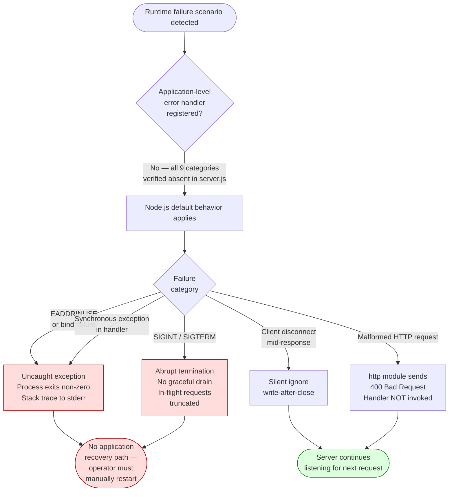

### 4.8.4 Retry, Fallback, Notification, and Recovery Procedures

Each of these axes from this section's prompt is intentionally empty in the repository:

| Procedure Type | Status | Rationale |
|---|---|---|
| **Retry mechanisms** | None | No retry on `listen` failure; no retry within handler. Adding retries would constitute a code change — forbidden by F-009 |
| **Fallback processes** | None | The handler has no alternate path. The response is monolithic. |
| **Error notification flows** | None | No log aggregation, no email/Slack/webhook, no APM integration. The only output channel is the single startup line on stdout. |
| **Recovery procedures** | External only | If the process exits, the operator must manually re-run `node server.js`. No process supervisor (systemd, pm2) is configured within the repository (Section 3.6.7). |

Per Section 2.4.5 (Maintenance Requirements), no CI/CD or alerting infrastructure exists to detect or remediate runtime failures.

---

## 4.9 SLA AND TIMING CONSTRAINTS

### 4.9.1 Declared Performance Constraints

Per Section 1.2.3 (Key Performance Indicators) and Section 2.4.2 (Performance Requirements), the repository declares **no quantitative performance targets**. The following table is intentionally sparse and serves to formally document this absence:

| Performance Dimension | Specified Value | Notes |
|---|---|---|
| Latency target (p50, p95, p99) | None declared | Behavior is whatever Node.js default produces |
| Throughput target (RPS) | None declared | No connection limits, no rate limiting |
| Concurrency tuning | None | Default Node.js single-process event loop |
| Keep-alive configuration | None | Node.js default keep-alive applies |
| Connection limit (`maxConnections`) | None | Not set in `server.js` |
| Availability target (uptime SLO) | None declared | No monitoring or alerting in repository |
| Response-size budget | Fixed | Body is the literal 14 bytes of `Hello, World!\n` |

Per Section 1.2.3, the only KPI inferable from the code is binary: "the server either responds with the expected payload, or it does not."

### 4.9.2 Synchronous vs. Asynchronous Boundaries

The diagrams in this section use solid arrows for synchronous operations and dashed arrows for asynchronous transitions. The boundaries are:

- **Asynchronous boundary 1** — `server.listen` (Step A-6 in Section 4.3.1): control returns immediately; the listen callback is invoked later by the event loop.
- **Asynchronous boundary 2** — Inbound request arrival: requests arrive at unpredictable times relative to the steady `Listening` state.
- **All other operations are synchronous**: constant initialization, `createServer`, `console.log`, `res.statusCode`, `res.setHeader`, and `res.end` complete without yielding to the event loop.

No timeouts, deadlines, or circuit breakers are configured anywhere in the application.

---

## 4.10 References

#### Files Examined

- `server.js` — Sole runtime artifact; lines 1–15 provide complete evidence for both Workflow A (startup) and Workflow B (request/response). Direct source of every flow step, every state transition, and every absent error/decision/state construct documented in this section.
- `package.json` — Confirms absence of a `start` script (forcing the literal `node server.js` launch command) and absence of `dependencies`/`devDependencies` keys, which constrains the integration workflow inventory.
- `package-lock.json` — Confirms `lockfileVersion: 3` and zero external packages, which is the structural basis for the verified-absent integration table in Section 4.5.4.
- `README.md` — Source of the F-009 immutability directive (`Do not touch!`), which governs the diagrammatic fidelity requirement: flowcharts depict actual rather than aspirational state.

#### Folders Explored

- Repository root (`./`) — Confirmed flat structure (4 files plus `.git`); no `src/`, `lib/`, `test/`, `config/`, `.github/`, or `docs/` subdirectories exist. The depth-0 enumeration is the structural basis for the swim-lane inventory in Section 4.2.2 (no additional internal lanes exist).

#### Technical Specification Sections Cross-Referenced

- **Section 1.1 Executive Summary** — Project minimalism and stakeholder context informing Section 4.1.1.
- **Section 1.2 System Overview** — Source of the canonical end-to-end flowchart (Section 1.2.2), success-criteria definition (Section 1.2.3), and integration model (Section 1.2.1) referenced throughout Section 4.
- **Section 1.3 Scope** — In-scope/out-of-scope declarations grounding the verified-absent tables in Sections 4.5.4 and 4.8.1.
- **Section 2.1 Feature Catalog** — Feature IDs F-001 through F-009 referenced throughout Sections 4.4 and 4.6.
- **Section 2.3 Feature Relationships** — Integration point inventory (Section 2.3.2) reproduced in Section 4.5.1; F-009 governance relationship (Section 2.3.4) reflected in Section 4.1.1.
- **Section 2.4 Implementation Considerations** — Technical constraints (Section 2.4.1), absence of performance targets (Section 2.4.2), stateless handler (Section 2.4.3), and security mitigations (Section 2.4.4) all incorporated into Sections 4.6, 4.7, and 4.9.
- **Section 2.5 Traceability Matrix** — Section 2.5.1's requirement-to-evidence mapping cited as the basis for handler-behavior assertions in Section 4.4.1; Section 2.5.3's designation of the canonical flowchart honored in Section 4.1.3.
- **Section 2.6 Assumptions and Constraints** — Section 2.6.2's explicit constraints (no `start` script, no environment variables, no graceful shutdown) reflected in Sections 4.3.3, 4.7.1, and 4.8.4.
- **Section 3.4 THIRD-PARTY SERVICES** — Confirmed-absent outbound integrations grounding Section 4.5.4.
- **Section 3.5 DATABASES & STORAGE** — Confirmed-absent persistence grounding Section 4.7.3.
- **Section 3.6 DEVELOPMENT & DEPLOYMENT** — Section 3.6.7's launch command and reachability constraints, and Section 3.6.8's deployment topology diagram, anchor the actor inventory in Section 4.2.2.

# 5. System Architecture

## 5.1 HIGH-LEVEL ARCHITECTURE

### 5.1.1 System Overview

#### Architecture Style and Rationale

The `hao-backprop-test` repository implements a **single-process, single-file, monolithic HTTP server** architecture. This style is the deliberate antithesis of layered, microservice, event-driven, or plugin-based architectures — none of which would be appropriate for a fixture whose primary purpose is to provide a deterministic, immutable test target for backprop integration tooling. The entire runtime surface is concentrated in a single 15-line file (`server.js`), with all configuration, routing, request handling, and response serialization co-located in one lexical scope.

The rationale for this minimalist style is rooted in three interlocking constraints established by the repository's foundational features:

- **F-009 Immutability Directive** — The README's `Do not touch!` statement constitutes a governance constraint that forbids any architectural elaboration. Adding layers, abstractions, or modules would itself violate the project's defining requirement.
- **F-007 Zero External Dependencies** — The empty `packages` object in `package-lock.json` (lockfileVersion `3`) eliminates the supply-chain attack surface entirely. No framework (Express, Koa, Fastify, Hapi) is permitted; only the Node.js built-in `http` module is used.
- **Determinism over Flexibility** — Hardcoded `hostname='127.0.0.1'` and `port=3000` constants produce byte-identical behavior across environments, which is the cardinal property required of an integration test fixture.

#### Key Architectural Principles

| Principle | Embodiment in the Codebase |
|---|---|
| Code Immutability | F-009 / `README.md` `Do not touch!` directive applies as a meta-requirement |
| Zero External Dependencies | F-007 / `package-lock.json` resolves zero packages |
| Determinism | F-002 / Static response invariant across all requests |
| Statelessness | Handler closure captures no mutable state; no in-memory or persistent stores |
| Minimalism | 15 lines of runtime code; no abstraction layers, MVC, or middleware chain |
| Loopback-Only Trust Boundary | F-001 / Bound to `127.0.0.1`, deliberately not `0.0.0.0` |
| Synchronous Request Handling | All three response statements complete without yielding to the event loop |

#### System Boundaries and Major Interfaces

The system has an exceptionally narrow boundary surface, which is itself an architectural property:

- **Inbound boundary**: A single HTTP/1.1 endpoint at `127.0.0.1:3000` — plaintext, no TLS, accepts any HTTP method on any path
- **Outbound boundary**: A single one-time write to `process.stdout` at startup (the `Server running at http://127.0.0.1:3000/` line)
- **Trust boundary**: Same-host loopback only — the server is unreachable from any external host because the bind address is the loopback interface, not the wildcard interface
- **Process boundary**: A single Node.js process, a single event loop, with no clustering, no worker threads, and no IPC

#### Component Interaction Diagram

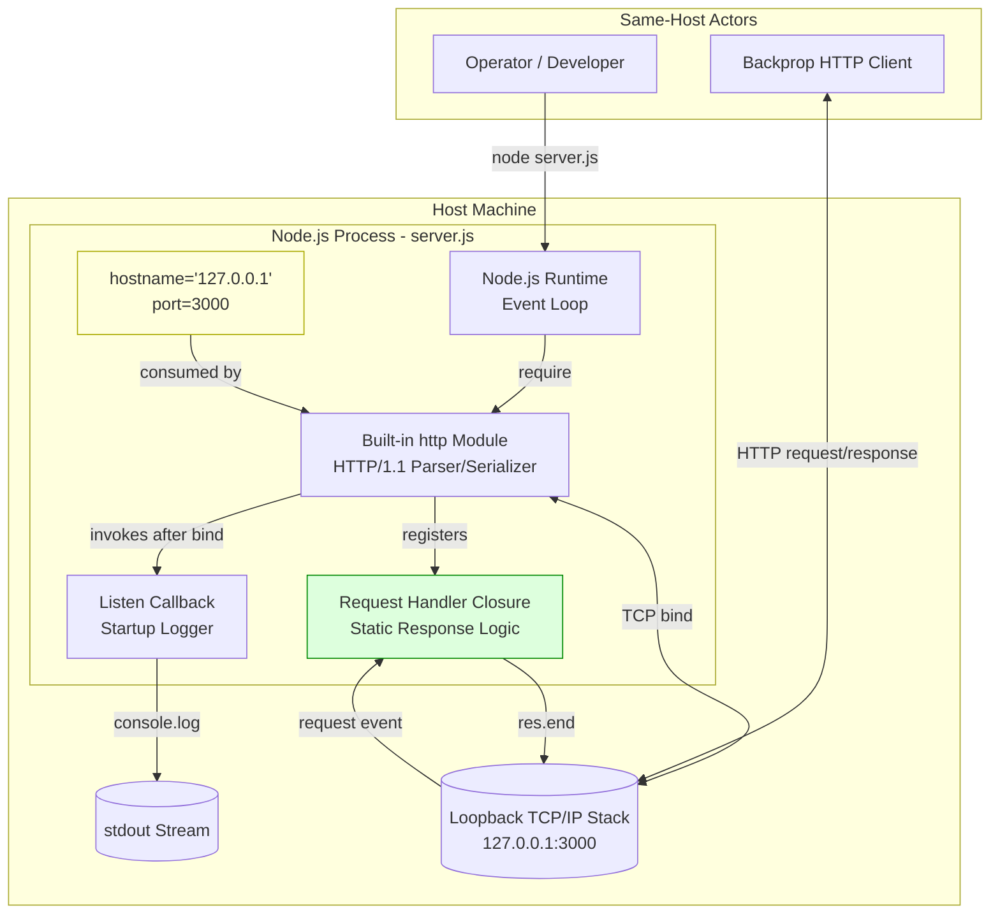

### 5.1.2 Core Components Table

The following table enumerates the architectural components participating in the system. Note that only the first three rows constitute runtime components in the strict sense; the remaining rows are tooling artifacts that participate in the build/install process but not in request handling.

| Component | Primary Responsibility | Key Dependencies |
|---|---|---|
| Node.js HTTP Server (`server.js`) | Accept inbound HTTP connections on loopback; return static response; emit one-time startup log | Node.js runtime, built-in `http` module |
| Built-in `http` Module | Parse HTTP request line/headers, serialize HTTP/1.1 responses, manage TCP socket lifecycle | Node.js runtime (host-provided) |
| Node.js Runtime | Provide event loop, CommonJS module resolution, process lifecycle, OS networking integration | Operating system TCP/IP stack |
| Request Handler Closure | Set status code 200, set `Content-Type: text/plain`, write `Hello, World!\n` body | `http` module's response stream API |
| Listen Callback | Emit `Server running at http://127.0.0.1:3000/` to stdout once on bind success (F-005) | `console.log` → `process.stdout` |
| npm Manifest (`package.json`) | Declare package identity (`hello_world@1.0.0`), author, license, placeholder test script | npm CLI, JSON parser |
| npm Lockfile (`package-lock.json`) | Enforce zero-dependency closure with `lockfileVersion: 3` | npm CLI v7+ |

| Component | Integration Points | Critical Considerations |
|---|---|---|
| Node.js HTTP Server (`server.js`) | Inbound: `127.0.0.1:3000`; Outbound: `process.stdout` (one-time) | Sole runtime artifact; immutability per F-009 |
| Built-in `http` Module | Bound to `server.js` via `require('http')` (line 1) | Version pinned to host runtime; no shimming |
| Node.js Runtime | Hosts the `server.js` process | No `engines` pin in `package.json`; runtime is host-supplied |
| Request Handler Closure | Invoked unconditionally per inbound request | No request inspection; intrinsically idempotent |
| Listen Callback | Fires exactly once after successful TCP bind | Single observable startup signal; no farewell log |
| npm Manifest (`package.json`) | Tooling-only (npm CLI); not loaded at runtime | Declares non-existent `index.js` entry point — fixture cannot be `require`d as a library |
| npm Lockfile (`package-lock.json`) | Tooling-only (npm CLI v7+); not loaded at runtime | Empty `packages` object (root only) — guarantees zero supply-chain surface |

### 5.1.3 Data Flow Description

#### Primary Data Flows

The system supports exactly two end-to-end workflows, identified throughout this document as **Workflow A (Server Startup)** and **Workflow B (HTTP Request/Response)**. These workflows are sequential at startup (A precedes B) and indefinitely repeating thereafter (B occurs zero or more times per process lifetime).

**Workflow A — Server Startup Lifecycle**: The operator executes `node server.js` at the shell. The Node.js runtime resolves the CommonJS `require('http')` import, evaluates the two top-level constants (`hostname='127.0.0.1'`, `port=3000`), invokes `http.createServer(handler)` to register the request handler closure, and finally invokes `server.listen(port, hostname, cb)`. The `listen` call is asynchronous: the runtime instructs the OS TCP/IP stack to bind on the specified address, and the listen callback fires only when the bind succeeds. Within that callback, a single `console.log` statement emits the startup line to `process.stdout`. The process then enters the `Listening` steady state, with the event loop awaiting inbound connections.

**Workflow B — HTTP Request/Response Cycle**: When a client opens a TCP connection to `127.0.0.1:3000`, the built-in `http` module parses the request line, headers, and (if present) body. The handler closure is then invoked with `req` and `res` arguments. The handler executes three unconditional statements — `res.statusCode = 200`, `res.setHeader('Content-Type', 'text/plain')`, and `res.end('Hello, World!\n')` — and returns. The `http` module serializes the HTTP/1.1 response and transmits it back through the loopback stack. Crucially, the handler **never inspects** `req.method`, `req.url`, `req.headers`, or `req.body`; the response is therefore identical for every request regardless of input.

#### Integration Patterns and Protocols

| Pattern Dimension | Specification |
|---|---|
| Inbound integration pattern | Synchronous request/reply over HTTP/1.1 |
| Outbound integration pattern | Fire-and-forget single line write to stdout (startup only) |
| Wire protocol | HTTP/1.1 plaintext over TCP loopback |
| Message format | Request: any HTTP method/path/body (ignored); Response: fixed 14-byte body `Hello, World!\n` with `Content-Type: text/plain` |
| Coupling style | Loose — consumer requires only the ability to issue an HTTP request to the local port |

#### Data Transformation Points

The system contains **zero data transformation points**. Request data is never read by application code, and the response body is a literal string constant defined inline in the handler. The only "transformation" that occurs is the HTTP/1.1 wire format serialization performed by the built-in `http` module, which is opaque to the application layer.

#### Data Stores and Caches

The system contains **zero data stores and zero caches**:

- **No database persistence** — no drivers in lockfile; no `mongodb`, `pg`, `mysql2`, `redis`, etc.
- **No file-system persistence** — the `fs` module is not imported in `server.js`
- **No object storage** — no AWS, GCP, or Azure SDKs present
- **No in-memory caching** — handler closure captures no mutable state
- **No HTTP cache headers** — no `Cache-Control`, `ETag`, or `Last-Modified` set
- **No session storage** — no cookie or session middleware

### 5.1.4 External Integration Points

The system has exactly one inbound integration point and effectively zero outbound integration points (the single startup stdout write is internal to the host process). The following table documents all integration surfaces.

| System Name | Integration Type | Data Exchange Pattern |
|---|---|---|
| Backprop HTTP Client | Inbound (single endpoint) | Synchronous HTTP request/response |
| `process.stdout` | Outbound (logging) | One-time text line write at startup |
| npm CLI Tooling | Operator-driven (offline) | JSON parse of manifest/lockfile |
| Markdown Renderer | Documentation | Markdown viewer parsing of README |

| System Name | Protocol/Format | SLA Requirements |
|---|---|---|
| Backprop HTTP Client | HTTP/1.1 plaintext, any method, any path | None declared — see Section 5.4.5 |
| `process.stdout` | UTF-8 text, single line `Server running at http://127.0.0.1:3000/` | None declared |
| npm CLI Tooling | JSON (npm v7+ schema, lockfileVersion `3`) | N/A — offline tooling |
| Markdown Renderer | Markdown (CommonMark-compatible) | N/A — documentation only |

#### Verified-Absent Integrations

The following integration categories were exhaustively verified as absent from the codebase. No file in the repository imports, references, or configures any of the following:

- **Outbound HTTP/HTTPS** — `http.request`, `https.request`, `fetch`, `axios`, `got` not invoked
- **TCP/UDP outbound** — `net.connect`, `dgram` not invoked
- **DNS lookups** — no application-initiated `dns` module usage
- **Database drivers** — zero database packages in `package-lock.json`
- **Message brokers** — Kafka, RabbitMQ, NATS, Amazon SQS not used
- **File system I/O** — `fs` module not imported in `server.js`
- **Cloud SDKs** — no `aws-sdk`, `@google-cloud/*`, or `@azure/*` packages
- **Cron / scheduled jobs** — no scheduler framework
- **Event bus / pub-sub** — no event bus integration

---

## 5.2 COMPONENT DETAILS

### 5.2.1 Node.js HTTP Server (server.js)

#### Purpose and Responsibilities

`server.js` is the sole runtime artifact of the system. It is responsible for establishing the HTTP listener on the loopback interface, registering the request handler that produces the static response, and emitting the one-time startup log message. It bears all responsibilities of every architectural layer (configuration, transport, routing, controller, view) because no architectural layering exists.

#### Technologies and Frameworks Used

| Aspect | Selection |
|---|---|
| Runtime | Node.js (unpinned — no `engines` field) |
| Language | JavaScript (ECMAScript), CommonJS module style |
| HTTP library | Built-in `http` module (line 1: `require('http')`) |
| Framework | None — no Express, Koa, Fastify, Hapi, or middleware chain |
| Async style | Native callbacks — no Promises, async/await, or streams |

#### Key Interfaces and APIs

The component exposes exactly one interface — the inbound HTTP endpoint at `127.0.0.1:3000`. The endpoint is defined by:

- **Bind specification**: `server.listen(3000, '127.0.0.1', callback)` (line 12)
- **Request handler signature**: `(req, res) => { ... }` (line 6)
- **Response specification**: status `200`, header `Content-Type: text/plain`, body `Hello, World!\n` (lines 7-9)

The component consumes the Node.js `http` module API surface:
- `http.createServer(requestListener)` to obtain the server instance
- `server.listen(port, hostname, callback)` to bind and start accepting connections
- `res.statusCode` setter, `res.setHeader(name, value)`, `res.end(body)` for response composition

#### Data Persistence Requirements

**None.** The component holds no mutable state, opens no files, connects to no databases, and writes nothing to disk. The handler closure is purely a pure function of its (ignored) inputs producing a constant output.

#### Scaling Considerations

The component's scaling profile is intrinsically constrained by its single-process, single-event-loop architecture:

- **Vertical scaling**: Only single-process throughput — no `cluster` module, no `worker_threads`, no PM2 fork mode
- **Horizontal scaling**: Not applicable — loopback binding precludes load balancing or service-mesh deployment
- **Concurrency model**: Default Node.js single-threaded event loop with synchronous handler — handler completes in nanoseconds
- **Connection limits**: None set explicitly — Node.js defaults apply
- **Throughput**: Whatever the built-in `http` module achieves under default settings; F-009 forbids tuning

### 5.2.2 Built-in `http` Module Boundary

#### Purpose and Responsibilities

The built-in Node.js `http` module is responsible for all HTTP/1.1 protocol mechanics: TCP socket management, request line parsing, header parsing, body buffering, response serialization, keep-alive handling, and chunked transfer encoding. It is host-provided and version-bound to the Node.js runtime hosting the process.

#### Technologies and Frameworks Used

| Aspect | Selection |
|---|---|
| Provider | Node.js core (host-supplied, not an npm package) |
| Version | Bound to runtime version; no shim or polyfill |
| Subscription | Loaded via `require('http')` in `server.js:1` |

#### Key Interfaces and APIs

The component sits at the boundary between application code and the OS networking layer. It exposes the `createServer`, `listen`, request, and response APIs consumed by `server.js`. Critically, certain HTTP-level error responses are produced by this module **without invoking the application handler** — most notably, malformed HTTP requests yield a `400 Bad Request` directly from the module, not a `200 OK` from the handler.

#### Data Persistence and Scaling

This component has no application-controlled persistence or scaling configuration. All defaults — `maxHeadersCount`, `headersTimeout`, `keepAliveTimeout`, `requestTimeout`, `maxConnections` — are inherited from the Node.js runtime. Per F-009, none of these are tuned by `server.js`.

### 5.2.3 Request Handler Closure

#### Purpose and Responsibilities

The request handler is an arrow-function closure registered as the `requestListener` argument to `http.createServer`. It executes three unconditional statements per invocation:

1. `res.statusCode = 200` — sets HTTP status code (F-003)
2. `res.setHeader('Content-Type', 'text/plain')` — sets MIME type (F-004)
3. `res.end('Hello, World!\n')` — writes body and terminates response (F-002)

The handler contains no conditional logic, no input validation, no routing, and no error handling. It does not inspect `req.method`, `req.url`, `req.headers`, or `req.body`.

#### Key Interfaces and APIs

The handler consumes the response API surface of the `http` module's `ServerResponse` object: the `statusCode` setter, the `setHeader` method, and the `end` method. It does not consume any property or method of the `req` (`IncomingMessage`) object.

#### Scaling Considerations

The handler is synchronous and bounded: all three statements complete in nanoseconds without yielding to the event loop. There is no I/O, no database call, no external HTTP call, and no awaitable operation. The handler is therefore intrinsically idempotent and trivially parallelizable within Node.js's event-loop concurrency model.

### 5.2.4 Listen Callback Component

#### Purpose and Responsibilities

The listen callback is a single-statement arrow function passed as the third argument to `server.listen(port, hostname, callback)`. It fires exactly once — when the OS reports that the TCP bind has succeeded — and emits the line `Server running at http://${hostname}:${port}/` to `process.stdout` via `console.log`. This corresponds to feature F-005.

This callback is the **only observable startup signal** of the system. There is no health endpoint, no `/ready` probe, and no log aggregation; an external orchestrator wishing to confirm successful startup must inspect stdout for this line.

#### Key Interfaces and APIs

The callback consumes `console.log` (which writes to `process.stdout`). It uses ES6 template literals to interpolate the `hostname` and `port` constants into the log message.

### 5.2.5 npm Manifest Components

#### Purpose and Responsibilities

`package.json` and `package-lock.json` are tooling-only artifacts — they participate in `npm install` workflows and IDE tooling but are not loaded at runtime by `server.js`. Their primary architectural roles are:

| Artifact | Architectural Role |
|---|---|
| `package.json` | Package identity (`hello_world@1.0.0`), license declaration (MIT), placeholder test script (F-008) |
| `package-lock.json` | Enforces zero-dependency closure with `lockfileVersion: 3` (F-007) |

Notably, `package.json` declares `"main": "index.js"`, but no `index.js` file exists in the repository. This intentional inconsistency — captured as F-006 — means the project cannot be consumed as a library via `require('hello_world')`; it can only be executed via `node server.js`.

### 5.2.6 Component State Transition Diagram

The following state diagram captures the process lifecycle states observable to an external operator. Note that no application-level state machine exists — the diagram describes only Node.js process states.

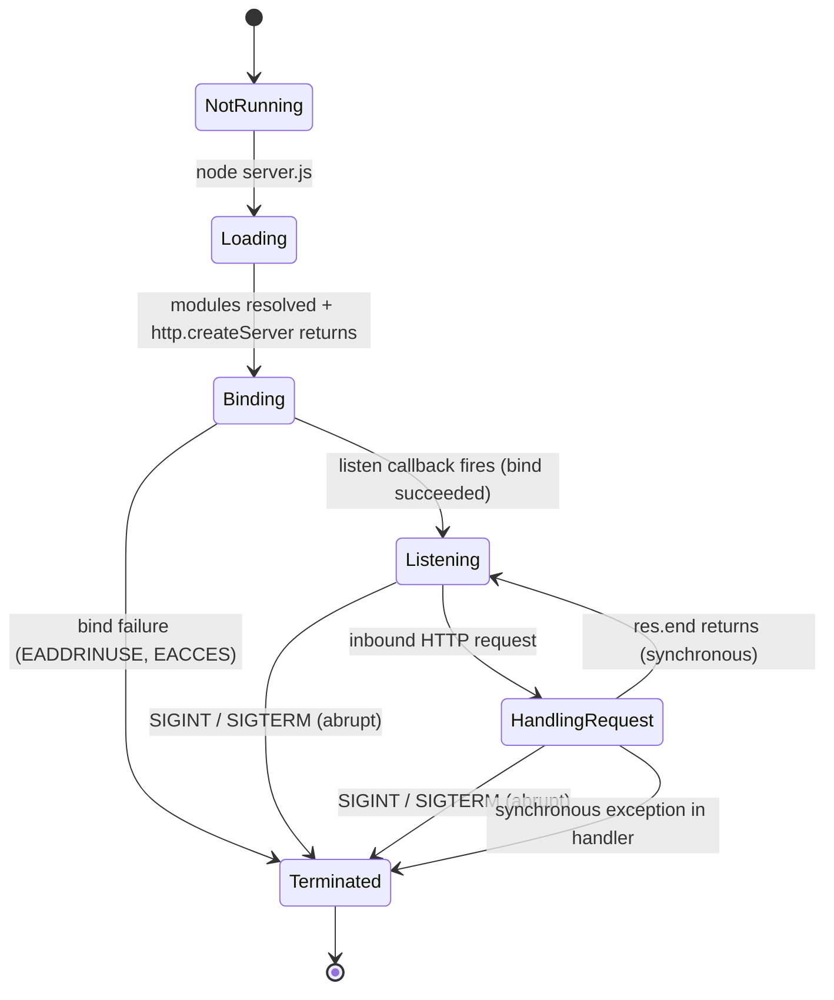

### 5.2.7 Sequence Diagrams for Key Flows

#### Workflow A — Server Startup Sequence

```mermaid
sequenceDiagram
    actor Operator
    participant Shell
    participant Node as Node.js Runtime
    participant HttpMod as http Module
    participant Server as server.js Process
    participant OS as OS TCP/IP Stack
    participant StdOut as stdout

    Operator->>Shell: node server.js
    Shell->>Node: spawn process
    Node->>Server: load server.js
    Server->>HttpMod: require('http')
    Server->>Server: hostname = '127.0.0.1'
    Server->>Server: port = 3000
    Server->>HttpMod: http.createServer(handler)
    HttpMod-->>Server: server instance
    Server->>HttpMod: server.listen(3000, '127.0.0.1', cb)
    HttpMod->>OS: bind TCP socket
    OS-->>HttpMod: bind success
    HttpMod->>Server: invoke listen callback
    Server->>StdOut: console.log('Server running at...')
    Note over Server,OS: Process enters Listening state;<br/>event loop awaits requests
```

#### Workflow B — HTTP Request/Response Sequence

```mermaid
sequenceDiagram
    participant Client as Backprop HTTP Client
    participant TCP as Loopback TCP/IP Stack
    participant HttpMod as Node.js http Module
    participant Handler as Request Handler Closure

    Client->>TCP: TCP SYN to 127.0.0.1:3000
    TCP->>HttpMod: accept connection
    Client->>HttpMod: HTTP request line + headers
    HttpMod->>Handler: invoke handler(req, res)
    Note over Handler: req.method, req.url,<br/>req.headers NEVER inspected
    Handler->>HttpMod: res.statusCode = 200
    Handler->>HttpMod: res.setHeader('Content-Type', 'text/plain')
    Handler->>HttpMod: res.end('Hello, World!\n')
    HttpMod->>TCP: serialize HTTP/1.1 response
    TCP->>Client: 200 OK + body (14 bytes)
    Note over HttpMod: Returns to event loop;<br/>awaits next request
```

---

## 5.3 TECHNICAL DECISIONS

### 5.3.1 Architecture Style Decisions

The architecture style of this system was determined by the intersection of three constraints: F-009 (immutability), F-007 (zero dependencies), and the project's stated purpose as an integration test fixture. The following table documents the principal architectural decisions and their justifications.

| Decision | Choice | Primary Driver |
|---|---|---|
| Runtime platform | Node.js | The `http` module is a Node-only API |
| Module system | CommonJS (`require`) | Default when no `"type": "module"` declared |
| HTTP framework | Built-in `http` module (no Express/Koa/Fastify) | Zero-dependency mandate (F-007) |
| Process model | Single-process, single-event-loop | Determinism; no clustering complexity |
| Handler style | Synchronous callback | Bounded execution; no awaitable I/O needed |
| Configuration model | Hardcoded constants in source | F-009 immutability + determinism |

#### Tradeoffs

- **Determinism vs. Flexibility**: Hardcoded `hostname` and `port` eliminate environmental variability but prevent reconfiguration without code changes — which are forbidden by F-009. This tradeoff is intentional: in a fixture context, predictability dominates flexibility.
- **Simplicity vs. Robustness**: The complete absence of `try`/`catch` and stream `'error'` handlers means uncaught exceptions terminate the process. This is acceptable because the fail-fast signal is itself diagnostic; a fixture that silently masks errors would be a worse fixture.
- **Zero Dependencies vs. Convenience**: Avoiding Express/Koa means more verbose use of the Node.js core API, but eliminates the supply-chain attack surface entirely and removes any risk of breakage from upstream package updates.

### 5.3.2 Communication Pattern Choices

| Pattern | Selection | Rationale |
|---|---|---|
| Inbound transport | HTTP/1.1 plaintext | Simplicity; loopback-only model removes TLS necessity |
| Inbound exchange | Synchronous request/reply | Minimal client integration burden |
| Outbound transport | None at runtime | Backprop's fixture role does not require outbound calls |
| Logging transport | `console.log` to `process.stdout` | No log aggregation framework needed |
| Inter-process | None | Single-process architecture |

The decision **not** to use TLS (HTTPS) is justified by the loopback-only binding: traffic never leaves the host kernel's loopback adapter, so confidentiality and integrity threats from network-layer adversaries do not apply.

### 5.3.3 Data Storage Solution Rationale

The system uses **no data storage solution** of any kind. This is a deliberate decision, not an oversight, and follows directly from the system's role as a static-response fixture.

| Storage Category | Decision | Rationale |
|---|---|---|
| Relational database | Not used | No persistent state to store |
| NoSQL document store | Not used | No persistent state to store |
| In-memory key-value store | Not used | No transient state to cache |
| File system persistence | Not used | `fs` not imported; no files to read/write |
| Object storage | Not used | No binary blobs to manage |
| Session/cookie store | Not used | No user sessions exist |

The handler is stateless and idempotent by design; there is nothing to persist, so persistence infrastructure would be pure overhead.

### 5.3.4 Caching Strategy

The system implements **no caching** at any layer. This is consistent with both the zero-dependency mandate and the absence of meaningful state to cache.

| Cache Layer | Decision | Rationale |
|---|---|---|
| HTTP response cache headers | Not set | No `Cache-Control`, `ETag`, or `Last-Modified` emitted |
| In-memory application cache | Not used | Static response is cheaper than any cache lookup |
| Distributed cache (Redis, Memcached) | Not used | Zero-dependency mandate (F-007) |
| CDN | Not applicable | Loopback-only binding precludes CDN use |

Because the response is a 14-byte literal computed at JavaScript-engine speed, a cache would impose more overhead than the work it would avoid.

### 5.3.5 Security Mechanism Selection

The system's security posture is built on a **single defensive layer**: network-level isolation via loopback binding. All other security controls are intentionally absent because they would not be effective complements within this threat model.

| Security Mechanism | Selection | Rationale |
|---|---|---|
| Authentication | None | Loopback binding restricts threat surface to same-host actors |
| Authorization | None | No protected resources exist |
| TLS / HTTPS | None | Traffic never leaves loopback; no over-the-wire interception risk |
| Input validation | None | Request payload is never read |
| Secrets management | None | No secrets exist (no env vars, no credentials) |
| Rate limiting | None | Same-host actors are implicitly trusted |
| CORS / CSRF protections | None | No browser origin model; same-host calls only |
| Supply chain controls | Implicit (zero dependencies) | F-007 eliminates the surface entirely |

### 5.3.6 Architecture Decision Records (ADRs)

The following ADRs document the principal architectural decisions in the canonical Context/Decision/Consequence format.

#### ADR-001: Use Built-in http Module Exclusively

| Field | Content |
|---|---|
| Status | Accepted |
| Context | A minimal HTTP fixture is needed; framework selection must reconcile with F-007 (zero dependencies) and F-009 (immutability) |
| Decision | Use the Node.js built-in `http` module; do not introduce Express, Koa, Fastify, or any other framework |
| Consequences | (+) Zero supply-chain risk. (+) No upgrade burden. (−) More verbose than a framework would require. (−) No middleware ecosystem |

#### ADR-002: Bind to Loopback Only (127.0.0.1)

| Field | Content |
|---|---|
| Status | Accepted |
| Context | The fixture must be reachable by backprop tooling but should not expose an unauthenticated HTTP endpoint to the network |
| Decision | Bind to `127.0.0.1` literally; do not bind to `0.0.0.0` |
| Consequences | (+) Threat model restricted to same-host actors. (+) No need for TLS, auth, or CORS. (−) Cross-host integration impossible without a tunnel/proxy |

#### ADR-003: Hardcode Configuration; No Environment Variables

| Field | Content |
|---|---|
| Status | Accepted |
| Context | A fixture must produce byte-identical behavior across environments; F-009 forbids per-environment customization |
| Decision | Declare `hostname` and `port` as in-file `const` values; do not read `process.env` |
| Consequences | (+) Fully deterministic. (+) No configuration drift. (−) Reconfiguration would require a forbidden code change |

#### ADR-004: No Test Framework; Placeholder Failing Script

| Field | Content |
|---|---|
| Status | Accepted |
| Context | npm convention expects a `test` script; the fixture has no testable surface beyond the immutable runtime |
| Decision | Retain the npm-default placeholder `echo "Error: no test specified" && exit 1` (F-008) |
| Consequences | (+) Honors npm conventions. (+) Documents intentional absence. (−) `npm test` exits non-zero by design |

#### Decision Tree for Architecture Style Selection

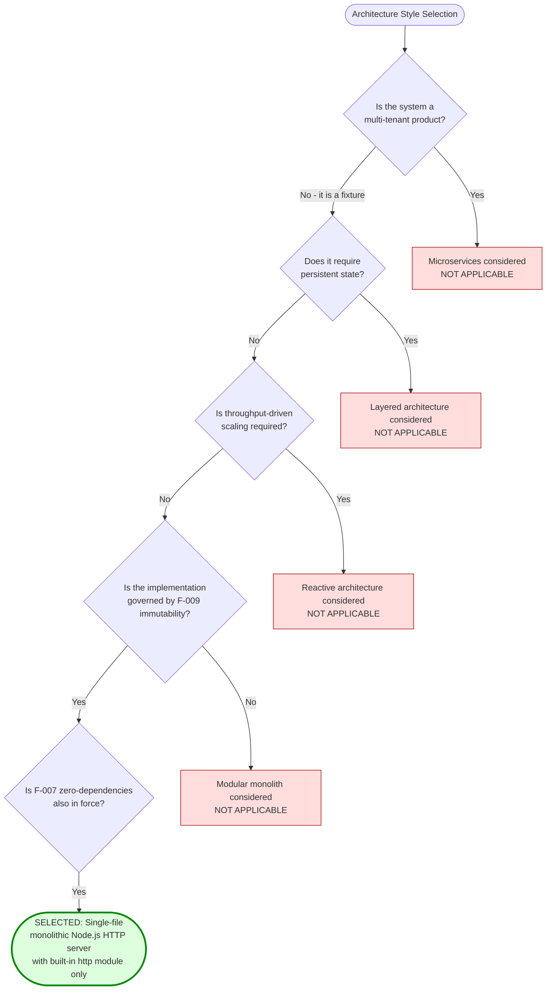

---

## 5.4 CROSS-CUTTING CONCERNS

### 5.4.1 Monitoring and Observability

The system's observability surface is intentionally minimal. The only signal emitted by the application is a single startup line on `process.stdout`. There is no metrics endpoint, no health check, no `/ready` probe, no APM agent, and no distributed tracing instrumentation.

| Observability Concern | Status | Available Signal |
|---|---|---|
| Application Performance Monitoring (APM) | Not implemented | None — no Datadog, New Relic, AppDynamics, Sentry |
| Log aggregation | Not implemented | None — no Splunk, ELK, Loggly, Fluentd |
| Distributed tracing | Not implemented | None — no OpenTelemetry, Jaeger, Zipkin |
| Metrics emission | Not implemented | None — no Prometheus, StatsD |
| Health check endpoint | Not implemented | Implicit — successful HTTP 200 response acts as health proxy |
| Structured logging | Not implemented | Single unstructured line: `Server running at http://127.0.0.1:3000/` |
| Process metrics | OS-level only | `ps`, `top`, OS-provided process accounting |

The single observable indicator of correct operation is the startup log line, which fires exactly once per process lifetime. The functional KPI inferable from the codebase is binary: the server either responds with the expected payload, or it does not.

### 5.4.2 Logging and Tracing Strategy

#### Logging Strategy

The logging strategy is reduced to a single mechanism: `console.log` invoked once from the listen callback. There are no per-request access logs, no error logs, no debug logs, and no audit logs.

| Log Event | Trigger | Destination | Format |
|---|---|---|---|
| Startup confirmation | Listen callback invocation (once per lifetime) | `process.stdout` | `Server running at http://127.0.0.1:3000/` |
| Per-request access log | Not emitted | N/A | N/A |
| Error log | Not emitted by application | Default Node.js stderr (for uncaught exceptions) | Stack trace |
| Shutdown log | Not emitted | N/A — abrupt termination | N/A |

#### Tracing Strategy

The system does not implement distributed tracing. There is no trace context propagation, no span emission, and no correlation ID generation. This is appropriate given:

- The system has no outbound HTTP calls (no downstream propagation surface)
- The system has only one process and one component (no internal span hierarchy)
- The handler is synchronous and completes in nanoseconds (no meaningful span duration)

### 5.4.3 Error Handling Patterns

The application contains **zero error-handling constructs**. All error handling is delegated to Node.js runtime defaults. The following table inventories the absent constructs.

| Error Handling Construct | Present? | Implication |
|---|---|---|
| `try`/`catch` blocks | No | Synchronous exceptions propagate to Node.js default handler |
| `server.on('error', ...)` handler | No | Server-level errors (e.g., `EADDRINUSE`) are unhandled at app layer |
| `req`/`res` `'error'` handlers | No | Stream errors are unhandled at app layer |
| `process.on('uncaughtException', ...)` | No | Uncaught exceptions terminate the process with non-zero exit code |
| `process.on('unhandledRejection', ...)` | No | (Not applicable — no Promise usage) |
| Retry / backoff logic | No | No retry on bind failure or handler failure |
| Fallback / graceful degradation | No | No alternate response path exists |
| Error notification / alerting | No | No webhook, email, log aggregation, or APM hooks |
| Recovery / self-healing | No | No watchdog, no health-check loop, no restart hook |

#### Implicit Error Paths (Node.js Defaults)

| Failure Scenario | Default Behavior | Observable |
|---|---|---|
| Port 3000 in use (`EADDRINUSE`) | Uncaught error → process exits non-zero | Stack trace on stderr; no startup log |
| Loopback unavailable | Bind fails → uncaught error → process exits | Stack trace on stderr |
| Client disconnects mid-response | `http` module silently ignores write-after-close | No app-visible event |
| Malformed HTTP request | `http` module sends 400; **handler not invoked** | Response is `400 Bad Request`, not `200 OK` |
| `SIGINT` (Ctrl-C) | Abrupt termination; in-flight requests truncated | Process exits; no farewell log |
| `SIGTERM` | Abrupt termination; in-flight requests truncated | Process exits; no farewell log |
| Synchronous exception in handler | Process exits non-zero | Stack trace on stderr |

#### Error Handling Flow Diagram

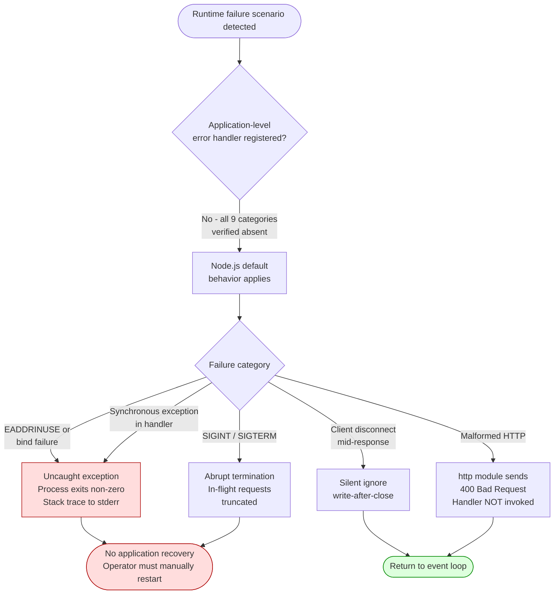

### 5.4.4 Authentication and Authorization Framework

The system implements **no authentication and no authorization framework**. This is a deliberate architectural decision, not an oversight, justified by the loopback-only network binding.

| Concern | Status | Mitigating Factor |
|---|---|---|
| User authentication | Not implemented | Loopback binding restricts callers to same-host processes |
| Service-to-service authentication | Not implemented | No service mesh; no mTLS |
| API keys / bearer tokens | Not implemented | No protected endpoints exist |
| Session management | Not implemented | No user state to associate |
| Role-based access control | Not implemented | No protected operations |
| OAuth / OIDC integration | Not implemented | No external identity provider |
| Audit logging | Not implemented | No protected actions to audit |

The threat model is explicitly bounded by the network-layer loopback constraint: only processes running on the same host as the server can reach the endpoint. Any attacker with same-host code execution capability has already breached more sensitive boundaries than the fixture protects.

### 5.4.5 Performance Requirements and SLAs

The repository declares **no quantitative performance targets, no SLAs, and no SLOs**. All performance characteristics are emergent properties of the Node.js runtime under default settings.

| Performance Dimension | Specified Value | Notes |
|---|---|---|
| Latency target (p50, p95, p99) | None declared | Whatever Node.js default produces over loopback |
| Throughput target (RPS) | None declared | No connection limits or rate limiting set |
| Concurrency tuning | None | Default Node.js single-process event loop |
| Keep-alive configuration | None | Node.js runtime defaults apply |
| Connection limit (`maxConnections`) | None | Not set in `server.js` |
| Availability target (uptime SLO) | None declared | No monitoring or alerting |
| Response-size budget | Fixed at 14 bytes | Body is the literal `Hello, World!\n` |
| Cold-start time | Not specified | Bounded only by Node.js process spawn time |

The functional KPI is binary: the server either responds with the correct payload or it does not. Performance qualities beyond functional correctness are not measured by the project itself.

### 5.4.6 Disaster Recovery Procedures

The system has no built-in disaster recovery procedures. Recovery, when needed, is delegated entirely to the operator or external orchestration.

| DR Concern | Status | Recovery Approach |
|---|---|---|
| Restart policy | Not in repository | External — must be provided via systemd, pm2, Docker `--restart`, etc. |
| Health check probe | Not implemented | External — operator may issue an HTTP request to verify response |
| Graceful shutdown | Not implemented | No `SIGINT`/`SIGTERM` handlers; termination is abrupt |
| Data backup / restore | Not applicable | No persistent state exists |
| Geographic redundancy | Not applicable | Loopback-only binding precludes multi-region deployment |
| Recovery Time Objective (RTO) | None declared | Equals operator's manual restart time |
| Recovery Point Objective (RPO) | Not applicable | Stateless — no data to lose |

#### Recovery Procedure

The complete recovery procedure for any failure mode is:

1. The operator detects that the process is no longer responding (e.g., the HTTP request to `127.0.0.1:3000` fails or times out)
2. The operator inspects stderr for any prior stack trace (if process was kept attached to a terminal)
3. The operator addresses the underlying environmental cause (e.g., releases port 3000 if `EADDRINUSE` was the failure)
4. The operator re-executes `node server.js`
5. The operator confirms recovery by observing the `Server running at http://127.0.0.1:3000/` line on stdout

Because the system is stateless, no data restoration step is required.

---

## 5.5 References

#### Files Examined

- `server.js` — Sole runtime artifact (15 lines); provides all evidence for HTTP server architecture, hostname/port constants, request handler logic, response payload, status code, Content-Type header, listen callback, and startup log message
- `package.json` — npm manifest (11 lines); provides package identity (`hello_world@1.0.0`), MIT license declaration, declared entry point (`index.js` — non-existent file), placeholder test script, and confirmed absence of `dependencies`/`devDependencies`/`engines`/`start` script
- `package-lock.json` — npm lockfile (14 lines); provides evidence for `lockfileVersion: 3` schema, empty `packages` graph (root entry only), and consequent zero-dependency closure
- `README.md` — Repository documentation (3 lines); provides repository name (`hao-backprop-test`), purpose statement, and the `Do not touch!` immutability directive that governs all architectural decisions

#### Folders Explored

- Repository root (`/`, depth 0) — Confirmed flat layout with only the four files above; no `src/`, `lib/`, `test/`, `config/`, `.github/`, `docs/`, or `node_modules/` subdirectories exist

#### Technical Specification Sections Cross-Referenced

- **Section 1.1 Executive Summary** — Project purpose framing as a backprop integration test fixture
- **Section 1.2 System Overview** — Integration model, capability inventory, technology stack rationale, success criteria, KPI framing
- **Section 1.3 Scope** — In-scope features and explicit out-of-scope boundaries (HTTPS, routing, auth, persistence, observability)
- **Section 2.1 Feature Catalog** — Features F-001 through F-009 with full metadata
- **Section 2.2 Functional Requirements Tables** — Atomic requirements per feature with priorities and validation rules
- **Section 2.3 Feature Relationships** — Dependency map, integration points, shared components, and the F-009 governance scope
- **Section 2.4 Implementation Considerations** — Technical constraints, performance characteristics, security, and maintenance considerations
- **Section 2.5 Traceability Matrix** — Requirements-to-evidence mapping per file
- **Section 2.6 Assumptions and Constraints** — Operating assumptions and explicit constraints (immutability, hardcoded values, no env vars)
- **Section 3.1 Programming Languages** — JavaScript / CommonJS module system
- **Section 3.2 Frameworks & Libraries** — Node.js runtime + built-in `http` module only
- **Section 3.3 Open Source Dependencies** — Confirmed zero direct/transitive dependencies
- **Section 3.4 Third-Party Services** — Confirmed zero external services
- **Section 3.5 Databases & Storage** — Confirmed no persistence layer
- **Section 3.6 Development & Deployment** — Confirmed no build, test, CI/CD, IaC, or containerization
- **Section 3.7 Technology Stack Summary** — Consolidated stack matrix and default-stack deviation analysis
- **Section 4.1 Overview and Workflow Inventory** — Two-workflow taxonomy (WF-A, WF-B)
- **Section 4.2 High-Level System Workflow** — Swim-lane diagram and actor inventory
- **Section 4.3 Server Startup Lifecycle (Workflow A)** — 8-step startup sequence with code locators
- **Section 4.4 HTTP Request/Response Cycle (Workflow B)** — 7-step request handling sequence
- **Section 4.5 Integration Workflows** — Single inbound integration and verified-absent integrations
- **Section 4.6 Validation, Authorization, Compliance Checkpoints** — Confirmed absence of validation/auth/compliance checks
- **Section 4.7 State Management** — Six-state process lifecycle taxonomy
- **Section 4.8 Error Handling** — Nine-category absence inventory and Node.js default behaviors
- **Section 4.9 SLA and Timing Constraints** — Confirmed no quantitative performance targets declared

# 6. SYSTEM COMPONENTS DESIGN

## 6.1 Core Services Architecture

### 6.1.1 Applicability Assessment

**Core Services Architecture is not applicable for this system.**

The `hao-backprop-test` repository implements a single-process, single-file, monolithic HTTP server that consists of exactly 15 lines of runtime code in `server.js`. The system contains no microservices, no distributed components, no service mesh, no inter-service communication, and no service-discovery layer. Every architectural property covered by the Core Services Architecture template — service boundaries, service discovery, load balancing, circuit breakers, auto-scaling, failover, and disaster recovery — is verifiably absent from the codebase. Furthermore, the project's governing immutability directive (F-009) explicitly forbids the introduction of any such properties.

This determination is grounded in three foundational architectural decisions documented elsewhere in this specification:

| Constraint | Source | Implication for Core Services |
|---|---|---|
| F-009 Immutability Directive | `README.md` (`Do not touch!`) | Adding service-architecture properties would itself violate the project's defining requirement |
| F-007 Zero External Dependencies | `package-lock.json` (empty `packages` object, `lockfileVersion: 3`) | Forbids any framework, service mesh, or circuit-breaker library |
| ADR-002 Loopback-Only Binding | `server.js` (`hostname='127.0.0.1'`) | Cross-host integration impossible; precludes load balancing and multi-region deployment |

#### 6.1.1.1 Architectural Style Determination

Per Section 5.1.1, the system explicitly adopts an architecture style described as the "deliberate antithesis of layered, microservice, event-driven, or plugin-based architectures." The complete runtime surface is concentrated in `server.js` with all configuration, routing, request handling, and response serialization co-located in a single lexical scope. The process model (per Section 5.1.1) consists of "a single Node.js process, a single event loop, with no clustering, no worker threads, and no IPC."

The Architecture Style decision tree in Section 5.3.6 explicitly traces why microservices, layered, reactive, and modular monolith architectures were each evaluated and rejected as **NOT APPLICABLE** for this fixture, with the final selection being a single-file monolithic Node.js HTTP server using only the built-in `http` module.

#### 6.1.1.2 Single-Component Inventory

The entire runtime composition consists of one Node.js process containing one logical component, decomposed into sub-elements that share a single lexical scope:

| Element | Type | Location |
|---|---|---|
| Node.js HTTP Server | Sole runtime artifact | `server.js` |
| Built-in `http` Module | Host-provided runtime API | Node.js core (`require('http')`) |
| Request Handler Closure | Inline arrow function | `server.js` lines 6-10 |
| Listen Callback | Inline arrow function | `server.js` lines 12-14 |

Per Section 5.2.1, `server.js` "bears all responsibilities of every architectural layer (configuration, transport, routing, controller, view) because no architectural layering exists." There is no second component with which the first might communicate, be discovered by, balance load against, or fail over to.

#### 6.1.1.3 Justification Summary

Because the Core Services Architecture template presupposes the existence of multiple cooperating services that must be coordinated, scaled, and protected from cascading failure, every subsection of the template has no addressable subject in this codebase. The remainder of Section 6.1 documents this absence systematically — mapping each prompt axis to its verified-absent status with file/section evidence — so that downstream readers can confirm that the determination is grounded in observable repository facts rather than omission.

---

### 6.1.2 Service Components — Verified Absent

This subsection maps each axis of the Core Services Architecture "Service Components" prompt to verified-absent status in the repository, with the file or specification section providing the supporting evidence.

#### 6.1.2.1 Service Boundaries and Responsibilities

The system has exactly one component boundary: the Node.js process started by `node server.js`. There are no service boundaries because there is only a single service. The `server.js` file simultaneously owns all responsibilities that would be distributed across services in a microservices architecture, including:

| Responsibility Layer | Owning Element | Boundary |
|---|---|---|
| Configuration | In-file `const` declarations (`hostname`, `port`) | Lexical scope of `server.js` |
| Transport | Built-in `http` module via `require('http')` | Process boundary |
| Routing | None — handler is invoked unconditionally | Not present |
| Controller / Business Logic | Three-statement handler closure | Lexical scope of `server.js` |
| View / Serialization | `res.end('Hello, World!\n')` | Lexical scope of `server.js` |

Per Section 5.1.1, the inbound boundary is "a single HTTP/1.1 endpoint at `127.0.0.1:3000`," the outbound boundary is "a single one-time write to `process.stdout` at startup," and the trust boundary is "Same-host loopback only." There are no internal service-to-service boundaries to define.

#### 6.1.2.2 Inter-Service Communication Patterns

Per Section 5.3.2, inter-process communication is explicitly documented as **"None — Single-process architecture."** No communication primitives are imported, configured, or invoked anywhere in the codebase. The following table inventories the communication categories that would normally appear in a Core Services Architecture document:

| Communication Pattern | Status | Evidence |
|---|---|---|
| Synchronous RPC (gRPC, Thrift, REST-to-REST) | Not present | No client libraries in `package-lock.json` |
| Asynchronous messaging (queues, brokers) | Not present | No Kafka, RabbitMQ, NATS, SQS clients |
| Event streaming | Not present | No Kafka Streams, Kinesis, EventBridge |
| Pub/sub | Not present | No Redis pub/sub, no event bus |
| Shared-memory IPC | Not present | No `worker_threads`, no `cluster`, no shared `ArrayBuffer` |
| Pipe / domain socket IPC | Not present | No `child_process`, no `net` UNIX socket usage |

The verified-absent integrations enumerated in Section 5.1.4 — outbound HTTP/HTTPS, TCP/UDP outbound, DNS lookups, database drivers, message brokers, file system I/O, cloud SDKs, cron schedulers, and event buses — collectively confirm that no inter-service communication channel exists in any direction.

#### 6.1.2.3 Service Discovery Mechanisms

Per ADR-003 (Section 5.3.6), `hostname` and `port` are declared as in-file `const` values; the application "do[es] not read `process.env`." There is consequently no discovery mechanism, registration protocol, or dynamic endpoint resolution. The following discovery-related capabilities are all absent:

| Discovery Capability | Status | Evidence |
|---|---|---|
| Service registry (Consul, etcd, Eureka) | Not present | Zero dependencies (F-007) |
| DNS-based discovery (SRV records) | Not present | `dns` module not imported |
| Cloud-native discovery (AWS Cloud Map, Azure Service Fabric) | Not present | No cloud SDKs in lockfile |
| Configuration server (Spring Cloud Config, Consul KV) | Not present | Hardcoded `const` values per ADR-003 |
| Sidecar proxy (Envoy, Linkerd) | Not present | Loopback-only deployment model |

#### 6.1.2.4 Load Balancing Strategy

Per Section 5.2.1, horizontal scaling is **"Not applicable — loopback binding precludes load balancing or service-mesh deployment."** Because the listening interface is `127.0.0.1` rather than `0.0.0.0`, the server is unreachable from any host other than the one running the process; no load balancer can be placed in front of it without first changing the bind address — a change forbidden by F-009.

| Load Balancing Element | Status |
|---|---|
| In-process load balancer | Not present (single process, single event loop) |
| OS-level load balancer (LVS, IPVS) | Not configured |
| L4 load balancer (HAProxy, NLB) | Not configured |
| L7 load balancer (NGINX, ALB, Envoy) | Not configured |
| DNS round-robin | Not applicable (single endpoint) |

#### 6.1.2.5 Circuit Breaker, Retry, and Fallback Mechanisms

Per Section 4.9.2, **"No timeouts, deadlines, or circuit breakers are configured anywhere in the application."** Per Section 4.8.1's nine-category error-handling inventory, retry/backoff logic, fallback/graceful-degradation logic, error notification flows, and recovery/self-healing logic are all explicitly verified absent in `server.js`.

| Resilience Construct | Status | Section Reference |
|---|---|---|
| Circuit breaker (Hystrix, Resilience4j, opossum) | Not present | 4.9.2 |
| Bulkhead isolation | Not present | 5.2.1 (single event loop) |
| Timeout / deadline propagation | Not present | 4.9.2 |
| Retry with exponential backoff | Not present | 4.8.1 |
| Fallback / graceful degradation | Not present | 4.8.1 |
| Hedged requests | Not present | 4.8.1 |

Per Section 4.8.4, "Adding retries would constitute a code change — forbidden by F-009," and the handler "has no alternate path. The response is monolithic." The static, idempotent response model means there is no upstream dependency to circuit-break or fall back from.

#### 6.1.2.6 Service Topology Diagram

The following diagram illustrates the actual topology of the system, derived from the component diagram in Section 5.1.1. Note the absence of any second service node, mesh sidecar, registry, or balancer.

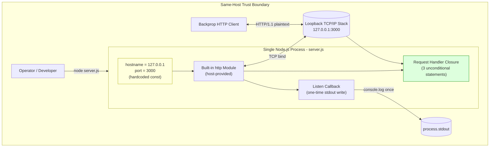

There is no second service, no API gateway, no service registry, no load balancer, no sidecar, and no message broker in the diagram because none exists in the codebase.

---

### 6.1.3 Scalability Design — Verified Absent

This subsection maps each axis of the Core Services Architecture "Scalability Design" prompt to verified-absent status. The system has no scalability design because it has no scaling targets — the fixture's role is deterministic correctness under low-volume integration test traffic, not throughput-driven workload service.

#### 6.1.3.1 Horizontal and Vertical Scaling Approach

Per Section 5.2.1, the scaling profile of `server.js` is intrinsically constrained by its single-process, single-event-loop architecture:

| Scaling Dimension | Repository Status | Evidence |
|---|---|---|
| Vertical scaling | Single-process throughput only | No `cluster` module, no `worker_threads`, no PM2 fork mode |
| Horizontal scaling | Not applicable | Loopback binding precludes load balancing or service-mesh deployment |
| Concurrency model | Default Node.js single-threaded event loop | Synchronous handler completes in nanoseconds |
| Connection limits | None set explicitly | Node.js defaults apply per F-009 |

Per Section 2.4.3, horizontal scaling is recorded as "Not supported — No clustering, worker threads, or process management." Multi-tenant responses are likewise "Not supported" because all requests yield identical, idempotent output.

#### 6.1.3.2 Auto-Scaling Triggers and Rules

The repository contains no auto-scaling infrastructure of any kind. Per Section 3.6:

| Auto-Scaling Substrate | Status | Section |
|---|---|---|
| Containerization (Docker) | Not present — `Dockerfile` absent | 3.6.3 |
| CI/CD pipelines | Not present — no `.github/`, `.gitlab-ci.yml`, etc. | 3.6.4 |
| Infrastructure-as-Code | Not present — no Terraform, Pulumi, CDK, CloudFormation | 3.6.5 |
| Orchestrator | Not present — "no orchestrator, no process supervisor, and no service manager configured within the repository" | 3.6.7 |
| Cloud auto-scaling primitives | Not present — Section 3.4.1 confirms zero third-party services | 3.4 |

There are no auto-scaling triggers (CPU thresholds, request-rate thresholds, queue-depth thresholds), no auto-scaling rules (min/max replica counts, cooldown periods, target utilization), and no horizontal pod autoscaler or auto-scaling group definitions.

#### 6.1.3.3 Resource Allocation Strategy

The system has no defined resource allocation strategy. Per Section 5.4.5, no resource budgets are declared:

| Resource Dimension | Specified Value |
|---|---|
| CPU allocation | None declared |
| Memory allocation | None declared |
| File-descriptor limits | None set |
| Network buffer tuning | None set |
| `maxConnections` ceiling | None set in `server.js` |
| Keep-alive configuration | None set; Node.js defaults apply |

The Node.js process inherits whatever resource limits the host operating system imposes by default. Per ADR-001 and F-009, tuning these limits would require code changes that are explicitly forbidden.

#### 6.1.3.4 Performance Optimization Techniques

Per Section 4.9.1, the repository declares "no quantitative performance targets." There is no caching tier (Section 5.3.4), no CDN integration, no compression configuration, no HTTP/2 or HTTP/3 upgrade path, and no static-asset optimization. The handler is already at the theoretical floor of work — three synchronous statements producing a 14-byte literal response — so there is no application-level operation left to optimize.

| Optimization Technique | Status | Evidence |
|---|---|---|
| Response caching (Redis, Memcached) | Not present | Section 5.3.4 |
| HTTP cache headers (`Cache-Control`, `ETag`) | Not set | Section 5.1.3 |
| Compression (gzip, brotli) | Not configured | Default `http` module behavior |
| HTTP/2 or HTTP/3 | Not used | `http` module is HTTP/1.1 only |
| Connection pooling (outbound) | Not applicable | No outbound calls |
| Database query optimization | Not applicable | No database |

#### 6.1.3.5 Capacity Planning Guidelines

The repository provides no capacity planning guidelines because no capacity targets exist. Per Section 5.4.5:

- Latency target (p50, p95, p99): None declared
- Throughput target (RPS): None declared
- Availability target (uptime SLO): None declared
- Cold-start time: Not specified
- Response-size budget: Fixed at 14 bytes (the literal `Hello, World!\n`)

The functional KPI inferable from the codebase is binary: "the server either responds with the expected payload, or it does not." Capacity planning, by contrast, requires declared performance envelopes and growth projections, neither of which is present.

#### 6.1.3.6 Scalability Boundaries Diagram

The following diagram illustrates the structural limits that prevent the system from scaling horizontally or being placed behind any load-distribution infrastructure.

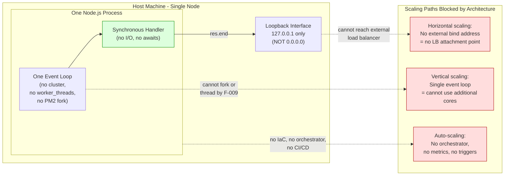

---

### 6.1.4 Resilience Patterns — Verified Absent

This subsection maps each axis of the Core Services Architecture "Resilience Patterns" prompt to verified-absent status. Per Section 5.4.6, "The system has no built-in disaster recovery procedures"; all recovery is delegated to the operator or to external orchestration that is itself outside the repository.

#### 6.1.4.1 Fault Tolerance Mechanisms

Per Section 4.8.1, the application contains zero error-handling constructs. The following nine-category inventory enumerates the absent fault-tolerance mechanisms:

| Fault Tolerance Construct | Present in `server.js`? |
|---|---|
| `try` / `catch` block | No |
| `server.on('error', ...)` listener | No |
| `req` / `res` `.on('error', ...)` listeners | No |
| `process.on('uncaughtException', ...)` | No |
| `process.on('unhandledRejection', ...)` | No |
| Retry / backoff logic | No |
| Fallback / graceful-degradation logic | No |
| Error notification / alerting | No |
| Recovery / self-healing logic | No |

All failure modes therefore route to the Node.js runtime defaults documented in Section 4.8.2: `EADDRINUSE`, bind failures, and synchronous exceptions in the handler all terminate the process with a non-zero exit code and a stack trace on stderr. Client mid-response disconnects are silently ignored. Malformed HTTP requests receive a `400 Bad Request` from the `http` module without ever invoking the handler. `SIGINT` and `SIGTERM` cause abrupt termination with no graceful drain.

#### 6.1.4.2 Disaster Recovery Procedures

Per Section 5.4.6, the disaster recovery posture is fully delegated:

| DR Concern | Status | Recovery Approach |
|---|---|---|
| Restart policy | Not in repository | External — must be supplied via systemd, pm2, or Docker `--restart` |
| Health check probe | Not implemented | External — operator may issue an HTTP request |
| Graceful shutdown | Not implemented | No `SIGINT`/`SIGTERM` handlers — termination is abrupt |
| Data backup / restore | Not applicable | No persistent state exists |
| Geographic redundancy | Not applicable | Loopback-only binding precludes multi-region deployment |
| Recovery Time Objective (RTO) | None declared | Equals the operator's manual restart time |
| Recovery Point Objective (RPO) | Not applicable | Stateless — no data to lose |

#### 6.1.4.3 Data Redundancy Approach

The system has no data redundancy approach because it has no data. Per Sections 3.5, 5.1.3, and 5.3.3, the system contains zero data stores and zero caches:

| Storage Surface | Status |
|---|---|
| Relational database | Not used — no drivers in `package-lock.json` |
| NoSQL document store | Not used — no drivers in lockfile |
| In-memory key-value store (Redis, Memcached) | Not used |
| File system persistence | Not used — `fs` module not imported in `server.js` |
| Object storage (S3, GCS, Azure Blob) | Not used — no cloud SDKs |
| Session / cookie store | Not used |
| HTTP response cache | Not set — no `Cache-Control`, `ETag`, `Last-Modified` |

Because the handler closure captures no mutable state and the response body is a string literal compiled into the source, there is no information at risk of loss and therefore no redundancy to engineer.

#### 6.1.4.4 Failover Configurations

The system has no failover configuration. The architectural primitives required for failover — multiple replicas, a primary/standby relationship, leader election, or active/passive pairs — are all absent. Per Section 5.2.1, only one Node.js process exists; per ADR-002, that process is bound to loopback and is consequently invisible to any external load balancer or DNS resolver that would route traffic between replicas.

| Failover Element | Status |
|---|---|
| Active/passive replica pair | Not present |
| Leader election (Raft, Paxos, ZooKeeper) | Not present |
| Health-check-driven failover | Not present (no health endpoint) |
| DNS or VIP failover | Not applicable (loopback only) |
| Cross-AZ / cross-region replicas | Not applicable (single host) |

#### 6.1.4.5 Service Degradation Policies

The system has no service degradation policy. Per Section 4.8.4, the handler "has no alternate path. The response is monolithic." There is no feature-flag system, no priority-based shedding, no graceful-degradation tier, and no read-only fallback mode. Either the handler executes its three statements in full and returns `200 OK` with `Hello, World!\n`, or the process is not running at all.

| Degradation Pattern | Status |
|---|---|
| Feature flags / toggles | Not present |
| Priority-based load shedding | Not present |
| Read-only / cached-only fallback tier | Not present |
| Static-asset fallback page | Not present |
| Reduced-functionality mode | Not present |

#### 6.1.4.6 Resilience Pattern Absence Map

The following diagram visualizes how every failure category routes to the same external-only recovery path because no application-level resilience pattern is registered.

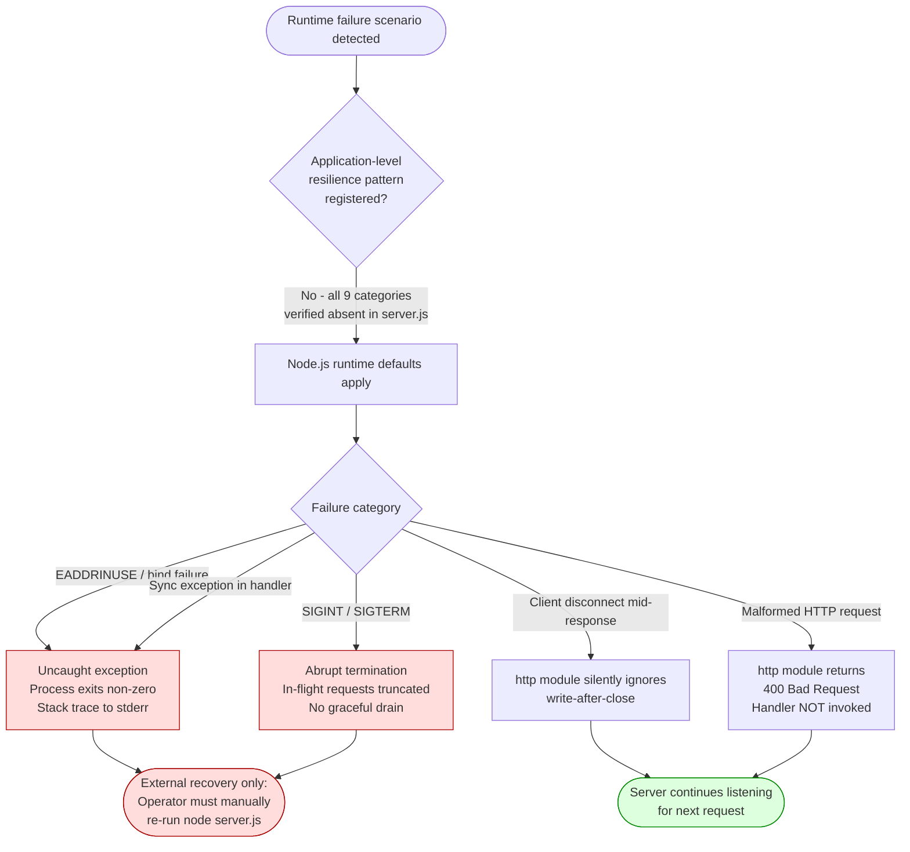

#### 6.1.4.7 Manual Recovery Procedure

Because no automated recovery mechanism exists, the complete recovery procedure is operator-driven, as documented verbatim in Section 5.4.6:

```mermaid
sequenceDiagram
    actor Operator
    participant Process as Node.js Process
    participant StdErr as stderr
    participant Shell

    Note over Process: Process exits non-zero<br/>(any failure category)
    Process->>StdErr: stack trace (if attached terminal)
    Operator->>Process: Detect unresponsive endpoint<br/>(HTTP request fails or times out)
    Operator->>StdErr: Inspect for prior stack trace
    Operator->>Operator: Address environmental cause<br/>(e.g., free port 3000 if EADDRINUSE)
    Operator->>Shell: node server.js
    Shell->>Process: spawn new process
    Process->>Operator: Server running at http://127.0.0.1:3000/
    Note over Operator,Process: Recovery confirmed by<br/>observing startup log line
```

Because the system is stateless, no data restoration step is required between termination and recovery. The Recovery Time Objective is equal to the operator's reaction time plus Node.js process spawn time; no formal RTO is declared.

---

### 6.1.5 Cross-Reference Matrix

The following matrix provides single-row cross-references from each Core Services Architecture prompt axis to the existing specification section that documents the absence in detail.

| Prompt Axis | Repository Status | Authoritative Section |
|---|---|---|
| Service boundaries and responsibilities | Single component — `server.js` owns all layers | 5.1.1, 5.2.1 |
| Inter-service communication patterns | None — single-process architecture | 5.3.2, 5.1.4 |
| Service discovery mechanisms | None — hardcoded constants per ADR-003 | 5.3.6 |
| Load balancing strategy | None — loopback binding precludes LB | 5.2.1, 5.3.6 (ADR-002) |
| Circuit breaker patterns | None — no timeouts, deadlines, or breakers | 4.9.2 |
| Retry and fallback mechanisms | None — handler is monolithic | 4.8.1, 4.8.4 |
| Horizontal/vertical scaling | Not supported | 2.4.3, 5.2.1 |
| Auto-scaling triggers and rules | None — no orchestrator, no metrics | 3.6.7, 5.4.1 |
| Resource allocation strategy | None — Node.js defaults apply | 5.4.5 |
| Performance optimization techniques | None — handler at theoretical floor | 5.3.4, 4.9.1 |
| Capacity planning guidelines | None — no targets declared | 4.9.1, 5.4.5 |
| Fault tolerance mechanisms | None — 9-category inventory verified absent | 4.8.1, 5.4.3 |
| Disaster recovery procedures | External only — manual operator restart | 5.4.6 |
| Data redundancy approach | Not applicable — no data | 3.5, 5.1.3, 5.3.3 |
| Failover configurations | Not applicable — single process | 5.2.1 |
| Service degradation policies | None — monolithic response path | 4.8.4 |

---

### 6.1.6 Summary

Core Services Architecture as a discipline addresses how multiple cooperating services should be bounded, discovered, scaled, isolated from each other's failures, and recovered after disruption. The `hao-backprop-test` repository contains exactly one service — a 15-line Node.js HTTP server — and is governed by an immutability directive that forbids the addition of any further services. Consequently, the entire prompt template applies to a substrate that does not exist in this codebase.

The fixture's design intent is the inverse of a Core Services Architecture: it provides a single, immutable, byte-deterministic HTTP target whose value derives precisely from its refusal to embody the runtime variability that service-architecture patterns are designed to manage. Any future engagement that requires service decomposition, scaling, or resilience engineering would necessarily occur in a separate repository, since modification of this one is forbidden by the F-009 governance constraint recorded in `README.md`.

---

#### References

#### Files Examined

- `server.js` — The entire 15-line runtime artifact; verified absence of clustering, worker threads, retry logic, error handlers, circuit breakers, and service-discovery primitives
- `package.json` — npm manifest declaring `hello_world@1.0.0` with placeholder test script and `main: index.js` (file does not exist)
- `package-lock.json` — npm lockfile with empty `packages` object and `lockfileVersion: 3`, confirming zero-dependency closure
- `README.md` — Contains the F-009 immutability directive (`Do not touch!`) governing all architectural decisions
- `/` (repository root) — Confirmed flat structure with no `src/`, `services/`, `microservices/`, `lib/`, `config/`, `.github/`, `docs/`, `node_modules/`, or any subdirectory beyond `.git`

#### Technical Specification Sections Referenced

- **Section 1.2 System Overview** — Establishes single logical runtime component and loopback-only integration model
- **Section 1.3 Scope** — Records that reverse proxy / load balancer hooks are explicitly out of scope
- **Section 2.1 Feature Catalog** — F-007 (zero dependencies) and F-009 (immutability) as governing constraints
- **Section 2.4 Implementation Considerations** — "Horizontal scaling: Not supported"; "Multi-tenant responses: Not supported"
- **Section 2.6 Assumptions and Constraints** — Hardcoded hostname/port; no environment-variable configuration
- **Section 3.4 Third-Party Services** — Zero third-party services integration
- **Section 3.5 Databases & Storage** — No persistence layer; no caching at any tier
- **Section 3.6 Development & Deployment** — No containerization, CI/CD, IaC, orchestrator, or process supervisor
- **Section 4.5 Integration Workflows** — One inbound integration point; verified-absent integrations table
- **Section 4.7 State Management** — No application-level state; no transaction boundaries
- **Section 4.8 Error Handling** — Nine-category absent-error-handling inventory; implicit Node.js default behaviors
- **Section 4.9 SLA and Timing Constraints** — No declared latency, throughput, concurrency, or availability targets; no circuit breakers
- **Section 5.1 High-Level Architecture** — Single-process, single-file, monolithic style; verified-absent integrations enumeration
- **Section 5.2 Component Details** — Per-component scaling considerations; horizontal scaling marked "Not applicable"
- **Section 5.3 Technical Decisions** — ADR-001 (built-in `http` only), ADR-002 (loopback binding), ADR-003 (hardcoded configuration); architecture style decision tree showing microservices/layered/reactive/modular all "NOT APPLICABLE"
- **Section 5.4 Cross-Cutting Concerns** — No monitoring, no logging framework, no error handlers; manual operator-driven recovery; "no built-in disaster recovery procedures"

## 6.2 Database Design

### 6.2.1 Applicability Assessment

**Database Design is not applicable to this system.**

The `hao-backprop-test` repository implements a single-process, single-file, monolithic HTTP server consisting of exactly 15 lines of runtime code in `server.js`. The system contains no persistence layer of any kind, no caching at any tier, no in-memory data structures, and no application-level state. Every architectural concern covered by the Database Design template — schema design, entity relationships, indexing, partitioning, replication, backup, migration, archival, compliance controls, and performance optimization — operates on a substrate that does not exist in this codebase. Furthermore, the project's foundational governance and dependency constraints (F-009 Immutability and F-007 Zero External Dependencies) explicitly forbid the introduction of any such substrate.

This determination is grounded in direct source-code evidence and is corroborated by no fewer than ten authoritative sections of this Technical Specification, all of which independently confirm the absence of data persistence and caching.

#### 6.2.1.1 Architectural Determination

The "no database" determination is the outcome of a deliberate architectural decision recorded across multiple specification sections. Section 3.5.1 (Persistence Layer Status) states unambiguously that the system implements no persistence layer. Section 5.3.3 (Data Storage Solution Rationale) records that the system uses no data storage solution of any kind, characterizing this as a deliberate decision rather than an oversight. Section 5.3.4 (Caching Strategy) confirms that no caching is implemented at any layer, and Section 4.7.3 (Data Persistence, Caching, and Transaction Boundaries) marks transaction boundaries as not applicable because there is no persistence to transact over.

| Determination Axis | Status | Authoritative Section |
|---|---|---|
| Persistence layer | Not implemented | 3.5.1 |
| In-memory state | Not present | 3.5.3, 4.7.1 |
| Caching tier | Not implemented at any layer | 3.5.4, 5.3.4 |
| File system I/O | Not invoked at runtime | 3.5.5 |
| Object storage | Not integrated | 3.5.5 |
| Transaction boundaries | Not applicable | 4.7.3 |
| Data redundancy | Not applicable | 6.1.4.3 |

#### 6.2.1.2 Foundational Constraints

Three interlocking constraints defined elsewhere in the specification mathematically preclude the introduction of any database, cache, or storage primitive within this repository. These constraints are not merely descriptive of the current state — they actively forbid the addition of database infrastructure as a future change.

| Constraint ID | Constraint | Source of Truth | Implication for Database Design |
|---|---|---|---|
| **F-007** | Zero External Dependencies | `package-lock.json` (empty `packages` object, `lockfileVersion: 3`) | Forbids any database driver, ORM, query builder, caching client, or migration tool |
| **F-009** | Immutability Directive | `README.md` (`Do not touch!`) | Adding database connection or schema code would itself violate the project's defining requirement |
| **ADR-002** | Loopback-Only Binding | `server.js` (`hostname='127.0.0.1'`) | Cross-host integration impossible; precludes typical multi-tier database deployment |
| **ADR-003** | Hardcoded Configuration | `server.js` (in-file `const` for `hostname`/`port`) | No environment-variable mechanism exists by which connection strings or credentials could be supplied |

The Architecture Style decision tree in Section 5.3.6 explicitly traces a branch labeled "Does it require persistent state? — No" that channels the design away from any layered or modular monolith style requiring data tiers, terminating instead at a single-file monolithic Node.js HTTP server with built-in `http` module only.

#### 6.2.1.3 Verified-Absent Persistence Inventory

Each category of data persistence and caching that would normally appear in a Database Design section was verified absent through exhaustive examination of the four committed source files (`server.js`, `package.json`, `package-lock.json`, `README.md`) and the empty repository directory tree. The following table consolidates the inventory drawn from Sections 3.5.2, 3.5.4, 3.5.5, 5.1.3, and 5.3.3.

| Storage / Caching Surface | Verified Status | Direct Evidence |
|---|---|---|
| Relational database (PostgreSQL, MySQL) | Not used | No `pg`, `mysql2`, `sequelize`, `prisma`, `knex` in lockfile |
| NoSQL document store (MongoDB) | Not used | No `mongodb`, `mongoose` in lockfile |
| Key-value store (Redis, DynamoDB) | Not used | No `redis`, `ioredis`, `@aws-sdk/client-dynamodb` in lockfile |
| Search engine (Elasticsearch) | Not used | No `@elastic/elasticsearch` client libraries |
| Graph database (Neo4j) | Not used | No `neo4j-driver` in lockfile |
| Vector database (Pinecone, Weaviate) | Not used | No vector store clients in lockfile |
| In-memory cache (LRU, node-cache) | Not used | Handler closure captures no mutable state |
| Distributed cache (Redis, Memcached) | Not used | Zero-dependency mandate (F-007) |
| HTTP response cache headers | Not set | No `Cache-Control`, `ETag`, or `Last-Modified` emitted |
| CDN edge caching | Not applicable | Loopback-only binding precludes CDN use |
| File system persistence | Not invoked | Node.js `fs` module not imported in `server.js` |
| Object storage (S3, GCS, Azure Blob) | Not used | No cloud SDKs (`aws-sdk`, `@google-cloud/*`, `@azure/*`) |
| Session / cookie store | Not used | No middleware; no session libraries |

---

## 6.2 SCHEMA DESIGN — VERIFIED ABSENT

This subsection maps each axis of the Schema Design prompt to verified-absent status, with the file or specification section providing the supporting evidence.

### 6.2.1 Entity Relationships and Data Models

The system has no entities and therefore no entity relationships. Section 1.3.1 (Implementation Boundaries) records under Data domains: "None — no persistent or in-memory user data is processed." Section 5.2.1 (Component Details) records that the sole runtime component "holds no mutable state, opens no files, connects to no databases, and writes nothing to disk."

The handler closure is a pure function whose output (`Hello, World!\n`) is a 14-byte string literal compiled into source code. Because the response body is materialized at JavaScript-engine speed from a literal in the source file, there is no domain object, value object, aggregate, or relationship to model.

| Schema Element | Status | Rationale |
|---|---|---|
| Logical entities | None | No business domain modeled |
| Entity attributes | None | No data fields exist |
| Primary keys | None | No records to identify |
| Foreign keys / relationships | None | No tables to relate |
| Aggregate roots | None | DDD does not apply to a static fixture |
| Value objects | None | Response body is a string literal, not a typed value |

### 6.2.2 Indexing Strategy

Indexing is not applicable. Indexes presuppose a queryable data store; with no database, no document collection, and no in-memory map, there is no surface against which an index could be defined.

| Index Category | Status |
|---|---|
| B-tree indexes | Not applicable — no relational database |
| Hash indexes | Not applicable — no key-value store |
| Inverted indexes | Not applicable — no search engine |
| Composite / covering indexes | Not applicable — no queries to cover |
| Partial / filtered indexes | Not applicable — no predicates to filter |
| Geospatial indexes | Not applicable — no location data |
| Vector / embedding indexes | Not applicable — no embeddings |

### 6.2.3 Partitioning Approach

Partitioning is not applicable. Partitioning addresses scalability concerns of large datasets distributed across storage units; this system has zero datasets and a single-process architecture that cannot itself be horizontally distributed.

| Partitioning Dimension | Status |
|---|---|
| Horizontal sharding | Not applicable — no data to shard |
| Vertical partitioning | Not applicable — no schema to partition |
| Range partitioning | Not applicable — no key ranges exist |
| Hash partitioning | Not applicable — no rows to distribute |
| List partitioning | Not applicable — no enumerable categories |
| Time-based partitioning | Not applicable — no temporal data |

### 6.2.4 Replication Configuration

Replication is not applicable. Replication requires at least one source-of-truth dataset and one or more replica nodes; neither exists. Section 6.1.4.4 (Failover Configurations) explicitly records that active/passive replica pairs, leader election, and DNS/VIP failover are all "Not present" or "Not applicable."

| Replication Pattern | Status | Reason |
|---|---|---|
| Single-leader (primary/replica) | Not applicable | No leader to elect; no replicas exist |
| Multi-leader | Not applicable | Single-process architecture |
| Leaderless (Dynamo-style) | Not applicable | No quorum nodes |
| Synchronous replication | Not applicable | No write path |
| Asynchronous replication | Not applicable | No write path |
| Cross-AZ / cross-region replicas | Not applicable | Loopback binding precludes multi-host topology |

### 6.2.5 Backup Architecture

Backup architecture is not applicable. Section 5.4.6 (Disaster Recovery Procedures) marks "Data backup / restore" as **Not applicable** with the explicit justification "No persistent state exists." Section 6.1.4.3 (Data Redundancy Approach) reinforces this: "Because the handler closure captures no mutable state and the response body is a string literal compiled into the source, there is no information at risk of loss and therefore no redundancy to engineer."

| Backup Concern | Status |
|---|---|
| Full database snapshot | Not applicable — no database |
| Incremental / differential backups | Not applicable — no baseline |
| Point-in-time recovery (PITR) | Not applicable — no transaction log |
| Write-ahead log (WAL) archival | Not applicable — no WAL |
| Cross-region snapshot copy | Not applicable — no source |
| Backup retention schedule | Not applicable — no backups generated |
| Restore procedure | Not applicable — no restore needed (re-execute `node server.js`) |
| Recovery Point Objective (RPO) | Not applicable — stateless, no data to lose |
| Recovery Time Objective (RTO) | Equal to operator's manual restart time (no formal target) |

---

## 6.3 DATA MANAGEMENT — VERIFIED ABSENT

### 6.3.1 Migration Procedures

Migration procedures are not applicable. Schema migrations exist to evolve a database schema in lockstep with application code; this codebase has no schema and is governed by F-009 (Immutability), which forbids the kind of evolutionary change that migrations were invented to manage.

| Migration Concern | Status |
|---|---|
| Migration tooling (Flyway, Liquibase, db-migrate, Umzug) | Not present — zero dependencies in lockfile |
| Migration scripts | Not present — no `migrations/` directory exists |
| Forward migrations | Not applicable — no schema to advance |
| Down/reverse migrations | Not applicable — no schema to roll back |
| Migration version table | Not applicable — no database to host it |
| Zero-downtime deployment patterns | Not applicable — no schema-version coupling |

### 6.3.2 Versioning Strategy

Data versioning is not applicable. Per Section 5.3.6, ADR-003 hardcodes configuration as in-file `const` values; per F-009, the source files themselves are immutable. There is no row to version, no document to revise, and no event log to evolve.

| Versioning Concern | Status |
|---|---|
| Schema versioning (e.g., Avro, Protobuf evolution) | Not applicable — no schema |
| Row-level versioning (`updated_at`, optimistic locking) | Not applicable — no rows |
| Document versioning (CouchDB-style `_rev`) | Not applicable — no documents |
| Event-sourcing replay | Not applicable — no event log |
| API contract versioning | Not implemented — no versioned endpoints exposed |

### 6.3.3 Archival Policies

Archival policies are not applicable. Archival presupposes a tiered storage hierarchy in which aging records are migrated from hot to cold storage; with no records and no storage tier, there is nothing to archive.

| Archival Concern | Status |
|---|---|
| Hot/warm/cold storage tiers | Not applicable — no storage |
| Time-to-live (TTL) policies | Not applicable — no records |
| Cold-storage destination (S3 Glacier, etc.) | Not applicable — no source data |
| Archival retention duration | Not applicable — no archive |
| Restore-from-archive procedure | Not applicable — no archive to restore from |

### 6.3.4 Data Storage and Retrieval Mechanisms

Data storage and retrieval mechanisms are not applicable. The handler does not read input data and does not retrieve stored data. Per Section 5.1.3, request data is never read by application code, and the response body is a literal string constant defined inline in the handler. Per the same section, the system contains "zero data transformation points."

| Storage / Retrieval Mechanism | Status |
|---|---|
| Read path (query, lookup, fetch) | Not applicable — no data source |
| Write path (insert, update, delete) | Not applicable — no data sink |
| Bulk loading | Not applicable — no destination table |
| Streaming ingestion | Not applicable — no consumer of inbound data |
| Change data capture (CDC) | Not applicable — no log to capture from |
| Data serialization (JSON, Protobuf, Avro) | Not applicable — response is a UTF-8 string literal |

### 6.3.5 Caching Policies

Caching policies are not applicable. Section 5.3.4 (Caching Strategy) records that the system implements no caching at any layer, with the rationale "Because the response is a 14-byte literal computed at JavaScript-engine speed, a cache would impose more overhead than the work it would avoid."

| Cache Policy Dimension | Status | Rationale (per Sections 3.5.4, 5.3.4) |
|---|---|---|
| Cache invalidation strategy | Not applicable | No cache to invalidate |
| TTL / expiry policy | Not applicable | No cache entries |
| Eviction policy (LRU, LFU, FIFO) | Not applicable | No cache to evict from |
| Write-through / write-back / write-around | Not applicable | No write path to a cache |
| Cache warming | Not applicable | No cache to warm |
| Cache stampede protection | Not applicable | No upstream to protect |
| Negative caching | Not applicable | No misses to memoize |

---

## 6.4 COMPLIANCE CONSIDERATIONS — NOT APPLICABLE

Because the system processes no user data, persists no state, and emits only a single static response, the data-related compliance posture is governed entirely by the absence of data. Each compliance axis below is mapped to its verified status with the appropriate cross-reference.

### 6.4.1 Data Retention Rules

Data retention rules are not applicable. Section 1.3.1 explicitly records under Data domains: "None — no persistent or in-memory user data is processed." With no data subject to retention, no GDPR right-to-be-forgotten obligation, no PCI scope, and no HIPAA PHI handling apply within the bounds of this repository.

| Retention Concern | Status |
|---|---|
| GDPR data retention / right to erasure | Not applicable — no personal data processed |
| HIPAA PHI retention | Not applicable — no health data processed |
| PCI-DSS cardholder data retention | Not applicable — no payment data processed |
| SOX financial record retention | Not applicable — no financial records |
| Industry-specific retention windows | Not applicable — no records exist |
| Legal hold mechanism | Not applicable — nothing to preserve |

### 6.4.2 Backup and Fault Tolerance Policies

Backup policies are not applicable for the reasons documented in Section 5.4.6 and Section 6.1.4.3: the system has no persistent state, the response body is a string literal compiled into source code, and the handler closure captures no mutable state. Fault tolerance for the running process is delegated entirely to operator-driven manual restart, as documented in Section 6.1.4.7 — but this concerns process availability, not data integrity, because no data exists.

| Backup / Fault Tolerance Concern | Status |
|---|---|
| Backup frequency | Not applicable — nothing to back up |
| Backup encryption at rest | Not applicable — no backup artifacts |
| Backup restore drill | Not applicable — no restore target |
| Cross-region backup replication | Not applicable — no source |
| Application-level fault tolerance for data integrity | Not applicable — no data integrity surface |

### 6.4.3 Privacy Controls

Privacy controls are not applicable. The handler does not inspect `req.method`, `req.url`, `req.headers`, or `req.body` (per Section 5.1.3), so no Personally Identifiable Information (PII) is ever accessed, logged, persisted, or transmitted onward. Section 5.4.4 records that no audit logging exists, but this is appropriate given that no protected actions occur.

| Privacy Control | Status |
|---|---|
| PII identification and tagging | Not applicable — no PII processed |
| Data minimization | Trivially satisfied — zero data captured |
| Encryption of PII at rest | Not applicable — no PII at rest |
| Data subject access request (DSAR) workflow | Not applicable — no subjects |
| Pseudonymization / anonymization | Not applicable — no identifiable data |
| Consent management | Not applicable — no consent surface |

### 6.4.4 Audit Mechanisms

Audit mechanisms are not applicable. Per Section 5.4.4, audit logging is "Not implemented" with the mitigating rationale "No protected actions to audit." Per Section 5.4.2, no per-request access logs, error logs, debug logs, or audit logs are emitted; the only log line is the single startup confirmation written to `process.stdout`.

| Audit Concern | Status |
|---|---|
| Per-request access log | Not emitted (Section 5.4.2) |
| Data-change audit trail (who/what/when) | Not applicable — no data changes |
| Authentication / authorization audit | Not applicable — no auth framework (Section 5.4.4) |
| Privileged action audit | Not applicable — no privileged actions |
| Audit log immutability / tamper-evidence | Not applicable — no audit log |
| External audit system integration (SIEM) | Not present — no log shipping |

### 6.4.5 Access Controls

Database access controls are not applicable. Per Section 5.4.4, the system implements no authentication and no authorization framework, and per Section 5.3.5, no protected resources exist. The threat model is bounded by the network-layer loopback constraint (ADR-002): only same-host processes can reach the endpoint, which substitutes for application-level access control given the threat surface.

| Access Control Mechanism | Status |
|---|---|
| Database user / role definition | Not applicable — no database |
| Row-level security (RLS) | Not applicable — no rows |
| Column-level encryption | Not applicable — no columns |
| Connection-string credential management | Not applicable — no connection strings |
| IAM-based database authentication | Not applicable — no database |
| Network ACL on database port | Not applicable — no database listener |
| Privilege separation (read-only / read-write users) | Not applicable — no users |

---

## 6.5 PERFORMANCE OPTIMIZATION — NOT APPLICABLE

Per Section 6.1.3.4, the handler is already at the theoretical floor of work — three synchronous statements producing a 14-byte literal response — so there is no application-level operation left to optimize. Section 5.4.5 records that no quantitative performance targets, SLAs, or SLOs are declared. Each performance-optimization axis from the prompt is mapped below.

### 6.5.1 Query Optimization Patterns

Query optimization is not applicable. There are no queries because there is no queryable substrate. The handler does not invoke any DSL, ORM `find()`, SQL `SELECT`, MongoDB `findOne()`, Redis `GET`, or any other retrieval primitive.

| Query Optimization Concern | Status |
|---|---|
| Query plan analysis (EXPLAIN, EXPLAIN ANALYZE) | Not applicable — no queries |
| N+1 query detection | Not applicable — no ORM, no queries |
| Materialized views | Not applicable — no view substrate |
| Denormalization for read performance | Not applicable — no schema to denormalize |
| Prepared statement caching | Not applicable — no statements |

### 6.5.2 Caching Strategy

Caching strategy is not applicable. The complete caching posture is enumerated in Section 5.3.4: HTTP response cache headers are not set, in-memory application cache is not used, distributed cache (Redis, Memcached) is not used, and CDN is not applicable due to loopback-only binding.

| Cache Layer | Decision (per Section 5.3.4) | Rationale |
|---|---|---|
| HTTP response cache headers | Not set | No `Cache-Control`, `ETag`, or `Last-Modified` emitted |
| In-memory application cache | Not used | Static response is cheaper than any cache lookup |
| Distributed cache (Redis, Memcached) | Not used | Zero-dependency mandate (F-007) |
| CDN | Not applicable | Loopback-only binding precludes CDN use |

### 6.5.3 Connection Pooling

Connection pooling is not applicable. Connection pools amortize the cost of establishing connections to a database or other backend service; this system has no outbound connections. Per Section 6.1.3.4, "Connection pooling (outbound)" is marked "Not applicable — No outbound calls."

| Connection Pool Concern | Status |
|---|---|
| Database connection pool size | Not applicable — no database |
| Connection acquisition timeout | Not applicable — no pool |
| Idle connection reaping | Not applicable — no pool |
| Connection health checks | Not applicable — no connections |
| Pool exhaustion behavior | Not applicable — no pool |

### 6.5.4 Read/Write Splitting

Read/write splitting is not applicable. This pattern presupposes a primary database accepting writes and one or more read replicas; per Section 6.1.4.4, no replicas of any kind exist, and per Section 6.1.4.3, no data exists to be split.

| Read/Write Splitting Concern | Status |
|---|---|
| Primary write endpoint | Not applicable — no primary database |
| Read replica endpoints | Not applicable — no replicas |
| Replica-lag-aware routing | Not applicable — no replication |
| Read-after-write consistency | Not applicable — no writes |

### 6.5.5 Batch Processing Approach

Batch processing is not applicable. Each HTTP request is handled synchronously and independently; per Section 4.7.3, the handler is intrinsically idempotent, and per Section 5.1.3, the handler executes three unconditional statements per request and returns. No accumulation of work, no scheduled job, no ETL pipeline, and no bulk loader exists.

| Batch Processing Concern | Status |
|---|---|
| Batch size tuning | Not applicable — no batches |
| Bulk insert / bulk update operations | Not applicable — no write target |
| Streaming batch (windowed) processing | Not applicable — no stream |
| Scheduled batch job (cron) | Not applicable — no scheduler |
| Backpressure / flow control | Not applicable — no producer/consumer |

---

## 6.6 DATA FLOW DIAGRAMS

Because no persistence layer exists, the canonical Database Design diagrams (ER diagram, replication topology, backup pipeline) cannot be drawn against any real subject in this codebase. The diagrams below instead document the absence in a structurally informative way: they show how request data flows through the running system without ever encountering a persistence tier, and they enumerate the conventional database surfaces that are verified absent.

### 6.6.1 Request Data Flow Past Verified-Absent Persistence Tiers

The following data flow diagram traces a complete HTTP request/response cycle (Workflow B from Section 5.1.3) and overlays each tier of a conventional Database Design where it would normally appear. Every persistence and caching tier is explicitly marked as verified-absent with the source of evidence.

```mermaid
flowchart LR
    Client["Backprop HTTP Client<br/>(same-host)"]
    Loopback[("Loopback TCP/IP<br/>127.0.0.1:3000")]
    HttpMod["Built-in http Module<br/>(parses request)"]
    Handler["Request Handler Closure<br/>3 synchronous statements"]
    Literal["String Literal<br/>'Hello, World!\n'<br/>(compiled into source)"]

    subgraph AbsentTiers["Verified-Absent Persistence and Caching Tiers"]
        direction TB
        NoCache["HTTP Response Cache<br/>NOT SET<br/>(Section 5.3.4)"]
        NoMemCache["In-Memory Cache<br/>NOT INSTANTIATED<br/>(Section 3.5.3)"]
        NoDistCache["Distributed Cache<br/>(Redis, Memcached)<br/>NOT USED<br/>(Section 5.3.4)"]
        NoDB["Database<br/>(SQL, NoSQL, KV, Graph)<br/>NOT USED<br/>(Section 3.5.2)"]
        NoFS["File System<br/>NOT IMPORTED<br/>(Section 3.5.5)"]
        NoBlob["Object Storage<br/>(S3, GCS, Azure)<br/>NOT INTEGRATED<br/>(Section 3.5.5)"]
    end

    Client -->|HTTP/1.1 request| Loopback
    Loopback -->|request event| HttpMod
    HttpMod -->|invoke| Handler
    Handler -->|reads| Literal
    Handler -->|res.end| HttpMod
    HttpMod -->|HTTP/1.1 response| Loopback
    Loopback -->|response| Client

    Handler -.->|never reads| NoCache
    Handler -.->|never reads| NoMemCache
    Handler -.->|never reads| NoDistCache
    Handler -.->|never queries| NoDB
    Handler -.->|never reads| NoFS
    Handler -.->|never accesses| NoBlob

    style Handler fill:#dfd,stroke:#080
    style Literal fill:#ffd,stroke:#aa0
    style NoCache fill:#fdd,stroke:#a00
    style NoMemCache fill:#fdd,stroke:#a00
    style NoDistCache fill:#fdd,stroke:#a00
    style NoDB fill:#fdd,stroke:#a00
    style NoFS fill:#fdd,stroke:#a00
    style NoBlob fill:#fdd,stroke:#a00
```

The dashed lines from the handler to each absent tier indicate the connections that would exist in a conventional layered architecture but are explicitly not present in this codebase. The solid path traces the actual runtime data flow: the request enters the loopback stack, is parsed by the built-in `http` module, invokes the handler, the handler emits a string literal compiled into source code, and the response is serialized back through the loopback interface to the client.

### 6.6.2 Conventional Database Architecture Comparison

The following diagram contrasts a conventional three-tier database architecture (the kind a Database Design section would normally document) against the actual structure of this fixture. This serves to make the "not applicable" determination visually concrete.

```mermaid
flowchart TB
    subgraph Conventional["Conventional Database Architecture (NOT IMPLEMENTED)"]
        direction TB
        ConvApp["Application Layer<br/>(business logic)"]
        ConvCache["Cache Layer<br/>(Redis / Memcached)"]
        ConvPrimary[("Primary Database<br/>(read/write)")]
        ConvReplica1[("Read Replica 1")]
        ConvReplica2[("Read Replica 2")]
        ConvBackup[("Backup / Snapshot<br/>(S3, Glacier)")]

        ConvApp --> ConvCache
        ConvCache --> ConvPrimary
        ConvPrimary -.->|async replication| ConvReplica1
        ConvPrimary -.->|async replication| ConvReplica2
        ConvPrimary -.->|nightly snapshot| ConvBackup
    end

    subgraph Actual["Actual Architecture (IMPLEMENTED)"]
        direction TB
        ActHandler["Handler Closure<br/>(3 statements)"]
        ActLiteral["'Hello, World!\n'<br/>string literal in source"]

        ActHandler -->|reads| ActLiteral
    end

    style Conventional fill:#fdd,stroke:#a00,stroke-dasharray: 5 5
    style Actual fill:#dfd,stroke:#080
    style ActHandler fill:#dfd,stroke:#080
    style ActLiteral fill:#ffd,stroke:#aa0
```

The actual architecture eliminates every box in the conventional architecture: there is no application/cache/database boundary, no primary/replica relationship, and no backup pipeline. The runtime "data layer" is collapsed entirely into a string literal embedded in the source file.

### 6.6.3 Replication and Redundancy Architecture

A replication architecture diagram cannot be drawn for this system because the structural primitives required for replication are all absent. Per Section 6.1.4.3 (Data Redundancy Approach), the system has no data redundancy approach because it has no data. Per Section 6.1.4.4 (Failover Configurations), no active/passive replica pair, leader election protocol, health-check-driven failover, or DNS/VIP failover exists. The following diagram instead documents what would be required to introduce replication and shows why each prerequisite is forbidden by the foundational constraints.

```mermaid
flowchart TD
    Required([Replication Topology Requires])
    Required --> Req1["Multiple data-bearing<br/>processes / hosts"]
    Required --> Req2["Persistent storage<br/>at each replica"]
    Required --> Req3["Network reachability<br/>between replicas"]
    Required --> Req4["Configurable connection<br/>endpoints per replica"]

    Req1 -->|"blocked by"| F009A["F-009 Immutability:<br/>cannot add a second<br/>process or replica"]
    Req2 -->|"blocked by"| F007["F-007 Zero Dependencies:<br/>cannot add a database<br/>driver to any replica"]
    Req3 -->|"blocked by"| ADR002["ADR-002 Loopback Only:<br/>127.0.0.1 binding cannot<br/>reach a remote replica"]
    Req4 -->|"blocked by"| ADR003["ADR-003 Hardcoded Config:<br/>no env-var mechanism<br/>for replica endpoints"]

    F009A --> Conclusion["Replication architecture is<br/>structurally impossible<br/>within this repository"]
    F007 --> Conclusion
    ADR002 --> Conclusion
    ADR003 --> Conclusion

    style Conclusion fill:#fdd,stroke:#a00,stroke-width:3px
    style F009A fill:#fdd,stroke:#a00
    style F007 fill:#fdd,stroke:#a00
    style ADR002 fill:#fdd,stroke:#a00
    style ADR003 fill:#fdd,stroke:#a00
```

Each of the four prerequisites for a replication topology is independently blocked by one of the four foundational constraints. Even if a database engine were willing to operate without persistence (none would), the loopback-only binding (ADR-002) and hardcoded-configuration mandate (ADR-003) would still prevent meaningful multi-host operation, and F-009 would still forbid the source-code change required to introduce the replica.

---

## 6.7 Cross-Reference Matrix

The following matrix provides single-row cross-references from each Database Design prompt axis to the existing specification section that documents the absence in detail. This matrix is the canonical traceability table for Section 6.2.

| Prompt Axis | Repository Status | Authoritative Section |
|---|---|---|
| Entity relationships | None — no entities | 1.3.1, 5.2.1 |
| Data models and structures | None — only a string literal | 5.1.3, 5.3.3 |
| Indexing strategy | Not applicable — no queryable data | 3.5.2 |
| Partitioning approach | Not applicable — no datasets | 5.3.3 |
| Replication configuration | Not applicable — single process, no data | 6.1.4.4 |
| Backup architecture | Not applicable — no persistent state | 5.4.6, 6.1.4.3 |
| Migration procedures | Not applicable — no schema; F-009 forbids change | 5.3.6 (ADR), 6.3.1 |
| Versioning strategy | Not applicable — no records, no documents | 4.7.3 |
| Archival policies | Not applicable — no records to archive | 3.5.5 |
| Data storage / retrieval | Not applicable — no read/write paths | 5.1.3, 5.3.3 |
| Caching policies | Not implemented at any tier | 3.5.4, 5.3.4 |
| Data retention rules | Not applicable — no user data processed | 1.3.1 |
| Backup / fault tolerance | Not applicable — no data integrity surface | 5.4.6, 6.1.4.3 |
| Privacy controls | Not applicable — no PII accessed | 5.4.4 |
| Audit mechanisms | Not implemented — no protected actions | 5.4.2, 5.4.4 |
| Access controls | Not applicable — no protected resources | 5.3.5, 5.4.4 |
| Query optimization | Not applicable — no queries | 6.1.3.4 |
| Caching strategy | Not implemented | 5.3.4 |
| Connection pooling | Not applicable — no outbound connections | 6.1.3.4 |
| Read/write splitting | Not applicable — no replicas, no writes | 6.1.4.4 |
| Batch processing | Not applicable — synchronous request handling | 5.1.3, 4.7.3 |

---

## 6.8 Summary

Database Design as a discipline addresses how durable application state should be modeled, queried, indexed, partitioned, replicated, backed up, migrated, retained, secured, and tuned for performance. The `hao-backprop-test` repository contains exactly one runtime artifact — a 15-line Node.js HTTP server in `server.js` — and is governed by an immutability directive that forbids the addition of any further code or dependencies. Consequently, the entire Database Design template applies to a substrate that does not exist in this codebase.

The fixture's design intent is the categorical inverse of a database-backed system: it provides a deterministic, byte-identical HTTP response materialized from a string literal compiled into source code. The deliberate absence of persistence is not a deficiency to be remedied — it is the architectural property that makes the fixture useful as a test target. Per Section 5.3.3, "The handler is stateless and idempotent by design; there is nothing to persist, so persistence infrastructure would be pure overhead." Per Section 5.3.4, "Because the response is a 14-byte literal computed at JavaScript-engine speed, a cache would impose more overhead than the work it would avoid."

Any future engagement that requires database design — schema modeling, query optimization, replication topology, backup engineering, or compliance-driven retention — would necessarily occur in a separate repository, since modification of this one is forbidden by the F-009 governance constraint recorded in `README.md`.

---

#### References

#### Files Examined

- `server.js` — The entire 15-line runtime artifact. Verified to import only `require('http')`; no `fs`, `crypto`, `dns`, `os`, `path`, or any database driver is imported. No `Map`, `Set`, `WeakMap`, closure-captured mutable variable, or top-level mutable counter exists. The handler is fully synchronous and stateless.
- `package.json` — npm manifest declaring `hello_world@1.0.0`. Verified to contain neither a `dependencies` key nor a `devDependencies` key, and no database-related scripts (`migrate`, `seed`, `db:setup`).
- `package-lock.json` — npm lockfile with `lockfileVersion: 3`. Verified to contain only the root package entry under `packages`, confirming a zero-third-party dependency closure. No database driver, ORM, query builder, caching client, or migration tool is present.
- `README.md` — Two-line documentation file. Source of evidence for the F-009 immutability directive (`Do not touch!`).
- Repository root directory — Confirmed via folder enumeration to contain only the four files above plus `.git`. No `db/`, `migrations/`, `models/`, `schemas/`, `data/`, `src/`, `lib/`, `config/`, or `node_modules/` subdirectory exists.

#### Technical Specification Sections Referenced

- **Section 1.3 Scope** — Records under Data domains: "None — no persistent or in-memory user data is processed"; lists "Persistence (database, file I/O)" and "Database connectivity" among Excluded Features.
- **Section 3.5 DATABASES & STORAGE** — Primary evidence. Section 3.5.1 ("The system implements no persistence layer"); Section 3.5.2 (database inventory all marked "Not used"); Section 3.5.3 (in-memory state verified absent); Section 3.5.4 ("No caching layer is present at any tier"); Section 3.5.5 (file system and object storage verified absent).
- **Section 4.7 STATE MANAGEMENT** — Section 4.7.1 records "no application-level state"; Section 4.7.3 marks transaction boundaries as "Not applicable — no persistence to transact over."
- **Section 5.1 HIGH-LEVEL ARCHITECTURE** — Section 5.1.3 confirms "zero data stores and zero caches"; Section 5.1.4 enumerates verified-absent integrations including database drivers, file system I/O, and cloud SDKs.
- **Section 5.2 COMPONENT DETAILS** — Section 5.2.1 records that the sole component "holds no mutable state, opens no files, connects to no databases, and writes nothing to disk."
- **Section 5.3 TECHNICAL DECISIONS** — Section 5.3.3 (Data Storage Solution Rationale: no storage of any kind); Section 5.3.4 (Caching Strategy: no caching at any layer); Section 5.3.6 ADR-001/002/003 documenting the architectural prohibitions.
- **Section 5.4 CROSS-CUTTING CONCERNS** — Section 5.4.2 (no per-request, error, or audit logs); Section 5.4.4 (no authentication, no authorization, no audit logging); Section 5.4.6 (data backup/restore "Not applicable — no persistent state exists").
- **Section 6.1 CORE SERVICES ARCHITECTURE** — Section 6.1.3.4 (connection pooling and database query optimization "Not applicable"); Section 6.1.4.3 (data redundancy approach "no data redundancy approach because it has no data"); Section 6.1.4.4 (failover/replication configurations all absent).
- **Section 2.1 Feature Catalog** — F-007 (Zero External Dependencies) and F-009 (Immutability Directive) as the foundational constraints precluding the introduction of any database substrate.
- **Section 2.6 Assumptions and Constraints** — Hardcoded `hostname` and `port` values; no environment-variable configuration mechanism by which database connection strings could ever be supplied.

## 6.3 Integration Architecture

### 6.3.1 Integration Architecture Overview

#### 6.3.1.1 Applicability Assessment

Integration Architecture **partially applies** to the `hao-backprop-test` repository. The system exposes exactly one runtime integration point — an inbound HTTP endpoint at `127.0.0.1:3000` — and therefore qualifies as an integrated system in the strictest sense. However, the broader machinery typically associated with Integration Architecture (API gateways, identity providers, message brokers, stream processors, third-party services) is **verifiably absent** from the codebase. This section documents the present integration with full architectural fidelity and systematically maps each prompt axis to a verified-absent status with file/section evidence.

The determination is grounded in three foundational architectural decisions documented in Section 5.3:

| Decision | Source | Implication for Integration Architecture |
|---|---|---|
| ADR-001 — Built-in `http` Module Only | `server.js:1` (`require('http')`) | No framework, no middleware, no integration plug-ins |
| ADR-002 — Loopback-Only Binding | `server.js:3` (`hostname='127.0.0.1'`) | Cross-host integration impossible; same-host trust boundary only |
| ADR-003 — Hardcoded Configuration | `server.js:3-4` (in-file `const`) | No environment-driven endpoint configuration; deterministic addressing |

Additionally, two foundational features govern the integration surface:

| Feature | Constraint | Effect on Integrations |
|---|---|---|
| F-007 Zero External Dependencies | `package-lock.json` empty `packages` | Forbids any integration client library |
| F-009 Immutability Directive | `README.md` `Do not touch!` | Forbids architectural elaboration of integration layer |

#### 6.3.1.2 Integration Surface Inventory

The complete integration surface enumerated authoritatively in Section 4.5.1 and Section 5.1.4 consists of:

| Integration Point | Direction | Mechanism |
|---|---|---|
| HTTP endpoint at `127.0.0.1:3000` | Inbound (runtime) | TCP/HTTP via Node.js `http` module |
| `process.stdout` | Outbound (logging) | One-time `console.log` at startup |
| npm CLI manifest interaction | Tooling (offline) | JSON parsing of `package.json` / `package-lock.json` |
| README rendering | Documentation | Markdown viewer / repository host |

Only the **first** row constitutes a runtime integration in the conventional sense. The `process.stdout` row is an internal one-time write that does not cross a process or host boundary at runtime. The npm and Markdown rows are operator-driven, offline tooling integrations and do not execute in the request-handling path.

#### 6.3.1.3 High-Level Integration Topology

```mermaid
flowchart TB
    subgraph SameHostBoundary["Same-Host Trust Boundary (Loopback Only)"]
        Operator["Operator / Developer<br/>(offline tooling consumer)"]
        Client["Backprop HTTP Client<br/>(inbound integration consumer)"]

        subgraph NodeProcess["Node.js Process — server.js"]
            HttpMod["Built-in http Module<br/>HTTP/1.1 Parser/Serializer"]
            Handler["Request Handler Closure<br/>Static 200 / text-plain / Hello, World!"]
            ListenCb["Listen Callback<br/>One-time stdout write"]
        end

        Loopback[("Loopback TCP/IP Stack<br/>127.0.0.1:3000")]
        StdOut[("process.stdout")]

        NpmTooling["npm CLI<br/>(offline)"]
        Manifests["package.json<br/>package-lock.json<br/>README.md"]
    end

    subgraph VerifiedAbsent["Verified-Absent Integration Categories"]
        NoDB["No databases / drivers"]
        NoMQ["No message brokers / queues"]
        NoCloud["No cloud SDKs (AWS / GCP / Azure)"]
        NoIdP["No identity providers (OAuth / OIDC)"]
        NoGateway["No API gateway / reverse proxy"]
        NoAPM["No APM / log aggregation / tracing"]
        NoLegacy["No legacy systems / no migration"]
    end

    Client <-->|HTTP/1.1 plaintext| Loopback
    Loopback <--> HttpMod
    HttpMod --> Handler
    HttpMod --> ListenCb
    ListenCb -->|console.log once| StdOut

    Operator -.->|reads / runs npm install| NpmTooling
    NpmTooling -.->|parses| Manifests

    NodeProcess -.->|no outbound calls| NoDB
    NodeProcess -.->|no outbound calls| NoMQ
    NodeProcess -.->|no outbound calls| NoCloud
    NodeProcess -.->|no auth integration| NoIdP
    Loopback -.->|loopback bind precludes| NoGateway
    NodeProcess -.->|no instrumentation| NoAPM
    NodeProcess -.->|standalone fixture| NoLegacy

    style Handler fill:#dfd,stroke:#080
    style Loopback fill:#ffd,stroke:#aa0
    style VerifiedAbsent fill:#fdd,stroke:#a00
```

---

### 6.3.2 API Design

#### 6.3.2.1 Protocol Specifications

The single inbound API is implemented directly atop the Node.js core `http` module (per ADR-001), serving HTTP/1.1 plaintext over the loopback TCP/IP interface. The protocol surface is defined by the four-line server initialization and three-statement request handler in `server.js`.

| Protocol Dimension | Specification |
|---|---|
| Transport protocol | HTTP/1.1 plaintext (no TLS) |
| Network interface | Loopback only — `127.0.0.1` (never `0.0.0.0`) |
| TCP port | `3000` (hardcoded `const`, per ADR-003) |
| Wire format | HTTP/1.1 over TCP loopback |

The handler logic deliberately ignores all client-supplied request data; behavior is invariant across the entire HTTP method/path/body/header surface.

| Request Dimension | Handler Behavior |
|---|---|
| HTTP method (`GET`, `POST`, `PUT`, `DELETE`, etc.) | Accepted; never inspected by handler |
| URL path (`/`, `/api/anything`, `/foo/bar`) | Accepted; never inspected by handler |
| Request headers | Accepted by `http` module; never read by handler |
| Request body | Accepted; never read by handler (`req` data events not subscribed) |

The response is a fixed three-tuple emitted unconditionally for every successfully parsed request:

| Response Dimension | Specification |
|---|---|
| Status code | `200 OK` (always) |
| Content-Type header | `text/plain` (no charset suffix) |
| Body | Literal 14-byte string `Hello, World!\n` |
| Other headers | Whatever the `http` module emits by default (e.g., `Date`, `Connection`, `Content-Length`) |

The coupling style is **loose synchronous request/reply**: a consumer requires only the ability to issue any HTTP/1.1 request to the local TCP port. There is no schema to satisfy, no protocol negotiation, and no content-type negotiation.

#### 6.3.2.2 Authentication Methods

The endpoint exposes **no application-layer authentication**. The sole access-control measure is the network-layer loopback binding established in `server.js:3`. Per Section 5.4.4, this is a deliberate architectural decision justified by the loopback-only network binding, not an oversight.

| Authentication Mechanism | Status | Mitigating Factor |
|---|---|---|
| User authentication (username/password, form login) | Not implemented | Loopback binding restricts callers to same-host processes |
| API keys / bearer tokens | Not implemented | No protected endpoints exist |
| OAuth 2.0 / OIDC | Not implemented | No external identity provider integration |
| Session management (cookies, server sessions) | Not implemented | Stateless handler; no user state to associate |
| mTLS / Service-to-service authentication | Not implemented | No service mesh; single-process deployment |
| TLS / HTTPS (transport authentication of server) | Not implemented | Plaintext HTTP only; no certificates configured |

Per Section 5.4.4, "the threat model is explicitly bounded by the network-layer loopback constraint: only processes running on the same host as the server can reach the endpoint." Any attacker with same-host code execution capability has already breached more sensitive boundaries than the fixture protects, making application-layer authentication architecturally redundant.

#### 6.3.2.3 Authorization Framework

No authorization framework is present. Per Section 5.4.4, the system implements no protected operations, no role-based access control, and no audit logging because there is no resource semantics to authorize against — every request receives the identical static response.

| Authorization Concern | Status | Source |
|---|---|---|
| Role-Based Access Control (RBAC) | Not implemented | Section 5.4.4 |
| Attribute-Based Access Control (ABAC) | Not implemented | Section 5.4.4 |
| Policy evaluation (OPA, Casbin) | Not implemented | Section 4.6.3 |
| CORS / CSRF protections | Not implemented | No browser-trust boundary to defend |
| Audit logging | Not implemented | No protected actions to audit |

Per Section 4.6.3, "the only access-control measure is the network-layer constraint imposed by binding to 127.0.0.1 (loopback)." This single network-layer control substitutes for the entire authorization stack that would normally be present in a public-facing API.

#### 6.3.2.4 Rate Limiting Strategy

No rate limiting is configured at any layer of the stack.

| Rate-Limiting Element | Status | Source |
|---|---|---|
| Application-level rate limiter (token bucket, sliding window) | Not present | Section 5.3.5 |
| Connection ceiling (`server.maxConnections`) | Not set | Section 4.9.1 |
| Keep-alive timeout configuration | Default Node.js values | Section 4.9.1 |
| Throughput budget / RPS target | None declared | Section 1.2.3 |

Per Section 5.4.5, the repository declares "no quantitative performance targets, no SLAs, and no SLOs"; all performance characteristics are emergent properties of the Node.js runtime under default settings. The functional KPI is binary: the server either responds with the expected payload or it does not.

#### 6.3.2.5 Versioning Approach

No API versioning scheme is implemented. The endpoint is effectively unversioned because, per F-009, the contract is immutable — no future version can ever be defined within this repository.

| Versioning Element | Status |
|---|---|
| URL path versioning (`/v1/`, `/v2/`) | Not implemented |
| Header-based versioning (`Accept-Version`, vendored media types) | Not implemented |
| Query-string versioning (`?version=1`) | Not implemented |
| Schema versioning (request/response payload schemas) | Not applicable (no schema) |
| Package version evolution | Locked at `1.0.0` per F-009 immutability |

Versioning is structurally precluded by two factors: (1) the handler ignores all client-supplied request data, so version selectors carried in path/header/query would be discarded; and (2) the F-009 immutability directive forbids the introduction of alternate response paths that any version selector would route to.

#### 6.3.2.6 Documentation Standards

No machine-readable API documentation exists. The two-line `README.md` constitutes the entirety of the project's prose documentation.

| Documentation Artifact | Status |
|---|---|
| OpenAPI / Swagger specification | Not present |
| API reference site (Redoc, Swagger UI) | Not present |
| Postman / Insomnia collection | Not present |
| JSDoc / inline code comments in `server.js` | Not present |
| README scope | 2 lines: repository identity + `Do not touch!` directive |

The absence of formal API documentation is consistent with the system's role as a deterministic test fixture — the contract is fully specified by the literal source code of `server.js` and is reinforced by the immutability directive in `README.md`.

#### 6.3.2.7 API Architecture Diagram

```mermaid
flowchart LR
    subgraph Caller["Same-Host Caller"]
        HttpClient["Backprop HTTP Client<br/>(curl, fetch, axios, etc.)"]
    end

    subgraph TransportLayer["Transport Layer (OS-Provided)"]
        LoopbackTcp[("Loopback TCP/IP Stack<br/>127.0.0.1:3000")]
    end

    subgraph ProtocolLayer["Protocol Layer (Node.js Core)"]
        HttpParser["http Module Parser<br/>(rejects malformed → 400)"]
        HttpSerializer["http Module Serializer<br/>(emits HTTP/1.1 response)"]
    end

    subgraph ApplicationLayer["Application Layer (server.js)"]
        Handler["Handler Closure<br/>1. res.statusCode = 200<br/>2. res.setHeader Content-Type text/plain<br/>3. res.end Hello, World!"]
    end

    subgraph AbsentLayers["Layers Verified Absent"]
        NoGw["No API Gateway"]
        NoLb["No Load Balancer"]
        NoAuth["No Auth Middleware"]
        NoRl["No Rate Limiter"]
        NoVal["No Validation Layer"]
        NoRoute["No Router (handler is unconditional)"]
    end

    HttpClient -->|HTTP request| LoopbackTcp
    LoopbackTcp --> HttpParser
    HttpParser -->|invokes handler req,res| Handler
    Handler --> HttpSerializer
    HttpSerializer --> LoopbackTcp
    LoopbackTcp -->|200 OK + body| HttpClient

    HttpClient -.bypassed by loopback.-> NoGw
    HttpClient -.not present.-> NoLb
    Handler -.not registered.-> NoAuth
    Handler -.not registered.-> NoRl
    Handler -.not registered.-> NoVal
    HttpParser -.not registered.-> NoRoute

    style Handler fill:#dfd,stroke:#080
    style LoopbackTcp fill:#ffd,stroke:#aa0
    style AbsentLayers fill:#fdd,stroke:#a00
```

#### 6.3.2.8 Inbound Request/Response Sequence

The following sequence diagram (reproduced from Section 4.5.2) is the authoritative illustration of the end-to-end inbound API flow. Of particular note: the handler is invoked **only after** the `http` module has successfully parsed the request line and headers; malformed HTTP requests result in a `400 Bad Request` returned by the core module without the handler ever executing.

```mermaid
sequenceDiagram
    participant Client as Backprop<br/>HTTP Client
    participant TCP as Loopback<br/>TCP/IP Stack
    participant Http as Node.js<br/>http module
    participant Handler as server.js<br/>handler closure

    Client->>TCP: TCP SYN to 127.0.0.1:3000
    TCP->>Http: Accept connection
    Client->>Http: HTTP request line + headers + (optional) body
    Note over Http: Core parses request<br/>(handler not yet involved;<br/>malformed requests rejected here)
    Http->>Handler: invoke handler(req, res)
    Note over Handler: Handler does NOT inspect<br/>method, url, headers, or body<br/>(F-002-RQ-002 to F-002-RQ-004)
    Handler->>Http: res.statusCode = 200
    Handler->>Http: res.setHeader('Content-Type','text/plain')
    Handler->>Http: res.end('Hello, World!\n')
    Http->>TCP: Serialize HTTP/1.1 response
    TCP->>Client: 200 OK + Hello, World!\n
    Note over Client,Handler: No authentication, no validation,<br/>no DB call, no external API call,<br/>no event published
```

---

### 6.3.3 Message Processing

#### 6.3.3.1 Applicability Assessment

**Message Processing is not applicable for this system.** The repository contains no event-processing infrastructure, no message broker client, no stream processor, no batch pipeline, and no scheduler. Per Section 5.1.4 and Section 4.5.4, every category of message-oriented integration was exhaustively verified as absent through enumeration of the four files in the repository. The handler's behavior is purely synchronous request/response — it neither consumes nor produces messages on any queue, topic, or stream.

This non-applicability is structurally enforced by two constraints:

- **F-007 Zero External Dependencies** — No message-broker or stream-processing client library can appear in `package-lock.json` (which has an empty `packages` object).
- **F-009 Immutability Directive** — Even if a library were available, `server.js` cannot be modified to publish, subscribe, consume, or schedule.

#### 6.3.3.2 Event Processing Patterns — Verified Absent

| Pattern | Status | Verification |
|---|---|---|
| Event sourcing | Not present | No append-only event store; no event replay logic |
| CQRS | Not present | Single read-only handler; no command/query separation |
| Event-driven choreography | Not present | No event emission beyond Node core lifecycle events |
| Domain events | Not present | No domain model; handler operates on byte literals |
| Event store integration (EventStoreDB, Kafka, etc.) | Not present | No client libraries in `package-lock.json` |

The Node.js `http` module internally uses an `EventEmitter` (e.g., `'request'`, `'connection'` events), but the application code does not register listeners on any of these events; the handler is registered exclusively via the `http.createServer(handler)` factory call.

#### 6.3.3.3 Message Queue Architecture — Verified Absent

| Queue Component | Status | Verification |
|---|---|---|
| AMQP brokers (RabbitMQ, ActiveMQ) | Not used | Zero packages in `package-lock.json` |
| Apache Kafka | Not used | No `kafkajs`, `node-rdkafka`, or equivalent |
| NATS / NATS Streaming | Not used | No `nats` package |
| Amazon SQS / Azure Service Bus / Google Pub/Sub | Not used | No cloud SDKs in lockfile |
| Redis pub/sub or Streams | Not used | No `ioredis`, `redis`, etc. |
| Dead letter queue (DLQ) | Not applicable | No queue exists from which to dead-letter |
| Poison-message handling | Not applicable | No message processing path |

#### 6.3.3.4 Stream Processing Design — Verified Absent

| Stream Element | Status | Verification |
|---|---|---|
| Kafka Streams / KSQL | Not used | No client libraries |
| Amazon Kinesis Streams / Firehose | Not used | No AWS SDK present |
| Apache Flink / Spark Streaming | Not used | No JVM bridges; no Node.js streaming clients |
| WebSocket streaming | Not implemented | No `ws`, no `socket.io`, no `Upgrade` handling |
| Server-Sent Events (SSE) | Not implemented | Handler emits a single `res.end`, not streaming chunks |
| Node.js native Streams API for processing | Not used | Handler does not pipe through any transform |

#### 6.3.3.5 Batch Processing Flows — Verified Absent

| Batch Element | Status | Verification |
|---|---|---|
| Cron-style schedulers | Not present | No `node-cron`, no `setInterval` for periodic jobs |
| Scheduled job framework (BullMQ, Agenda) | Not present | Zero packages in lockfile |
| ETL/data-processing pipelines | Not present | No `fs` import; no input data source |
| Bulk-import/export endpoints | Not present | Handler is single-purpose, single-statement |
| Workflow orchestration (Airflow, Step Functions) | Not present | No external orchestrator integration |

The handler completes synchronously in nanoseconds with three statements; there is no asynchronous work to batch, schedule, or queue.

#### 6.3.3.6 Error Handling Strategy

Although message processing is absent, the section template requests an error-handling strategy. The application-level error-handling posture for the inbound HTTP integration is documented authoritatively in Section 5.4.3 and is reproduced here with integration-architecture framing.

The application contains **zero error-handling constructs**. All failure modes route to Node.js runtime defaults.

| Error-Handling Construct | Present? | Implication for the Integration |
|---|---|---|
| `try` / `catch` in handler | No | Synchronous exceptions during response emission terminate the process |
| `server.on('error', ...)` listener | No | `EADDRINUSE` and bind failures are unhandled at the application layer |
| `req` / `res` `'error'` listeners | No | Stream errors during response write are unhandled at the application layer |
| `process.on('uncaughtException', ...)` | No | Uncaught exceptions terminate the process with non-zero exit code |
| Retry / backoff on transient failure | No | Bind failure produces no retry; client must reconnect |
| Fallback / graceful degradation | No | No alternate response path; only `200 OK` or process exit |
| Error notification / alerting | No | No webhook, email, log aggregation, or APM hooks |

The implicit behaviors that result from this delegation, per Section 4.8.2 and Section 5.4.3, are:

| Failure Scenario | Default Behavior | Observable |
|---|---|---|
| Port `3000` in use (`EADDRINUSE`) | Uncaught error → process exits non-zero | Stack trace on stderr; no startup log |
| Loopback unavailable | Bind fails → uncaught error → process exits | Stack trace on stderr |
| Client disconnects mid-response | `http` module silently ignores write-after-close | No app-visible event |
| Malformed HTTP request | `http` module sends 400; handler not invoked | Response is `400 Bad Request`, not `200 OK` |
| `SIGINT` / `SIGTERM` | Abrupt termination; in-flight requests truncated | Process exits; no farewell log |
| Synchronous exception in handler | Process exits non-zero | Stack trace on stderr |

Because no message processing exists, there is no concept of a poison-message quarantine, dead-letter queue, retry queue with exponential backoff, or compensating transaction. The recovery mechanism for any failure is an external operator-initiated process restart, as detailed in Section 5.4.6.

#### 6.3.3.7 Message Flow Absence Map

In place of a conventional message-flow diagram (which would presuppose a producer, broker, and consumer that do not exist), the following diagram depicts the actual single-shot synchronous flow alongside the categorically absent message-processing surfaces.

```mermaid
flowchart TB
    subgraph PresentFlow["Present — Synchronous Request/Reply Only"]
        ClientReq["Client HTTP Request"]
        HttpModule["http module parses"]
        HandlerExec["Handler executes 3 statements"]
        ClientResp["Client receives 200 OK + Hello, World!"]
        ClientReq --> HttpModule --> HandlerExec --> ClientResp
    end

    subgraph AbsentFlow["Verified Absent — Message-Oriented Flows"]
        Producer["No publishers / producers"]
        Broker["No queues / brokers / topics"]
        Consumer["No consumers / subscribers"]
        DLQ["No dead-letter queue"]
        StreamProc["No stream processors"]
        Scheduler["No batch / cron schedulers"]
    end

    HandlerExec -.does NOT publish to.-> Producer
    HandlerExec -.does NOT enqueue to.-> Broker
    HandlerExec -.does NOT signal.-> Consumer
    HandlerExec -.does NOT route to.-> DLQ
    HandlerExec -.does NOT emit to.-> StreamProc
    HandlerExec -.is NOT triggered by.-> Scheduler

    style PresentFlow fill:#dfd,stroke:#080
    style AbsentFlow fill:#fdd,stroke:#a00
```

---

### 6.3.4 External Systems

#### 6.3.4.1 Third-Party Integration Patterns — Verified Absent

Per Section 3.4, the system has zero third-party service integrations. The repository contains no SDK, no client library, and no configuration referencing any external service. The complete verified-absent inventory is:

| Service Category | Status | Verification |
|---|---|---|
| Cloud platforms (AWS, Azure, GCP) | Not used | No `aws-sdk`, `@google-cloud/*`, `@azure/*` packages |
| Authentication providers (Auth0, Okta, Cognito) | Not used | No identity SDK; no OAuth client |
| APM / Observability (Datadog, New Relic, Sentry) | Not used | No agent libraries; no instrumentation |
| Log aggregation (Splunk, ELK, Loggly, Fluentd) | Not used | Single `console.log` at startup only |
| Error tracking (Sentry, Rollbar, Bugsnag) | Not used | No error-handling registration anywhere |
| Email / Notifications (SendGrid, Mailgun, Twilio) | Not used | No notification SDK |
| AI / LLM services (OpenAI, Anthropic) | Not used | No HTTP clients; no API keys |
| Payment processors (Stripe, PayPal) | Not used | No payment SDKs |
| CDN services (CloudFront, Cloudflare, Fastly) | Not used | No CDN configuration; loopback binding precludes CDN fronting |

Outbound network activity is itself verified absent. Per Section 4.5.4, none of the following invocations occur anywhere in `server.js`:

| Outbound Call Type | Status |
|---|---|
| `http.request()` / `https.request()` | Not invoked |
| `fetch()` (no fetch polyfill loaded) | Not invoked |
| `net.connect()` / socket-level outbound | Not invoked |
| `dgram` UDP outbound | Not invoked |
| Application-initiated DNS lookups | Not invoked (loopback literal `'127.0.0.1'` requires no resolution) |

#### 6.3.4.2 Legacy System Interfaces — Not Applicable

The repository is a purpose-built integration test fixture and is not a replacement for, upgrade of, or adapter to any existing system. Per Section 1.2.1, "the repository is not a replacement for or upgrade of an existing system."

| Legacy Integration Element | Status |
|---|---|
| Mainframe / legacy protocol bridging (SOAP, EDI, etc.) | Not applicable |
| Strangler-fig migration scaffolding | Not applicable |
| Anti-corruption layer for legacy domain model | Not applicable |
| File-based legacy interface (FTP/SFTP/CSV drops) | Not applicable |
| Legacy database co-existence (read replicas, CDC) | Not applicable |

#### 6.3.4.3 API Gateway Configuration — Not Applicable

No API gateway, reverse proxy, or service mesh ingress can be configured in front of the server because the bind address `127.0.0.1` makes the endpoint unreachable from any host other than the one running the process. Per Section 6.1.2.4, "loopback binding precludes load balancing or service-mesh deployment." The relevant absent capabilities are:

| Gateway Capability | Status | Reason |
|---|---|---|
| Edge ingress (NGINX, Envoy, HAProxy) | Not configured | Loopback bind blocks attachment |
| Cloud-native gateway (AWS API GW, Azure APIM, GCP API Gateway) | Not used | Loopback bind blocks attachment |
| Service mesh sidecar (Istio, Linkerd, Consul Connect) | Not configured | Single-process deployment |
| Mutual TLS termination | Not configured | Plaintext HTTP only |
| Path-based routing / virtual hosting | Not configured | Single endpoint accepts any path |
| Protocol translation (HTTP/2 → HTTP/1.1, gRPC → REST) | Not configured | HTTP/1.1 only |
| Gateway-level authentication / token validation | Not configured | No auth at any layer |
| Gateway-level rate limiting | Not configured | No rate limiting at any layer |

To introduce an API gateway, the bind address would need to change from `127.0.0.1` to a routable interface — a code change forbidden by F-009.

#### 6.3.4.4 External Service Contracts

The system has exactly one external service contract: the inbound HTTP request/response contract honored at `127.0.0.1:3000`. The contract is fully specified by the source code and is summarized below.

| Contract Element | Specification |
|---|---|
| Endpoint | `http://127.0.0.1:3000` (any path) |
| Caller obligation | Issue any HTTP/1.1 request from the same host |
| Server obligation | Respond `200 OK` with `Content-Type: text/plain` and body `Hello, World!\n` |
| Idempotency | Fully idempotent across all methods (handler ignores method) |

The contract carries the following SLA characteristics, derived from Section 5.1.4 and Section 5.4.5:

| SLA Dimension | Value |
|---|---|
| Availability target | None declared |
| Latency target (p50/p95/p99) | None declared (Node.js loopback default behavior) |
| Throughput target (RPS) | None declared (no rate limit, no connection cap) |
| Response-size budget | Fixed 14 bytes (`Hello, World!\n`) |
| Cold-start time | Bounded only by Node.js process spawn time |

There is no service-level agreement document, no published support tier, and no escalation path. The functional KPI is binary, per Section 5.4.1: the server either responds with the expected payload or it does not.

#### 6.3.4.5 Integration Flow Diagram

The following diagram traces the end-to-end runtime integration flow across the trust boundary, showing the single inbound path and the single internal logging path. Every other flow that an Integration Architecture document might depict is annotated as verified-absent.

```mermaid
flowchart TB
    subgraph External["External to Process"]
        Caller["Backprop HTTP Client<br/>Same-Host Process"]
        OperatorTerm["Operator Terminal<br/>Observes startup log"]
    end

    subgraph Inbound["Inbound Integration (Runtime)"]
        TcpIn[("Loopback Socket<br/>127.0.0.1:3000")]
        HttpIn["http module<br/>parse + dispatch"]
        Handler["Handler Closure<br/>Static response"]
        HttpOut["http module<br/>serialize"]
    end

    subgraph InternalLog["Outbound Integration (Internal, One-Time)"]
        ListenCb["Listen Callback<br/>Fires on bind success"]
        StdOut[("process.stdout")]
    end

    subgraph AbsentOutbound["Outbound Integrations Verified Absent"]
        NoExtHttp["No outbound HTTP / HTTPS calls"]
        NoBroker["No message broker publish"]
        NoDb["No database queries / writes"]
        NoCloud["No cloud-service SDK calls"]
        NoFs["No file-system writes"]
    end

    Caller -->|HTTP request| TcpIn
    TcpIn --> HttpIn
    HttpIn --> Handler
    Handler --> HttpOut
    HttpOut --> TcpIn
    TcpIn -->|HTTP response| Caller

    ListenCb -->|console.log once| StdOut
    StdOut -.observed by.-> OperatorTerm

    Handler -.NOT invoked.-> NoExtHttp
    Handler -.NOT invoked.-> NoBroker
    Handler -.NOT invoked.-> NoDb
    Handler -.NOT invoked.-> NoCloud
    Handler -.NOT invoked.-> NoFs

    style Handler fill:#dfd,stroke:#080
    style TcpIn fill:#ffd,stroke:#aa0
    style StdOut fill:#ffd,stroke:#aa0
    style AbsentOutbound fill:#fdd,stroke:#a00
```

#### 6.3.4.6 External Dependencies Inventory

Per the explicit output requirement that all external dependencies be documented, the following inventory enumerates every dependency the running system has — at runtime, at install time, and at documentation time. This is the complete and authoritative list.

| Dependency | Type | Source / Provider |
|---|---|---|
| Node.js Runtime | Host runtime | Operating system / host installation (no `engines` pin in `package.json`) |
| Node.js core `http` module | Built-in module | Bundled with Node.js runtime; no separate package |
| Loopback TCP/IP stack (`127.0.0.1:3000`) | Operating system facility | Host OS networking layer |
| `process.stdout` file descriptor | Operating system facility | Inherited from the parent shell process |
| npm CLI (v7+, for lockfileVersion 3) | Tooling (offline) | Bundled with Node.js or installed separately |
| `package.json` (manifest) | Repository file | Local file; declares `hello_world@1.0.0`, no dependencies |
| `package-lock.json` (lockfile) | Repository file | Local file; empty `packages` object |
| `README.md` (governance directive) | Repository file | Local file; carries the F-009 immutability directive |

Notably **absent from the dependency inventory**:

| Category | Status |
|---|---|
| npm runtime dependencies | Zero (`package-lock.json` `packages` object is empty) |
| npm devDependencies | Zero |
| Native bindings (`node-gyp`, `.node` files) | Zero |
| External services consumed at runtime | Zero |
| External services consumed at build time | Zero (no build step exists) |

---

### 6.3.5 Integration Architecture Cross-Reference Matrix

The following matrix maps each Integration Architecture prompt axis to its repository status and the authoritative section that documents it in detail.

| Prompt Axis | Repository Status | Authoritative Section |
|---|---|---|
| Protocol specifications | Implemented — HTTP/1.1 plaintext on loopback | 5.1.3, 4.5.2 |
| Authentication methods | Verified absent — loopback substitutes | 5.4.4, 4.6.3 |
| Authorization framework | Verified absent — no protected resources | 5.4.4, 4.6.3 |
| Rate limiting strategy | Verified absent — no limits, no targets | 5.4.5, 4.9.1 |
| Versioning approach | Verified absent — locked at `1.0.0` per F-009 | 2.6, F-009 |
| Documentation standards | 2-line README only — no OpenAPI/Swagger | 2.7, README |
| Event processing patterns | Not applicable — no event surface | 5.1.4, 4.5.4 |
| Message queue architecture | Not applicable — no broker integration | 5.1.4, 3.4 |
| Stream processing design | Not applicable — no streaming primitives | 5.1.4, 4.5.4 |
| Batch processing flows | Not applicable — no scheduler, no batch jobs | 5.1.4, 3.6 |
| Error handling strategy | Verified absent at app layer — Node.js defaults apply | 5.4.3, 4.8.1 |
| Third-party integration patterns | Verified absent — zero third-party services | 3.4, 5.1.4 |
| Legacy system interfaces | Not applicable — purpose-built fixture | 1.2.1 |
| API gateway configuration | Not applicable — loopback bind precludes gateway | 6.1.2.4, ADR-002 |
| External service contracts | One contract — inbound HTTP request/response | 5.1.4, 4.5.2 |

---

### 6.3.6 Summary

The Integration Architecture of the `hao-backprop-test` repository consists of a single inbound HTTP integration point at `127.0.0.1:3000`, served directly by the Node.js core `http` module from a 15-line `server.js` file with no framework, no middleware, and no external dependencies. The integration's contract is fully captured by three statements in the request handler: `res.statusCode = 200`; `res.setHeader('Content-Type','text/plain')`; `res.end('Hello, World!\n')`. The handler invariantly ignores all client-supplied request data (method, URL, headers, body) and emits the identical response for every well-formed inbound request.

Every other category that an Integration Architecture document conventionally addresses — application-layer authentication, authorization, rate limiting, versioning, formal API documentation, event processing, message queues, stream processing, batch flows, third-party services, legacy system bridges, and API gateway configuration — is verifiably absent from the codebase. These absences are not oversights; they are direct consequences of three deliberate architectural decisions (ADR-001's framework prohibition, ADR-002's loopback-only binding, and ADR-003's hardcoded configuration) operating under two governance constraints (F-007's zero-dependency rule and F-009's immutability directive).

The integration model is therefore both minimal and immutable by design. Any future integration concerns — gateway fronting, identity-provider connection, observability instrumentation, message-broker publishing, or schema-versioned API evolution — would need to be addressed in a separate repository, since modification of this fixture is forbidden by the F-009 directive recorded in `README.md`.

---

### 6.3.7 References

#### 6.3.7.1 Files Examined

- `server.js` — The complete 15-line runtime artifact; provided all evidence for protocol specifications (HTTP/1.1, loopback, port 3000), handler behavior (unconditional 200/text-plain/Hello-World), absence of authentication/authorization/rate-limiting/versioning code, absence of outbound calls, absence of message-processing primitives, and the single startup `console.log`
- `package.json` — npm manifest; provided evidence for absent `dependencies`, `devDependencies`, `engines` pin, and `start` script
- `package-lock.json` — npm lockfile (`lockfileVersion: 3`); provided evidence for the empty `packages` object that confirms zero external client libraries (no broker clients, no cloud SDKs, no auth libraries, no APM agents)
- `README.md` — Two-line documentation file containing the F-009 immutability directive (`Do not touch!`) that forbids architectural elaboration of the integration layer
- Repository root (`/`) — Confirmed flat structure with no subdirectories beyond `.git`, demonstrating the absence of `services/`, `gateway/`, `proxy/`, `messaging/`, `events/`, or any integration-related folders

#### 6.3.7.2 Technical Specification Sections Referenced

- **Section 1.2 System Overview** — Single logical runtime component; loopback-only integration model
- **Section 1.3 Scope** — Reverse proxy, load balancer, and identity-provider integrations explicitly out of scope
- **Section 2.1 Feature Catalog** — F-001 (loopback bind), F-002 (static response), F-003 (status 200), F-004 (text/plain), F-005 (startup log), F-007 (zero dependencies), F-009 (immutability)
- **Section 2.3 Feature Relationships** — Integration points table reproduced authoritatively in Section 4.5.1
- **Section 2.4 Implementation Considerations** — Horizontal scaling and multi-tenant responses marked "Not supported"
- **Section 2.6 Assumptions and Constraints** — Hardcoded hostname/port; no environment-variable configuration
- **Section 2.7 References** — README scope and immutability directive
- **Section 3.3 Open Source Dependencies** — Zero-dependency confirmation; supply-chain implications
- **Section 3.4 Third-Party Services** — Verified-absent third-party services inventory
- **Section 3.5 Databases & Storage** — No persistence layer; no caching at any tier
- **Section 3.6 Development & Deployment** — No containerization, CI/CD, IaC, orchestrator, or process supervisor
- **Section 4.5 Integration Workflows** — Authoritative integration point inventory (4.5.1); inbound HTTP sequence diagram (4.5.2); outbound stdout flow (4.5.3); verified-absent integrations table (4.5.4)
- **Section 4.6 Validation, Authorization, and Compliance Checkpoints** — Network-layer loopback as sole access-control measure
- **Section 4.8 Error Handling** — Nine-category absent-error-handling inventory; implicit Node.js default behaviors
- **Section 4.9 SLA and Timing Constraints** — No declared latency, throughput, concurrency, availability, or circuit-breaker targets
- **Section 5.1 High-Level Architecture** — Single-process monolithic style; integration patterns and protocols table; verified-absent integrations enumeration
- **Section 5.2 Component Details** — Per-component responsibilities and scaling considerations
- **Section 5.3 Technical Decisions** — ADR-001 (built-in `http` only), ADR-002 (loopback binding), ADR-003 (hardcoded configuration)
- **Section 5.4 Cross-Cutting Concerns** — Authentication and authorization framework absence (5.4.4); error-handling absence (5.4.3); performance and SLA absence (5.4.5)
- **Section 6.1 Core Services Architecture** — Establishes the verified-absent format adopted in this section; load balancing and gateway absence (6.1.2.4)

## 6.4 Security Architecture

### 6.4.1 Applicability Assessment

#### 6.4.1.1 Determination

**Detailed Security Architecture is not applicable for this system.**

The `hao-backprop-test` repository is a deliberately minimal 15-line Node.js HTTP test fixture whose entire security posture rests on a **single defensive layer**: network-level isolation via loopback binding to `127.0.0.1`. Every traditional Security Architecture concern — authentication frameworks, authorization systems, encryption-in-transit, key management, secrets management, audit logging, and regulatory compliance controls — is **verifiably absent** from the codebase. These absences are not oversights; they are direct consequences of the system's role as a deterministic integration test fixture and are governed by an immutability directive that forbids architectural elaboration.

This determination is grounded in the authoritative absence inventory documented in Section 5.4.4, which records that the system "implements **no authentication and no authorization framework**. This is a deliberate architectural decision, not an oversight, justified by the loopback-only network binding." Section 5.3.5 further establishes that the system's security posture is "built on a **single defensive layer**: network-level isolation via loopback binding. All other security controls are intentionally absent because they would not be effective complements within this threat model."

The remainder of Section 6.4 documents this determination systematically in three parts:

1. **Standard security practices in effect** — what *is* implicitly enforced despite the absence of formal Security Architecture machinery
2. **Verified-absent inventories** for Authentication, Authorization, and Data Protection — mapping each prompt sub-axis to its repository status with file/section evidence
3. **Required diagrams and matrices** — security zone topology, absence-aware authentication and authorization flow diagrams, security control matrix, and compliance requirements matrix

#### 6.4.1.2 Architectural Constraints Underlying the Determination

Three deliberate architectural decisions, formalized as Architecture Decision Records in Section 5.3.6, jointly preclude the introduction of conventional Security Architecture machinery into this repository:

| ADR | Decision | Security Implication |
|---|---|---|
| ADR-001 | Use Built-in `http` Module Exclusively | Forbids any auth middleware, JWT library, OAuth client, or TLS framework |
| ADR-002 | Bind to Loopback Only (`127.0.0.1`) | Defines the *sole* defensive layer; substitutes for TLS, auth, and CORS |
| ADR-003 | Hardcode Configuration; No Environment Variables | Eliminates the secrets-management surface entirely |

Two governance constraints further reinforce the determination:

| Constraint | Source | Effect on Security Architecture |
|---|---|---|
| F-007 Zero External Dependencies | `package-lock.json` empty `packages` object | Forbids any security library (helmet, passport, jsonwebtoken, bcrypt, etc.) |
| F-009 Immutability Directive | `README.md` `Do not touch!` | Forbids adding any security control after the fact |

#### 6.4.1.3 Threat Model

The threat model is explicitly bounded by the network-layer loopback constraint. Per Section 5.4.4, "the threat model is explicitly bounded by the network-layer loopback constraint: only processes running on the same host as the server can reach the endpoint. Any attacker with same-host code execution capability has already breached more sensitive boundaries than the fixture protects."

| Threat Category | Reachability | Mitigation in Force |
|---|---|---|
| External network attacker (off-host) | **Unreachable** — bind address is `127.0.0.1` | Loopback binding (ADR-002) |
| Cross-network lateral movement | **Unreachable** — no routable interface attached | Loopback binding (ADR-002) |
| Same-host non-privileged process | Reachable | None — implicitly trusted by threat model |
| Same-host privileged process | Reachable | Not addressable — already breached more sensitive boundaries |
| Supply-chain attack via npm dependency | **Structurally impossible** | Zero dependencies (F-007) |
| Configuration injection via env vars | **Structurally impossible** | Hardcoded constants (ADR-003) |
| Code modification at rest | Out of repository scope | F-009 governance directive |

---

### 6.4.2 Standard Security Practices in Effect

Although detailed Security Architecture is not applicable, the system's design implicitly enforces several standard security practices. These are not the product of explicit security controls in the code; rather, they are emergent properties of the architectural decisions enumerated in Section 6.4.1.2.

#### 6.4.2.1 Network-Layer Isolation (Sole Defensive Layer)

The cornerstone practice — and the *only* active security control — is loopback-only binding. Per ADR-002, the server binds literally to `127.0.0.1` and never to `0.0.0.0`. The consequence is that the server is unreachable from any host other than the one running the process; no firewall rule, ACL, or VPC subnet configuration is required to enforce this isolation because the OS kernel itself refuses to route external traffic to the loopback adapter.

| Practice Element | Implementation | Evidence |
|---|---|---|
| Bind address | Hardcoded `'127.0.0.1'` literal | `server.js` line 3 |
| Bind interface scope | Loopback adapter only | OS kernel enforcement |
| External reachability | None — kernel refuses external routing | ADR-002 |
| Configuration override path | None — `process.env` not read (ADR-003) | `server.js` |

#### 6.4.2.2 Supply Chain Security via Zero Dependencies

The repository declares zero open-source dependencies. The empty `packages` object in `package-lock.json` (lockfileVersion 3) confirms that no transitive resolution has occurred. Per Section 3.3.2, this design "**eliminates the supply-chain attack surface** entirely. The system is structurally immune to:

- Malicious package injection (no resolution path exists)
- Transitive vulnerability disclosures (no transitive packages exist)
- Deprecation cascade failures (no upstream packages to deprecate)
- Version-resolution drift (no packages to resolve)
- Typosquatting attacks (no package names to typosquat)"

| Practice Element | Implementation | Evidence |
|---|---|---|
| Direct dependencies | Zero — `dependencies` field absent from `package.json` | Section 3.3.1 |
| Transitive dependencies | Zero — empty `packages` object in lockfile | Section 3.3.2 |
| Lockfile integrity | `lockfileVersion: 3` enforces deterministic resolution | `package-lock.json` |
| Registry exposure | No `.npmrc`; no scoped registry overrides | Section 3.3.3 |

#### 6.4.2.3 Data Minimization (Trivially Satisfied)

The handler does not inspect `req.method`, `req.url`, `req.headers`, or `req.body`. Per Section 4.6.2, "input validation is **not applicable** because the handler reads no input from the `req` object." This means data minimization — a foundational privacy principle requiring that systems collect only the data strictly necessary for their function — is satisfied trivially: zero data is captured.

| Data Category | Captured? | Evidence |
|---|---|---|
| Request method | No — `req.method` not inspected | Section 4.6.2 |
| Request path | No — `req.url` not inspected | Section 4.6.2 |
| Request headers | No — `req.headers` not inspected | Section 4.6.2 |
| Request body | No — `req` data events not subscribed | Section 4.6.2 |
| Client IP / metadata | No — handler ignores `req` connection metadata | Section 5.1.3 |
| Personally Identifiable Information | None — no PII collection surface | Section 6.4.5 |

#### 6.4.2.4 Configuration Hardening — No Secrets Surface

Per ADR-003, configuration is hardcoded; the application does not read `process.env`. There are no `.env` files, no secret stores, no credentials, no API keys, no signing keys, and no certificates. The absence of a configuration injection vector is itself a security property: there is no place for a misconfigured secret to leak from.

| Configuration Surface | Status | Evidence |
|---|---|---|
| Environment variables | Not read by application | ADR-003 |
| `.env` file | Not present | Section 3.3.3 |
| `.npmrc` file | Not present | Section 3.3.3 |
| Cloud secret manager integration | Not present | Section 3.4 |
| Hardcoded credentials | None | `server.js` (no credential literals) |

#### 6.4.2.5 Logging Hygiene — No Sensitive Data Logged

Per Section 2.4.4, "Logging of sensitive data: None — Only the static startup line is logged." The single `console.log` invocation at startup emits the literal `Server running at http://127.0.0.1:3000/` and nothing else. No per-request access log, no error log, no audit log, and no debug log is ever written. The fixture cannot accidentally log a credential, a session token, or a PII field because no such field is ever read.

#### 6.4.2.6 Fail-Fast Process Termination

Per Section 5.4.3, the application contains zero error-handling constructs. While this design has reliability tradeoffs documented elsewhere, it carries a security benefit: silent error masking — which can hide intrusion attempts, anomalous request patterns, or exploitation of latent bugs — is structurally impossible. Any exception terminates the process with a stack trace on stderr, producing a maximally observable failure signal.

---

### 6.4.3 Authentication Framework — Verified Absent

Per the explicit determination in Section 5.4.4 and reproduced in Section 6.3.2.2, the system implements no application-layer authentication of any form. This subsection maps each prompt sub-axis (identity management, multi-factor authentication, session management, token handling, password policies) to its verified-absent status.

#### 6.4.3.1 Authentication Inventory

| Authentication Mechanism | Status | Mitigating Factor |
|---|---|---|
| Identity management (user accounts, identity store) | Not implemented | No identity model exists; no protected resources |
| Multi-factor authentication (TOTP, WebAuthn, push) | Not implemented | No identity to authenticate |
| Session management (cookies, server sessions) | Not implemented | Stateless handler; no user state to associate |
| Token handling (JWT, bearer, API keys) | Not implemented | No protected endpoints; `req.headers` never inspected |
| Password policies (complexity, rotation, hashing) | Not applicable | No user accounts; no password storage |
| OAuth 2.0 / OIDC integration | Not implemented | No external identity provider |
| mTLS / service-to-service authentication | Not implemented | No service mesh; single-process deployment |
| TLS / HTTPS (server identity authentication) | Not implemented | Plaintext HTTP only; no certificates configured |

#### 6.4.3.2 Identity Management

No identity model exists in the system. There are no user records, no service accounts, no machine identities, no roles, and no claims. Per Section 5.4.4, user authentication is "Not implemented" because "Loopback binding restricts callers to same-host processes" — the implicit identity of every caller is "any process running on this host," and that identity is granted unconditional access to the single available resource (the static response).

#### 6.4.3.3 Session and Token Handling

No session or token machinery exists. The handler closure captures no mutable state, so even within a single request lifetime there is no session-like context. The handler does not read `req.headers`, so any `Authorization`, `Cookie`, or `X-API-Key` header sent by a client is silently discarded by the application code.

| Session/Token Element | Status | Evidence |
|---|---|---|
| Session store (in-memory, Redis, database) | Not present | Section 5.3.3 |
| Cookie parsing / `Set-Cookie` emission | Not present | Handler does not inspect `req.headers` or set cookies |
| JWT signing / verification | Not present | No JWT library in `package-lock.json` |
| Bearer token validation | Not present | `req.headers.authorization` never read |
| API key validation | Not present | No header inspection |
| CSRF token issuance / validation | Not present | No browser-trust boundary to defend |
| Refresh token rotation | Not applicable | No tokens issued |

#### 6.4.3.4 Password Policies

Password policies are not applicable because no user accounts exist and no password storage occurs. The repository contains no user table, no credential vault, no hashing library (bcrypt, argon2, scrypt), and no password validation logic.

#### 6.4.3.5 Authentication Flow Diagram (Absence-Aware)

The following diagram depicts the actual request flow alongside the conventional authentication layers that are verified absent. The diagram shows that an inbound request, having crossed the loopback trust boundary, bypasses every authentication checkpoint that a typical public API would impose and proceeds directly to the unconditional handler.

```mermaid
flowchart TB
    Client["Same-Host HTTP Client<br/>(Backprop integration consumer)"]
    LoopbackBoundary{{"Loopback Trust Boundary<br/>127.0.0.1 only"}}

    subgraph AbsentAuth["Verified-Absent Authentication Layers"]
        IdentityMgr["Identity Management<br/>(user store, claims)"]
        MFAStep["Multi-Factor Authentication<br/>(TOTP, WebAuthn)"]
        SessionLookup["Session Lookup<br/>(cookie / server session)"]
        TokenValidator["Token Validation<br/>(JWT, bearer, API key)"]
        PasswordCheck["Password Verification<br/>(bcrypt / argon2)"]
        OAuthFlow["OAuth 2.0 / OIDC Exchange"]
        MtlsCheck["mTLS Certificate Validation"]
    end

    HttpModule["Node.js http Module<br/>HTTP/1.1 Parser"]
    Handler["Request Handler Closure<br/>(unconditional 200 OK)"]
    Response["200 OK<br/>Content-Type: text/plain<br/>Body: Hello, World!"]

    Client -->|HTTP request| LoopbackBoundary
    LoopbackBoundary -->|same-host only| HttpModule
    HttpModule -.bypasses.-> IdentityMgr
    HttpModule -.bypasses.-> MFAStep
    HttpModule -.bypasses.-> SessionLookup
    HttpModule -.bypasses.-> TokenValidator
    HttpModule -.bypasses.-> PasswordCheck
    HttpModule -.bypasses.-> OAuthFlow
    HttpModule -.bypasses.-> MtlsCheck
    HttpModule -->|invokes unconditionally| Handler
    Handler --> Response
    Response --> Client

    style LoopbackBoundary fill:#ffd,stroke:#aa0,stroke-width:3px
    style AbsentAuth fill:#fdd,stroke:#a00
    style Handler fill:#dfd,stroke:#080
```

---

### 6.4.4 Authorization System — Verified Absent

Per Section 4.6.3, "There are **zero authorization checkpoints** in the application. The **only** access-control measure is the network-layer constraint imposed by binding to `127.0.0.1` (loopback)." This subsection maps each prompt sub-axis (RBAC, permission management, resource authorization, policy enforcement points, audit logging) to its verified-absent status.

#### 6.4.4.1 Authorization Inventory

| Authorization Concern | Status | Source |
|---|---|---|
| Role-Based Access Control (RBAC) | Not implemented | Section 5.4.4 |
| Attribute-Based Access Control (ABAC) | Not implemented | Section 5.4.4 |
| Permission management (grants, revocations, scopes) | Not applicable | No protected resources exist |
| Resource authorization (per-object ACL, ownership) | Not applicable | Single static response for every request |
| Policy enforcement points (middleware, decorators) | Not present | No middleware chain; handler is unconditional |
| Policy decision points (OPA, Casbin, custom rules) | Not present | No policy engine library |
| CORS / CSRF protections | Not implemented | No browser-trust boundary to defend |
| Origin / referer header validation | Not implemented | `req.headers` never inspected |
| Rate limiting (per-user, per-IP, per-token) | Not implemented | Same-host actors implicitly trusted |
| Audit logging (auth decisions, access events) | Not implemented | No protected actions to audit |

#### 6.4.4.2 Resource Authorization and Policy Enforcement

The system has exactly one resource — the static `Hello, World!\n` response — and exactly one access policy: respond `200 OK` to every well-formed HTTP request. Because the response is identical for every caller, every method, and every path, there is no resource semantics to authorize against. Per Section 6.3.2.3, "this single network-layer control [loopback binding] substitutes for the entire authorization stack that would normally be present in a public-facing API."

| Resource Authorization Dimension | Repository Status |
|---|---|
| Number of distinct protected resources | Zero |
| Number of distinct access verbs | Zero (every method yields identical output) |
| Per-object access control lists (ACLs) | Not present |
| Ownership / tenancy model | Not present |
| Capability tokens | Not present |

#### 6.4.4.3 Audit Logging

Per Section 6.4.4 of the existing compliance section, audit mechanisms are not applicable. No per-request access log, no auth decision log, no privileged action log, and no SIEM integration exists. The single observable signal is the startup line on `process.stdout`, which does not constitute an audit trail.

| Audit Concern | Status | Section Reference |
|---|---|---|
| Per-request access log | Not emitted | 5.4.2 |
| Authentication / authorization audit | Not applicable — no auth framework | 5.4.4 |
| Data-change audit trail | Not applicable — no data changes | 6.4.4 |
| Privileged action audit | Not applicable — no privileged actions | 6.4.4 |
| Audit log immutability / tamper-evidence | Not applicable — no audit log | 6.4.4 |
| External SIEM integration (Splunk, ELK) | Not present | 5.4.1 |

#### 6.4.4.4 Authorization Flow Diagram (Absence-Aware)

The following diagram depicts the request flow with no policy enforcement points, no RBAC checks, and no resource-level authorization. Every conventional authorization gate that a public API would impose between the transport layer and the business-logic handler is verified absent.

```mermaid
flowchart TB
    Inbound["Inbound HTTP Request<br/>(post-authentication-bypass)"]

    subgraph AbsentPEPs["Verified-Absent Policy Enforcement Points"]
        RBACGate{{"RBAC Gate<br/>(role lookup, permission check)"}}
        ABACGate{{"ABAC Gate<br/>(attribute / context evaluation)"}}
        ResourceACL{{"Resource ACL<br/>(per-object ownership check)"}}
        ScopeCheck{{"OAuth Scope Validation"}}
        PolicyEngine{{"Policy Engine<br/>(OPA / Casbin / Cedar)"}}
        CorsCheck{{"CORS Origin Check"}}
        CsrfCheck{{"CSRF Token Validation"}}
        RateLimit{{"Rate Limiter<br/>(token bucket / sliding window)"}}
    end

    AuditSink[("Audit Log Sink<br/>(NOT present)")]
    Handler["Request Handler Closure<br/>(unconditional response)"]
    StaticResponse["Static 200 OK<br/>Body: Hello, World!"]

    Inbound -.no PEP registered.-> RBACGate
    Inbound -.no PEP registered.-> ABACGate
    Inbound -.no PEP registered.-> ResourceACL
    Inbound -.no PEP registered.-> ScopeCheck
    Inbound -.no PEP registered.-> PolicyEngine
    Inbound -.no PEP registered.-> CorsCheck
    Inbound -.no PEP registered.-> CsrfCheck
    Inbound -.no PEP registered.-> RateLimit
    Inbound -->|invoked unconditionally<br/>(no checkpoints exist)| Handler
    Handler --> StaticResponse

    Handler -.NOT written to.-> AuditSink

    style AbsentPEPs fill:#fdd,stroke:#a00
    style AuditSink fill:#fdd,stroke:#a00,stroke-dasharray: 5 5
    style Handler fill:#dfd,stroke:#080
```

---

### 6.4.5 Data Protection — Not Applicable

Per Section 4.6.4, no regulatory compliance checks are applicable because no personally identifiable information, payment data, health data, or financial data flows through the system. Per Section 5.3.5, encryption, key management, and secrets management are all "None" with the rationale that "Traffic never leaves loopback; no over-the-wire interception risk" and "No secrets exist (no env vars, no credentials)." This subsection maps each Data Protection prompt sub-axis to its repository status.

#### 6.4.5.1 Encryption Standards

No encryption is implemented at any layer. Per Section 5.3.2, "The decision **not** to use TLS (HTTPS) is justified by the loopback-only binding: traffic never leaves the host kernel's loopback adapter, so confidentiality and integrity threats from network-layer adversaries do not apply."

| Encryption Layer | Status | Rationale |
|---|---|---|
| Encryption in transit (TLS / HTTPS) | Not implemented | Loopback traffic never traverses a network adapter |
| Encryption at rest | Not applicable | No persistent state; nothing to encrypt at rest |
| Field-level / column-level encryption | Not applicable | No database; no fields |
| End-to-end encryption | Not applicable | No multi-party data flow |
| Symmetric cipher specification (AES-256-GCM, etc.) | None | No encryption operations performed |
| Asymmetric cipher specification (RSA, ECDSA, Ed25519) | None | No signing or key exchange operations |

#### 6.4.5.2 Key Management

No keys exist in the system. Per Section 6.4.2.4 and Section 3.3.3, no `.npmrc`, no `.env` files, and no secret store integrations are present. There is no certificate, no API key, no encryption key, no signing key, and no HMAC secret.

| Key Management Concern | Status |
|---|---|
| Key generation procedures | Not applicable — no keys |
| Key storage (HSM, KMS, file system) | Not applicable — no keys |
| Key rotation policy | Not applicable — no keys |
| Key escrow / recovery | Not applicable — no keys |
| Cloud KMS integration (AWS KMS, Azure Key Vault, GCP KMS) | Not present |
| Hardware Security Module (HSM) integration | Not present |
| Certificate authority / PKI integration | Not present |

#### 6.4.5.3 Data Masking Rules

Data masking is trivially satisfied because no data is captured. Per Section 4.6.2, the handler does not inspect `req.method`, `req.url`, `req.headers`, or `req.body`. There is no PII to mask, no payload to redact, no log line that could leak a credential, and no exception trace that could expose a secret (because no secrets exist to be in a trace).

| Masking Concern | Status |
|---|---|
| PII redaction in logs | Not applicable — no PII flows; no per-request logs |
| Credit card / PAN masking | Not applicable — no payment data |
| Email / phone redaction | Not applicable — no PII captured |
| Stack trace sanitization | Not applicable — no secrets exist to leak |
| Response body filtering | Not applicable — response is a static literal |

#### 6.4.5.4 Secure Communication

The transport is HTTP/1.1 plaintext over the loopback TCP/IP interface. Per Section 5.3.2, the loopback constraint substitutes for transport-layer security. The following table inventories the secure-communication elements and their status.

| Secure Communication Element | Status | Rationale |
|---|---|---|
| TLS termination | Not configured | No certificates; loopback model |
| Cipher suite policy | Not applicable | No TLS in use |
| TLS version pinning (TLS 1.2 / 1.3 minimum) | Not applicable | No TLS in use |
| HSTS header emission | Not configured | No HTTPS to upgrade to |
| mTLS for service-to-service | Not configured | No service mesh |
| VPN / private link tunneling | Not applicable | Loopback already kernel-local |

#### 6.4.5.5 Compliance Controls

Per Section 4.6.4, no regulatory compliance checks (GDPR, HIPAA, PCI-DSS, SOX, etc.) are implemented or applicable, because:

- No personally identifiable information is collected, processed, or stored
- No payment data, health data, or financial data flows through the system
- The static response body `Hello, World!\n` is non-sensitive
- No logging of request data occurs

| Compliance Standard | Applicability | Justification |
|---|---|---|
| GDPR | Not applicable | No personal data processed (Section 4.6.4) |
| HIPAA | Not applicable | No protected health information processed |
| PCI-DSS | Not applicable | No cardholder data flows |
| SOX | Not applicable | No financial records |
| CCPA / CPRA | Not applicable | No consumer personal data |
| SOC 2 (technical controls) | Not applicable at fixture level | No customer data; no SLA commitments |
| FedRAMP / FISMA | Not applicable | Not a government system; not deployed publicly |
| ISO 27001 | Not applicable at fixture level | No information assets to control |

The MIT license declared in `package.json` and `package-lock.json` governs distribution rights but does not impose runtime compliance obligations.

---

### 6.4.6 Security Zone Diagram

The following diagram is the most consequential security artifact for this system. It depicts the trust boundaries and the single security control (loopback binding) that separates the system's runtime from the unreachable external network. This diagram should be read in conjunction with the network topology established in Section 5.1.1 and ADR-002 in Section 5.3.6.

```mermaid
flowchart TB
    subgraph UntrustedZone["Untrusted Zone — External Network (UNREACHABLE)"]
        ExtAttacker["External Attacker<br/>(off-host adversary)"]
        RemoteClient["Remote Network Client<br/>(any non-localhost peer)"]
        InternetTraffic["Internet / WAN traffic"]
    end

    LoopbackControl{{"SOLE SECURITY CONTROL<br/>━━━━━━━━━━━━━━━━━━<br/>Loopback Binding<br/>hostname = 127.0.0.1<br/>(NOT 0.0.0.0)<br/>OS Kernel-Enforced"}}

    subgraph SemiTrustedZone["Semi-Trusted Zone — Same-Host Trust Boundary"]
        SameHostProc["Same-Host Process<br/>(any local process)"]
        BackpropClient["Backprop HTTP Client<br/>(intended consumer)"]
        OperatorShell["Operator Shell<br/>(launches node server.js)"]
    end

    subgraph TrustedZone["Trusted Zone — Node.js Process (server.js)"]
        HttpModule["Built-in http Module<br/>HTTP/1.1 Parser/Serializer"]
        HandlerClosure["Request Handler Closure<br/>(unconditional 200 OK)"]
        Constants["Hardcoded Constants<br/>hostname='127.0.0.1'<br/>port=3000<br/>(no env vars per ADR-003)"]
        StdoutSink[("process.stdout<br/>(startup log only)")]
    end

    ExtAttacker -.BLOCKED by kernel.-> LoopbackControl
    RemoteClient -.BLOCKED by kernel.-> LoopbackControl
    InternetTraffic -.BLOCKED by kernel.-> LoopbackControl

    LoopbackControl -->|same-host only| SameHostProc
    LoopbackControl -->|same-host only| BackpropClient
    OperatorShell -->|node server.js| TrustedZone

    SameHostProc -->|HTTP request| HttpModule
    BackpropClient -->|HTTP request| HttpModule
    HttpModule --> HandlerClosure
    Constants --> HttpModule
    HandlerClosure -->|res.end Hello World| HttpModule
    HttpModule -->|HTTP response| BackpropClient
    HandlerClosure -.startup only.-> StdoutSink

    style UntrustedZone fill:#fdd,stroke:#a00,stroke-width:2px
    style LoopbackControl fill:#ffd,stroke:#aa0,stroke-width:4px
    style SemiTrustedZone fill:#ffe,stroke:#aa0
    style TrustedZone fill:#dfd,stroke:#080
    style HandlerClosure fill:#dfd,stroke:#080
```

The diagram illustrates four key properties:

1. **External attackers are kernel-blocked** — the OS kernel itself refuses to route external traffic to the loopback adapter, making the security control non-bypassable without root-level network reconfiguration on the host.
2. **The semi-trusted zone is implicitly trusted** — any same-host process is granted access to the static response without further authentication or authorization.
3. **The trusted zone has no internal segmentation** — within the Node.js process, there is no separation between configuration, transport, and handler logic; per Section 5.2.1, `server.js` "bears all responsibilities of every architectural layer."
4. **The single security boundary is the kernel-enforced loopback constraint** — there is no defense-in-depth.

---

### 6.4.7 Security Control Matrix

The following matrix consolidates every security control category from the prompt and maps it to the repository status, the mitigating factor (if any), and the authoritative section that documents the determination. The matrix is intended to be the single-glance reference that answers "what does this fixture do for X?" for every conventional security X.

#### 6.4.7.1 Authentication and Authorization Controls

| Control Category | Status | Mitigating Factor |
|---|---|---|
| User authentication | Not implemented | Loopback binding (ADR-002) |
| Multi-factor authentication | Not implemented | No identity to authenticate |
| Session management | Not implemented | Stateless handler |
| Token handling (JWT, bearer, API key) | Not implemented | `req.headers` never inspected |
| Password policies | Not applicable | No user accounts |
| RBAC / ABAC | Not implemented | No protected resources |
| Permission management | Not applicable | No protected resources |
| Resource authorization | Not applicable | Single static response |
| Policy enforcement points | Not present | No middleware chain |
| Audit logging | Not implemented | No protected actions |

#### 6.4.7.2 Data Protection Controls

| Control Category | Status | Mitigating Factor |
|---|---|---|
| Encryption in transit (TLS) | Not implemented | Loopback-local kernel traffic |
| Encryption at rest | Not applicable | No persistent state |
| Key management | Not applicable | No keys exist |
| Data masking | Not applicable | No data captured |
| PII handling | Not applicable | No PII processed |
| Secrets management | Not applicable | No secrets exist (ADR-003) |

#### 6.4.7.3 Network and Boundary Controls

| Control Category | Status | Mitigating Factor |
|---|---|---|
| Loopback binding | **Implemented (sole control)** | ADR-002 — kernel-enforced |
| Network segmentation (VPC, subnet) | Not configured | Loopback model precludes need |
| Firewall / ACL | Not configured | OS kernel enforces loopback isolation |
| Reverse proxy / API gateway | Not configured | Loopback bind precludes attachment |
| Load balancer | Not configured | Single host; loopback only |
| Web Application Firewall (WAF) | Not configured | Loopback model precludes need |
| Rate limiting | Not implemented | Same-host actors implicitly trusted |
| CORS / CSRF protections | Not implemented | No browser-trust boundary |

#### 6.4.7.4 Supply Chain and Configuration Controls

| Control Category | Status | Mitigating Factor |
|---|---|---|
| Direct dependency security | **Eliminated (zero deps)** | F-007 — empty `package.json` |
| Transitive dependency security | **Eliminated (zero deps)** | Empty `packages` in lockfile |
| Software Bill of Materials (SBOM) | Implicit (Node.js runtime only) | `lockfileVersion: 3` |
| Vulnerability scanning (Snyk, npm audit) | Not configured | No dependencies to scan |
| Hardcoded configuration | **Implemented (security property)** | ADR-003 |
| Environment-variable secrets | Not used | Application does not read `process.env` |
| Secret rotation | Not applicable | No secrets exist |

#### 6.4.7.5 Operational Security Controls

| Control Category | Status | Mitigating Factor |
|---|---|---|
| Application access logs | Not emitted | Section 5.4.2 |
| Application error logs | Not emitted | Section 5.4.2 |
| SIEM integration | Not present | Section 5.4.1 |
| APM / runtime threat detection | Not present | Section 5.4.1 |
| Intrusion detection (IDS/IPS) | Not present | Loopback model; no detection layer |
| Fail-fast on exception | **Implicit (Node.js default)** | Section 5.4.3 |
| Sensitive data in logs | None | Section 2.4.4 |

---

### 6.4.8 Compliance Requirements

#### 6.4.8.1 Regulatory Compliance Status

Per Section 4.6.4 and Section 6.4.5.5, no regulatory compliance regime imposes binding requirements on this fixture because no regulated data flows through the system.

| Standard | Applicability | Justification | Section Reference |
|---|---|---|---|
| GDPR (EU General Data Protection Regulation) | Not applicable | No personal data processed | 4.6.4, 6.4.3 |
| HIPAA (US health privacy) | Not applicable | No PHI processed | 4.6.4 |
| PCI-DSS (payment card industry) | Not applicable | No payment data flows | 4.6.4 |
| SOX (US financial reporting) | Not applicable | No financial records | 4.6.4 |
| CCPA / CPRA (California consumer privacy) | Not applicable | No consumer personal data | 4.6.4 |
| SOC 2 (service organization controls) | Not applicable at fixture level | No customer data; no SLA commitments | 5.4.5 |
| FedRAMP / FISMA (US federal systems) | Not applicable | Not a government system | 1.3.2 |
| ISO 27001 (information security management) | Not applicable at fixture level | No information assets | 1.3.1 |

#### 6.4.8.2 Compliance Obligations Inherited from License

The MIT license declared in both `package.json` and `package-lock.json` is the only legal obligation attaching to the codebase. It governs distribution and reuse rights but does not impose runtime compliance behavior on the fixture itself.

| License Element | Obligation | Runtime Effect |
|---|---|---|
| MIT license | Permissive distribution; copyright notice retention | None at runtime |
| Author attribution (`hxu`) | Authorship metadata in `package.json` | None at runtime |
| Version declaration (`1.0.0`) | Static version per F-009 | No upgrade path |

#### 6.4.8.3 Standards-Aligned Practices in Effect

While no formal compliance regime applies, the fixture's design happens to align with several widely-recognized security baselines through its minimalism. The following table maps each in-effect practice to the recognized security principle it satisfies.

| In-Effect Practice | Aligned Principle | Evidence |
|---|---|---|
| Loopback-only binding | Network segmentation; least-exposure | ADR-002 |
| Zero dependencies | Supply-chain integrity; minimal attack surface | Section 3.3.2 |
| Hardcoded configuration | No secrets-at-rest; no injection vectors | ADR-003 |
| No request-data logging | Data minimization; privacy by default | Section 2.4.4 |
| Fail-fast process termination | No silent error masking | Section 5.4.3 |
| Static response | Idempotency; no privileged-operation surface | F-002, F-003, F-004 |
| Repository immutability directive | Change control; configuration management | F-009 |

---

### 6.4.9 Cross-Reference Matrix

The following matrix maps each Security Architecture prompt axis to the repository status and the authoritative section that documents it.

#### 6.4.9.1 Authentication Framework Cross-References

| Prompt Sub-Axis | Repository Status | Authoritative Section |
|---|---|---|
| Identity management | Verified absent | 5.4.4, 6.3.2.2 |
| Multi-factor authentication | Verified absent | 5.4.4 |
| Session management | Verified absent | 5.4.4, 6.3.2.2 |
| Token handling | Verified absent | 5.4.4, 6.3.2.2 |
| Password policies | Not applicable | 5.4.4 |

#### 6.4.9.2 Authorization System Cross-References

| Prompt Sub-Axis | Repository Status | Authoritative Section |
|---|---|---|
| Role-based access control | Verified absent | 5.4.4, 6.3.2.3 |
| Permission management | Not applicable | 4.6.3 |
| Resource authorization | Not applicable | 4.6.3, 6.3.2.3 |
| Policy enforcement points | Verified absent | 4.6.3 |
| Audit logging | Verified absent | 5.4.2, 5.4.4, 6.4.4 |

#### 6.4.9.3 Data Protection Cross-References

| Prompt Sub-Axis | Repository Status | Authoritative Section |
|---|---|---|
| Encryption standards | Not applicable | 5.3.2, 5.3.5 |
| Key management | Not applicable | 5.3.5, 3.3.3 |
| Data masking rules | Not applicable | 4.6.2, 6.4.5.3 |
| Secure communication | Plaintext on loopback | 5.3.2, 6.3.2.1 |
| Compliance controls | Not applicable | 4.6.4, 6.4 |

---

### 6.4.10 Summary

Security Architecture as a discipline addresses how authentication frameworks, authorization systems, and data protection mechanisms cooperate to enforce confidentiality, integrity, and availability for systems that handle sensitive data, expose internet-facing endpoints, or operate within regulated environments. The `hao-backprop-test` repository handles no sensitive data, exposes no internet-facing endpoint, and operates within no regulated environment — making the entire prompt template applicable to a substrate that does not exist in this codebase.

Instead, the system relies on a **single, kernel-enforced security control**: loopback binding to `127.0.0.1` per ADR-002. This control substitutes for the full conventional security stack — TLS, authentication, authorization, rate limiting, CORS — by making the endpoint structurally unreachable from any host other than the one running the process. The implicit standard practices that further harden the fixture — zero dependencies (eliminating the supply-chain attack surface), hardcoded configuration (eliminating the secrets-management surface), data minimization (eliminating the PII surface), and fail-fast process termination (eliminating silent error masking) — are emergent consequences of the same architectural decisions that make the system minimal.

Any future security engagement that requires authentication, authorization, encryption-in-transit, formal audit logging, or regulatory compliance would necessarily occur in a separate repository, since modification of this fixture is forbidden by the F-009 immutability directive recorded in `README.md`. Within this repository, the security architecture is — by deliberate design — the loopback interface itself.

---

### 6.4.11 References

#### 6.4.11.1 Files Examined

- `server.js` — The complete 15-line runtime artifact; provided evidence for the hardcoded `hostname='127.0.0.1'` (sole security control), the absence of `req` inspection (data minimization), the absence of `try`/`catch` and error listeners (fail-fast property), and the absence of any auth, encryption, or secrets-handling code
- `package.json` — npm manifest; provided evidence for the absent `dependencies`/`devDependencies` fields (supply-chain elimination), MIT license declaration (sole legal obligation), and the absence of any security-related scripts or configurations
- `package-lock.json` — npm lockfile (`lockfileVersion: 3`); provided evidence for the empty `packages` object that confirms zero supply-chain attack surface and the structural impossibility of malicious package injection or transitive vulnerability
- `README.md` — Two-line documentation file containing the F-009 immutability directive (`Do not touch!`) that forbids retroactive introduction of any security control
- `/` (repository root) — Confirmed flat structure with no `secrets/`, `keys/`, `certs/`, `auth/`, `security/`, `.github/`, or any subdirectory beyond `.git`, demonstrating the structural absence of any security-related artifact

#### 6.4.11.2 Technical Specification Sections Referenced

- **Section 1.2 System Overview** — Established loopback binding and HTTP plaintext (no TLS) as defining properties
- **Section 1.3 Scope** — Records HTTPS/TLS, authentication/authorization, environment-variable configuration, and external dependencies as explicitly out-of-scope and verified absent
- **Section 2.4 Implementation Considerations** — Section 2.4.4 Security Implications table — primary security inventory at the implementation-considerations layer
- **Section 3.3 Open Source Dependencies** — Zero-dependency lockfile evidence; Section 3.3.2 supply-chain implications
- **Section 4.6 Validation, Authorization, and Compliance Checkpoints** — "Zero authorization checkpoints"; no compliance applicable; sole access-control measure is loopback binding
- **Section 5.1 High-Level Architecture** — Same-host loopback trust boundary; verified-absent integrations enumeration
- **Section 5.3 Technical Decisions** — ADR-001 (built-in `http` only), ADR-002 (loopback binding — the sole security control), ADR-003 (no env vars, no secrets); Section 5.3.5 Security Mechanism Selection table
- **Section 5.4 Cross-Cutting Concerns** — Section 5.4.4 Authentication and Authorization Framework absence inventory (authoritative for this section)
- **Section 6.1 Core Services Architecture** — Established the verified-absent format and Single-Component Inventory pattern adopted in this section
- **Section 6.3 Integration Architecture** — Section 6.3.2.2 Authentication Methods (verified-absent inventory) and Section 6.3.2.3 Authorization Framework (verified-absent inventory)
- **Section 6.4 Compliance Considerations — Not Applicable** — Authoritative compliance-not-applicable determination across data retention, backups, privacy, audit, and access controls

## 6.5 Monitoring and Observability

### 6.5.1 Applicability Assessment

**Detailed Monitoring Architecture is not applicable for this system.**

The `hao-backprop-test` repository implements a single-process Hello World HTTP server fixture comprising 15 lines of runtime code in `server.js`. As established authoritatively in Section 5.4.1, the system's observability surface is intentionally minimal: the only signal emitted by the application is a single startup line on `process.stdout`, and there is no metrics endpoint, no health check, no `/ready` probe, no APM agent, and no distributed tracing instrumentation.

Each axis of the Monitoring and Observability prompt — metrics collection, log aggregation, distributed tracing, alert management, dashboard design, health checks, performance metrics, business metrics, SLA monitoring, capacity tracking, alert routing, escalation procedures, runbooks, post-mortem processes, and improvement tracking — has no addressable substrate in this codebase. This determination is grounded in three foundational architectural decisions documented elsewhere in this specification:

| Constraint | Source | Implication for Monitoring |
|---|---|---|
| F-009 Immutability Directive | `README.md` (`Do not touch!`) | Adding metrics endpoints, health checks, or instrumentation would violate the project's defining requirement |
| F-007 Zero External Dependencies | `package-lock.json` (empty `packages` graph, lockfileVersion: 3) | Forbids any monitoring library — no Prometheus client, no OpenTelemetry SDK, no APM agent |
| ADR-002 Loopback-Only Binding | `server.js` (`hostname='127.0.0.1'`) | Cross-host integration impossible; precludes external monitoring infrastructure connectivity |

The remainder of Section 6.5 maps each prompt axis to its verified-absent status with file/section evidence, then documents the basic monitoring practices that operators may apply externally to the unmodified repository.

#### 6.5.1.1 Single Observability Signal Inventory

The system emits exactly one observable signal during normal operation. Per Section 2.1.5 (F-005 Startup Console Logging), the only feature in the entire repository categorized as "Operational / Observability" is a single `console.log` invocation inside the `server.listen` callback.

| Attribute | Value |
|---|---|
| Feature ID | F-005 |
| Trigger | Listen callback invocation (once per process lifetime) |
| Destination | `process.stdout` |
| Format | `Server running at http://127.0.0.1:3000/` (unstructured text) |

Per F-005's stated business value, this single line "provides binary operational visibility — the operator can confirm successful startup without external monitoring infrastructure." The functional KPI inferable from the codebase is binary: the server either responds with the expected payload, or it does not.

#### 6.5.1.2 Cross-Reference to Section 5.4.1 Inventory Table

The authoritative observability-concern inventory is established in Section 5.4.1 and reproduced here for self-contained reference:

| Observability Concern | Status | Available Signal |
|---|---|---|
| Application Performance Monitoring (APM) | Not implemented | None — no Datadog, New Relic, AppDynamics, Sentry |
| Log aggregation | Not implemented | None — no Splunk, ELK, Loggly, Fluentd |
| Distributed tracing | Not implemented | None — no OpenTelemetry, Jaeger, Zipkin |
| Metrics emission | Not implemented | None — no Prometheus, StatsD |
| Health check endpoint | Not implemented | Implicit — successful HTTP 200 acts as health proxy |
| Structured logging | Not implemented | Single unstructured line via F-005 |
| Process metrics | OS-level only | `ps`, `top`, OS-provided process accounting |

---

### 6.5.2 Monitoring Infrastructure — Verified Absent

This subsection maps each axis of the "Monitoring Infrastructure" prompt to verified-absent status. Per Section 3.4.1, no third-party monitoring services are integrated; per Section 3.6, no monitoring-stack provisioning infrastructure (Dockerfile, IaC, CI/CD) exists in the repository.

#### 6.5.2.1 Metrics Collection

The system implements no metrics collection. There is no metrics endpoint, no Prometheus scrape target, no StatsD client, no Micrometer registry, and no OpenTelemetry meter provider. The handler — three synchronous statements producing a 14-byte response — captures no timing, no headers, no method, and no path, and therefore offers no surface from which metrics could be derived without modifying source code (forbidden by F-009).

The metrics-definitions matrix below would normally enumerate the application's emitted measurements; every entry is verified absent in the codebase:

| Metric Category | Metric Name | Status | Source |
|---|---|---|---|
| Application performance | Request rate (RPS) | Not implemented | No instrumentation in `server.js` |
| Application performance | Request latency (p50/p95/p99) | Not implemented | No timing capture in handler |
| Application performance | Error rate | Not implemented | No error counter (Section 4.8.1) |
| Resource utilization | CPU usage | Not collected | OS-level only via `ps`, `top` |
| Resource utilization | Memory (RSS, heap) | Not collected | OS-level only via `ps`, `top` |
| Resource utilization | Active connections | Not collected | No `server.getConnections()` poll |
| Runtime | Event-loop lag | Not collected | No `perf_hooks.monitorEventLoopDelay` |
| Runtime | GC pause duration | Not collected | No `perf_hooks.PerformanceObserver` |
| Business | Request invocation counter | Not implemented | No counter increment in handler |

#### 6.5.2.2 Log Aggregation

The system implements no log aggregation. Per Section 5.4.2, the complete log inventory contains exactly one entry: the F-005 startup confirmation line. There is no log shipper (Fluentd, Filebeat, Logstash), no log aggregation backend (Splunk, ELK, Loggly, Datadog Logs), and no structured logging framework (Pino, Winston, Bunyan).

| Log Event | Trigger | Destination | Format |
|---|---|---|---|
| Startup confirmation | Listen callback (once per lifetime) | `process.stdout` | Unstructured text |
| Per-request access log | Not emitted | N/A | N/A |
| Error log | Not emitted by application | Default Node.js stderr (uncaught only) | Stack trace |
| Shutdown log | Not emitted | N/A — abrupt termination | N/A |

The single emitted line has no log level (no DEBUG/INFO/WARN/ERROR distinction), no timestamp, no correlation ID, no JSON envelope, and no machine-readable fields. Capture of the line for aggregation is the operator's responsibility (e.g., shell redirection `node server.js > server.log`, or stdout capture by an external process supervisor that is not configured within the repository per Section 3.6.7).

#### 6.5.2.3 Distributed Tracing

The system implements no distributed tracing. Per Section 5.4.2, the absence is justified by three structural properties: the system has no outbound HTTP calls (no downstream propagation surface), it has only one process and one component (no internal span hierarchy), and the handler is synchronous and completes in nanoseconds (no meaningful span duration).

| Tracing Concern | Status | Evidence |
|---|---|---|
| OpenTelemetry SDK | Not installed | Empty `package-lock.json` packages graph |
| Trace context propagation (W3C, B3) | Not implemented | No header inspection in handler |
| Span emission | Not implemented | No tracer/span API usage |
| Correlation ID generation | Not implemented | No `req.id` or correlation header |
| Trace sampling configuration | Not applicable | No tracer to configure |
| Trace backend (Jaeger, Zipkin, Tempo) | Not connected | Loopback-only binding precludes connection |

#### 6.5.2.4 Alert Management

The system implements no alert management. There is no alerting rule definition (Prometheus AlertManager, Datadog Monitor, PagerDuty integration), no alert routing pipeline, and no notification channel (email, SMS, Slack, PagerDuty webhook). Per Section 4.8.4, the only output channel is the single startup line on stdout; there is no log aggregation, no email/Slack/webhook, and no APM integration.

The alert-threshold matrix below would normally enumerate the application's alert rules; every entry is verified absent:

| Alert Type | Threshold | Status | Notes |
|---|---|---|---|
| High error rate | Not defined | Not configured | No metrics; no rule engine |
| Latency SLO breach | Not defined | Not configured | No latency capture; no SLO declared |
| Process down (synthetic probe) | Not defined | Not configured | No external dead-man's switch |
| Memory pressure | Not defined | Not configured | No resource monitor |
| Event-loop lag | Not defined | Not configured | No `perf_hooks` instrumentation |
| Port binding failure (`EADDRINUSE`) | Not defined | Not configured | Stack trace on stderr only |
| Uncaught exception | Not defined | Not configured | Stack trace on stderr only (Section 4.8.2) |
| Disk / volume saturation | Not applicable | Not configured | No persistent storage (Section 3.5) |

#### 6.5.2.5 Dashboard Design

The system implements no dashboards. There is no Grafana, no Kibana, no Datadog dashboard, no New Relic UI, no custom HTML/SVG dashboard, and no terminal-based dashboard tool. Dashboard composition presupposes time-series metrics, structured logs, or trace records — all verified absent per the preceding subsections.

The de facto "dashboard" available to operators is the terminal session in which `node server.js` was launched, on which exactly one line ever appears under nominal operation: `Server running at http://127.0.0.1:3000/`. This minimal visualization is illustrated in Section 6.5.5.5.

#### 6.5.2.6 Monitoring Architecture Diagram

The diagram below illustrates the actual observability surface. Solid arrows indicate signals that exist; dashed arrows pointing into the "Verified Absent" cluster mark categories of monitoring infrastructure that the F-007 zero-dependency mandate and the F-009 immutability directive together forbid from being introduced.

```mermaid
flowchart TB
    Operator["Operator / Developer"]
    Client["Backprop HTTP Client"]
    OSLevel["OS-Level Tools<br/>ps, top, lsof<br/>(external to repo)"]
    StdOut[("process.stdout<br/>1 line per process lifetime")]
    StdErr[("process.stderr<br/>stack traces on<br/>uncaught exceptions only")]

    subgraph NodeProc["Node.js Process — server.js"]
        ListenCb["Listen Callback<br/>(F-005 startup log)"]
        Handler["Request Handler<br/>(no instrumentation)"]
    end

    subgraph VerifiedAbsent["Monitoring Infrastructure — Verified Absent"]
        APM["APM agent<br/>Datadog / New Relic / Sentry"]
        Logs["Log aggregation<br/>Splunk / ELK / Fluentd"]
        Traces["Distributed tracing<br/>OpenTelemetry / Jaeger"]
        Metrics["Metrics emitter<br/>Prometheus / StatsD"]
        Health["Health endpoint<br/>/healthz, /ready"]
        Dashboard["Dashboards<br/>Grafana / Kibana"]
        Alerts["Alert manager<br/>PagerDuty / OpsGenie"]
    end

    Operator -->|node server.js| ListenCb
    ListenCb -->|console.log once| StdOut
    Client <-->|HTTP/1.1; 200 OK is<br/>implicit health proxy| Handler
    Handler -.->|stack trace on failure| StdErr
    OSLevel -.->|process accounting| Handler

    Handler -.->|F-007 forbids| APM
    Handler -.->|F-007 forbids| Logs
    Handler -.->|F-007 forbids| Traces
    Handler -.->|F-007 forbids| Metrics
    Handler -.->|F-009 forbids| Health
    Handler -.->|F-007 forbids| Dashboard
    Handler -.->|F-007 forbids| Alerts

    style ListenCb fill:#dfd,stroke:#080
    style Handler fill:#dfd,stroke:#080
    style StdOut fill:#dfd,stroke:#080
    style APM fill:#fdd,stroke:#a00
    style Logs fill:#fdd,stroke:#a00
    style Traces fill:#fdd,stroke:#a00
    style Metrics fill:#fdd,stroke:#a00
    style Health fill:#fdd,stroke:#a00
    style Dashboard fill:#fdd,stroke:#a00
    style Alerts fill:#fdd,stroke:#a00
```

---

### 6.5.3 Observability Patterns — Verified Absent or Implicit

This subsection maps each axis of the "Observability Patterns" prompt to verified-absent or implicit-only status, with cross-references to the sections that document the absence in detail.

#### 6.5.3.1 Health Checks

The system implements no application-level health-check endpoint. Per Section 5.4.1, the available health signal is implicit: a successful HTTP 200 response acts as a health proxy. No `/health`, `/healthz`, `/ready`, `/live`, or equivalent route exists, because the handler is invoked unconditionally for every URL — making a probe to any path effectively a health check by virtue of the static `200 OK` response.

| Health-Check Pattern | Status | Available Substitute |
|---|---|---|
| Liveness probe (`/healthz`) | Not implemented | Implicit — any HTTP 200 confirms liveness |
| Readiness probe (`/ready`) | Not implemented | Implicit — F-005 startup line confirms readiness |
| Deep health check (downstream verification) | Not applicable | No downstream dependencies exist |
| Synthetic transaction monitoring | Not implemented | Operator-driven external probe only |

#### 6.5.3.2 Performance Metrics

The system captures no performance metrics. Per Section 5.4.5, no quantitative performance targets are declared; per Section 6.1.3.4, the handler is already at the theoretical floor of work — three synchronous statements producing a 14-byte literal response — so there is no application-level operation left to measure.

| Performance Metric | Captured? | Source |
|---|---|---|
| Latency (p50, p95, p99) | Not captured | Section 5.4.5 — none declared |
| Throughput (RPS) | Not captured | Section 5.4.5 — none declared |
| Concurrency (active connections) | Not captured | Section 6.1.3.3 — `maxConnections` not set |
| Event-loop lag | Not captured | No `perf_hooks` integration |
| Garbage-collection statistics | Not captured | No `--trace-gc` or PerformanceObserver |

#### 6.5.3.3 Business Metrics

The system captures no business metrics. Per Section 1.2.3, no quantitative KPIs are specified — the only KPI inferable from the codebase is binary: the server either responds with the expected payload, or it does not. The fixture's role is deterministic correctness for backprop integration tests, not throughput-driven workload service, so business-metric instrumentation has no use case.

| Business Metric Category | Status |
|---|---|
| Hello World response counter | Not implemented |
| User funnel / conversion metrics | Not applicable — no users |
| Revenue / billing metrics | Not applicable — no commercial surface |
| Domain event counters | Not applicable — no domain events |

#### 6.5.3.4 SLA Monitoring

The system has no SLA monitoring because no SLA exists to monitor. Per Section 5.4.5 and Section 4.9, the repository declares no quantitative performance targets, no SLAs, and no SLOs. Per Section 4.9.2, no timeouts, deadlines, or circuit breakers are configured anywhere in the application. The complete SLA-requirements matrix is reproduced below; every entry is "None declared."

| SLA Dimension | Target | Status | Source |
|---|---|---|---|
| Availability (uptime SLO) | None declared | Not monitored | Section 5.4.5 |
| Latency p50 | None declared | Not monitored | Section 5.4.5 |
| Latency p95 | None declared | Not monitored | Section 5.4.5 |
| Latency p99 | None declared | Not monitored | Section 5.4.5 |
| Throughput (RPS) | None declared | Not monitored | Section 5.4.5 |
| Error budget | None declared | Not tracked | Section 4.9.2 |
| Recovery Time Objective (RTO) | None declared | Equals operator restart time | Section 5.4.6 |
| Recovery Point Objective (RPO) | Not applicable | Stateless system | Section 5.4.6 |
| Application timeout / deadline | None configured | No application timeouts | Section 4.9.2 |
| Circuit-breaker threshold | None configured | No circuit breakers | Section 4.9.2 |

#### 6.5.3.5 Capacity Tracking

The system has no capacity tracking. Per Section 6.1.3.5, the repository provides no capacity-planning guidelines because no capacity targets exist. Per Section 6.1.3.3, no resource budgets are declared at all (no CPU allocation, no memory allocation, no file-descriptor limits, no `maxConnections` ceiling); the Node.js process inherits whatever resource limits the host operating system imposes by default.

| Capacity Dimension | Tracked? | Source |
|---|---|---|
| CPU utilization trend | Not tracked | OS-level only |
| Memory utilization trend | Not tracked | OS-level only |
| Connection-pool saturation | Not applicable | No connection pools |
| Storage growth | Not applicable | No persistent storage (Section 3.5) |
| Request-rate trend | Not tracked | No metrics collection |

---

### 6.5.4 Incident Response — Operator-Driven Manual Procedure

This subsection maps each axis of the "Incident Response" prompt. The repository contains no automated incident-response infrastructure; per Section 5.4.6 and Section 6.1.4, all recovery is delegated to the operator or to external orchestration that is itself outside the repository. The operator is consequently the sole actor in every phase of incident detection, triage, and recovery.

#### 6.5.4.1 Alert Routing

The system has no alert-routing infrastructure. Per Section 4.8.4, no log aggregation, no email/Slack/webhook, and no APM integration is configured; the only output channel is the single startup line on stdout. There is no AlertManager configuration, no PagerDuty integration, no OpsGenie webhook, no Slack channel, and no email destination.

| Alert Routing Concern | Status | Evidence |
|---|---|---|
| Notification channel (email, SMS, push) | Not configured | Section 4.8.4 |
| On-call rotation | Not defined | No PagerDuty / OpsGenie integration |
| Severity classification | Not defined | No alert system to classify |
| Deduplication and grouping | Not applicable | No alerts to deduplicate |

The de facto alert routing is the operator's direct observation of a failed HTTP request when manually probing `127.0.0.1:3000`, or the absence of the `Server running at http://127.0.0.1:3000/` line on stdout.

#### 6.5.4.2 Escalation Procedures

The system has no escalation procedures. There is no tiered support model, no on-call schedule, and no escalation policy. The only actor in the incident-response flow is the operator who launched `node server.js`; there is no "next level" to escalate to within the repository's scope.

| Escalation Tier | Status |
|---|---|
| L1 / triage | Operator (sole actor) |
| L2 / engineering | Not defined within repository scope |
| L3 / vendor | Not applicable — no third-party services (Section 3.4.1) |
| Executive / public status page | Not applicable — loopback-only fixture |

#### 6.5.4.3 Runbooks

The repository contains no formalized runbook documents. The `README.md` file consists of two documentary lines (containing the F-009 immutability directive `Do not touch!`) and prescribes no operational procedures. However, Section 5.4.6 documents an operator recovery procedure that serves as the de facto runbook for every failure category.

##### 6.5.4.3.1 Manual Recovery Runbook (per Section 5.4.6)

1. **Detect**: The operator observes that the process is no longer responding (e.g., the HTTP request to `127.0.0.1:3000` fails or times out).
2. **Diagnose**: The operator inspects stderr for any prior stack trace (visible only if the process was attached to a terminal).
3. **Remediate**: The operator addresses the underlying environmental cause — for example, releasing port 3000 if `EADDRINUSE` was the failure cause (per Section 4.8.2), or restoring the loopback interface if it was unavailable.
4. **Restart**: The operator re-executes `node server.js`.
5. **Verify**: The operator confirms recovery by observing the `Server running at http://127.0.0.1:3000/` line on stdout (F-005), and optionally by issuing an HTTP request and confirming the byte-deterministic `200 OK` response with `Hello, World!\n` body.

Because the system is stateless (no data exists per Section 6.1.4.3), no data-restoration step is required between termination and recovery.

#### 6.5.4.4 Post-Mortem Processes

The repository defines no post-mortem process. There is no incident-retrospective template, no blameless-post-mortem culture documentation, and no incident database. Per F-009, modification of the repository to add such artifacts is forbidden. Operators conducting their own post-mortems externally to the repository may rely on the following observable evidence:

| Evidence Source | Available? | Limitation |
|---|---|---|
| Stack trace on stderr | Yes — sync exceptions and bind failures | Visible only if terminal was attached |
| Startup log on stdout | Yes — confirms last successful start | Single line; no timestamp |
| Process exit code | Yes — non-zero on uncaught exception | Captured only by parent process |
| Application access log | No | Per-request logging not emitted (Section 5.4.2) |
| Application error log | No | Error logging not emitted (Section 5.4.2) |
| OS-level audit (auditd, syslog) | External only | Outside repository scope |

#### 6.5.4.5 Improvement Tracking

The repository contains no improvement-tracking mechanism. There is no ticketing-system integration, no issue-tracker reference, no SLO error-budget burn-down, and no continuous-improvement feedback loop. Per Section 2.4.5, no CI/CD or alerting infrastructure exists to detect or remediate runtime failures, and per F-009, code-level improvements derived from post-mortem findings cannot be applied without violating the immutability directive.

| Improvement Tracking Practice | Status |
|---|---|
| Issue-tracker integration | Not configured |
| SLO error-budget burn-down | Not applicable — no SLO declared |
| Post-mortem action items | Not tracked within repository |
| Trend analysis on incident frequency | Not tracked |
| Improvement backlog | Not tracked |

#### 6.5.4.6 Alert Flow Diagram

The following diagram illustrates the full failure-to-recovery path, showing that every alert "channel" terminates at the operator and every remediation action requires manual intervention. The diagram synthesizes the failure categorization in Section 4.8.2 with the manual recovery sequence in Section 5.4.6.

```mermaid
flowchart TD
    Failure([Failure event in Node.js process])
    Failure --> Category{"Failure category<br/>(per Section 4.8.2)"}

    Category -->|"EADDRINUSE /<br/>bind failure"| ExitNonZero["Process exits non-zero<br/>Stack trace to stderr"]
    Category -->|"Sync exception<br/>in handler"| ExitNonZero
    Category -->|"SIGINT / SIGTERM"| AbruptExit["Abrupt termination<br/>No farewell log<br/>No graceful drain"]
    Category -->|"Endpoint unreachable<br/>from operator probe"| Unresponsive["HTTP request fails<br/>or times out"]

    ExitNonZero --> NoAutoAlert{"Application alert<br/>handler registered?"}
    AbruptExit --> NoAutoAlert
    Unresponsive --> NoAutoAlert

    NoAutoAlert -->|"No — all 9 categories<br/>verified absent (Section 4.8.1)"| OperatorOnly["Operator must observe<br/>failure manually"]

    OperatorOnly --> ObserveStderr["Operator inspects stderr<br/>for stack trace"]
    OperatorOnly --> ObserveStdout["Operator inspects stdout<br/>for missing startup line"]
    OperatorOnly --> ProbeEndpoint["Operator probes<br/>127.0.0.1:3000"]

    ObserveStderr --> Diagnose["Operator diagnoses<br/>environmental cause"]
    ObserveStdout --> Diagnose
    ProbeEndpoint --> Diagnose

    Diagnose --> Remediate["Operator remediates<br/>(e.g., free port 3000)"]
    Remediate --> Restart["Operator runs<br/>node server.js"]
    Restart --> Verify["Operator verifies<br/>F-005 startup line"]
    Verify --> Recovered([System recovered])

    style ExitNonZero fill:#fdd,stroke:#a00
    style AbruptExit fill:#fdd,stroke:#a00
    style Unresponsive fill:#fdd,stroke:#a00
    style OperatorOnly fill:#ffd,stroke:#aa0
    style Recovered fill:#dfd,stroke:#080
```

#### 6.5.4.7 Manual Recovery Sequence Diagram (per Section 5.4.6)

The complete operator-driven recovery sequence, reproduced from Section 5.4.6 / 6.1.4.7 for self-contained reference, is the following:

```mermaid
sequenceDiagram
    actor Operator
    participant Process as Node.js Process
    participant StdOut as stdout
    participant StdErr as stderr
    participant Shell

    Note over Process: Process exits non-zero<br/>(any failure category)
    Process->>StdErr: Stack trace<br/>(if terminal attached)
    Operator->>Process: Detect unresponsive endpoint<br/>(HTTP request fails)
    Operator->>StdErr: Inspect prior stack trace
    Operator->>Operator: Diagnose environmental cause<br/>(EADDRINUSE? SIGTERM? exception?)
    Operator->>Shell: node server.js
    Shell->>Process: Spawn new process
    Process->>StdOut: Server running at http://127.0.0.1:3000/
    Operator->>StdOut: Observe startup line (F-005)
    Note over Operator,Process: Recovery confirmed
```

The Recovery Time Objective is equal to the operator's reaction time plus Node.js process spawn time; no formal RTO is declared in the repository.

---

### 6.5.5 Basic Monitoring Practices

Although no monitoring infrastructure is present in the repository, several basic monitoring practices are available to operators who run the fixture. These practices operate entirely outside the codebase and are consistent with F-009 (immutability) because they require no modification to repository files.

#### 6.5.5.1 Implicit Health Probe

Operators may issue an HTTP request to `127.0.0.1:3000` from the same host. A successful response carrying status code `200`, header `Content-Type: text/plain`, and body `Hello, World!\n` confirms simultaneously that:

- The process is alive (F-001 server bind is intact)
- The request handler is functioning (F-002, F-003, F-004)
- The loopback interface is reachable (ADR-002 boundary respected)

Per F-002 and Section 1.2.3, this response is byte-deterministic — any deviation indicates a regression or that a non-fixture process is bound to port 3000.

#### 6.5.5.2 Stdout Capture and Inspection

Operators may capture the F-005 startup line by:

- Running `node server.js` in an attached terminal and reading the output directly
- Redirecting stdout to a file (`node server.js > server.log 2>&1`) — useful for unattended sessions
- Wrapping the process in an external supervisor (systemd, pm2, Docker) that captures stdout to a journal — these supervisors are explicitly external to the repository per Section 3.6.7

The presence of the line confirms successful TCP bind. Its absence — combined with process termination — indicates a startup failure whose cause is visible on stderr.

#### 6.5.5.3 OS-Level Process Metrics

Per Section 5.4.1, the available process-metric signals are OS-level only:

| OS-Level Tool | Signal Captured |
|---|---|
| `ps`, `top`, `htop` | Process CPU and memory consumption |
| `lsof -i :3000` | Confirmation that port 3000 is bound by the Node.js process |
| `netstat`, `ss` | Active loopback connections to 127.0.0.1:3000 |
| `kill -0 <pid>` | Liveness probe (returns 0 if process exists) |
| Process exit code | Non-zero on any uncaught exception or bind failure |

These tools provide no application-level insight (no per-request data, no business metrics) but are sufficient for the binary "process up / process down" determination that constitutes the system's only meaningful health distinction.

#### 6.5.5.4 External Orchestration Hooks (Out of Repository)

Per Section 6.1.4.2, operators may layer external orchestration on top of the unmodified `node server.js` invocation to introduce restart policies, health probes, log aggregation, and alerting. Examples include systemd unit files, Docker `--restart=always` flags, pm2 ecosystem files, and Kubernetes Deployment manifests. None of these constructs exist within the repository (verified per Sections 3.6.3 and 3.6.7), and configuring them is the operator's responsibility, not the fixture's.

#### 6.5.5.5 Operator "Dashboard" Layout

The de facto "dashboard" available to operators is the terminal session in which `node server.js` was launched, supplemented by manual probes and OS-level inspections issued from adjacent shells. The diagram below illustrates this minimal observability composition.

```mermaid
flowchart LR
    subgraph Terminal["Operator Terminal Session — the only 'dashboard'"]
        subgraph StartupPanel["Startup Panel — process.stdout"]
            StartupLine["Server running at<br/>http://127.0.0.1:3000/<br/>(emitted exactly once via F-005)"]
        end
        subgraph ErrorPanel["Error Panel — process.stderr"]
            ErrorTrace["Stack trace on uncaught<br/>exception or bind failure<br/>(emitted only on failure)"]
        end
        subgraph ProbePanel["Probe Panel — manual operator action"]
            CurlOutput["curl http://127.0.0.1:3000<br/>=> 200 OK + 'Hello, World!\n'<br/>(operator-issued)"]
        end
        subgraph OSPanel["OS Panel — external tools"]
            PsOutput["ps / top / lsof / netstat<br/>(operator-issued in<br/>adjacent terminal)"]
        end
    end

    StartupLine -.->|confirms F-005 startup| CurlOutput
    ErrorTrace -.->|reveals failure category| CurlOutput
    CurlOutput -.->|confirms F-002, F-003, F-004| PsOutput

    style StartupLine fill:#dfd,stroke:#080
    style CurlOutput fill:#dfd,stroke:#080
    style ErrorTrace fill:#fdd,stroke:#a00
    style PsOutput fill:#ffd,stroke:#aa0
```

There is no graphical dashboard, no panel composition, no time-series chart, no alert summary widget, and no SLO burndown — because no metrics, logs, or alerts exist to display.

---

### 6.5.6 Cross-Reference Matrix

The following matrix provides single-row cross-references from each Monitoring and Observability prompt axis to the existing specification section that documents its absence in detail.

| Prompt Axis | Repository Status | Authoritative Section |
|---|---|---|
| Metrics collection | Not implemented | 5.4.1 |
| Log aggregation | Not implemented; single stdout line via F-005 | 5.4.1, 5.4.2 |
| Distributed tracing | Not implemented; structurally inappropriate | 5.4.1, 5.4.2 |
| Alert management | Not configured; no notification channel | 4.8.4, 5.4.1 |
| Dashboard design | None; terminal stdout/stderr only | 5.4.1 |
| Health checks | Implicit only (HTTP 200 = health proxy) | 5.4.1, 5.4.6 |
| Performance metrics | Not captured; no targets declared | 5.4.5, 6.1.3.4 |
| Business metrics | None; binary functional KPI only | 1.2.3, 5.4.5 |
| SLA monitoring | None — no SLA, SLO, RTO, RPO declared | 4.9, 5.4.5, 5.4.6 |
| Capacity tracking | None — no targets, no resource budgets | 5.4.5, 6.1.3.3, 6.1.3.5 |
| Alert routing | Not configured | 4.8.4 |
| Escalation procedures | None; operator is sole actor | 5.4.6, 6.1.4.7 |
| Runbooks | None formalized; recovery sequence in 5.4.6 | 5.4.6 |
| Post-mortem processes | Not defined within repository | 4.8.4, 5.4.2 |
| Improvement tracking | Not configured; F-009 forbids modification | 2.4.5, F-009 |

---

### 6.5.7 Summary

Monitoring and Observability as a discipline addresses how a running system reports its own health, performance, and behavior so that operators can detect, diagnose, and remediate problems before they propagate. The `hao-backprop-test` repository contains exactly one observability signal — the F-005 startup log line on stdout — and is governed by the F-007 zero-dependency constraint and the F-009 immutability directive that together forbid both the addition of monitoring libraries and the addition of instrumentation code. Consequently, every infrastructure axis (metrics, logs, traces, alerts, dashboards), every observability pattern (health checks, performance / business metrics, SLA, capacity), and every incident-response axis (routing, escalation, runbooks, post-mortems, improvement tracking) maps to verified-absent or implicit-only status.

The fixture's design intent is the inverse of an observability-rich system: it exposes only the binary signal that an operator needs to confirm "the integration target is up" — a successful HTTP 200 response carrying the byte-deterministic `Hello, World!\n` body — and delegates everything beyond that to the operator's manual processes and external tooling. The basic monitoring practices documented in Section 6.5.5 (implicit health probe, stdout capture, OS-level process metrics, optional external orchestration, and the terminal-as-dashboard composition) provide the complete operator-side toolkit. Any future engagement that requires real monitoring infrastructure would necessarily occur outside this repository, since modification of `server.js`, `package.json`, `package-lock.json`, or `README.md` is forbidden by the F-009 governance constraint.

---

#### References

#### Files Examined

- `server.js` — The complete 15-line runtime artifact; verified absence of all monitoring instrumentation, log frameworks, error handlers, health-check routes, metrics emitters, and tracing libraries; only emits a single `console.log` line to stdout from the `server.listen` callback (F-005)
- `package.json` — npm manifest declaring `hello_world@1.0.0` with MIT license and a placeholder `test` script; confirms absence of monitoring/APM/tracing dependencies (no `dependencies` or `devDependencies` keys present)
- `package-lock.json` — npm lockfile (lockfileVersion: 3) with empty `packages` graph; confirms zero monitoring/APM/tracing libraries are installed (F-007)
- `README.md` — Two-line content with `Do not touch!` immutability directive (F-009) governing the absence of any monitoring elaboration

#### Folders Explored

- `/` (repository root, depth 0) — Confirmed flat structure with no `monitoring/`, `observability/`, `metrics/`, `logging/`, `health/`, `.github/`, `config/`, or any related directory

#### Technical Specification Sections Referenced

- **Section 1.2.3** — Establishes binary functional KPI; "no quantitative KPIs are specified"
- **Section 1.3.2** — Lists "Observability (metrics, tracing, structured logs)" as Not implemented in out-of-scope integration points
- **Section 2.1.5** — F-005 Startup Console Logging is the only observability feature in the catalog; the lone "Operational / Observability" entry
- **Section 2.4.5** — "CI/CD configuration: None present"; no alerting infrastructure to detect or remediate runtime failures
- **Section 3.4.1** — Zero third-party services for monitoring/APM/log aggregation (no Datadog, New Relic, Sentry, Splunk, Loggly, ELK)
- **Section 3.4.3** — Justification: monitoring/APM not used because no quantitative KPIs or SLAs are declared
- **Section 3.5** — No persistence layer; no caching at any tier (relevant to capacity tracking absence)
- **Section 3.6.3 / 3.6.4 / 3.6.5 / 3.6.7** — No containerization, CI/CD, IaC, orchestrator, or process supervisor configured within the repository
- **Section 4.8.1** — Nine-category absent-error-handling inventory (relevant to incident-response absence)
- **Section 4.8.2** — Implicit Node.js default error paths and operator-observable failure outcomes
- **Section 4.8.4** — Notification, recovery, and improvement-tracking absence; "the only output channel is the single startup line on stdout"
- **Section 4.9** — No SLAs, SLOs, timeouts, or circuit breakers declared
- **Section 5.4.1** — **Primary authoritative source**: "intentionally minimal" observability surface; the seven-row observability-concern inventory
- **Section 5.4.2** — Logging and tracing strategy; per-request, error, and shutdown logs all "Not emitted"; tracing absence justified by structural properties
- **Section 5.4.5** — Performance and SLA absence (no quantitative targets across all dimensions)
- **Section 5.4.6** — Manual operator-driven recovery procedure (5-step sequence)
- **Section 6.1.3.3 / 6.1.3.4 / 6.1.3.5** — Resource allocation, performance optimization, and capacity-planning all verified absent
- **Section 6.1.4.2 / 6.1.4.7** — Disaster-recovery delegation to external orchestration; manual recovery sequence diagram

## 6.6 Testing Strategy

### 6.6.1 Applicability Assessment

**Detailed Testing Strategy is not applicable for this system.**

The `hao-backprop-test` repository is a deliberately minimal Node.js HTTP fixture comprising exactly four files (`server.js`, `package.json`, `package-lock.json`, `README.md`) and a 15-line runtime artifact. It is not a library distributed for downstream consumption, nor a multi-tenant product with user workflows; it is a static-response integration target whose value derives precisely from its byte-deterministic, immutable behavior. Every dimension of conventional testing strategy — unit, integration, end-to-end, automated CI/CD, coverage gates, performance benchmarks, and flaky-test management — has no addressable substrate in this codebase, and the project's governing immutability directive (F-009) explicitly forbids the introduction of any testing infrastructure that would change the repository.

This determination is grounded in four foundational decisions documented elsewhere in this specification, which together prevent (rather than merely omit) the introduction of an automated test suite.

#### 6.6.1.1 Governing Constraints That Forbid a Test Suite

| Constraint | Source | Effect on Testing |
|---|---|---|
| F-009 Immutability Directive | `README.md` (`Do not touch!`) | Adding test files would itself violate the project's defining requirement |
| F-007 Zero External Dependencies | `package-lock.json` (empty `packages` object, `lockfileVersion: 3`) | Forbids installation of any test framework (Jest, Mocha, Vitest, Tap, Playwright, Cypress) |
| F-008 Placeholder Test Script | `package.json` (`scripts.test`) | Encodes the intentional absence of tests as a documented npm-convention slot |
| ADR-004 No Test Framework | Section 5.3.6 | Ratified architectural decision retaining the failing-placeholder script |

The remainder of Section 6.6 documents this absence systematically — mapping each conventional testing-strategy axis to its verified-absent status with file and section evidence — and then describes the **manual verification approach** (acceptance criteria from Section 2.2) that operates as the sole test surrogate available without violating F-009.

#### 6.6.1.2 Authoritative Test Infrastructure Inventory

The complete test-infrastructure inventory verified by repository enumeration and documented in Section 3.6.6 is reproduced below for reference. No assets of any kind are present that would constitute a testing system.

| Test Concern | Repository Status |
|---|---|
| Test framework (Jest, Mocha, Vitest, Tap) | None installed — zero dependencies |
| Test files (`*.test.js`, `*.spec.js`, `__tests__/`, `test/`, `tests/`) | None present |
| `npm test` outcome | Intentional failure: `echo "Error: no test specified" && exit 1` |
| Coverage tooling (nyc, c8, Istanbul) | None |
| End-to-end tooling (Playwright, Cypress, Puppeteer) | None |
| CI/CD (`.github/workflows/`, `.gitlab-ci.yml`, `Jenkinsfile`, etc.) | None — Section 3.6.4 |
| Linting / formatting / type checking | None — Section 3.6.1 |
| Containerization (`Dockerfile`, `docker-compose.yml`) | None — Section 3.6.3 |

#### 6.6.1.3 ADR-004 — Architectural Ratification of the Absence

ADR-004 (Section 5.3.6) ratifies the decision in canonical Context/Decision/Consequence form:

| Field | Content |
|---|---|
| Status | Accepted |
| Context | npm convention expects a `test` script; the fixture has no testable surface beyond the immutable runtime |
| Decision | Retain the npm-default placeholder `echo "Error: no test specified" && exit 1` (F-008) |
| Consequences | (+) Honors npm conventions. (+) Documents intentional absence. (−) `npm test` exits non-zero by design |

Section 2.4.5 (Maintenance Requirements) corroborates this position with the explicit entry: "Test maintenance: Not applicable — placeholder fails by design."

---

### 6.6.2 Manual Verification Approach (The De Facto Testing Surrogate)

While no automated tests exist or can be added, the specification documents a complete set of acceptance criteria and validation rules in Section 2.2 that operate as **manual verification procedures**. These criteria are the only "tests" available without violating F-009, and they are exercised by an operator on an as-needed basis using the Node.js runtime, an HTTP client (e.g., `curl`), and visual inspection of stdout.

#### 6.6.2.1 Manual Verification Workflow

The manual verification workflow is operator-driven, single-host, and requires no fixtures, no setup scripts, no teardown steps, and no external infrastructure. It is summarized below and depicted in the test execution flow diagram in Section 6.6.2.4.

| Verification Step | Command / Action | Expected Observation |
|---|---|---|
| Launch fixture | `node server.js` | Single stdout line: `Server running at http://127.0.0.1:3000/` |
| Verify status code | `curl -I http://127.0.0.1:3000` | `HTTP/1.1 200 OK` returned |
| Verify response body | `curl http://127.0.0.1:3000` | Body byte-equal to `Hello, World!\n` |
| Verify Content-Type | Inspect response headers | Header `Content-Type: text/plain` present |
| Verify method invariance | Repeat with `-X POST`, `-X PUT`, `-X DELETE` | Identical 200/`Hello, World!\n` response |
| Verify path invariance | Request `/`, `/foo`, `/anything` | Identical response for every path |
| Verify placeholder script | `npm test` | Process exits with code `1`; stdout shows `Error: no test specified` |

#### 6.6.2.2 Acceptance Criteria as Manual Validation Rules

The acceptance criteria from Section 2.2 — originally written to specify functional requirements — function as the de facto manual test cases. The complete mapping is preserved here for direct use as a manual checklist.

| Requirement | Manual Acceptance Criterion |
|---|---|
| F-001-RQ-001 | A TCP probe to `127.0.0.1:3000` succeeds after `node server.js` |
| F-001-RQ-002 | Port `3000` listener is observable via OS socket inspection |
| F-001-RQ-003 | `package-lock.json` resolves zero packages |
| F-002-RQ-001 | Response body byte-equal to `Hello, World!\n` |
| F-002-RQ-002 | Method invariance verified across at least GET and POST |
| F-002-RQ-003 | Path invariance verified across at least 2 distinct paths |
| F-002-RQ-004 | Server does not hang waiting for body data |
| F-003-RQ-001 | `curl -I http://127.0.0.1:3000` reports `200 OK` |
| F-004-RQ-001 | Response includes `Content-Type: text/plain` header |
| F-005-RQ-001 | stdout contains exactly one log line on startup |
| F-005-RQ-002 | Log text matches the hostname/port template literal |
| F-008-RQ-002 | Process exits non-zero (intentional fail-fast) when `npm test` is invoked |
| F-008-RQ-003 | Output message contains `Error: no test specified` |

#### 6.6.2.3 Observable Success Indicators

The four observable success indicators from Section 1.2.3 collectively constitute the binary functional KPI by which the fixture is judged. Per Section 5.4.5, "the server either responds with the expected payload, or it does not."

| Criterion Category | Observable Indicator |
|---|---|
| Startup correctness | `node server.js` produces the startup log message |
| Response correctness | HTTP request returns status `200`, `Content-Type: text/plain`, body `Hello, World!\n` |
| Determinism | Repeated requests yield byte-identical responses |
| Stability | The codebase remains unchanged, honoring the README's "Do not touch!" directive |

#### 6.6.2.4 Test Execution Flow Diagram

The diagram below depicts the complete manual verification flow performed by an operator. There is no automated harness; every transition is human-initiated.

```mermaid
flowchart TD
    Start([Operator initiates verification])
    Start --> Launch["Run: node server.js"]
    Launch --> StartupCheck{"Startup log line<br/>'Server running at<br/>http://127.0.0.1:3000/'<br/>observed on stdout?"}
    StartupCheck -->|No| Fail1[FAIL: Startup correctness<br/>F-005-RQ-001/002 violated]
    StartupCheck -->|Yes| HttpProbe["Run: curl -i http://127.0.0.1:3000"]
    HttpProbe --> StatusCheck{"Status line<br/>'HTTP/1.1 200 OK'?"}
    StatusCheck -->|No| Fail2[FAIL: F-003-RQ-001<br/>status invariant]
    StatusCheck -->|Yes| HeaderCheck{"Header<br/>'Content-Type: text/plain'<br/>present?"}
    HeaderCheck -->|No| Fail3[FAIL: F-004-RQ-001<br/>content-type invariant]
    HeaderCheck -->|Yes| BodyCheck{"Body byte-equal to<br/>'Hello, World!\n' (14 bytes)?"}
    BodyCheck -->|No| Fail4[FAIL: F-002-RQ-001<br/>response determinism]
    BodyCheck -->|Yes| MethodLoop["Repeat with<br/>-X GET, -X POST, -X PUT,<br/>-X DELETE"]
    MethodLoop --> InvariantCheck{"All methods return<br/>identical response?"}
    InvariantCheck -->|No| Fail5[FAIL: F-002-RQ-002/003<br/>method/path invariance]
    InvariantCheck -->|Yes| NpmTest["Run: npm test"]
    NpmTest --> ExitCheck{"Exit code = 1<br/>AND stdout contains<br/>'Error: no test specified'?"}
    ExitCheck -->|No| Fail6[FAIL: F-008-RQ-002/003<br/>placeholder violated]
    ExitCheck -->|Yes| ImmutCheck{"Repository git status<br/>shows zero modifications?"}
    ImmutCheck -->|No| Fail7[FAIL: F-009 immutability<br/>'Do not touch!' violated]
    ImmutCheck -->|Yes| Pass([PASS: All four<br/>observable success indicators<br/>satisfied])

    style Pass fill:#dfd,stroke:#080,stroke-width:3px
    style Fail1 fill:#fdd,stroke:#a00
    style Fail2 fill:#fdd,stroke:#a00
    style Fail3 fill:#fdd,stroke:#a00
    style Fail4 fill:#fdd,stroke:#a00
    style Fail5 fill:#fdd,stroke:#a00
    style Fail6 fill:#fdd,stroke:#a00
    style Fail7 fill:#fdd,stroke:#a00
```

---

### 6.6.3 Testing Approach — Verified Absent

This subsection maps the conventional Testing Approach prompt axes (unit, integration, end-to-end) to verified-absent status with file and section evidence.

#### 6.6.3.1 Unit Testing

Unit testing is not applicable. The application contains zero decision points (per Section 4.4.3 there are no `if`, `else`, `switch`, `case`, `?:`, `&&`, or `||` short-circuits in `server.js`), and the entire runtime consists of three unconditional statements inside a single arrow-function handler closure. There is no isolatable unit beyond the handler itself, and the handler's behavior is deterministically observable through the same HTTP transport used in Section 6.6.2.

| Unit Testing Concern | Repository Status |
|---|---|
| Testing framework (Jest, Mocha, Vitest, Tap, Ava) | None — F-007 forbids dependencies |
| Test organization structure (`__tests__/`, `test/`, `*.test.js`) | None — F-009 forbids new files |
| Mocking strategy (sinon, jest mocks, proxyquire) | None — no collaborators to mock |
| Code coverage requirements (nyc, c8, Istanbul) | None — no tooling configured |
| Test naming conventions | Not applicable — no tests exist |
| Test data management | Not applicable — no test data exists |

#### Why Mocking Has No Subject

The handler imports only the Node.js built-in `http` module (per Section 5.3.1), captures no mutable state, and performs no outbound calls. Per Section 4.5, there are zero outbound integrations to mock. The only potentially-mockable surface — `http.createServer` itself — is the System Under Test, not a collaborator.

#### 6.6.3.2 Integration Testing

Integration testing is not applicable. The system has exactly one inbound integration boundary (loopback HTTP at `127.0.0.1:3000`) and zero outbound integrations. Per Section 5.1.4, the verified-absent integrations include outbound HTTP/HTTPS, TCP/UDP, DNS lookups, database drivers, message brokers, file system I/O, cloud SDKs, cron schedulers, and event buses.

| Integration Testing Concern | Repository Status |
|---|---|
| Service integration test approach | Not applicable — single-component architecture (Section 6.1.1.2) |
| API testing strategy | Manual `curl` invocations (Section 6.6.2) |
| Database integration testing | Not applicable — no database (Section 5.3.3) |
| External service mocking (WireMock, MSW, nock) | Not applicable — no external services (Section 3.4) |
| Test environment management | Single-host loopback environment (Section 6.6.7) |

The single inbound boundary is exercised by the manual verification workflow described in Section 6.6.2; this is the closest analog to "API integration testing" available without modifying the repository.

#### 6.6.3.3 End-to-End Testing

End-to-end testing is not applicable. There is no UI to automate (the response is a 14-byte plaintext literal, not a rendered page), no multi-step user workflow (every request is independent and idempotent), no authentication state to set up or tear down, and no performance benchmark suite.

| End-to-End Testing Concern | Repository Status |
|---|---|
| E2E test scenarios | Not applicable — no multi-step workflow exists |
| UI automation (Selenium, Playwright, Cypress) | Not applicable — no UI; response is `text/plain` |
| Test data setup / teardown | Not applicable — handler is stateless and idempotent |
| Performance testing requirements | None declared (Section 5.4.5) |
| Cross-browser testing strategy | Not applicable — no browser-rendered surface |

The handler is "fully idempotent and stateless" (Section 4.4.1) and produces a 14-byte literal response with no client-side rendering, so no end-to-end choreography is required to validate behavior beyond a single HTTP round-trip.

---

### 6.6.4 Test Automation — Verified Absent

This subsection maps the Test Automation prompt axes to verified-absent status. The repository contains no automation substrate of any kind.

#### 6.6.4.1 CI/CD Integration

Per Section 3.6.4, no CI/CD pipeline is configured. All major platforms have been verified absent through repository enumeration.

| CI/CD Asset | Repository Status |
|---|---|
| GitHub Actions (`.github/workflows/`) | Absent |
| GitLab CI (`.gitlab-ci.yml`) | Absent |
| CircleCI (`.circleci/config.yml`) | Absent |
| Travis CI (`.travis.yml`) | Absent |
| Jenkins (`Jenkinsfile`) | Absent |
| Azure Pipelines (`azure-pipelines.yml`) | Absent |

If a CI system were to scan the repository for the conventional `test` script (per F-008), it would receive a clear, fail-fast signal that no tests are defined: the placeholder script exits with code `1` and prints `Error: no test specified`. This is the intended behavior recorded in ADR-004.

#### 6.6.4.2 Triggers, Parallelism, and Reporting

Because no automation exists, no triggers, no parallel execution strategy, and no reporting requirements are declared.

| Automation Concern | Repository Status |
|---|---|
| Automated test triggers (push, PR, schedule, manual dispatch) | None |
| Parallel test execution (sharding, matrix builds) | None |
| Test reporting (JUnit XML, Allure, HTML reports) | None |
| Failed test handling (retry, notifications, blocking merges) | None |
| Flaky test management (quarantine, retry-on-failure, statistical detection) | None |

#### 6.6.4.3 Why Automation Cannot Be Added

Two architectural constraints prevent the introduction of test automation without invalidating the fixture:

1. **F-009 Immutability**: Any new file (`.github/workflows/test.yml`, `Jenkinsfile`, etc.) is itself a code change forbidden by the README's `Do not touch!` directive.
2. **F-007 Zero Dependencies**: Test runners required to populate a CI job (Jest, Mocha, Vitest, etc.) cannot be installed without modifying `package.json` and `package-lock.json`, both of which are governed by F-009.

If automated coverage of these acceptance criteria is required by a downstream consumer, it must be implemented in a separate repository that exercises this fixture as a black box.

---

### 6.6.5 Quality Metrics — Verified Absent

This subsection maps the Quality Metrics prompt axes to verified-absent status with section evidence.

#### 6.6.5.1 Code Coverage Targets

Per Section 3.6.6, no coverage tooling (nyc, c8, Istanbul) is installed and no coverage thresholds are declared. The handler contains three unconditional statements with zero branches (Section 4.4.3), so any meaningful coverage measurement would be a trivial 100% statement coverage by inspection alone — a metric whose value is too low to justify the tooling cost in a fixture context.

| Coverage Dimension | Specified Target |
|---|---|
| Statement coverage | None declared |
| Branch coverage | None declared (no branches exist) |
| Function coverage | None declared |
| Line coverage | None declared |

#### 6.6.5.2 Test Success Rate Requirements

No success rate requirements are declared. The functional KPI inferable from the codebase, per Section 1.2.3, is binary: "the server either responds with the expected payload, or it does not." There is no statistical pass-rate target, no trailing-window flakiness threshold, and no allowable-failure budget.

#### 6.6.5.3 Performance Test Thresholds

Per Section 5.4.5, the repository declares **no quantitative performance targets, no SLAs, and no SLOs**. All performance characteristics are emergent properties of the Node.js runtime under default settings.

| Performance Dimension | Specified Threshold |
|---|---|
| Latency (p50, p95, p99) | None declared |
| Throughput (RPS) | None declared |
| Concurrency / connection limits | None declared (Node.js defaults apply) |
| Availability (uptime SLO) | None declared |
| Cold-start time | Not specified |
| Response-size budget | Fixed at 14 bytes (the literal `Hello, World!\n`) |

#### 6.6.5.4 Quality Gates

No quality gates are configured because there is no automation substrate to host them. There are no merge-blocking checks, no minimum coverage thresholds, no static-analysis gates, no security-scan gates, and no performance-regression gates.

| Quality Gate | Repository Status |
|---|---|
| Coverage minimum threshold | None — no coverage tooling |
| Static analysis (ESLint, SonarQube) | None — Section 3.6.1 |
| Security scanning (Snyk, npm audit, Dependabot) | Not configured — no dependencies to scan |
| License compliance scanning | Not configured |
| Performance regression detection | Not configured — no benchmarks |

#### 6.6.5.5 Documentation Requirements

The complete documentation surface for testing is the present Section 6.6 plus the corroborating sections (2.2, 2.4.5, 3.6.6, 5.3.6). No additional test-plan, test-case, or test-report documents are required because no automated tests exist.

---

### 6.6.6 Security Testing Considerations

#### 6.6.6.1 Why Security Testing Is Not Applicable

The system relies on a **single, kernel-enforced security control**: loopback binding to `127.0.0.1` (ADR-002, Section 5.3.6). Per Section 5.3.5, all other security controls — authentication, authorization, TLS, input validation, secrets management, rate limiting, CORS, CSRF — are intentionally absent because they would not be effective complements within this threat model.

| Security Testing Activity | Applicability | Rationale |
|---|---|---|
| Authentication / authorization testing | Not applicable | No auth exists; loopback restricts to same-host actors |
| Input fuzzing | Not applicable | Handler does not inspect `req.method`, `req.url`, headers, or body (Section 4.4.1) |
| Injection testing (SQL, NoSQL, command, LDAP) | Not applicable | No data persistence; no shell-out (Section 5.3.3) |
| TLS / cipher suite testing | Not applicable | No TLS — loopback-only model removes over-the-wire interception risk |
| CORS / CSRF testing | Not applicable | No browser origin model; same-host calls only |
| Penetration testing | Not applicable | Threat model bounded by network-layer loopback constraint |

#### 6.6.6.2 Compliance Regimes

Per Section 6.4 (Security Architecture / Compliance Considerations), no compliance regimes apply. No PII flows through the system, no regulated data is handled, and no internet-facing endpoint exists.

| Compliance Regime | Applicability |
|---|---|
| GDPR | Not applicable — no personal data |
| HIPAA | Not applicable — no PHI |
| PCI-DSS | Not applicable — no cardholder data |
| SOX, CCPA, SOC 2, FedRAMP, ISO 27001 | Not applicable — no regulated data flows |

#### 6.6.6.3 Supply Chain Security

The supply chain attack surface is **eliminated** rather than monitored: per F-007, the closure of external packages is empty, so there are no transitive vulnerabilities to scan for, no version drift to detect, and no upstream tampering vector to defend against. `npm audit` would report zero vulnerabilities by definition.

| Supply Chain Concern | Status | Rationale |
|---|---|---|
| Dependency vulnerability scanning (Snyk, npm audit) | Not configured | No dependencies to scan |
| Software Bill of Materials (SBOM) generation | Not configured | SBOM would list only `hello_world@1.0.0` itself |
| Lockfile integrity verification | Implicit | `lockfileVersion: 3` with empty `packages` object |
| License compliance | Manual | Single MIT license declared in `package.json` |

---

### 6.6.7 Test Environment Requirements

#### 6.6.7.1 Resource Requirements

The "test environment" for this system is identical to its runtime environment: a single host with Node.js installed and TCP port `3000` available on the loopback interface. No separate test environment exists, no test fixtures are loaded, no seed data is required, and no teardown is performed.

| Resource | Requirement |
|---|---|
| Node.js runtime | Any version supporting `http.createServer`, CommonJS `require`, and template literals |
| TCP port `3000` on loopback | Must be free; no fallback or retry logic exists |
| HTTP client | Any same-host HTTP client (e.g., `curl`, `wget`, browser, custom client) |
| stdout availability | Attached or redirected stream for observing the startup log line |
| Disk / memory / CPU | Whatever defaults Node.js requires; no application-level limits declared (Section 5.4.5) |

#### 6.6.7.2 Process Lifecycle During Verification

Per Section 3.6.7, the process lifecycle has no graceful-shutdown surface and no health-check endpoint. The operator is responsible for both startup and termination.

| Lifecycle Concern | Behavior |
|---|---|
| Startup | Synchronous; emits startup log when listener is ready |
| Steady state | Stateless request handling on the Node.js event loop |
| Shutdown | Abrupt — no SIGINT/SIGTERM hooks; no graceful drain |
| Restart policy | None within repository — must be externally provided (e.g., systemd, pm2) if desired |

#### 6.6.7.3 Test Environment Architecture Diagram

The test environment is structurally identical to the production deployment topology because the system has no separate non-production deployment. The diagram below illustrates the single-host model.

```mermaid
flowchart TB
    subgraph Operator[Operator Workspace]
        Op[Operator / Developer]
        Shell["Shell prompt"]
        CurlCmd["HTTP client<br/>(curl, wget, browser)"]
    end

    subgraph TestHost["Single Host (test = production)"]
        NodeRT["Node.js Runtime<br/>(host-provided)"]

        subgraph Process["Node.js Process: server.js"]
            Const["hostname = 127.0.0.1<br/>port = 3000<br/>(hardcoded)"]
            HttpMod["Built-in http module"]
            Handler["3-statement handler<br/>(stateless, idempotent)"]
        end

        Loopback[("Loopback TCP/IP stack<br/>127.0.0.1:3000")]
        StdOut[("process.stdout<br/>(startup log only)")]
    end

    Op --> Shell
    Shell -->|"node server.js"| NodeRT
    NodeRT --> Process
    Const --> HttpMod
    HttpMod --> Handler
    HttpMod <-->|TCP bind| Loopback
    HttpMod -->|"listen callback<br/>fires once"| StdOut
    StdOut -->|visual inspection| Op
    Op --> CurlCmd
    CurlCmd <-->|"HTTP/1.1<br/>plaintext"| Loopback
    Loopback --> Handler

    style Handler fill:#dfd,stroke:#080
    style Const fill:#ffd,stroke:#aa0
    style TestHost stroke-dasharray: 5 5
```

There is no separate staging environment, no QA environment, no preview environment, and no ephemeral test container. The verification environment is the operator's local host, which is also the only environment in which this fixture is intended to run.

#### 6.6.7.4 Test Data Flow Diagram

There is no test data in the conventional sense. The "input" is any HTTP request whose contents are entirely ignored by the handler; the "output" is the static 14-byte literal `Hello, World!\n` compiled into the source. The diagram below depicts the trivial data flow that obtains during manual verification.

```mermaid
flowchart LR
    Input["Any HTTP request<br/>(method, path, headers,<br/>body all IGNORED)"]
    Discarded(["Request data<br/>discarded by handler<br/>(no req inspection)"])
    StaticLiteral["Static literal in source:<br/>'Hello, World!\n'<br/>(14 bytes, hardcoded)"]
    Response["HTTP response:<br/>200 OK<br/>Content-Type: text/plain<br/>Body: Hello, World!\n"]
    Compare{"Operator compares<br/>response bytes to<br/>expected literal"}
    Pass([Verification PASS])
    Fail([Verification FAIL])

    Input --> Discarded
    StaticLiteral --> Response
    Response --> Compare
    Compare -->|byte-equal| Pass
    Compare -->|differs| Fail

    style StaticLiteral fill:#ffd,stroke:#aa0
    style Discarded fill:#eee,stroke:#888
    style Pass fill:#dfd,stroke:#080
    style Fail fill:#fdd,stroke:#a00
```

The data flow is unidirectional and decoupled: request data flows into the discard sink, and the response is generated independently from a compile-time constant. Determinism is a structural property — there is no test-data permutation that could yield a different response, because the handler has no input dependency.

---

### 6.6.8 Cross-Reference Matrix

The following matrix maps each axis of the conventional Testing Strategy prompt to the authoritative specification section that documents the corresponding repository status.

| Prompt Axis | Repository Status | Authoritative Section |
|---|---|---|
| Unit testing framework / organization / mocking | None — no framework, files, or collaborators | 3.6.6, 5.3.1 |
| Code coverage requirements | None — no tooling, no targets | 3.6.6, 5.4.5 |
| Test naming conventions / data management | Not applicable — no tests exist | 3.6.6 |
| Service / API integration testing | Manual `curl` only — single-component architecture | 6.1.1.2, 6.6.2 |
| Database integration testing | Not applicable — no database | 5.3.3, 3.5 |
| External service mocking | Not applicable — no external services | 3.4, 5.1.4 |
| Test environment management | Single-host; test = production | 3.6.7, 6.6.7 |
| End-to-end scenarios / UI automation | Not applicable — no UI, no workflow | 1.2.2, 4.4.1 |
| Performance testing requirements | None declared | 5.4.5 |
| Cross-browser testing | Not applicable — `text/plain` response | 1.2.2 |
| CI/CD integration / automated triggers | None — Section 3.6.4 | 3.6.4 |
| Parallel test execution / reporting | None — no automation substrate | 3.6.6 |
| Failed / flaky test handling | Not applicable — no tests exist | 3.6.6 |
| Quality gates | None — no automation to host gates | 3.6.6, 5.4.1 |
| Security testing requirements | Not applicable — loopback is sole control | 5.3.5, 6.4 |
| Compliance regime testing | Not applicable — no regulated data | 6.4 |
| Supply chain security | Eliminated by F-007 | 5.3.5, 2.1.7 |

---

### 6.6.9 Summary

A Testing Strategy as a discipline addresses how a software system should be exercised, measured, and gated against regression. The `hao-backprop-test` repository contains no software complex enough to warrant such a strategy: its 15-line runtime handler has zero decision points, its closure captures no mutable state, its dependency closure is empty, and its acceptance criteria reduce to a binary equality check between a 14-byte literal in the source and the same 14 bytes on the wire.

The fixture's deliberate refusal to host an automated test suite is itself a documented feature (F-008), an accepted architectural decision (ADR-004), and a downstream consequence of the project's two governing constraints (F-007 zero dependencies, F-009 immutability). The npm-default placeholder script is preserved verbatim so that any CI tooling encountering the project receives a clear, fail-fast signal — `Error: no test specified` — rather than a silent success that would misrepresent the fixture's testing posture.

The only testing activity that can occur without violating F-009 is manual verification by an operator using the acceptance criteria from Section 2.2 as a checklist, executed against a single-host Node.js process via `curl` and visual inspection of stdout. This procedure is documented in Section 6.6.2 as the de facto testing surrogate. Any further test coverage demanded by a downstream consumer must be implemented externally to this repository, treating the fixture as an immutable black box.

---

#### References

#### Files Examined

- `server.js` — 15-line runtime artifact; verified absence of any test scaffolding, error handlers, or branching logic that would warrant unit-level testing
- `package.json` — npm manifest hosting the F-008 placeholder test script (`echo "Error: no test specified" && exit 1`); confirms zero `dependencies` and zero `devDependencies` keys
- `package-lock.json` — npm lockfile (`lockfileVersion: 3`) with empty `packages` object beyond the root entry; confirms F-007 zero-dependency closure that prevents installation of any test framework
- `README.md` — Source of the F-009 immutability directive (`Do not touch!`) that prevents introduction of test files or CI/CD configuration
- `/` (repository root) — Verified flat structure containing exactly four files plus `.git/`; confirms absence of `__tests__/`, `test/`, `tests/`, `spec/`, `.github/workflows/`, `.gitlab-ci.yml`, `Jenkinsfile`, and `Dockerfile`

#### Technical Specification Sections Referenced

- **Section 1.2 System Overview** — Binary functional KPI ("the server either responds with the expected payload, or it does not"); four observable success indicators
- **Section 1.3 Scope** — Out-of-scope confirmation that the `test` script is the failing placeholder
- **Section 2.1 Feature Catalog** — F-007 (Zero External Dependencies), F-008 (Placeholder Test Script), F-009 (Repository Documentation & Immutability Directive)
- **Section 2.2 Functional Requirements Tables** — Acceptance criteria operating as the de facto manual validation rules across F-001 through F-009
- **Section 2.4 Implementation Considerations** — Section 2.4.5 explicit entry: "Test maintenance: Not applicable — placeholder fails by design"
- **Section 3.4 Third-Party Services** — Zero third-party services to mock or stub
- **Section 3.5 Databases & Storage** — No database to integration-test
- **Section 3.6 Development & Deployment** — Section 3.6.6 authoritative test infrastructure absence inventory; Section 3.6.4 CI/CD absence; Section 3.6.7 deployment model
- **Section 4.4 HTTP Request/Response Cycle** — Workflow B with zero application decision points; idempotent stateless handler
- **Section 4.5 Integration Workflows** — One inbound integration boundary; verified-absent outbound integrations
- **Section 4.8 Error Handling** — Nine-category absent-error-handling inventory
- **Section 4.9 SLA and Timing Constraints** — No declared latency, throughput, concurrency, or availability targets
- **Section 5.1 High-Level Architecture** — Single-component inventory; verified-absent integrations enumeration
- **Section 5.3 Technical Decisions** — ADR-002 (loopback binding as sole security control), ADR-003 (hardcoded configuration), ADR-004 (No Test Framework — Accepted)
- **Section 5.4 Cross-Cutting Concerns** — No monitoring, no APM, no logging framework beyond startup line; binary functional KPI; no SLAs or SLOs
- **Section 6.1 Core Services Architecture** — Single-component verification establishing the "Verified Absent" pattern template applied throughout this section
- **Section 6.4 Security Architecture** — Loopback binding as sole control; compliance regimes (GDPR, HIPAA, PCI-DSS, SOX, CCPA, SOC 2, FedRAMP, ISO 27001) all not applicable

# 7. User Interface Design

> **Notice: No user interface required.**

The `hao-backprop-test` system does not define, render, or serve any user-facing interface. This section is therefore intentionally empty of UI-design content. The subsections below formally record this disposition, document the evidence supporting it, and direct readers to the backend documentation that governs the system's actual (programmatic) consumer-facing surface.

## 7.1 Applicability Statement

### 7.1.1 No User Interface Required (Primary Notice)

This project is a backend-only HTTP test fixture. It has **no graphical user interface**, **no command-line user interface beyond the standard `node` invocation**, **no HTML/CSS/JavaScript client artifacts**, **no template rendering engine**, and **no static-asset serving**. Accordingly, the standard subsections of a User Interface Design chapter — UI technology selection, UI use cases, UI/backend interaction boundaries, UI schemas, screens, user interactions, and visual design considerations — are **not applicable** to this repository and are deliberately omitted.

### 7.1.2 Section Disposition

| UI Design Topic (per section prompt) | Disposition for `hao-backprop-test` |
|---|---|
| Core UI technologies involved | Not applicable — none present |
| UI use cases | Not applicable — no human end-users |
| UI / backend interaction boundaries | Not applicable — no UI tier exists |
| UI schemas | Not applicable — no view models or DTOs intended for rendering |
| Screens required | Not applicable — no screens exist |
| User interactions | Not applicable — no interactive elements exist |
| Visual design considerations | Not applicable — no visual surface is rendered |

## 7.2 Rationale and Supporting Evidence

The "no UI" disposition is not an oversight; it is an explicit architectural property of the system. The following evidence was gathered from the repository and is corroborated throughout the Technical Specification.

### 7.2.1 Backend-Only Architecture

The system is documented in Section 5.1.1 as a "single-process, single-file, monolithic HTTP server" whose entire runtime surface is concentrated in the 15-line `server.js`. Section 5.1.1's stated key architectural principles include "Zero External Dependencies" (no UI framework permitted) and "Statelessness" (no client session model). No frontend tier, presentation layer, or view layer is defined or implied anywhere in the architecture.

### 7.2.2 Response Content Type Excludes Markup

Per Section 1.2.2, the system's only response capability is to return the literal payload `Hello, World!\n` with the `Content-Type` header set to `text/plain`. The response is not `text/html`, `application/xhtml+xml`, `application/xml`, `image/*`, or any other type that could be interpreted by a browser as a renderable user interface. Per Section 4.4.1 (Workflow B), the handler emits this 14-byte plain-text body unconditionally for every request — there is no content negotiation, no view selection, and no template execution.

### 7.2.3 Network Reachability Boundary

Per Section 5.1.1's "System Boundaries and Major Interfaces" subsection, the trust boundary is "Same-host loopback only — the server is unreachable from any external host because the bind address is the loopback interface, not the wildcard interface." Section 1.2.1 records the address as `127.0.0.1:3000` (loopback only — not externally reachable). A loopback-bound server cannot be reached by a browser running on any other machine and is not intended for human end-user consumption.

### 7.2.4 Repository Composition Confirms Absence of UI Artifacts

The repository contains exactly four files at the root and no subdirectories beyond `.git`. Per Section 1.3.1's References subsection, those files are `server.js`, `package.json`, `package-lock.json`, and `README.md`. Critically:

- **No HTML, CSS, JSX/TSX, Vue, or Svelte files** exist in the repository.
- **No `views/`, `templates/`, `pages/`, `components/`, `client/`, `frontend/`, `public/`, `static/`, `assets/`, `src/`, or `dist/` directories** exist.
- **No `index.html`** is present.
- **`package.json` declares no `dependencies` and no `devDependencies`** — there is no React, Vue, Angular, Svelte, Express view engine, Pug, EJS, Handlebars, webpack, Vite, Parcel, Next.js, Nuxt, or any other UI- or build-related package in the project graph.
- **`server.js` does not import or use `fs`** and contains no static-file-serving logic, no `res.render`, no template path resolution, and no streamed response branches.

These absences are exhaustively cross-confirmed by Section 1.3.2 ("Out-of-Scope Elements"), which explicitly lists URL routing, HTTP method differentiation, request body parsing, authentication/authorization, persistence, environment variable configuration, logging frameworks, test suites, build pipelines, and external dependencies as verified-absent — collectively eliminating every prerequisite for a meaningful UI.

## 7.3 Consumer Interaction Model (Programmatic, Not Human)

Although this section establishes the absence of a UI, it must clarify what does occupy the "consumer-facing" role in this system. That role is filled exclusively by a programmatic HTTP client, not by any rendered interface.

### 7.3.1 Sole Consumer Identity

Per Section 5.1.4 ("External Integration Points"), the only inbound consumer is the **Backprop HTTP Client** — a programmatic test consumer that issues HTTP requests to the local port. Section 1.3.1 reinforces this by listing the in-scope user group as "The local backprop integration consumer only." There is no human operator workflow beyond the operator's one-time `node server.js` invocation (Section 4.3, Workflow A) and observation of the startup log line on `process.stdout`.

### 7.3.2 Interaction Boundary

Per Section 5.1.3, the only inbound integration pattern is "Synchronous request/reply over HTTP/1.1," and the coupling style is documented as: "Loose — consumer requires only the ability to issue an HTTP request to the local port." The interaction surface is therefore an **HTTP API contract**, not a UI contract. There are no view models, no form schemas, no DOM events, no rendering pipelines, and no client-side state — only a single, fixed HTTP request/response transaction governed by the backend specification.

```mermaid
flowchart LR
    subgraph Consumer["Programmatic Consumer (No UI Tier)"]
        Backprop[Backprop HTTP Client<br/>Issues HTTP request]
    end

    subgraph Server["Backend (server.js)"]
        Handler[Request Handler<br/>Returns text/plain<br/>Hello, World!]
    end

    NoUI{{"No UI tier exists<br/>between consumer and server"}}

    Backprop -->|HTTP/1.1 request<br/>over loopback 127.0.0.1:3000| Handler
    Handler -->|200 OK<br/>Content-Type: text/plain<br/>Body: Hello, World!| Backprop
    NoUI -.illustrates.-> Backprop

    style NoUI fill:#fee,stroke:#c00,stroke-dasharray: 5 5
    style Handler fill:#dfd,stroke:#080
```

## 7.4 Cross-References to Authoritative Backend Documentation

Because all consumer-facing behavior in this system is HTTP-protocol behavior rather than UI behavior, the canonical references for what a consumer can observe are located elsewhere in this Technical Specification. The following pointers are provided so that readers expecting UI documentation can locate the equivalent backend documentation.

### 7.4.1 Pointers for Each UI-Adjacent Concern

| If you came here looking for… | Refer instead to… |
|---|---|
| "Screens" / "pages" the consumer sees | Section 4.4 — sole observable artifact is the HTTP response body `Hello, World!\n` |
| "User interactions" | Section 4.4.1 — Workflow B step-by-step request/response cycle |
| "UI / backend boundaries" | Section 5.1.1 (System Boundaries) and Section 5.1.4 (External Integration Points) |
| "UI schemas" or response shapes | Section 1.2.2 — `Content-Type: text/plain`, body is the literal 14-byte string |
| "Visual design" | Not applicable; the response is plain text with no markup, styling, or media |
| Authentication, sessions, multi-step flows | Section 1.3.1 confirms these are absent — "no authentication flow, no user registration, no multi-step interaction, and no session lifecycle" |
| Routing, method handling, query parsing | Section 1.3.2 confirms these are explicitly out of scope |

### 7.4.2 Conditions That Would Change This Disposition

This section would need to be populated with substantive UI-design content only if **all** of the following conditions were introduced into the repository — none of which are present today and none of which are planned per Section 1.3.2's "Future Phase Considerations":

1. The response `Content-Type` were changed to `text/html` (or another renderable type), AND
2. A markup-producing branch were added to the request handler (or a template engine introduced), AND
3. Static or templated assets (HTML/CSS/JS) were added to the repository, AND
4. The bind address were changed from loopback (`127.0.0.1`) to a routable interface to permit browser access, AND
5. The README's `Do not touch!` immutability directive (Feature F-009; see Section 5.1.1) were rescinded.

None of these conditions hold. The repository's design — and the README's explicit directive — actively preclude them.

## 7.5 References

### 7.5.1 Repository Files Examined

- `server.js` — Confirmed sole runtime file; verified `Content-Type: text/plain` response, verified absence of HTML output, template rendering, static-file serving, routing, and any UI-related logic.
- `package.json` — Confirmed zero `dependencies` and zero `devDependencies`; no UI frameworks, no build tooling, no template engines declared.
- `package-lock.json` — Confirmed `lockfileVersion: 3` with empty external dependency graph; no UI-related packages resolved.
- `README.md` — Confirmed project purpose as "test project for backprop integration" with the `Do not touch!` immutability directive; no documentation of any UI.

### 7.5.2 Repository Folders Examined

- Repository root directory — Confirmed via folder enumeration to contain only the four files listed above. No `views/`, `templates/`, `pages/`, `components/`, `client/`, `frontend/`, `public/`, `static/`, `assets/`, `src/`, or `dist/` subdirectories exist.

### 7.5.3 Technical Specification Sections Cross-Referenced

- **Section 1.2 System Overview** — Confirms the system's primary capabilities (HTTP Listening, Static Response, Content Typing, Startup Logging) contain no UI capability; confirms `Content-Type: text/plain`; confirms loopback-only address `127.0.0.1:3000`.
- **Section 1.3 Scope** — Confirms in-scope features are HTTP-only and that authentication, sessions, routing, and method differentiation are explicitly out of scope.
- **Section 4.4 Core Business Process — HTTP Request/Response Cycle (Workflow B)** — Confirms the handler returns an unconditional 14-byte plain-text body with no view selection, no rendering, and no decision branches.
- **Section 5.1 High-Level Architecture** — Confirms the single-process, single-file, monolithic backend architecture; confirms zero external dependencies; confirms loopback-only trust boundary; identifies the sole consumer as the programmatic "Backprop HTTP Client."

# 8. Infrastructure

## 8.1 APPLICABILITY ASSESSMENT

**Detailed Infrastructure Architecture is not applicable for this system.**

The `hao-backprop-test` repository implements a deliberately minimal Node.js HTTP server fixture comprising exactly four files at the repository root (`server.js`, `package.json`, `package-lock.json`, `README.md`) with no subdirectories beyond `.git`. The system contains no infrastructure assets of any kind: no `Dockerfile`, no CI/CD pipeline definitions, no Infrastructure-as-Code templates, no orchestration manifests, no cloud-service integrations, no environment files, and no deployment-automation artifacts. The deployment model — established authoritatively in Section 3.6.7 — is direct command-line invocation (`node server.js`) on a host with Node.js installed, with no orchestrator, no process supervisor, and no service manager configured within the repository.

This non-applicability determination is grounded in three foundational architectural decisions documented elsewhere in this specification, and reproduced here for self-contained reference:

| Constraint | Source | Implication for Infrastructure |
|---|---|---|
| F-009 Immutability Directive | `README.md` (`Do not touch!`) | Adding any infrastructure asset (Dockerfile, IaC, CI/CD, orchestration manifests) would itself violate the project's defining requirement |
| F-007 Zero External Dependencies | `package-lock.json` (empty `packages` graph, `lockfileVersion: 3`) | Forbids any infrastructure SDK or library — no AWS SDK, no Terraform provider library, no Kubernetes client, no monitoring agent |
| ADR-002 Loopback-Only Binding | `server.js:3` (`hostname='127.0.0.1'`) | Cross-host integration is impossible; precludes load balancers, API gateways, CDNs, multi-region deployment, and any infrastructure topology beyond a single host |

The remainder of Section 8 documents the minimal build and distribution requirements that do apply, then maps each infrastructure prompt axis to verified-absent status using the format established in Sections 6.1 and 6.5, providing file and section evidence for each determination.

### 8.1.1 Why Conventional Infrastructure Documentation Does Not Apply

Infrastructure architecture as a discipline addresses how a deployable system is provisioned, configured, scaled, monitored, and recovered across one or more environments. The `hao-backprop-test` system has been designed as the inverse of a deployable system: it is a 15-line test fixture whose value derives precisely from its byte-deterministic, immutable behavior. Per Section 1.2 (System Overview) and Section 5.1.1, the system is a single-process, single-file, monolithic HTTP listener bound to loopback only, intended as an integration target for upstream backprop tooling running on the same host. Per Section 6.1.1, every architectural property covered by the Core Services Architecture template — service boundaries, service discovery, load balancing, circuit breakers, auto-scaling, failover, and disaster recovery — is verifiably absent from the codebase. The Infrastructure prompt template, which presupposes the existence of provisioning, scaling, and operational substrate, has no addressable subject in this codebase beyond the trivial direct-invocation deployment model.

### 8.1.2 Determination Map by Prompt Axis

| Infrastructure Prompt Axis | Determination | Rationale |
|---|---|---|
| Target environment assessment | Documented minimally (§ 8.3) | Single-host direct-invocation only |
| Environment management (IaC, config mgmt, promotion, DR) | Verified absent (§ 8.3.2) | No IaC, no config mgmt, no environments, no DR |
| Cloud services | Not applicable (§ 8.4) | Zero third-party services per Section 3.4.1 |
| Containerization | Not applicable (§ 8.5) | No `Dockerfile` per Section 3.6.3; F-009 forbids addition |
| Orchestration | Not applicable (§ 8.6) | Single-process model per Section 5.1.1; F-009 forbids addition |
| CI/CD pipeline | Verified absent (§ 8.7) | No pipeline definitions per Section 3.6.4 |
| Infrastructure monitoring | Verified absent (§ 8.8) | OS-level only per Section 6.5; no monitoring infrastructure |

---

## 8.2 MINIMAL BUILD AND DISTRIBUTION REQUIREMENTS

This subsection documents the only infrastructure-relevant facts that are positively present in the repository: the runtime, package-management, and distribution prerequisites needed to execute `node server.js` on any host.

### 8.2.1 Runtime Prerequisites

The system has exactly one host-side prerequisite: a Node.js runtime that includes the built-in `http` module (i.e., any supported Node.js version).

| Prerequisite | Required Version | Source of Truth | Notes |
|---|---|---|---|
| Node.js runtime | Unpinned (no `engines` field in `package.json`) | Implied by `require('http')` in `server.js:1` | Any LTS version satisfies the built-in `http` module dependency |
| npm CLI | v7+ (recommended) | Implied by `lockfileVersion: 3` in `package-lock.json:4` | Required only for lockfile schema interpretation; not invoked at runtime |
| JavaScript engine | V8 (bundled with Node.js) | Implicit | Inherited from the chosen Node.js distribution |
| Operating system | Any OS supporting Node.js | Implicit | Linux, macOS, Windows, BSD all viable |

Per Section 3.7.1 (Technology Stack Summary), the runtime is unpinned: `package.json` declares no `engines` field, and the source code uses only universally available built-in APIs (`http`, `console`). Operators selecting a Node.js version assume responsibility for their own runtime-version policy.

### 8.2.2 Build Pipeline Status

**No build pipeline is configured.** Per Section 3.6.2, the source artifact (`server.js`) is the deployment artifact: there is no transpilation, bundling, minification, source-map generation, or asset pipeline.

| Build Concern | Repository Status |
|---|---|
| Bundler (Webpack, Rollup, esbuild, Vite) | None |
| Transpiler (Babel, SWC, TypeScript compiler) | None |
| Task runner (Gulp, Grunt) | None |
| `Makefile` | None |
| Production minification | None |
| Source-map generation | None |
| Asset pipeline | None |

The `package.json` `scripts` section contains only a placeholder `test` script (`echo "Error: no test specified" && exit 1`); no `start`, `build`, `lint`, `dev`, or `prepare` scripts are defined. Per Section 2.6.2, this means the server must be launched as `node server.js` rather than via `npm start`, and the deployment workflow involves no preparatory steps.

### 8.2.3 Dependency Management

The system has zero runtime and zero development dependencies. Per Section 3.3, `package.json` declares no `dependencies`, `devDependencies`, `peerDependencies`, `optionalDependencies`, or `bundledDependencies` keys. The `package-lock.json` `packages` object contains only the root entry, confirming that `npm install` performs no work other than verifying the lockfile schema. There is no `node_modules/` directory required, no transitive dependency closure to audit, and no supply-chain scanning surface.

| Dependency Concern | Status | Source of Truth |
|---|---|---|
| Direct dependencies | Zero | `package.json` (no `dependencies` key) |
| Transitive dependencies | Zero | `package-lock.json` (empty `packages` graph) |
| Dev dependencies | Zero | `package.json` (no `devDependencies` key) |
| Lockfile determinism | Trivially deterministic | Empty graph cannot drift |
| `npm install` execution time | Effectively zero | No packages to fetch or extract |
| `node_modules/` size | Empty / not produced | No packages installed |

### 8.2.4 Distribution Model

The distribution model is repository-as-artifact: consumers obtain the four root files via `git clone` (or equivalent file transfer), and execute `node server.js` directly from the working copy. No package is published to the npm registry, no Docker image is pushed to a registry, and no archive is produced. The `package.json` `main` field references `index.js`, which does not exist in the repository — operators must therefore launch via the explicit `node server.js` command, not by `npm start` or `node .`.

| Distribution Concern | Status |
|---|---|
| npm registry publication | Not performed (private repository fixture) |
| Docker image registry | Not used (no `Dockerfile`) |
| GitHub Releases | Not used |
| Tarball / archive distribution | Not produced |
| `main` field validity | Points to `index.js` (which does not exist); has no runtime effect |
| Consumer acquisition method | `git clone` or manual file copy |

---

## 8.3 DEPLOYMENT ENVIRONMENT

### 8.3.1 Target Environment Assessment

#### 8.3.1.1 Environment Type

The target environment is **a single host running Node.js**. The system is neither cloud-native, on-premises-enterprise, hybrid, nor multi-cloud — it is host-agnostic by virtue of having no infrastructure expectations beyond a Node.js runtime. The same `node server.js` invocation works identically on a developer laptop, a cloud VM, a container host, or a CI build agent, provided the host can bind TCP port 3000 on the loopback interface.

| Environment Attribute | Specification |
|---|---|
| Environment type | Single host (host-agnostic; no cloud/on-prem/hybrid distinction) |
| Provisioning model | None — operator selects and prepares the host externally |
| Tenancy | Single-tenant by deployment (one process per host) |
| Network exposure | Loopback only (`127.0.0.1`) per ADR-002 |

#### 8.3.1.2 Geographic Distribution Requirements

**No geographic distribution is supported.** Per ADR-002 and Section 6.1.4.2, the loopback-only binding (`127.0.0.1`) makes the server invisible to any host other than the one running the process. Consequently:

- No multi-region deployment is possible
- No cross-availability-zone replication is possible
- No edge / CDN distribution is possible
- No DNS-based geo-routing is applicable
- No data residency or sovereignty requirements apply (no data exists)

The only "geographic" property of the deployment is the location of the single host that runs the Node.js process; that location is determined by the operator and has no architectural implication.

#### 8.3.1.3 Resource Requirements

The fixture has no declared resource requirements. Per Section 5.4.5 and Section 6.1.3.3, no CPU, memory, file-descriptor, or network-buffer budgets are specified; the Node.js process inherits whatever resource limits the host operating system imposes by default. The following table provides empirical sizing guidelines based on the workload characteristics (synchronous handler, 14-byte response body, no persistent state).

| Resource | Recommended Minimum | Rationale |
|---|---|---|
| CPU | 1 vCPU | Single-threaded event loop; handler is nanoseconds-fast |
| Memory (RSS) | 64 MB | Bounded by Node.js runtime baseline; no allocation pressure from handler |
| Memory (heap, Node.js default) | Default `--max-old-space-size` | No tuning required; handler allocates trivial transient strings |
| Storage | 10 MB working space + `.git` | Repository totals ≤ 50 KB across four files; `.git` history is small |
| Network bandwidth | Negligible (loopback only) | No external traffic; loopback bypasses NIC driver |
| File descriptors | OS default | Single listening socket plus per-connection sockets |
| TCP port | `3000` (exclusive) | Hardcoded; collision causes immediate startup failure |

These are guidelines, not requirements — the fixture will run successfully on hosts with substantially lower resources (e.g., container limits of 0.1 CPU and 32 MB RAM are sufficient for the synthetic workload).

#### 8.3.1.4 Compliance and Regulatory Requirements

**No compliance or regulatory requirements apply.** Per Section 6.4 (Security Architecture) and Section 6.4 (Compliance Considerations — Not Applicable), the system processes no personally identifiable information (PII), no protected health information (PHI), no payment card data, no authentication credentials, no session tokens, and no business data of any kind. The handler's response body — the byte-literal `Hello, World!\n` — contains no information subject to regulatory regimes such as GDPR, HIPAA, PCI-DSS, SOX, or SOC 2.

| Regulatory Regime | Applicability | Justification |
|---|---|---|
| GDPR / CCPA (privacy) | Not applicable | No personal data processed |
| HIPAA (healthcare) | Not applicable | No protected health information |
| PCI-DSS (payments) | Not applicable | No payment data; no commercial surface |
| SOX (financial reporting) | Not applicable | No financial data |
| SOC 2 (trust services criteria) | Not applicable | No customer data; loopback-only |
| FedRAMP (federal cloud) | Not applicable | No cloud services in use |
| ISO 27001 (infosec management) | Not applicable | No data assets to protect |

### 8.3.2 Environment Management — Verified Absent

This subsection maps each axis of the Environment Management prompt to verified-absent status, with file and specification-section evidence.

#### 8.3.2.1 Infrastructure as Code Approach

**No Infrastructure-as-Code approach is defined.** Per Section 3.6.5, no IaC artifacts are present in the repository.

| IaC Tool | Status | Notes |
|---|---|---|
| Terraform (`.tf` files) | Absent | No HashiCorp tooling integration |
| Pulumi | Absent | No Pulumi programs |
| AWS CloudFormation | Absent | No `*.yaml` / `*.json` stack templates |
| AWS CDK | Absent | No CDK app code |
| Azure Resource Manager / Bicep | Absent | No ARM templates |
| Google Cloud Deployment Manager | Absent | No GCP templates |
| Ansible playbooks | Absent | No `playbook.yml` or roles |
| Chef cookbooks | Absent | No `metadata.rb`, no recipes |
| Puppet manifests | Absent | No `.pp` files |
| Salt states | Absent | No `.sls` files |

Adding any of these artifacts to the repository would violate the F-009 immutability directive. If an operator requires reproducible host provisioning, that provisioning must be defined externally to this repository.

#### 8.3.2.2 Configuration Management Strategy

**No configuration management strategy is defined within the repository.** Per ADR-003 and Section 2.6.2, configuration is hardcoded as in-file `const` declarations (`hostname='127.0.0.1'`, `port=3000`); the application does not read `process.env`, does not load configuration files, and does not accept command-line arguments. There is no `.env` file, no `.envrc`, no config server integration, no Consul/etcd client, and no AWS Parameter Store / Secrets Manager integration.

| Configuration Channel | Status | Evidence |
|---|---|---|
| Environment variables | Not consumed | `server.js` does not reference `process.env` |
| `.env` files | Absent | Verified by repository enumeration |
| Configuration files (JSON, YAML, TOML) | Absent | No config files committed |
| Command-line arguments | Not consumed | `process.argv` not referenced |
| Configuration server (Consul KV, Spring Cloud Config) | Not used | Zero dependencies (F-007) |
| Secret manager (Vault, AWS Secrets Manager) | Not used | No secrets exist |
| Feature flags (LaunchDarkly, Unleash) | Not used | No conditional code paths |

The complete configuration surface consists of the two `const` declarations on `server.js` lines 3-4 (`hostname` and `port`); altering either would constitute a code change forbidden by F-009.

#### 8.3.2.3 Environment Promotion Strategy (Dev/Staging/Prod)

**No environment promotion strategy applies.** The system does not maintain dev, staging, or production environments; there is exactly one deployment target — the single host on which an operator runs `node server.js`. The complete environment matrix is:

| Environment Tier | Status | Configuration |
|---|---|---|
| Development | Not differentiated | Single configuration applies everywhere |
| Staging / QA | Not differentiated | Single configuration applies everywhere |
| Production | Not differentiated | Single configuration applies everywhere |
| Disaster recovery | Not provisioned | No DR site; recovery is operator-driven |

Because every consumer runs the identical four files with the identical hardcoded configuration on the identical loopback interface, environment promotion as a concept (where artifacts move from a less-trusted to a more-trusted environment with configuration overrides) does not apply. The same artifact runs in every context and produces byte-identical behavior. The "promotion flow" diagram in Section 8.9.3 illustrates this single-environment topology.

#### 8.3.2.4 Backup and Disaster Recovery Plans

**No application-level backup is required, and no automated DR plan is configured.** Per Section 5.4.6 and Section 6.1.4.2:

| DR Concern | Status | Approach |
|---|---|---|
| Application data backup | Not applicable | Stateless system; no data to back up |
| Source code backup | Operator responsibility | Standard Git remote backups apply |
| Restart policy | Not in repository | External — must be supplied via systemd, pm2, Docker `--restart`, or equivalent |
| Health-check probe | Not implemented | External — operator may issue an HTTP request |
| Graceful shutdown | Not implemented | No `SIGINT`/`SIGTERM` handlers; termination is abrupt |
| Geographic redundancy | Not applicable | Loopback-only binding precludes multi-region |
| Recovery Time Objective (RTO) | None declared | Equals operator manual restart time |
| Recovery Point Objective (RPO) | Not applicable | Stateless — no data to lose |

The complete recovery procedure (verbatim per Section 5.4.6 / Section 6.5.4.3.1) consists of five operator-driven steps:

1. **Detect**: Operator observes that the process is no longer responding (HTTP request fails or times out)
2. **Diagnose**: Operator inspects stderr for any prior stack trace
3. **Remediate**: Operator addresses the underlying environmental cause (e.g., releases port 3000 if `EADDRINUSE`)
4. **Restart**: Operator re-executes `node server.js`
5. **Verify**: Operator confirms recovery by observing the F-005 startup line on stdout

Because the system is stateless, no data-restoration step is required between termination and recovery.

---

## 8.4 CLOUD SERVICES — NOT APPLICABLE

**The system uses no cloud services.** Per Section 3.4.1, the repository integrates with zero third-party services across all categories. The `package-lock.json` lockfile contains zero cloud-provider SDKs, the source code performs zero outbound network calls, and no IAM credentials, service endpoints, or API keys are referenced anywhere in the codebase.

### 8.4.1 Cloud Provider Selection — None

No cloud provider is selected because no cloud-hosted resources are provisioned by or for the application.

| Cloud Provider Category | Status | Evidence |
|---|---|---|
| AWS (EC2, Lambda, ECS, RDS, S3, etc.) | Not used | No `@aws-sdk/*` packages in `package-lock.json` |
| Azure (App Service, Functions, Cosmos DB, etc.) | Not used | No `@azure/*` packages |
| Google Cloud Platform (GCE, Cloud Run, GKE, etc.) | Not used | No `@google-cloud/*` packages |
| Alibaba Cloud / Tencent Cloud / IBM Cloud / Oracle Cloud | Not used | No SDKs |
| DigitalOcean / Linode / Vultr / Hetzner | Not used | No SDKs |
| Multi-cloud abstraction layers (Pulumi, Crossplane) | Not used | No abstractions |

### 8.4.2 Core Cloud Services — None Required

Because no cloud provider is selected, no cloud-service inventory exists. The default-stack-equivalent matrix is reproduced below; every category is verified absent:

| Service Category | Default-Stack Equivalent | Repository Status |
|---|---|---|
| Compute (VMs, containers, FaaS) | EC2 / Azure VM / GCE / Lambda | Not used — runs on operator-selected host |
| Object storage | S3 / Azure Blob / GCS | Not used — no persistent data (Section 3.5) |
| Block storage | EBS / Managed Disks / Persistent Disk | Not used |
| Relational database | RDS / Azure SQL / Cloud SQL | Not used (Section 3.5) |
| NoSQL database | DynamoDB / Cosmos DB / Firestore | Not used |
| Cache | ElastiCache / Azure Cache / Memorystore | Not used (Section 5.3.4) |
| Message queue | SQS / Service Bus / Pub/Sub | Not used |
| API gateway | API Gateway / APIM / Cloud Endpoints | Not used (loopback binding precludes) |
| CDN | CloudFront / Front Door / Cloud CDN | Not used (loopback binding precludes) |
| Identity / authentication | IAM, Cognito, Azure AD, Identity Platform | Not used (Section 5.4.4) |
| Monitoring / APM | CloudWatch, Application Insights, Cloud Monitoring | Not used (Section 6.5) |
| Logging | CloudWatch Logs / Log Analytics / Cloud Logging | Not used (Section 5.4.2) |
| Secrets management | Secrets Manager / Key Vault / Secret Manager | Not used — no secrets |
| Email / Notifications | SES, SendGrid, Twilio | Not used |
| AI / ML inference | Bedrock, OpenAI, Vertex AI | Not used |

### 8.4.3 High Availability Design — Not Applicable

High availability design presupposes redundant deployment topologies (multi-AZ, multi-region, active/active or active/passive replicas) that this system structurally cannot adopt. Per Section 6.1.4.4, the loopback binding precludes any external load balancer, DNS-based failover, or VIP failover from being placed in front of the process.

### 8.4.4 Cost Optimization Strategy — Not Applicable

Because no cloud-billed resources are consumed, the cloud cost profile is **zero**. The only infrastructure cost is the host on which the operator runs `node server.js` — a cost that varies entirely with the operator's choice of host (e.g., zero on a developer laptop, the equivalent of a single VM-hour rate on a cloud instance the operator separately provisions). Section 8.11 provides indicative host-cost ranges as guidance to operators.

### 8.4.5 Security and Compliance Considerations — Not Applicable

Cloud-specific security and compliance considerations (IAM least-privilege, VPC architecture, security groups, KMS encryption, AWS Config rules, Azure Policy, GCP Organization Policies) do not apply because no cloud control plane is in scope. Per Section 6.4, the sole security control is the kernel-enforced loopback binding, which is independent of any cloud infrastructure layer.

---

## 8.5 CONTAINERIZATION — NOT APPLICABLE

**The system is not containerized.** Per Section 3.6.3, no `Dockerfile`, no `docker-compose.yml`, no `.dockerignore`, no Kubernetes manifests, and no Helm charts exist in the repository. Adding any of these assets would violate the F-009 immutability directive.

### 8.5.1 Container Platform Selection — None

No container platform is selected because no container image is built. The complete container-asset inventory is reproduced from Section 3.6.3:

| Container Asset | Repository Status |
|---|---|
| `Dockerfile` | Absent |
| `docker-compose.yml` | Absent |
| `.dockerignore` | Absent |
| Kubernetes manifests (`*.yaml`) | Absent |
| Helm charts (`Chart.yaml`, `templates/`) | Absent |
| OCI image references | None |
| Container registry credentials | None |

### 8.5.2 Base Image Strategy — Not Applicable

No base image is selected. If a downstream operator chooses to containerize the fixture externally to the repository (which they may, since `node server.js` is platform-agnostic), they retain full discretion over base image selection (`node:lts-alpine`, `node:lts-slim`, `gcr.io/distroless/nodejs`, etc.). No such choice is encoded within this repository.

### 8.5.3 Image Versioning Approach — Not Applicable

No image versioning approach exists because no images are produced. Repository-level versioning consists of the static `1.0.0` declared in `package.json` and `package-lock.json`, which has no infrastructure implication.

### 8.5.4 Build Optimization Techniques — Not Applicable

No build optimization is performed because there is no build step (Section 3.6.2) and no image build (Section 3.6.3). The four-file repository requires no multi-stage Dockerfile, no `.dockerignore` exclusions, no layer-caching tuning, no BuildKit features, and no SBOM emission.

### 8.5.5 Security Scanning Requirements — Not Applicable

No container-image security scanning applies because no image exists. Vulnerability scanning of the npm dependency tree (e.g., `npm audit`, Snyk, Dependabot) is also degenerate: the dependency graph is empty per Section 3.3, so the supply-chain attack surface is structurally minimized.

### 8.5.6 Note on External Containerization

If a downstream integration host requires the fixture to run inside a container, that containerization must be applied **externally to this repository**, since the repository itself cannot be modified. A representative external Dockerfile would consist of:

- A Node.js LTS base image
- A `COPY` of the four root files into the image
- An `EXPOSE 3000` (cosmetic only — the process binds to `127.0.0.1`, not `0.0.0.0`, so the port mapping is unreachable from outside the container without bind-address modification, which is forbidden)
- An `ENTRYPOINT ["node", "server.js"]`

Such a container would be reachable only from within itself (loopback within the container's network namespace), which severely limits its operational utility — but this is a property of the application's loopback binding, not of any infrastructure decision documented in this repository.

---

## 8.6 ORCHESTRATION — NOT APPLICABLE

**The system requires no orchestration.** Per Section 3.6.7, the deployment model is direct command-line invocation with "no orchestrator, no process supervisor, and no service manager configured within the repository." Per Section 5.1.1, the runtime topology consists of a single Node.js process, a single event loop, and no clustering, worker threads, or IPC.

### 8.6.1 Orchestration Platform Selection — None

| Orchestration Platform | Status | Evidence |
|---|---|---|
| Kubernetes (vanilla, EKS, AKS, GKE, OpenShift) | Not used | No `*.yaml` manifests, no kubeconfig references |
| HashiCorp Nomad | Not used | No `*.nomad` job files |
| Docker Swarm | Not used | No `docker-compose.yml` with `deploy:` keys |
| Amazon ECS | Not used | No task definitions |
| Apache Mesos / Marathon | Not used | No app definitions |
| AWS Lambda / Azure Functions / Cloud Functions | Not used | No serverless deployment manifests |
| pm2 / forever / nodemon | Not used | No `ecosystem.config.js` |
| systemd unit files | Not committed | Operator may add externally to the repository |

### 8.6.2 Cluster Architecture — Not Applicable

No cluster architecture is defined because no cluster exists. Per Section 6.1.3.1, both horizontal scaling ("loopback binding precludes load balancing or service-mesh deployment") and vertical scaling beyond a single event loop ("no `cluster` module, no `worker_threads`, no PM2 fork mode") are structurally blocked by the application's design. Cluster concepts — control-plane / data-plane separation, node pools, taints and tolerations, pod-anti-affinity rules, leader election — have no addressable subject.

### 8.6.3 Service Deployment Strategy — Not Applicable

No deployment strategy applies because no orchestrated rollout occurs. The deployment "strategy" is the trivial sequence: copy files, run `node server.js`. There is no rolling update, no blue-green deployment, no canary release, no shadow deployment, no progressive delivery, and no deployment pipeline of any kind.

### 8.6.4 Auto-Scaling Configuration — Not Applicable

Per Section 6.1.3.2, the repository contains no auto-scaling infrastructure of any kind: no Horizontal Pod Autoscaler, no Vertical Pod Autoscaler, no Cluster Autoscaler, no AWS Auto Scaling Groups, no Azure VM Scale Sets, no GCP Managed Instance Groups, and no application-level worker management. There are no auto-scaling triggers (CPU thresholds, request-rate thresholds, queue-depth thresholds), no auto-scaling rules (min/max replica counts, cooldown periods, target utilization), and no metrics substrate from which scaling decisions could be derived (per Section 6.5.2.1).

### 8.6.5 Resource Allocation Policies — Not Applicable

Per Section 6.1.3.3, no resource budgets are declared at all. The Node.js process inherits whatever resource limits the host operating system imposes by default. Concepts such as Kubernetes `resources.requests`, `resources.limits`, QoS classes (`Guaranteed`, `Burstable`, `BestEffort`), priority classes, and resource quotas have no addressable subject.

### 8.6.6 Note on External Orchestration

Per Section 6.1.4.2, operators may layer external orchestration on top of the unmodified `node server.js` invocation to introduce restart policies, health probes, log aggregation, and alerting. Examples include systemd unit files, Docker `--restart=always` flags, pm2 ecosystem files, and Kubernetes Deployment manifests. None of these constructs exist within the repository, and configuring them is the operator's responsibility, not the fixture's.

---

## 8.7 CI/CD PIPELINE — VERIFIED ABSENT

This subsection maps each axis of the CI/CD pipeline prompt to verified-absent status. Per Section 3.6.4, no CI/CD pipeline definitions exist in the repository, and per Section 2.4.5, "CI/CD configuration: None present — No `.github/`, `.gitlab-ci`, or equivalent files."

### 8.7.1 Build Pipeline — Verified Absent

#### 8.7.1.1 Source Control Triggers

No source-control triggers are configured because no pipeline exists to trigger. There are no GitHub Actions workflows (`.github/workflows/`), no GitLab CI rules (`.gitlab-ci.yml`), no CircleCI configurations (`.circleci/config.yml`), no Travis CI definitions (`.travis.yml`), no Jenkins pipelines (`Jenkinsfile`), no Azure Pipelines manifests (`azure-pipelines.yml`), no Bitbucket Pipelines (`bitbucket-pipelines.yml`), and no Drone CI files (`.drone.yml`).

| CI Provider | Configuration File | Repository Status |
|---|---|---|
| GitHub Actions | `.github/workflows/*.yml` | Absent |
| GitLab CI | `.gitlab-ci.yml` | Absent |
| CircleCI | `.circleci/config.yml` | Absent |
| Travis CI | `.travis.yml` | Absent |
| Jenkins | `Jenkinsfile` | Absent |
| Azure Pipelines | `azure-pipelines.yml` | Absent |
| Bitbucket Pipelines | `bitbucket-pipelines.yml` | Absent |
| Drone CI | `.drone.yml` | Absent |
| Buildkite | `.buildkite/pipeline.yml` | Absent |
| TeamCity | `.teamcity/` | Absent |

#### 8.7.1.2 Build Environment Requirements

No build environment is required because no build step is performed. Per Section 3.6.2, the source artifact (`server.js`) is the deployment artifact; no compilation, transpilation, or bundling produces a derived artifact that requires an isolated build environment.

#### 8.7.1.3 Dependency Management

No CI-side dependency installation occurs because the dependency graph is empty per Section 3.3. `npm install` (or `npm ci`) on a clean checkout produces no `node_modules/` content beyond the empty package graph; no caching, no proxy configuration, and no private-registry authentication is required.

#### 8.7.1.4 Artifact Generation and Storage

No build artifacts are generated. The four root files of the repository are themselves the deployment artifact set; no separate Docker image, npm package tarball, JAR, ZIP, or DEB/RPM is produced. There is no artifact store (Artifactory, Nexus, GitHub Packages, ECR, GCR, ACR) to integrate with.

#### 8.7.1.5 Quality Gates

No quality gates are defined because no automated quality enforcement exists. Per Section 3.6.6, no test framework is installed (`npm test` returns intentional exit code 1); per Section 3.6.1, no linter or formatter configuration is present; per Section 5.4.5, no performance budgets are declared; per Section 6.5.3.4, no SLO is declared.

| Quality Gate Category | Status |
|---|---|
| Unit test pass / coverage threshold | Not enforced — no tests; placeholder script always fails (F-008) |
| Linter / static analysis | Not enforced — no `.eslintrc*` |
| Type checking | Not enforced — no `tsconfig.json` |
| Code formatting | Not enforced — no `.prettierrc*` |
| Security scanning (Snyk, npm audit) | Not enforced — no pipeline to invoke |
| Container image scanning | Not applicable — no image |
| License compliance | Trivial — only the project's own MIT license |
| Performance regression | Not enforced — no benchmarks |

### 8.7.2 Deployment Pipeline — Verified Absent

#### 8.7.2.1 Deployment Strategy

No deployment strategy is defined because no automated deployment occurs. There is no blue-green deployment, no canary release, no rolling update, no shadow deployment, and no feature-flagged progressive delivery. The de facto "deployment strategy" is the operator's manual `git clone` + `node server.js` sequence on each target host.

#### 8.7.2.2 Environment Promotion Workflow

Per Section 8.3.2.3, no environment promotion workflow applies because no dev/staging/prod environments are differentiated. The same artifact runs identically on every host that an operator chooses to launch it on.

#### 8.7.2.3 Rollback Procedures

No automated rollback procedure is defined. Because the repository is intended to be byte-immutable (F-009), there is by construction no "newer version" to roll back from; the operator's only rollback is a `git checkout` to a prior commit (if any exist) and a re-execution of `node server.js`. Because the system is stateless (Section 5.4.6, Section 6.1.4.3), no data migration or schema reversal is involved in any rollback.

#### 8.7.2.4 Post-Deployment Validation

No automated post-deployment validation is configured. The only validation available to an operator is the manual probe documented in Section 6.5.5.1: an HTTP request to `127.0.0.1:3000` should return status `200`, header `Content-Type: text/plain`, and body `Hello, World!\n` — any deviation indicates a regression or that a non-fixture process is bound to port 3000.

#### 8.7.2.5 Release Management Process

No formal release management process exists. The repository's `package.json` declares a static `1.0.0` version that is not advanced by any release tooling. No `CHANGELOG.md`, no release notes, no semantic-versioning automation (`semantic-release`, `standard-version`), no Git tags lifecycle, and no GitHub Releases publication is configured. Per F-009, version advancement would itself constitute a forbidden modification of the repository.

---

## 8.8 INFRASTRUCTURE MONITORING — VERIFIED ABSENT

This subsection summarizes the infrastructure-monitoring posture; the authoritative monitoring-and-observability documentation is Section 6.5, which provides per-axis verified-absent matrices.

### 8.8.1 Resource Monitoring Approach

Per Section 6.5.5.3, only OS-level process metrics are available; the application emits no metrics of its own.

| OS-Level Tool | Signal Captured |
|---|---|
| `ps`, `top`, `htop` | Process CPU and memory consumption |
| `lsof -i :3000` | Confirmation that port 3000 is bound by the Node.js process |
| `netstat`, `ss` | Active loopback connections to `127.0.0.1:3000` |
| `kill -0 <pid>` | Liveness probe (returns 0 if process exists) |
| Process exit code | Non-zero on any uncaught exception or bind failure |

There is no Prometheus node-exporter, no Datadog agent, no New Relic Infrastructure agent, no Telegraf collector, no CloudWatch agent, and no host-level metrics shipper. Infrastructure metric capture is the operator's responsibility and is performed externally to the repository, if at all.

### 8.8.2 Performance Metrics Collection

Per Section 6.5.3.2, the system captures no performance metrics. There is no latency measurement, no throughput counter, no concurrency tracking, no event-loop-lag monitoring, and no garbage-collection telemetry. The handler is already at the theoretical floor of work (three synchronous statements producing a 14-byte literal response per Section 6.1.3.4), so there is no application-level operation left to measure.

### 8.8.3 Cost Monitoring and Optimization

The repository incurs no infrastructure cost beyond the host on which the operator runs `node server.js`. No cost-monitoring tooling (AWS Cost Explorer, Azure Cost Management, GCP Billing, CloudHealth, Cloudability) applies because no cloud-billed resources are consumed (Section 8.4.4). Section 8.11 documents indicative host-side cost ranges as guidance to operators.

### 8.8.4 Security Monitoring

No security monitoring infrastructure is configured. There is no SIEM integration (Splunk Enterprise Security, IBM QRadar, Microsoft Sentinel), no intrusion detection (Falco, OSSEC, Wazuh), no runtime application self-protection (RASP), and no audit logging (Section 5.4.4). The security model relies entirely on the kernel-enforced loopback binding (per Section 6.4) as the sole defensive layer; security monitoring is consequently equivalent to monitoring whether the loopback binding remains intact, which is verifiable by the implicit health probe in Section 6.5.5.1.

### 8.8.5 Compliance Auditing

Per Section 8.3.1.4, no regulatory regime applies to the system. There is consequently no compliance-auditing infrastructure (AWS Config, Azure Policy, GCP Security Command Center, Chef InSpec, Open Policy Agent), no audit-log retention requirement, and no compliance-evidence collection workflow. The repository's auditability surface consists of the four committed files and the Git history of the repository — both of which are operator-managed externally.

---

## 8.9 INFRASTRUCTURE ARCHITECTURE DIAGRAMS

### 8.9.1 Infrastructure Architecture Diagram

The following diagram synthesizes the deployment topology from Section 3.6.8 with the absence of cloud, orchestration, and CI/CD substrates documented in Sections 8.4–8.8. It depicts the complete infrastructure surface of the system: a single Node.js process on a single host with one inbound loopback HTTP integration and one outbound stdout signal, surrounded by a verified-absent perimeter of conventional infrastructure layers.

```mermaid
flowchart TB
    Operator["Operator / Developer"]

    subgraph Host["Single Host (any OS with Node.js)"]
        NodeRT["Node.js Runtime<br/>(host-provided, unpinned)"]
        subgraph App["hao-backprop-test process"]
            Srv["server.js<br/>HTTP listener<br/>127.0.0.1:3000"]
            Constants["Hardcoded Configuration<br/>hostname=127.0.0.1<br/>port=3000"]
        end
        StdOut["process.stdout<br/>F-005 startup line"]
        StdErr["process.stderr<br/>stack traces on failure"]
        Loopback["Loopback TCP/IP Stack<br/>127.0.0.1:3000"]
        OSTools["OS-Level Tools<br/>ps, top, lsof, netstat<br/>(operator-invoked)"]
    end

    subgraph Consumer["Backprop Integration Tooling"]
        Client["HTTP Client<br/>(same host only)"]
    end

    subgraph Absent["Verified-Absent Infrastructure Layers"]
        NoCloud["Cloud services<br/>(AWS / Azure / GCP)"]
        NoContainers["Containerization<br/>(Docker / OCI)"]
        NoOrch["Orchestration<br/>(Kubernetes / Nomad / ECS)"]
        NoCICD["CI/CD pipelines<br/>(GitHub Actions / Jenkins)"]
        NoIaC["Infrastructure-as-Code<br/>(Terraform / CDK / Pulumi)"]
        NoMonitoring["Monitoring stack<br/>(Prometheus / Datadog / ELK)"]
        NoLB["Load balancers / CDN<br/>(blocked by loopback bind)"]
    end

    Operator -->|node server.js| NodeRT
    NodeRT -->|loads| Srv
    Constants --> Srv
    Srv -->|listen callback| StdOut
    Srv -.->|on uncaught exception| StdErr
    Client -->|HTTP/1.1 plaintext| Loopback
    Loopback <--> Srv
    Operator -.->|process inspection| OSTools

    Srv -.->|F-007 forbids| NoCloud
    Srv -.->|F-009 forbids| NoContainers
    Srv -.->|ADR-002 precludes| NoOrch
    Srv -.->|F-009 forbids| NoCICD
    Srv -.->|F-009 forbids| NoIaC
    Srv -.->|F-007 forbids| NoMonitoring
    Srv -.->|ADR-002 precludes| NoLB

    style Srv fill:#dfd,stroke:#080
    style Constants fill:#ffd,stroke:#aa0
    style StdOut fill:#dfd,stroke:#080
    style NoCloud fill:#fdd,stroke:#a00
    style NoContainers fill:#fdd,stroke:#a00
    style NoOrch fill:#fdd,stroke:#a00
    style NoCICD fill:#fdd,stroke:#a00
    style NoIaC fill:#fdd,stroke:#a00
    style NoMonitoring fill:#fdd,stroke:#a00
    style NoLB fill:#fdd,stroke:#a00
```

### 8.9.2 Deployment Workflow Diagram

The following diagram illustrates the complete deployment workflow — a four-step manual sequence with no automated pipeline. Each step is performed by the operator on the target host; no CI/CD tool, no orchestrator, and no configuration-management agent participates.

```mermaid
flowchart LR
    Start([Operator decides<br/>to deploy fixture])
    Acquire["Acquire repository<br/>git clone or<br/>file copy"]
    Verify["Verify Node.js runtime<br/>node --version<br/>any version OK"]
    Launch["Launch process<br/>node server.js"]
    Confirm["Confirm startup<br/>observe F-005 line:<br/>Server running at<br/>http://127.0.0.1:3000/"]
    Probe["(Optional) Probe<br/>curl 127.0.0.1:3000<br/>=> 200 OK<br/>Hello, World!"]
    Done([Fixture is live])

    Start --> Acquire
    Acquire --> Verify
    Verify --> Launch
    Launch --> Confirm
    Confirm --> Probe
    Probe --> Done

    style Launch fill:#dfd,stroke:#080
    style Confirm fill:#dfd,stroke:#080
    style Done fill:#dfd,stroke:#080
```

### 8.9.3 Environment Promotion Flow Diagram

The following diagram illustrates that no environment promotion flow exists. The single artifact runs identically on every host, with no configuration variance between dev, staging, or production tiers. The right-hand cluster shows the conventional environment-promotion topology that does **not** apply.

```mermaid
flowchart LR
    subgraph Reality["Actual Topology — Single-Environment Model"]
        Repo[("Repository<br/>4 immutable files")]
        Host1["Host A<br/>node server.js<br/>127.0.0.1:3000"]
        Host2["Host B<br/>node server.js<br/>127.0.0.1:3000"]
        HostN["Host N<br/>node server.js<br/>127.0.0.1:3000"]

        Repo -->|identical files,<br/>identical config| Host1
        Repo -->|identical files,<br/>identical config| Host2
        Repo -->|identical files,<br/>identical config| HostN
    end

    subgraph NotApplicable["Conventional Promotion Topology — Verified Absent"]
        DevEnv["Dev environment"]
        StageEnv["Staging environment"]
        ProdEnv["Production environment"]
        ConfigOverride["Per-env config<br/>overrides"]
        PromoteGate["Promotion<br/>quality gates"]

        DevEnv -.->|"no promotion<br/>pipeline exists"| StageEnv
        StageEnv -.->|"no promotion<br/>pipeline exists"| ProdEnv
        ConfigOverride -.->|"ADR-003 forbids<br/>env-driven config"| DevEnv
        PromoteGate -.->|"no CI/CD<br/>per § 8.7"| StageEnv
    end

    Repo -.->|F-009 immutability +<br/>ADR-003 hardcoded config| NotApplicable

    style Host1 fill:#dfd,stroke:#080
    style Host2 fill:#dfd,stroke:#080
    style HostN fill:#dfd,stroke:#080
    style DevEnv fill:#fdd,stroke:#a00
    style StageEnv fill:#fdd,stroke:#a00
    style ProdEnv fill:#fdd,stroke:#a00
    style ConfigOverride fill:#fdd,stroke:#a00
    style PromoteGate fill:#fdd,stroke:#a00
```

### 8.9.4 Network Architecture Diagram

The following diagram synthesizes the security-zone diagram from Section 6.4 with the network-binding constraint from ADR-002, illustrating that the loopback interface is the sole network attachment point for the application.

```mermaid
flowchart LR
    subgraph External["External Network — Untrusted, Unreachable"]
        ExtHost["Any external host<br/>(LAN, WAN, internet)"]
        ExtTools["External LB / CDN /<br/>API Gateway"]
    end

    subgraph HostMachine["Host Machine — Trust Boundary"]
        subgraph SameHost["Same-Host Trust Zone"]
            SameHostClient["Same-Host HTTP Client<br/>(Backprop tooling)"]
            subgraph Process["Node.js Process"]
                Server["server.js<br/>HTTP listener"]
            end
            LoopbackIface["Loopback Interface<br/>127.0.0.1<br/>(NOT 0.0.0.0)"]
            ExtIface["External NIC<br/>eth0 / en0<br/>(NOT bound)"]
        end
    end

    SameHostClient -->|"allowed:<br/>HTTP/1.1 plaintext"| LoopbackIface
    LoopbackIface --> Server

    ExtHost -.->|"BLOCKED: kernel routes<br/>127.0.0.1 to lo only"| ExtIface
    ExtTools -.->|"BLOCKED: cannot attach<br/>to loopback bind"| ExtIface
    ExtIface -.->|"NOT bound by server.js"| Server

    style Server fill:#dfd,stroke:#080
    style LoopbackIface fill:#dfd,stroke:#080
    style SameHostClient fill:#dfd,stroke:#080
    style ExtHost fill:#fdd,stroke:#a00
    style ExtTools fill:#fdd,stroke:#a00
    style ExtIface fill:#fdd,stroke:#a00
```

---

## 8.10 EXTERNAL DEPENDENCIES

This subsection inventories every external dependency the system has on assets outside the repository. Per Section 3.3 and Section 3.4, the only external dependencies are the host operating system and the host-provided Node.js runtime; no third-party services, libraries, or APIs are consumed.

| Dependency | Type | Provider | Version Pin |
|---|---|---|---|
| Node.js runtime | Host runtime | Operator-selected (Node.js Foundation distribution) | Unpinned (no `engines` field) |
| Built-in `http` module | Runtime API | Bundled with Node.js | Bound to runtime version |
| Built-in `console` API | Runtime API | Bundled with Node.js | Bound to runtime version |
| Operating system kernel | Host OS | Operator-selected | Any OS supporting Node.js |
| TCP/IP loopback interface | Host network stack | Host OS kernel | Standard loopback semantics |
| npm CLI | Distribution tool | Operator-installed | v7+ recommended for `lockfileVersion: 3` |
| Git client | Acquisition tool | Operator-installed | Optional — manual file copy is equivalent |

There are no:

- npm package dependencies (Section 3.3)
- Cloud-provider service dependencies (Section 3.4)
- Database dependencies (Section 3.5)
- Cache dependencies (Section 5.3.4)
- Authentication-provider dependencies (Section 5.4.4)
- Monitoring / APM / logging dependencies (Section 6.5)
- CDN, DNS, or network-service dependencies (ADR-002 precludes external network)

---

## 8.11 RESOURCE SIZING GUIDELINES AND COST ESTIMATES

### 8.11.1 Resource Sizing Guidelines

Resource sizing for the fixture is dominated by the Node.js runtime baseline rather than by application workload, because the handler performs nanoseconds of synchronous work and produces a 14-byte response. The following guidelines reflect comfortable operating envelopes; the fixture will run successfully on substantially smaller allocations.

| Workload Profile | vCPU | Memory (RSS) | Storage | Notes |
|---|---|---|---|---|
| Developer workstation | Existing host | Existing host | Existing host | No incremental allocation needed |
| Container (minimal) | 0.1 vCPU | 32 MB | 50 MB | Sufficient for synthetic loopback workload |
| Container (recommended) | 0.25 vCPU | 64 MB | 100 MB | Comfortable headroom for Node.js baseline |
| Cloud VM (smallest viable) | 1 vCPU | 512 MB–1 GB | 8 GB | OS overhead dominates the footprint |
| CI build agent (ephemeral) | 1 vCPU | 1 GB | 10 GB | Spins up only for `node server.js` smoke check |

The constraining factor is rarely application workload; it is the Node.js runtime's process baseline, which typically reserves tens of megabytes regardless of application size.

### 8.11.2 Infrastructure Cost Estimates

Because the application itself consumes no cloud-billed resources, the infrastructure cost is fully determined by the operator's choice of host. The following estimates are indicative ranges based on common cloud-provider list prices for the smallest viable instances, but the system has no published or required cost target.

| Hosting Choice | Indicative Monthly Cost (USD) | Notes |
|---|---|---|
| Developer laptop / workstation | $0 incremental | No marginal cost |
| Self-hosted bare metal / homelab | $0 incremental | Within existing operator infrastructure |
| Cloud VM — smallest tier (e.g., AWS `t4g.nano`, Azure `B1ls`, GCP `e2-micro`) | ~$3–$10 | Always-on; loopback workload is trivial |
| Cloud VM — burstable small (e.g., AWS `t4g.small`, GCP `e2-small`) | ~$10–$25 | Provides comfortable headroom |
| Container platform (e.g., Fly.io smallest, Railway, Render free tier) | $0–$10 | Loopback binding limits practical utility |
| CI runner (ephemeral) | Per-minute pricing | Cost only during smoke-test runs |

**Total marginal infrastructure cost imposed by the repository itself: $0**, because no cloud resources, no managed services, no licenses (the project is MIT-licensed per `package.json`), and no third-party SaaS subscriptions are required to run the fixture.

### 8.11.3 Scalability Considerations

Per Section 6.1.3, scalability is structurally constrained: the system is single-process, single-event-loop, and loopback-bound, with no cluster module, no worker threads, and no PM2 fork mode. Operators requiring higher throughput cannot achieve it by scaling this repository; they must either (a) accept the throughput ceiling of a single Node.js event loop on their chosen host, or (b) implement a separate, non-immutable backprop integration target outside this repository. Per Section 5.4.5, no quantitative throughput target is declared, so no concrete capacity-planning guidance applies.

---

## 8.12 MAINTENANCE PROCEDURES

This subsection documents the maintenance posture of the system. Per Section 2.4, the maintenance surface is intentionally minimal: F-009 prohibits modifications to repository files, and F-007 eliminates the dependency-update treadmill that typically dominates Node.js maintenance work.

### 8.12.1 Routine Maintenance — Not Applicable

| Routine Maintenance Task | Status |
|---|---|
| Dependency updates (`npm update`, Renovate, Dependabot) | Not applicable — zero dependencies (F-007) |
| Security patching of application code | Not applicable — F-009 forbids modification |
| Database schema migrations | Not applicable — no database (Section 3.5) |
| Certificate rotation | Not applicable — no TLS (Section 6.4) |
| Log rotation | Operator responsibility — single-line stdout output |
| Backup verification | Not applicable — stateless system |
| Capacity reviews | Not applicable — no capacity targets (Section 5.4.5) |

### 8.12.2 Runtime Version Maintenance

The Node.js runtime version is the operator's responsibility. Because the repository declares no `engines` field, the operator may freely update Node.js to address runtime CVEs, performance improvements, or LTS lifecycle transitions without coordinating any change to the repository. Per Section 3.7.1, the source code uses only universally available built-in APIs (`http`, `console`); compatibility across LTS versions is not anticipated to break.

### 8.12.3 Operational Maintenance Procedures

The only operational maintenance procedures available are operator-driven actions performed externally to the repository:

| Procedure | Description | Frequency |
|---|---|---|
| Process health check | Manual HTTP probe per Section 6.5.5.1 | As needed by operator |
| Log inspection | Read stdout / stderr per Section 6.5.5.2 | As needed by operator |
| Process restart | Re-execute `node server.js` per Section 5.4.6 | On failure |
| Port-conflict remediation | Free port 3000 if `EADDRINUSE` per Section 4.8.2 | On failure |
| Host runtime upgrade | Update Node.js binary on host | Per host operator policy |

### 8.12.4 Forbidden Maintenance Activities

Per F-009, the following maintenance activities are explicitly forbidden within the repository:

- Modifying `server.js`, `package.json`, `package-lock.json`, or `README.md`
- Adding configuration files, environment files, or hidden dotfiles
- Adding source files, test files, or build manifests
- Adding infrastructure assets (Dockerfile, IaC, CI/CD)
- Adding monitoring or instrumentation code
- Advancing the package version

Any such activity must occur in a separate repository or external configuration store, never within `hao-backprop-test`.

---

## 8.13 CROSS-REFERENCE MATRIX

The following matrix provides single-row cross-references from each Infrastructure prompt axis to the existing specification section that documents its absence or minimal status in detail.

| Prompt Axis | Repository Status | Authoritative Section |
|---|---|---|
| Environment type (cloud / on-prem / hybrid) | Single host, host-agnostic | 3.6.7, 5.1.1 |
| Geographic distribution | Not applicable; loopback-bound | ADR-002, 6.1.4.4 |
| Resource requirements | Empirical guidelines only; no declared budgets | 5.4.5, 6.1.3.3 |
| Compliance / regulatory requirements | Not applicable; no protected data | 6.4 |
| Infrastructure as Code | Verified absent | 3.6.5 |
| Configuration management | Hardcoded `const`; no externalization | ADR-003, 2.6.2 |
| Environment promotion (dev/staging/prod) | Single environment; no promotion | 3.6.7, ADR-003 |
| Backup and DR plans | Stateless; manual operator restart | 5.4.6, 6.1.4.2 |
| Cloud provider selection | Not applicable; zero third-party services | 3.4.1 |
| Core cloud services | Not applicable | 3.4, 6.1.1 |
| High availability design | Not applicable; single-process loopback | 6.1.4.4 |
| Cost optimization | Not applicable; $0 cloud cost | 8.4.4 |
| Container platform | Not applicable; no `Dockerfile` | 3.6.3 |
| Base image strategy | Not applicable | 3.6.3 |
| Image versioning | Not applicable | 3.6.3 |
| Build optimization | Not applicable; no build step | 3.6.2 |
| Container security scanning | Not applicable | 3.6.3 |
| Orchestration platform | Not applicable; single process | 3.6.7, 5.1.1 |
| Cluster architecture | Not applicable | 6.1.3.1 |
| Service deployment strategy | Manual `node server.js` | 3.6.7 |
| Auto-scaling configuration | Not applicable | 6.1.3.2 |
| Resource allocation policies | Not applicable; OS defaults | 6.1.3.3 |
| Source control triggers | Not configured | 3.6.4 |
| Build environment requirements | Not applicable; no build | 3.6.2 |
| CI dependency management | Not applicable; empty graph | 3.3 |
| Artifact generation / storage | Not applicable; source = artifact | 3.6.2 |
| Quality gates | Not enforced | 3.6.6, 6.5.3.4 |
| Deployment strategy | Manual; no blue-green/canary/rolling | 3.6.7 |
| Environment promotion workflow | Not applicable | 8.3.2.3 |
| Rollback procedures | `git checkout` + restart | 5.4.6 |
| Post-deployment validation | Manual HTTP probe | 6.5.5.1 |
| Release management | Not configured | 3.6.4 |
| Resource monitoring approach | OS-level only | 6.5.5.3 |
| Performance metrics collection | Not implemented | 6.5.3.2 |
| Cost monitoring | Not applicable | 8.4.4 |
| Security monitoring | Not configured; loopback is sole control | 6.4 |
| Compliance auditing | Not applicable | 6.4 |

---

## 8.14 SUMMARY

Infrastructure architecture as a discipline addresses how a deployable system is provisioned across one or more environments, how its containers and services are orchestrated, how it is built and released through automated pipelines, and how it is monitored, scaled, and recovered in production. The `hao-backprop-test` repository inverts each of these expectations: it is a 15-line Node.js HTTP server whose deployment "infrastructure" consists entirely of a single command (`node server.js`) and a single host's TCP loopback stack. The repository is governed by an immutability directive (F-009) that explicitly forbids the addition of any infrastructure asset, by a zero-dependency constraint (F-007) that forbids the addition of any infrastructure SDK or library, and by a loopback-binding decision (ADR-002) that structurally precludes any topology beyond a single host.

The minimal positive infrastructure facts are concentrated in Section 8.2: the system requires a Node.js runtime (any version supporting the built-in `http` module), an npm CLI v7+ (only for lockfile-schema understanding, not for runtime), and a TCP port 3000 free on the loopback interface. The complete deployment workflow is the four-step manual sequence depicted in Section 8.9.2: acquire the four files, verify the runtime, launch the process, confirm the F-005 startup line. The complete recovery procedure is the five-step manual sequence in Section 5.4.6. The complete cost surface is $0 marginal infrastructure cost imposed by the repository itself, beyond the operator's chosen host.

Every other axis of the Infrastructure prompt — cloud services, containerization, orchestration, CI/CD pipelines, monitoring infrastructure, environment promotion, backup and DR, auto-scaling, IaC, configuration management — is verified absent with file and section evidence in the corresponding subsection above. Any future engagement that requires conventional infrastructure architecture (cloud provisioning, container orchestration, CI/CD automation, or monitoring stack deployment) must occur in a separate repository or in operator-managed configuration external to this repository, since modification of `server.js`, `package.json`, `package-lock.json`, or `README.md` is forbidden by the F-009 governance constraint recorded in `README.md`.

---

## 8.15 REFERENCES

### 8.15.1 Files Examined

- `server.js` — The complete 15-line runtime artifact; provided all evidence for the deployment model (`node server.js` direct invocation), hardcoded configuration (`hostname='127.0.0.1'`, `port=3000`), runtime API surface (`require('http')`, `console.log`), and absence of error handlers, instrumentation, and outbound calls
- `package.json` — npm manifest declaring `hello_world@1.0.0` with MIT license; verified absence of `dependencies`, `devDependencies`, `engines`, `start`, `build`, `lint`, and `prepare` fields/scripts; only a placeholder failing `test` script is present
- `package-lock.json` — npm lockfile with `lockfileVersion: 3` and an empty `packages` graph, confirming zero direct and transitive dependencies (F-007)
- `README.md` — Two-line content establishing the F-009 immutability directive (`Do not touch!`) and repository identity (`hao-backprop-test`)
- `/` (repository root) — Confirmed flat structure containing only the four files above and `.git/`; no `infrastructure/`, `deploy/`, `k8s/`, `terraform/`, `.github/`, `docker/`, `helm/`, `ansible/`, `pipelines/`, or any other infrastructure-related subdirectory exists

### 8.15.2 Technical Specification Sections Referenced

- **Section 1.2 System Overview** — Establishes single logical runtime component bound to loopback `127.0.0.1:3000`
- **Section 1.3 Scope** — Records out-of-scope inventory confirming absence of HTTPS/TLS, environment variables, build pipeline, dependencies, and test suite
- **Section 2.1 Feature Catalog** — F-005 (startup logging), F-007 (zero dependencies), F-008 (placeholder test), F-009 (immutability)
- **Section 2.4 Implementation Considerations** — Records "CI/CD configuration: None present"; horizontal scaling and multi-tenant responses "Not supported"
- **Section 2.6 Assumptions and Constraints** — Hardcoded `hostname`/`port`; no `start` script; no environment-variable configuration
- **Section 3.3 Open Source Dependencies** — Zero direct and zero transitive dependencies; lockfile determinism
- **Section 3.4 Third-Party Services** — Zero third-party service integrations across all categories (cloud, auth, monitoring, etc.)
- **Section 3.5 Databases & Storage** — No persistence layer; no caching at any tier
- **Section 3.6 Development & Deployment** — Authoritative source for the absence of build system, containerization, CI/CD, IaC, test infrastructure, and orchestration; provides the deployment topology diagram
- **Section 3.7 Technology Stack Summary** — Consolidated stack matrix; documents Node.js as unpinned and lockfile schema as `lockfileVersion: 3`
- **Section 4.8 Error Handling** — Nine-category absent-error-handling inventory; failure-category default behaviors (`EADDRINUSE`, abrupt termination, etc.)
- **Section 4.9 SLA and Timing Constraints** — No timeouts, deadlines, circuit breakers, or quantitative performance targets
- **Section 5.1 High-Level Architecture** — Single-process, single-file, monolithic style; verified-absent integrations
- **Section 5.2 Component Details** — Per-component scaling considerations; horizontal scaling marked "Not applicable"
- **Section 5.3 Technical Decisions** — ADR-001 (built-in `http` only), ADR-002 (loopback binding), ADR-003 (hardcoded configuration), ADR-004 (no test framework)
- **Section 5.4 Cross-Cutting Concerns** — Authoritative source for monitoring, logging, error handling, authentication, performance, and disaster recovery — all verified absent or minimal
- **Section 6.1 Core Services Architecture** — Authoritative "not applicable" determination for service architecture; resilience-pattern absence map; manual recovery sequence
- **Section 6.4 Security Architecture** — Loopback as sole security control; compliance not applicable; security-zone diagram
- **Section 6.5 Monitoring and Observability** — Authoritative monitoring "not applicable" determination; basic monitoring practices for operators; OS-level signal inventory

# 9. Appendices

This section consolidates supplementary technical information, terminology definitions, and acronym expansions referenced throughout the Technical Specification. It serves as the single, authoritative lookup reference for any reader who needs to clarify a term, expand an acronym, locate a fine-grained technical detail, or trace a cross-reference to other sections of this document. All content herein is grounded in the four-file `hao-backprop-test` repository (`server.js`, `package.json`, `package-lock.json`, `README.md`) and the preceding eight sections of this specification.

## 9.1 ADDITIONAL TECHNICAL INFORMATION

This subsection captures technical details that are referenced in earlier sections but warrant consolidated, lookup-friendly presentation in an appendix. Each item below is a **factual artifact** of the repository or a **canonical cross-reference** to a numbered section.

### 9.1.1 Repository Identity Inconsistencies (Documented Anomalies)

The repository carries three deliberate-or-incidental identity inconsistencies that downstream consumers, package management tooling, and contributors must be aware of. Each is documented elsewhere in this specification but is consolidated here as an appendix-grade reference.

| Inconsistency | Source Artifact A | Source Artifact B | Operational Implication |
|---|---|---|---|
| Repository name vs npm package name | `hao-backprop-test` (in `README.md`) | `hello_world` (in `package.json`) | Both identifiers must be honored simultaneously; tools resolving by repo path see the former, npm tools see the latter |
| Declared entry point vs actual runtime artifact | `"main": "index.js"` in `package.json` | `server.js` (sole executable file) | The package cannot be `require()`d as a library; only `node server.js` works |
| Author vs project URL | `hxu` declared as `author` in `package.json` | No `repository`, `homepage`, or `bugs` URL declared | No discoverable upstream source; consumers must resolve provenance out-of-band |

Reference: Section 3.7.2 (Project Identity table), Section 2.6 (Assumptions and Constraints).

### 9.1.2 Complete File Inventory and Line Counts

The entire repository consists of exactly four tracked files (plus the `.git` metadata directory). No file in the repository exceeds 15 lines, and the cumulative source-of-record across the project totals 43 lines.

| File | Line Count | Purpose | Authoritative Section |
|---|---|---|---|
| `server.js` | 15 | Sole runtime artifact; HTTP server implementation | Section 5.2 (Component Details) |
| `package.json` | 11 | npm manifest declaring identity and metadata | Section 3.7.2 (Project Identity) |
| `package-lock.json` | 14 | npm lockfile (lockfileVersion 3) confirming zero dependencies | Section 3.3 (Open Source Dependencies) |
| `README.md` | 3 | Repository documentation and immutability directive | Feature F-009 |

### 9.1.3 Hardcoded Constants Catalog

All runtime parameters are hardcoded as JavaScript literals in `server.js`. There are no environment variables, no configuration files, and no command-line flags. The exhaustive set of hardcoded constants is enumerated below for traceability.

| Constant | Value | Source Location |
|---|---|---|
| `hostname` | `'127.0.0.1'` | `server.js` line 3 |
| `port` | `3000` | `server.js` line 4 |
| HTTP status code | `200` | `server.js` line 7 |
| `Content-Type` header value | `'text/plain'` | `server.js` line 8 |
| Response body literal | `'Hello, World!\n'` | `server.js` line 9 |
| Startup log template | `` `Server running at http://${hostname}:${port}/` `` | `server.js` line 13 |

### 9.1.4 Response Specification (Byte-Level)

The exact bytes returned by the server in response to any well-formed HTTP request are documented for fixture-validation purposes. Backprop integration tooling can rely on this byte-level contract being byte-identical across all invocations.

| Property | Value |
|---|---|
| HTTP version | HTTP/1.1 |
| Status code | `200` |
| Status reason phrase | `OK` |
| `Content-Type` header value | `text/plain` (no charset suffix) |
| Body bytes | `Hello, World!\n` (14 bytes including trailing newline) |
| Character encoding | Implicit UTF-8 (Node.js default) |
| `Content-Length` | Set automatically by Node.js core `http` module |

### 9.1.5 Verified-Absent Files and Directories

The following paths are formally confirmed absent in Section 2.7.2 and reinforced throughout Sections 3 through 8. This list is intentionally exhaustive, as it documents the explicit non-presence of conventional Node.js project artifacts that consumers might otherwise expect.

#### 9.1.5.1 Absent Directories

`src/`, `test/`, `tests/`, `__tests__/`, `lib/`, `dist/`, `build/`, `config/`, `configs/`, `docs/`, `documentation/`, `examples/`, `scripts/`, `bin/`, `node_modules/`, `.github/`, `.gitlab/`, `.circleci/`, `.husky/`, `.vscode/`, `.idea/`, `secrets/`, `keys/`, `certs/`, `auth/`, `security/`, `infra/`, `terraform/`, `k8s/`, `kubernetes/`, `helm/`.

#### 9.1.5.2 Absent Files

`index.js`, `app.js`, `main.js`, `.env`, `.env.example`, `.gitignore`, `.eslintrc*`, `.prettierrc*`, `Dockerfile`, `docker-compose.yml`, `.dockerignore`, `Makefile`, `tsconfig.json`, `jsconfig.json`, `.editorconfig`, `.nvmrc`, `.node-version`, `.npmrc`, `babel.config.js`, `.travis.yml`, `Jenkinsfile`, `.gitlab-ci.yml`, `azure-pipelines.yml`, any `*.tf` files, `yarn.lock`, `pnpm-lock.yaml`, `LICENSE`, `LICENSE.md`, `CONTRIBUTING.md`, `CHANGELOG.md`, `CODE_OF_CONDUCT.md`.

### 9.1.6 Verified-Absent Specification Sections Cross-Reference

Several major sections of this specification are formally designated as "Verified Absent" or "Not Applicable." This appendix consolidates these designations for quick lookup.

| Section | Disposition | Cause |
|---|---|---|
| 6.2 SCHEMA DESIGN | Verified Absent | No persistence layer (F-007 / Section 3.5) |
| 6.3 DATA MANAGEMENT | Verified Absent | No data lifecycle to manage |
| 6.4 COMPLIANCE CONSIDERATIONS | Not Applicable | No regulated data is processed |
| 6.5 PERFORMANCE OPTIMIZATION | Not Applicable | No performance SLA is declared |
| 8.4 CLOUD SERVICES | Not Applicable | Local-loopback deployment only |
| 8.5 CONTAINERIZATION | Not Applicable | No Dockerfile; F-009 forbids addition |
| 8.6 ORCHESTRATION | Not Applicable | Single-process runtime |
| 8.7 CI/CD PIPELINE | Verified Absent | No `.github/`, `.gitlab-ci.yml`, etc. |
| 8.8 INFRASTRUCTURE MONITORING | Verified Absent | No metrics, traces, or APM agents |

### 9.1.7 Architecture Decision Records Index

The full text of each Architecture Decision Record is captured in Section 5.3.6. The table below provides an index for cross-referencing.

| ADR ID | Title | Defining Section |
|---|---|---|
| ADR-001 | Use Built-in `http` Module Exclusively | 5.3.6 |
| ADR-002 | Bind to Loopback Only (`127.0.0.1`) | 5.3.6 |
| ADR-003 | Hardcode Configuration; No Environment Variables | 5.3.6 |
| ADR-004 | No Test Framework; Placeholder Failing Script | 5.3.6 |

### 9.1.8 Feature Identifier Quick Reference

The complete feature catalog with identifiers F-001 through F-009 is defined in Section 2.1. This compact lookup table supports rapid navigation when atomic feature requirements (e.g., F-001-RQ-003) are referenced elsewhere.

| Feature ID | Feature Name | Priority | Source Artifact |
|---|---|---|---|
| F-001 | HTTP Server Instantiation & Network Binding | Critical | `server.js` |
| F-002 | Static Response Body Generation | Critical | `server.js` |
| F-003 | HTTP Status Code Assignment | Critical | `server.js` |
| F-004 | `Content-Type` Header Assignment | Critical | `server.js` |
| F-005 | Startup Console Logging | High | `server.js` |
| F-006 | NPM Package Identity & Metadata | High | `package.json` |
| F-007 | Zero External Dependencies (Lockfile Determinism) | High | `package-lock.json` |
| F-008 | Placeholder Failing Test Script | Low | `package.json` |
| F-009 | Repository Documentation & Immutability Directive | Critical | `README.md` |

### 9.1.9 Feature, File, and Decision Mapping

The following diagram visualizes the closed mapping between repository files, the nine features they implement, and the four Architecture Decision Records that govern them. This appendix-level view is intended to allow auditors to verify, at a glance, that every feature is sourced from a single file and every ADR maps deterministically to features.

```mermaid
flowchart LR
    subgraph Files["Repository Files"]
        SRV[server.js]
        PKG[package.json]
        LCK[package-lock.json]
        RDM[README.md]
    end

    subgraph Features["Feature Catalog F-001..F-009"]
        F1[F-001 HTTP Bind]
        F2[F-002 Static Body]
        F3[F-003 Status 200]
        F4[F-004 Content-Type]
        F5[F-005 Startup Log]
        F6[F-006 Package Identity]
        F7[F-007 Zero Deps]
        F8[F-008 Test Stub]
        F9[F-009 Immutability]
    end

    subgraph ADRs["Architecture Decisions"]
        A1[ADR-001 Built-in http]
        A2[ADR-002 Loopback Only]
        A3[ADR-003 Hardcoded Config]
        A4[ADR-004 No Test Framework]
    end

    SRV --> F1
    SRV --> F2
    SRV --> F3
    SRV --> F4
    SRV --> F5
    PKG --> F6
    PKG --> F8
    LCK --> F7
    RDM --> F9

    F1 --> A1
    F1 --> A2
    F1 --> A3
    F8 --> A4
```

### 9.1.10 Workflow Identifiers

Section 4 defines exactly two workflows that govern the operational behavior of the system. They are referenced by the short identifiers below.

| Workflow ID | Name | Frequency | Defining Section |
|---|---|---|---|
| Workflow A | Server Startup Lifecycle | Once per process lifetime | 4.3 |
| Workflow B | HTTP Request/Response Cycle | Zero or more times per process lifetime | 4.4 |

### 9.1.11 Default-Stack Items NOT Used

Section 3.7.3 documents the disposition of every item in the default backend technology stack against this repository. The consolidated set of items intentionally **not used** is listed here for compact reference: AWS, Docker, Terraform, GitHub Actions, Python, Flask, Auth0, MongoDB, Langchain, React, TypeScript, TailwindCSS, React-Native, Swift, Kotlin, Objective-C, and ElectronJS. Adopting any of these would directly violate F-007 (zero external dependencies) and F-009 (immutability directive).

### 9.1.12 NPM Test Script Behavior

The `test` script declared in `package.json` is a deliberate fail-fast placeholder, not a test runner.

| Property | Value |
|---|---|
| Command | `echo "Error: no test specified" && exit 1` |
| Standard output | `Error: no test specified` |
| Process exit code | `1` (non-zero — intentional failure) |
| Purpose | Signal to CI tooling that no tests are defined (F-008) |
| Governing ADR | ADR-004 (No Test Framework) |

### 9.1.13 Launch Command Reference

Exactly one launch command is supported. All alternatives are non-functional and are documented for the avoidance of doubt.

| Command | Status | Reason |
|---|---|---|
| `node server.js` | **Supported** | Direct invocation of sole runtime artifact |
| `npm start` | Not supported | No `start` script defined in `package.json` |
| `npm run server` | Not supported | No `server` script defined in `package.json` |
| `npm test` | Defined but fails | Placeholder script exits with code `1` (F-008) |
| `require('hello_world')` | Not supported | Declared `main: "index.js"` does not exist |

### 9.1.14 License Declaration Locations

The MIT license is declared programmatically in two metadata files. **No standalone `LICENSE` or `LICENSE.md` file exists in the repository.**

| Location | Field | Value |
|---|---|---|
| `package.json` line 10 | `license` | `MIT` |
| `package-lock.json` line 10 | `license` | `MIT` |
| Repository root | (no `LICENSE` file present) | — |

## 9.2 GLOSSARY OF TERMS

The following terms appear throughout this Technical Specification and are formally defined here. Each definition is grounded in the section that introduces or most authoritatively uses the term.

### 9.2.1 Project- and Repository-Specific Terms

| Term | Definition |
|---|---|
| **backprop** | The integration target tool/system that consumes this fixture; referenced in `README.md` as "backprop integration." |
| **hao-backprop-test** | The repository name as declared in `README.md` (the human-facing identifier of the project). |
| **hello_world** | The npm package name as declared in `package.json` (the machine-facing identifier of the project; distinct from the repository name). |
| **Fixture** | A stable, immutable test target whose value derives from byte-level predictability across all invocations (Section 1.1.4). |
| **Immutability Directive** | The `Do not touch!` constraint from `README.md` formalized as Feature F-009, which prohibits modification of any file in the repository. |
| **Verified-Absent** | A formal designation in this specification for components, files, integrations, or capabilities that have been confirmed by exhaustive search to not exist in the repository. |

### 9.2.2 Networking and Protocol Terms

| Term | Definition |
|---|---|
| **Loopback Interface / Loopback Binding** | Network binding to `127.0.0.1`, the local-only adapter; kernel-enforced isolation from external network interfaces (Section 6.4.2.1). |
| **Loopback-Only Trust Boundary** | The security boundary defined by binding only to `127.0.0.1` rather than `0.0.0.0`; same-host processes are trusted, all others are unreachable (Section 5.1.1). |
| **Wildcard Interface** | The address `0.0.0.0`, which would accept connections on any network interface; explicitly NOT used (Section 5.1.1). |
| **Same-Host Trust Boundary** | The security boundary defined by host scope; only processes executing on the same operating-system host can reach the listener (Section 6.4.6). |
| **Trust Boundary** | The line between trusted and untrusted zones in a security architecture (Section 6.4.6). |
| **Plaintext (HTTP)** | Unencrypted HTTP transmission with no TLS layer; appropriate here because traffic never leaves the loopback interface (Section 5.3.2). |

### 9.2.3 Runtime, Module, and Tooling Terms

| Term | Definition |
|---|---|
| **Built-in `http` module** | Node.js core/standard-library HTTP implementation; ships with the runtime; requires no installation (Section 3.2.2). |
| **CommonJS** | The default Node.js module system using `require()` and `module.exports` (Section 3.1.3). |
| **ES Modules (ESM)** | The alternative JavaScript module system using `import`/`export`; explicitly NOT used in this project (Section 3.1.3). |
| **Event Loop** | Node.js's single-threaded mechanism for handling asynchronous I/O via a queue of completion callbacks (Section 5.1.1). |
| **Process boundary** | A single Node.js process; this project uses no clustering, no worker threads, and no IPC (Section 5.1.1). |
| **Manifest (npm)** | The `package.json` file declaring package identity and configuration (Section 3.1.1). |
| **Lockfile (npm)** | The `package-lock.json` file recording exact dependency versions for deterministic installs (Section 3.1.1). |
| **lockfileVersion 3** | The npm v7+ lockfile schema, used in this project's `package-lock.json` (Section 3.7.1). |
| **Node Package Manager (npm)** | The package manager and CLI for distributing and consuming Node.js packages (Section 3.6.1). |

### 9.2.4 Architectural and Quality Property Terms

| Term | Definition |
|---|---|
| **Idempotency** | The property whereby repeated operations produce identical results; here, every HTTP request returns byte-identical bytes (Section 5.4.5). |
| **Determinism** | Producing byte-identical outputs across all environments and invocations (Section 5.1.1). |
| **Statelessness** | The property whereby the request handler captures no mutable state between requests; no in-memory or persistent stores are used (Section 5.1.1). |
| **Fail-Fast** | A behavior pattern in which the process terminates on any unhandled exception, rather than attempting silent recovery (Section 6.4.2.6). |
| **Defense-in-Depth** | The security pattern of layering multiple, independent controls; this project explicitly applies a single defensive layer (loopback binding) only (Section 5.3.5). |
| **Architecture Decision Record (ADR)** | A document capturing an architectural decision in Context/Decision/Consequence format (Section 5.3.6). |

### 9.2.5 Security Terms (Cross-Referenced from Section 6)

| Term | Definition |
|---|---|
| **Supply Chain Attack** | An attack targeting dependency packages; structurally impossible in this project due to zero external dependencies (Section 6.4.2.2). |
| **Typosquatting** | An attack pattern in which malicious packages with names similar to legitimate ones are registered; not applicable here due to zero dependencies (Section 3.3.2). |
| **Middleware** | Pluggable request-processing components (e.g., Express middleware); explicitly NOT used (Section 5.4.1). |
| **Policy Enforcement Point (PEP)** | The component that enforces an authorization decision at runtime; verified absent in this project (Section 6.4.4.4). |
| **Stack Trace** | The sequence of function-call records emitted to standard error on uncaught exceptions (Section 5.4.3). |
| **Workflow A** | The Server Startup Lifecycle workflow, executed once per process lifetime (Section 4.3). |
| **Workflow B** | The HTTP Request/Response Cycle workflow, executed zero or more times per process lifetime (Section 4.4). |

## 9.3 ACRONYMS AND ABBREVIATIONS

The acronyms below are organized by domain. Each entry shows the acronym, its expanded form, and the section in which it first appears or is most authoritatively defined. This index covers acronyms used anywhere in the document — including those used to describe technologies and standards that are explicitly **not** part of this project (typically in "verified absent" or "not applicable" subsections).

### 9.3.1 Standards, Protocols, and Encoding

| Acronym | Expanded Form | Section Reference |
|---|---|---|
| HTTP | HyperText Transfer Protocol | 1.2.1 |
| HTTPS | HyperText Transfer Protocol Secure | 1.3.2 |
| HTTP/1.1 | HyperText Transfer Protocol version 1.1 | 5.1.1 |
| TCP | Transmission Control Protocol | 1.3.1 |
| TCP/IP | Transmission Control Protocol / Internet Protocol | 5.1.2 |
| UDP | User Datagram Protocol | 5.1.4 |
| TLS | Transport Layer Security | 1.2.1 |
| mTLS | Mutual Transport Layer Security | 6.4.3.1 |
| URL | Uniform Resource Locator | 1.3.2 |
| UTF-8 | Unicode Transformation Format — 8-bit | 5.1.4 |
| MIME | Multipurpose Internet Mail Extensions | 2.1.4 |
| DNS | Domain Name System | 3.4.2 |
| HSTS | HTTP Strict Transport Security | 6.4.5.4 |
| JSON | JavaScript Object Notation | 3.1.1 |
| API | Application Programming Interface | 3.4.1 |
| ECMAScript | European Computer Manufacturers Association Script | 3.1.2 |

### 9.3.2 Operating System and Runtime

| Acronym | Expanded Form | Section Reference |
|---|---|---|
| OS | Operating System | 5.1.1 |
| IPC | Inter-Process Communication | 5.1.1 |
| WAN | Wide Area Network | 6.4.6 |
| LAN | Local Area Network | 6.4.6 |
| I/O | Input / Output | 5.1.1 |

### 9.3.3 Tools, Frameworks, and Languages

| Acronym | Expanded Form | Section Reference |
|---|---|---|
| npm | Node Package Manager | 3.6.1 |
| CLI | Command Line Interface | 3.7.1 |
| MVC | Model-View-Controller | 5.1.1 |
| ORM | Object-Relational Mapping | 3.2.3 |
| SDK | Software Development Kit | 3.4.1 |
| SWC | Speedy Web Compiler | 3.6.2 |
| LRU | Least Recently Used (cache eviction policy) | 3.5.4 |

### 9.3.4 Cloud, Infrastructure, and DevOps

| Acronym | Expanded Form | Section Reference |
|---|---|---|
| AWS | Amazon Web Services | 3.4.1 |
| GCP | Google Cloud Platform | 3.4.1 |
| GCS | Google Cloud Storage | 3.5.5 |
| CDN | Content Delivery Network | 3.4.1 |
| CI/CD | Continuous Integration / Continuous Deployment | 3.6.4 |
| IaC | Infrastructure as Code | 3.6.5 |
| OCI | Open Container Initiative | 3.6.3 |
| VPC | Virtual Private Cloud | 6.4.7.3 |
| VPN | Virtual Private Network | 6.4.5.4 |
| KMS | Key Management Service | 6.4.5.2 |
| CDK | (AWS) Cloud Development Kit | 3.6.5 |

### 9.3.5 Security and Access Control

| Acronym | Expanded Form | Section Reference |
|---|---|---|
| RBAC | Role-Based Access Control | 6.4.4.1 |
| ABAC | Attribute-Based Access Control | 6.4.4.1 |
| ACL | Access Control List | 6.4.4.1 |
| MFA | Multi-Factor Authentication | 6.4.3.1 |
| TOTP | Time-Based One-Time Password | 6.4.3.1 |
| JWT | JSON Web Token | 6.4.3.1 |
| OAuth | Open Authorization | 6.4.3.1 |
| OIDC | OpenID Connect | 6.4.3.1 |
| OPA | Open Policy Agent | 6.4.4.1 |
| PEP | Policy Enforcement Point | 6.4.4.1 |
| CORS | Cross-Origin Resource Sharing | 6.4.4.1 |
| CSRF | Cross-Site Request Forgery | 6.4.4.1 |
| IAM | Identity and Access Management | 3.4.1 |

### 9.3.6 Cryptography and Network Security

| Acronym | Expanded Form | Section Reference |
|---|---|---|
| HSM | Hardware Security Module | 6.4.5.2 |
| HMAC | Hash-based Message Authentication Code | 6.4.5.2 |
| PKI | Public Key Infrastructure | 6.4.5.2 |
| RSA | Rivest–Shamir–Adleman (cryptographic algorithm) | 6.4.5.1 |
| ECDSA | Elliptic Curve Digital Signature Algorithm | 6.4.5.1 |
| AES | Advanced Encryption Standard | 6.4.5.1 |
| GCM | Galois / Counter Mode | 6.4.5.1 |
| WAF | Web Application Firewall | 6.4.7.3 |
| IDS | Intrusion Detection System | 6.4.7.5 |
| IPS | Intrusion Prevention System | 6.4.7.5 |
| SIEM | Security Information and Event Management | 6.4.4.3 |
| SBOM | Software Bill of Materials | 6.4.7.4 |

### 9.3.7 Sensitive Data Classifications

| Acronym | Expanded Form | Section Reference |
|---|---|---|
| PAN | Primary Account Number | 6.4.5.3 |
| PII | Personally Identifiable Information | 6.4.2.3 |
| PHI | Protected Health Information | 6.4.5.5 |

### 9.3.8 Compliance and Regulatory Standards

| Acronym | Expanded Form | Section Reference |
|---|---|---|
| GDPR | General Data Protection Regulation | 6.4.5.5 |
| HIPAA | Health Insurance Portability and Accountability Act | 6.4.5.5 |
| PCI-DSS | Payment Card Industry Data Security Standard | 6.4.5.5 |
| SOX | Sarbanes-Oxley Act | 6.4.5.5 |
| CCPA | California Consumer Privacy Act | 6.4.5.5 |
| CPRA | California Privacy Rights Act | 6.4.5.5 |
| SOC 2 | Service Organization Controls (Type 2) | 6.4.5.5 |
| FedRAMP | Federal Risk and Authorization Management Program | 6.4.5.5 |
| FISMA | Federal Information Security Management Act | 6.4.5.5 |
| ISO 27001 | International Organization for Standardization 27001 (Information Security Management) | 6.4.5.5 |
| MIT | Massachusetts Institute of Technology (license) | 1.3.1 |

### 9.3.9 Operations, Performance, and Observability

| Acronym | Expanded Form | Section Reference |
|---|---|---|
| SLA | Service Level Agreement | 5.4.5 |
| SLO | Service Level Objective | 5.4.5 |
| KPI | Key Performance Indicator | 1.2.3 |
| RTO | Recovery Time Objective | 5.4.6 |
| RPO | Recovery Point Objective | 5.4.6 |
| RPS | Requests Per Second | 5.4.5 |
| APM | Application Performance Monitoring | 3.4.1 |
| ELK | Elasticsearch, Logstash, Kibana (stack) | 3.4.1 |
| DR | Disaster Recovery | 5.4.6 |

### 9.3.10 Project-Specific Identifiers

| Identifier Pattern | Meaning | Section Reference |
|---|---|---|
| ADR | Architecture Decision Record | 5.3.6 |
| ADR-NNN | Specific Architecture Decision Record (e.g., ADR-001) | 5.3.6 |
| F-NNN | Feature identifier (F-001 through F-009) | 2.1 |
| F-NNN-RQ-NNN | Atomic Functional Requirement (e.g., F-001-RQ-003) | 2.2 |

### 9.3.11 Operating-System Signals and Node.js Error Codes

| Code | Meaning | Section Reference |
|---|---|---|
| EADDRINUSE | Address (port) already in use — Node.js error code | 5.4.3 |
| EACCES | Permission denied (e.g., binding privileged port without rights) | 5.4.3 |
| SIGINT | Signal Interrupt — typically delivered by Ctrl-C | 5.4.3 |
| SIGTERM | Signal Terminate — used by orchestrators for graceful shutdown requests | 5.4.3 |
| SIGKILL | Signal Kill — non-catchable forced termination | 5.4.3 |

## 9.4 References

This appendices section consolidates information from across the entire Technical Specification. The complete and canonical list of repository files and folders is given in Section 2.7; the references below identify the specific subset of source artifacts and document sections that supply the appendix-level facts presented above.

### 9.4.1 Repository Files Examined

- `server.js` — Source of evidence for the hardcoded constants catalog (Section 9.1.3), the byte-level response specification (Section 9.1.4), and the file-to-feature mapping for F-001 through F-005 (Section 9.1.9).
- `package.json` — Source of evidence for the npm package identity inconsistencies (Section 9.1.1), the license declaration (Section 9.1.14), the placeholder test script behavior (Section 9.1.12), and the file-to-feature mapping for F-006 and F-008.
- `package-lock.json` — Source of evidence for the zero-dependency property (F-007), the `lockfileVersion: 3` declaration, and the second authoritative MIT license declaration (Section 9.1.14).
- `README.md` — Source of evidence for the repository name `hao-backprop-test`, the immutability directive `Do not touch!` (F-009), and the project purpose statement.

### 9.4.2 Repository Folders Explored

- Repository root (`/`) — Confirmed flat structure containing only the four files above and the `.git` directory; this confirmation grounds the entire absent-files-and-directories enumeration in Section 9.1.5.

### 9.4.3 Technical Specification Sections Cross-Referenced

- **Section 1.1 Executive Summary** — Establishes the fixture role and stakeholder model used to ground glossary entries `Fixture`, `backprop`, and `Immutability Directive`.
- **Section 1.2 System Overview** — Provides the integration model and capability table referenced by Section 9.1.4.
- **Section 1.3 Scope** — Provides the in-scope/out-of-scope inventory that grounds Section 9.1.5 (Verified-Absent Files and Directories).
- **Section 2.1 Feature Catalog** — Authoritative source for the F-001 through F-009 quick reference in Section 9.1.8.
- **Section 2.6 Assumptions and Constraints** — Grounds the identity inconsistencies documented in Section 9.1.1.
- **Section 2.7 References** — Authoritative source for the complete file inventory and absent-paths confirmation referenced by Sections 9.1.2 and 9.1.5.
- **Section 3.3 Open Source Dependencies** — Grounds the zero-dependency property and the supply-chain glossary entries.
- **Section 3.6 Development & Deployment** — Grounds the launch-command reference (Section 9.1.13) and the `npm test` placeholder behavior (Section 9.1.12).
- **Section 3.7 Technology Stack Summary** — Authoritative source for project identity (Section 9.1.1) and default-stack deviations (Section 9.1.11).
- **Section 4.1–4.4** — Defines Workflow A and Workflow B identifiers used throughout the glossary and Section 9.1.10.
- **Section 5.1 High-Level Architecture** — Grounds glossary entries for `Event Loop`, `Statelessness`, `Determinism`, and `Process boundary`.
- **Section 5.3 Technical Decisions** — Authoritative source for the ADR-001 through ADR-004 index in Section 9.1.7.
- **Section 5.4 Cross-Cutting Concerns** — Grounds the `EADDRINUSE`, `SIGINT`, `SIGTERM`, and `Stack Trace` entries in Sections 9.2 and 9.3.11.
- **Section 6.4 Security Architecture** — Authoritative source for the security/compliance acronym tables (Sections 9.3.5–9.3.8) and trust-boundary glossary entries.
- **Section 6.5 Performance Optimization** and **Section 6.4 Compliance Considerations** — Sourced for the verified-absent designations in Section 9.1.6.
- **Section 8.4–8.8** — Sourced for the deployment-related verified-absent designations in Section 9.1.6.